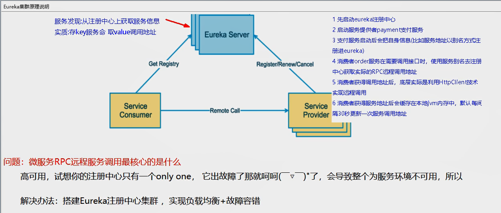
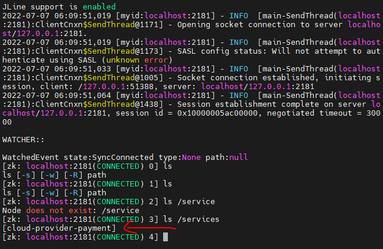
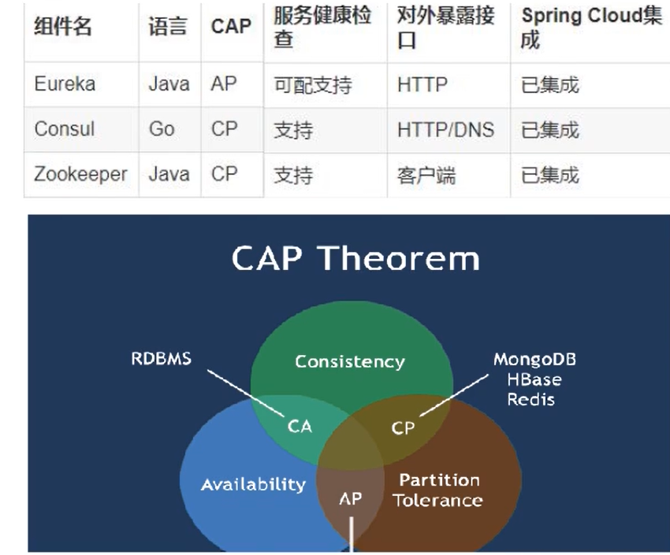
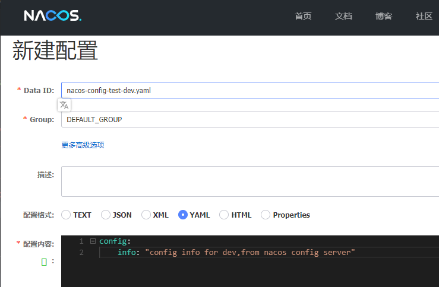

# SpringCloud

Martin Fowler：**简而言之，微服务架构的风格，就是将单一程序开发成一个微服务， 每个微服务运行在自己的进程中，并使用轻量级通信机制，通常是 HTTP RESTFUL API 。这些服务围绕业务能力来划分构建的，并通 过完全自动化部署机制来独立部署这些服务可以使用不同的编程语 言，以及不同数据存储技术，以保证最低限度的集中式管理。**

SpringCloud、SpringBoot、SpringCloud Alibaba版本对应关系，看官方文档。

SpringCloud 常用组件：

1. 服务的注册和发现。（eureka（netflix）、nacos（Alibaba）、consul（Spring官方）） 
2. 服务的负载均衡。(ribbon（netflix）、dubbo（Alibaba）) 
3. 服务的相互调用。（openFeign、dubbo） 
4. 服务的容错。（hystrix（netflix），sentinel（Alibaba）） 
5. 服务网关。（gateway（官方的），zuul（netflix）） 
6. 服务配置的统一管理。（config-server、nacos、apollo） 
7. 服务消息总线。(bus) 
8. 服务安全组件。(security、Oauth2.0) 
9. 服务监控。（admin）（jvm） 
10. 链路追踪。（sleuth+zipkin）

SpringCloud 就是微服务理念的一种具体落地实现方式，帮助微服务架构提供了必备的功能，目前开发中常用的落地实现有三种： 

1. Dubbo+Zookeeper——半自动化的微服务实现架构 (别的管理没有) 。
2. SpringCloud Netflix——一站式微服务架构 。
3. SpringCloud Alibaba——新的一站式微服务架构。

三大公司——Spring、Netflix、Alibaba。

# 概述

微服务架构是一种架构模式，它提倡将单一的应用程序划分为一组小的服务-也就是微服务，服务之间互相协调、互相配合，为用户提供最终价值。每个微服务运行在其独立的进程中，服务与服务间采用轻量级的通信机制互相协作（通常是基于HTTP协议的RESTfulAPI）。每个服务都围绕着具体的业务进行构建，并且能够被独立地部署到生产环境、类生产环境等。另外，为了避免统一的、集中式的服务管理机制，对具体一个服务而言，应该根据业务上下文，选择合适的语言、工具对其进行构建。

（提出者：Martin Fowler）

分布式的微服务架构体系：


SpringCloud：分布式微服务架构的一站式解决方案，是多种微服务架构落地技术的集合体，俗称微服务全家桶。

SpringCloud与SpringBoot版本问题：官网查看对应版本：[Spring Cloud](https://spring.io/projects/spring-cloud#overview)。

本次学习需要的各开发环境版本选型：


组件停更替换：


# 热部署

热部署在**开发时使用，生产环境则要关闭**。

## 1.Adding devtools to your project

支付模块添加以下依赖：

```xml
<dependency>
    <groupId>org.springframework.boot</groupId>
    <artifactId>spring-boot-devtools</artifactId>
    <scope>runtime</scope>
    <optional>true</optional>
</dependency>
```

## 2.Adding plugin to your pom.xml

下段配置复制到聚合父类总工程的pom.xml：

```xml
<build>
  <plugins>
    <plugin>
      <groupId>org.springframework.boot</groupId>
      <artifactId>spring-boot-maven-plugin</artifactId>
      <configuration>
        <fork>true</fork>
        <addResources>true</addResources>
      </configuration>
    </plugin>
  </plugins>
</build>
```

## 3.Enabling automatic build

File -> Settings -> Build -> Complier 下面项勾选以下四个选项：

- Automatically show first error in editor。
- Display notification on build completion。
- Build project automatically。
- Compile independent modules in parallel。

## 4.Update the value of

键入`Ctrl + Shift + Alt + / `，打开Registry，找到并勾选以下两个选项：

- actionSystem.assertFocusAccessFromEdt。
- compiler.automake.allow.when.app.running。

## 5.重启idea

重启后启动支付项目，会发现一个error，如下：（不影响使用，忽略这个错误）


重启后，修改程序，会发现修改后间隔一定时间项目会自动重新启动。

# 服务注册中心

注册进注册中心的微服务之间，各服务端之间内部发起访问，访问地址为`http://spring.application.name/`，可以不使用主机+端口的方式去访问。

## Eureka

### 关于服务注册与发现

**什么是服务治理？**

Spring Cloud封装了Netflix 公司开发的Eureka模块来实现服务治理。

在传统的RPC远程调用框架中，管理每个服务与服务之间依赖关系比较复杂，管理比较复杂，所以需要使用服务治理，**管理服务与服务之间依赖关系**，可以实现服务调用、负载均衡、容错等，实现服务发现与注册。

**什么是服务注册与发现？**

Eureka采用了C/S的设计架构，Eureka Sever作为服务注册功能的服务器，它是服务注册中心。而系统中的其他微服务，使用Eureka的客户端连接到 Eureka Server并维持心跳连接。这样系统的维护人员就可以通过Eureka Server来监控系统中各个微服务是否正常运行。

在服务注册与发现中，有一个注册中心。当服务器启动的时候，会把当前自己服务器的信息（比如服务地址、通讯地址等）以别名的方式注册到注册中心上。另一方(消费者服务提供者)，以该别名的方式去注册中心上获取到实际的服务通讯地址，然后再实现本地RPC调用，RPC远程调用框架核心设计思想在于注册中心，因为使用注册中心管理每个服务与服务之间的一个依赖关系（服务治理概念）。在任何RPC远程框架中，都会有一个注册中心存放服务地址相关信息（接口地址）。


**Eureka包含两个组件：Eureka Server和Eureka Client**

1. Eureka Server：提供服务注册服务
   - 各个微服务节点通过配置启动后，会在EurekaServer中进行注册，这样EurekaServer中的服务注册表中将会存储所有可用服务节点的信息，服务节点的信息可以在界面中直观看到。
2. EurekaClient：通过注册中心进行访问
   - 它是一个Java客户端，用于简化Eureka Server的交互，客户端同时也具备一个内置的、使用轮询（round-robin）负载算法的负载均衡器。在应用启动后，将会向Eureka Server发送心跳（默认周期为30秒）。如果Eureka Server在多个心跳周期内没有接收到某个节点的心跳，EurekaServer将会从服务注册表中把这个服务节点移除（默认90秒)。

**Spring Cloud Eureka 和 Zookeeper 的区别？问：为什么 zookeeper 不适合做注册中心？**


在分布式微服务集群里面 CAP 定理 （CAP 原则又称 CAP 定理）， CAP 原则指的是，这三个要素最多只能同时实现两点（CP或AP），不可能三者兼顾：

1.  一致性（Consistency）：同一功能的各个微服务的数据一致。
2.  可用性（Availability）：某一个节点宕机了，但整个集群仍可以对外提供服务。
3.  分区容错性（Partition tolerance）：这个特性是不可避免的，原因是由网络或分区等原因造成的数据同步不能同时完成，从而出现的同一功能的各个服务间数据会出现一定时刻内数据不完全一致。

zookeeper 遵循CP原则：注重数据的一致性，但某个节点挂了，整个服务在几分钟的时间内不能提供服务。（注册中心，配置文件中心，协调中心）

Eureka注重AP原则：数据可能不一致、注重服务的可用性。（注册中心）


### Eureka-Server注册中心

1. 项目创建。
2. 添加依赖。

   ```xml
   <parent>
       <groupId>org.springframework.boot</groupId>
       <artifactId>spring-boot-starter-parent</artifactId>
       <version>2.3.12.RELEASE</version>
       <relativePath/> <!-- lookup parent from repository -->
   </parent>
   <properties>
       <java.version>1.8</java.version>
       <spring-cloud.version>Hoxton.SR12</spring-cloud.version>
   </properties>
   <dependencies>
       <!-- eureka-server的依赖 -->
       <dependency>
           <groupId>org.springframework.cloud</groupId>
           <artifactId>spring-cloud-starter-netflix-eureka-server</artifactId>
       </dependency>
   </dependencies>
   <dependencyManagement>
       <dependencies>
           <dependency>
               <groupId>org.springframework.cloud</groupId>
               <artifactId>spring-cloud-dependencies</artifactId>
               <version>${spring-cloud.version}</version>
               <type>pom</type>
               <scope>import</scope>
           </dependency>
       </dependencies>
   </dependencyManagement>
   ```
3. 写YML。

   ```yaml
   server:
     port: 7001
   
   eureka:
     instance:
       hostname: localhost # eureka服务端的实例名称
     client:
       # false表示不向注册中心注册自己。
       register-with-eureka: false
       # false表示自己就是注册中心，我的职责就是维护服务实例，并不需要去检索服务
       fetch-registry: false
       service-url:
         # 设置与Eureka server交互的地址查询服务和注册服务都需要依赖这个地址。
         defaultZone: http://${eureka.instance.hostname}:${server.port}/eureka/
   ```
4. 主启动。

   ```java
   @SpringBootApplication
   @EnableEurekaServer
   public class EurekaMain7001 {
       public static void main(String[] args) {
           SpringApplication.run(EurekaMain7001.class,args);
       }
   }
   ```
5. 测试：运行项目，浏览器访问`http://localhost:7001/`，会查看到Spring Eureka服务主页。
6. 业务类。

浏览器输入`http://localhost:7001/`并回车，会查看到Spring Eureka服务主页：


### Eureka-Server配置说明

Eureka-Server既是服务端，也可以是客户端。

```yaml
server:
	port: 8761
spring:
	application:
		name: eureka-server
eureka:
	client:
		service-url: # eureka 服务端和客户端的交互地址,集群用`,`隔开
			defaultZone: http://localhost:8761/eureka
		fetch-registry: true # 是否拉取服务列表到本地
		register-with-eureka: true # 是否注册自己（单机 eureka 一般关闭注册自己,集群注意打开，默认打开）
	server:
		eviction-interval-timer-in-ms: 30000 # 清除无效节点的频率(毫秒)--定期删除
		enable-self-preservation: true # server 的自我保护机制，避免因为网络原因造成误剔除,生产环境建议打开
		renewal-percent-threshold: 0.85 # 85%，如果在一个机房的 client 端，15 分钟内有 85%的 client 没有续约，那么则可能是网络原因，认为服务实例没有问题，不会剔除他们，宁可放过一万，不可错杀一个，确保高可用
	instance:
		hostname: localhost # 服务主机名称
		instance-id: ${eureka.instance.hostname}:${spring.application.name}:${server.port} # 实例 id
		prefer-ip-address: true # 服务列表以 ip 的形式展示
		lease-renewal-interval-in-seconds: 10 # 表示 eureka client 发送心跳给 server 端的频率
		lease-expiration-duration-in-seconds: 20 # 表示 eureka server 至上一次收到 client 的心跳之后，等待下一次心跳的超时时间，在这个时间内若没收到下一次心跳，则将移除该实例
```


### Eureka-Client服务注册

哪个服务需要入驻到服务注册中心，就在哪个服务中进行操作。主要操作如下：

1. 加入客户端依赖，以便使用注解将当前模块注册为一个`Eureka Client`客户端。

   ```xml
   <!-- eureka-client -->
   <dependency>
       <groupId>org.springframework.cloud</groupId>
       <artifactId>spring-cloud-starter-netflix-eureka-client</artifactId>
   </dependency>
   ```

2. 配置好信息，告知要注册到哪个 Eureka Server —— 服务注册中心，在项目配置文件中配置（yml或properties配置文件）。

   ```yml
   eureka:
     client:
       # 表示是否将自己注册进EurekaServer 默认为true。
       register-with-eureka: true
       # 是否从EurekaServer抓取已有的注册信息，默认为true。单节点无所谓，集群必须设置为true才能配合ribbon使用负载均衡
       fetchRegistry: true
       # 注册中心地址
       service-url:
         defaultZone: http://localhost:7001/eureka
   ```

3. 主启动类加注解：`@EnableEurekaClient`，声明该服务为一个`Eureka Client`客户端。

4. 测试：启动 Eureka Server项目和Eureka Client项目，然后进入Spring Eureka服务主页：http://localhost:7001/ ，查看主页的`Instances currently registered with Eureka`：会显示`Eureka Client`客户端应用名（application.yml文件设置的`spring.application.name：`）。


**自我保护机制：**（后面会详细说）

测试时eureka首页可能会出现如下的情况：


紧急情况！EUREKA可能错误地声称实例在没有启动的情况下启动了。续订小于阈值，因此实例不会为了安全而过期。

### Eureka-Client配置说明

```yaml
server:
	port: 8080
spring:
	application:
		name: eureka-client
eureka:
	client:
		service-url:
			defaultZone: http://localhost:8761/eureka # 指定注册地址
		register-with-eureka: true # 注册自己
		fetch-registry: true # 拉取服务列表到本地
		registry-fetch-interval-seconds: 5 # 表示 eureka-client 间隔多少秒去拉取服务注册信息
	instance:
		hostname: localhost # 服务主机名称，最好写IP
		instance-id: ${eureka.instance.hostname}:${spring.application.name}:${server.port} # 实例 id
		prefer-ip-address: true # 服务列表以 ip 的形式展示
		lease-renewal-interval-in-seconds: 10 # 表示 eureka client 发送心跳给 server 端的频率，多少秒每次，为了缓解服务列表脏读问题
		lease-expiration-duration-in-seconds: 20 #表示 eureka server 至上一次收到 client 的心跳之后，等待下一次心跳的超时时间，在这个时间内若没收到下一次心跳，则该实例将从服务中心移除
```


### 注册中心集群



注册中心集群原理：安装多个eureka，彼此之间相互注册、相互守望


**注册中心集群**——建立好各个 Eureka-Server，它们的`spring.application.name`得要一致，然后再在配置中将各自都注册到所有的服务中心即可，配置示范如下：

```yaml
server:
  port: 8761
spring:
  application:
    name: eureka-server # 集群时都要一致
eureka:
  server:
    eviction-interval-timer-in-ms: 30000
    enable-self-preservation: true
    renewal-percent-threshold: 0.85
  client:
    service-url:
      defaultZone: http://localhost:8762/eureka,http://localhost:8763/eureka
    fetch-registry: true
    register-with-eureka: true
  instance:
    hostname: localhost
    instance-id: ${eureka.instance.hostname}:${spring.application.name}:${server.port}
    prefer-ip-address: true
    lease-renewal-interval-in-seconds: 10
    lease-expiration-duration-in-seconds: 20
```

如果在同一台集群开启了这些服务，只是同一个服务 server 启动了多台，没有数据交互，不是真正意义上的集群原因是因为`http://localhost:8761/eureka/,http://localhost:8762/eureka/ `这样写，eureka 认为只有一个机器，就是 localhost 所以这里面不能写成一样。

管理员模式修改 `hosts` 文件（`C:\Windows\System32\drivers\etc`目录下），然后再在cmd执行`ipconfig /flushdns`刷新：

```host
# 添加以下
127.0.0.1 peer1
127.0.0.1 peer2
127.0.0.1 peer3
```

然后再将localhost改为peer1、peer2、peer3即可，重启服务：

```
defaultZone: http://peer2:8762/eureka,http://peer3:8763/eureka
```

**最终优化配置文件：**（写好模板，修改一下端口即可，不再需要每个配置都指定不同的defaultZone）

```yaml
server:
	port: 8761
spring:
	application:
		name: eureka-server #服务名称
eureka:
	client:
		fetch-registry: true #是否拉取服务列表
		register-with-eureka: true #是否注册自己（集群需要注册自己和拉取服务）
		service-url:
			defaultZone: http://peer1:8761/eureka/,http://peer2:8762/eureka/,http://peer3:8763/eureka/
	server:
		eviction-interval-timer-in-ms: 90000 #清除无效节点的评率(毫秒)
	instance:
		instance-id: ${spring.application.name}:${server.port}
		prefer-ip-address: true
		lease-expiration-duration-in-seconds: 5 #server 在等待下一个客户端发送的心跳时间，若在指定时间不能收到客户端心跳，则剔除此实例并且禁止流量
```

改造 eureka-client-a 的配置文件：

```yaml
server:
	port: 8761
spring:
	application:
		name: eureka-server #服务名称
eureka:
	client:
		fetch-registry: true #是否拉取服务列表
		register-with-eureka: true #是否注册自己（集群需要注册自己和拉取服务）
		service-url:
			defaultZone: http://peer1:8761/eureka/,http://peer2:8762/eureka/,http://peer3:8763/eureka/
	instance:
		instance-id: ${spring.application.name}:${server.port}
		prefer-ip-address: true
		lease-renewal-interval-in-seconds: 30 # 发送心跳间隔
```


### Eureka自我保护机制


**导致原因：**

一句话：某时刻某一个微服务不可用了，Eureka不会立刻清理，依旧会对该微服务的信息进行保存。属于CAP里面的AP分支（Consual中的三个注册中心易常点会介绍）。

**为什么会产生Eureka自我保护机制?**

为了EurekaClient可以正常地运行，防止其与EurekaServer网络连接不上的情况下EurekaServer会立刻将EurekaClient服务剔除的情况。

（防止因网络导致微服务与EurekaServer连接失败，而造成EurekaServer将该注册了的服务剔除）

**什么是自我保护模式?**

默认情况下，如果EurekaServer在一定时间内没有接收到某个微服务实例的心跳，EurekaServer将会注销该实例(默认90秒)。但是当网络分区故障发生(延时、卡顿、拥挤)时，微服务与EurekaServer之间无法正常通信，以上行为可能变得非常危险了——因为微服务本身其实是健康的，此时本不应该注销这个微服务。Eureka通过“自我保护模式”来解决这个问题——当EurekaServer节点在短时间内丢失过多客户端时(可能发生了网络分区故障)，那么这个节点就会进入自我保护模式。


自我保护机制：默认情况下EurekaClient定时向EurekaServer端发送心跳包，如果Eureka在server端在一定时间内（默认90秒）没有收到EurekaClient发送心跳包，便会直接从服务注册列表中剔除该服务，但是在短时间（90秒中）内丢失了大量的服务实例心跳，这时候Eurekaserver会开启自我保护机制，不会剔除该服务（该现象可能出现在如果网络不通但是EurekaClient为出现宕机，此时如果换做别的注册中心如果一定时间内没有收到心跳会将剔除该服务，这样就出现了严重失误，因为客户端还能正常发送心跳，只是网络延迟问题，而保护机制是为了解决此问题而产生的）。

在自我保护模式中，Eureka Server会保护服务注册表中的信息，不再注销任何服务实例。

它的设计哲学就是宁可保留错误的服务注册信息，也不盲目注销任何可能健康的服务实例。一句话讲解：好死不如赖活着。

综上，自我保护模式是一种应对网络异常的安全保护措施。它的架构哲学是宁可同时保留所有微服务（健康的微服务和不健康的微服务都会保留）也不盲目注销任何健康的微服务。使用自我保护模式，可以让Eureka集群更加的健壮、稳定。

**禁止自我保护机制：**

1.在eurekaServer端7001处设置关闭自我保护机制。

自我保护机制是开启的，使用`eureka.server.enable-self-preservation = false`可以禁用自我保护模式：

```yaml
eureka:
  server:
    # 关闭自我保护机制，保证不可用服务被及时踢除
    enable-self-preservation: false
    eviction-interval-timer-in-ms: 2000
```

关闭效果，spring-eureka主页会显示出一句：

THE SELF PRESERVATION MODE IS TURNED OFF. THIS MAY NOT PROTECT INSTANCE EXPIRY IN CASE OF NETWORK/OTHER PROBLEMS.

2.在生产者客户端eureakeClient端8001做一些配置

默认的Eureka客户端向服务端发送心跳的时间间隔，单位秒：

```yaml
eureka.instance.lease-renewal-interval-in-seconds=30
eureka.instance.lease-expiration-duration-in-seconds=90
```

修改为：

```yaml
eureka:
  instance:
    instance-id: payment8001
    prefer-ip-address: true
    # 心跳检测与续约时间
    # 开发时没置小些，保证服务关闭后注册中心能即使剔除服务
    # Eureka客户端向服务端发送心跳的时间间隔，单位为秒(默认是30秒)
    lease-renewal-interval-in-seconds: 1
    # Eureka服务端在收到最后一次心跳后等待时间上限，单位为秒(默认是90秒)，超时将剔除服务
    lease-expiration-duration-in-seconds: 2
```

启动7001，再启动8001，启动完成后关闭8001，会发现8001被eureka剔除。

### Eureka停更说明

Eureka已经停更了，如果还有一些老项目使用的话，上面的知识已经够用了。

https://github.com/Netflix/eureka/wiki，官方说明，2.0版本不再更新。

```properties
Eureka 2.0 (Discontinued)

The existing open source work on eureka 2.0 is discontinued. The code base and artifacts that were released as part of the existing repository of work on the 2.x branch is considered use at your own risk.

Eureka 1.x is a core part of Netflix’s service discovery system and is still an active project.
```

## Zookeeper

### 安装Zookeeper

CentOS7下，使用docker安装Zookeeper：

1. `docker pull zookeeper`。
2. `docker run -p 2181:2181 --name my_zookeeper -d --restart always zookeeper:latest`。
3. `docker exec -it my_zookeeper bash`，然后`cd bin`，再`zkCli.sh`开启客户端。
   1. `ls /services`：可查看注册进zookeeper里的微服务名称。
   2. ` ls /services/cloud-provider-payment`：查看当前的` cloud-provider-payment`的内部编码流水号。
   3. `get /services/cloud-provider-payment/内部编码流水号`：查看注册进去的微服务节点的基本信息。（zookeeper中服务节点是临时节点还是持久节点）


### 注册中心

1. 新建项目。

2. 添加依赖。

   ```xml
   <!-- SpringBoot整合zookeeper客户端 -->
   <dependency>
       <groupId>org.springframework.cloud</groupId>
       <artifactId>spring-cloud-starter-zookeeper-discovery</artifactId>
   </dependency>
   ```
   
3. yml配置文件。

   ```yaml
   # 8004表示注册到zookeeper服务器的支付服务提供者端口号
   server:
     port: 8004
   # 服务别名----注册zookeeper到注册中心名称
   spring:
     application:
       name: cloud-provider-payment
     cloud:
       zookeeper:
         connect-string: 192.168.56.10:2181 # 安装了zookeeper的服务器的zookeeper访问地址
   ```

4. 主启动类。

   ```java
   @SpringBootApplication
   @EnableDiscoveryClient // 启动注册发现功能
   public class PaymentMain8004 {
       public static void main(String[] args) {
           SpringApplication.run(PaymentMain8004.class,args);
       }
   }
   ```

5. Controller编写（用于测试）。

   ```java
   @RestController
   @Slf4j
   public class PaymentController {
       @Value("${server.port}")
       private String serverPort;
   
       @RequestMapping(value = "/payment/zk")
       public String paymentzk()
       {
           return "springcloud with zookeeper: "+serverPort+"\t"+ UUID.randomUUID().toString();
       }
   }
   ```

7. 启动，在服务器中进入zookeeper，运行zookeeper客户端后执行`ls /services`：

   

### 微服务注册

1. 建立Maven项目

2. 添加依赖。

   ```xml
   <dependencies>
       <!-- SpringBoot整合zookeeper客户端 -->
       <dependency>
           <groupId>org.springframework.cloud</groupId>
           <artifactId>spring-cloud-starter-zookeeper-discovery</artifactId>
           <!-- 如果jar冲突，先排除自带的zookeeper-->
           <exclusions>
               <exclusion>
                   <groupId>org.apache.zookeeper</groupId>
                   <artifactId>zookeeper</artifactId>
               </exclusion>
           </exclusions>
       </dependency>
       <!-- 添加zookeeper3.4.9版本-->
       <dependency>
           <groupId>org.apache.zookeeper</groupId>
           <artifactId>zookeeper</artifactId>
           <version>3.4.9</version>
       </dependency>
   </dependencies>
   ```
   
3. 项目配置。

   ```yaml
   server:
     port: 80
   spring:
     application:
       name: cloud-consumer-order
     cloud:
       # 要注册到的zookeeper的地址
       zookeeper:
         connect-string: 192.168.56.10:2181
   ```

4. 主启动类。

   ```java
   @SpringBootApplication
   public class CloudConsumerzkOrder80Application {
       public static void main(String[] args) {
           SpringApplication.run(CloudConsumerzkOrder80Application.class, args);
       }
   }
   ```

5. 业务代码编写：

   ```java
   @Configuration
   public class ApplicationContextBean
   {
       @Bean
       @LoadBalanced
       public RestTemplate getRestTemplate()
       {
           return new RestTemplate();
       }
   }
   ```

   ```java
   @RestController
   public class OrderZKController{
       // 服务注册进了zookeeper  可通过 http://注册进zookeeper的服务名  来对注册进去的微服务进行访问
       public static final String INVOKE_URL = "http://cloud-provider-payment";
   
       @Autowired
       private RestTemplate restTemplate;
   
       @RequestMapping(value = "/consumer/payment/zk")
       public String paymentInfo()
       {
           String result = restTemplate.getForObject(INVOKE_URL+"/payment/zk", String.class);
           System.out.println("消费者调用支付服务(zookeeper)--->result:" + result);
           return result;
       }
   
   }
   ```

6. 测试：服务器端进入zookeeper查询注册进的服务；访问`http://localhost:80/consumer/payment/zk`。


## Consul

Consul 是一套开源的分布式服务发现和配置管理系统，由 HashiCorp 公司用 Go 语言开发。其提供了微服务系统中的服务治理、配置中心、控制总线等功能。这些功能中的每一个都可以根据需要单独使用，也可以一起使用以构建全方位的服务网格，总之Consul提供了一种完整的服务网格解决方案。它具有很多优点。包括： 基于 raft 协议，比较简洁； 支持健康检查, 同时支持 HTTP 和 DNS 协议 支持跨数据中心的 WAN 集群 提供图形界面 跨平台，支持 Linux、Mac、Windows。

主要功能：

1. 服务发现：提供HTTP和DNS两种发现方式。
2. 健康监测：支持多种方式，HTTP、TCP、Docker、Shell脚本定制化监控。
3. KV存储：key、value存储方式。
4. 支持多数据中心。
5. 可视化Web界面。

[下载：Downloads | Consul by HashiCorp](https://www.consul.io/downloads)        文档：[Spring Cloud Consul 中文文档 参考手册 中文版](https://www.springcloud.cc/spring-cloud-consul.html)。

### 安装Consul

Windows下安装：

1. 官方网站下载consul，在下载的exe文件目录下打开cmd窗口，执行命令：
   - `consul --version`：查看版本。
   - `consul agent -dev`：使用开发模式启动。
2. 启动后访问：`http:localhost:8500`。

### 注册中心

1. 建立Maven项目。

2. 添加依赖。

   ```xml
   <dependencies>
       <!--SpringCloud consul-server -->
       <dependency>
           <groupId>org.springframework.cloud</groupId>
           <artifactId>spring-cloud-starter-consul-discovery</artifactId>
       </dependency>
       <dependency>
           <groupId>org.springframework.boot</groupId>
           <artifactId>spring-boot-starter-actuator</artifactId>
       </dependency>
   </dependencies>
   ```
   
3. 项目配置。

   ```yaml
   ###consul服务端口号
   server:
     port: 8006
   
   spring:
     application:
       name: consul-provider-payment
     ####consul注册中心地址
     cloud:
       consul:
         host: localhost
         port: 8500
         discovery:
           #hostname: 127.0.0.1
           service-name: ${spring.application.name}
   ```

4. 主启动类——需要添加@EnableDiscoveryClient注解。

   ```java
   @SpringBootApplication
   @EnableDiscoveryClient
   public class CloudProviderConsulPaymentApplication {
       public static void main(String[] args) {
           SpringApplication.run(CloudProviderConsulPaymentApplication.class, args);
       }
   }
   ```

5. 业务类开发。

   ```java
   @RestController
   public class PaymentController {
       @Value("${server.port}")
       private String serverPort;
   
       @GetMapping("/payment/consul")
       public String paymentInfo()
       {
           return "springcloud with consul: "+serverPort+"\t\t"+ UUID.randomUUID().toString();
       }
   }
   ```

6. 测试：

   - [localhost:8006/payment/consul](http://localhost:8006/payment/consul)。（页面返回`springcloud with consul: 8006 1782438c-a397-4f45-800a-7ea91bdc2348`）
   - 访问`localhost:8550`。

### 微服务注册

1. 新建Maven项目——cloud-consumerconsul-order80。

2. 添加依赖。

   ```xml
   
   <!--SpringCloud consul-server -->
   <dependency>
       <groupId>org.springframework.cloud</groupId>
       <artifactId>spring-cloud-starter-consul-discovery</artifactId>
   </dependency>
   
   <!-- 可以用于检测系统的健康情况、当前的Beans、系统的缓存等 -->
   <dependency>
       <groupId>org.springframework.boot</groupId>
       <artifactId>spring-boot-starter-actuator</artifactId>
   </dependency>
   ```
   
3. 添加配置。

   ```yaml
   ###consul服务端口号
   server:
     port: 80
   
   spring:
     application:
       name: cloud-consumer-order
     ####consul注册中心地址
     cloud:
       consul:
         host: localhost
         port: 8500
         discovery:
           #hostname: 127.0.0.1
           service-name: ${spring.application.name}
   ```

4. 主启动类。

   ```java
   @SpringBootApplication
   @EnableDiscoveryClient //该注解用于向使用consul或者zookeeper作为注册中心时注册服务
   public class CloudConsumerConsulOrderApplication {
       public static void main(String[] args) {
           SpringApplication.run(CloudConsumerConsulOrderApplication.class, args);
       }
   }
   ```

5. 业务：

   ```java
   @Configuration
   public class ApplicationContextBean {
       @Bean
       @LoadBalanced
       public RestTemplate getRestTemplate()
       {
           return new RestTemplate();
       }
   }
   ```

   ```java
   @RestController
   public class OrderConsulController
   {
       public static final String INVOKE_URL = "http://consul-provider-payment"; //consul-provider-payment
   
       @Autowired
       private RestTemplate restTemplate;
   
       @GetMapping(value = "/consumer/payment/consul")
       public String paymentInfo()
       {
           String result = restTemplate.getForObject(INVOKE_URL+"/payment/consul", String.class);
           System.out.println("消费者调用支付服务(consul)--->result:" + result);
           return result;
       }
   }
   ```

6. 测试：http://localhost:8500、[localhost/consumer/payment/consul](http://localhost/consumer/payment/consul)。

## 三个注册中心的异同



CAP：


AP：Eureka。

CP：Zookeeper、Consul。

# 服务调用

## Ribbon负载均衡服务调用

### 概述

Spring Cloud Ribbon是基于Netflix Ribbon实现的一套客户端负载均衡的工具。

简单的说，Ribbon是Netflix发布的开源项目，主要功能是提供客户端的软件负载均衡算法和服务调用。Ribbon客户端组件提供一系列完善的配置项如连接超时，重试等。简单的说，就是在配置文件中列出Load Balancer（简称LB）后面所有的机器，Ribbon会自动的帮助你基于某种规则（如简单轮询，随机连接等）去连接这些机器。我们很容易使用Ribbon实现自定义的负载均衡算法。

LB负载均衡(Load Balance)是什么？简单的说就是将用户的请求平摊的分配到多个服务上，从而达到系统的HA（高可用）。常见的负载均衡有软件Nginx，LVS，硬件 F5等。

Ribbon本地负载均衡客户端 VS Nginx服务端负载均衡区别：Nginx是服务器负载均衡，客户端所有请求都会交给nginx，然后由nginx实现转发请求。即负载均衡是由服务端实现的。Ribbon本地负载均衡，在调用微服务接口时候，会在注册中心上获取注册信息服务列表之后缓存到JVM本地，从而在本地实现RPC远程服务调用技术。

1. 集中式负载均衡：即在服务的消费方和提供方之间使用独立的LB设施(可以是硬件，如F5；也可以是软件，如nginx)，由该设施负责把访问请求通过某种策略转发至服务的提供方。
2. 进程内负载均衡：将LB逻辑集成到消费方，消费方从服务注册中心获知有哪些地址可用，然后自己再从这些地址中选择出一个合适的服务器。Ribbon就属于进程内LB，它只是一个类库，集成于消费方进程，消费方通过它来获取到服务提供方的地址。

**Ribbon：负载均衡 + RestTemplate调用服务。**

Ribbon在工作时分成两步：

1. 第一步先选择 EurekaServer ,它优先选择在同一个区域内负载较少的server.
2. 第二步再根据用户指定的策略，在从server取到的服务注册列表中选择一个地址。（其中Ribbon提供了多种策略：比如轮询、随机和根据响应时间加权）

spring-cloud-starter-netflix-eureka-client 中自带了spring-cloud-starter-ribbon引用，可以不再声明依赖添加：

```xml
<dependency>
    <groupId>org.springframework.cloud</groupId>
    <artifactId>spring-cloud-starter-netflix-ribbon</artifactId>
</dependency>
```

### RestTemplate-服务调用

同步客户端以执行HTTP请求，在基础HTTP客户端库中公开一个简单的模板方法API，例如JDK HTTPURLCONNECTION，APACHE HTTPCOMPONENTS等。
RestTemplate除了支持较不频繁情况的广义交换和执行方法外，还提供了HTTP方法的常见方案模板。（简化了发起 HTTP 请求以及处理响应的过程，并且支持 REST ）

使用：1、注册为bean。2、调用RestTemplate的方法。

```java
@Bean
@LoadBalanced // 负载均衡
public RestTemplate restTemplate() {
  return new RestTemplate();
}
```

```java
@Autowired
private RestTemplate restTemplate; // 注入并调用方法
```

**发起GET请求：**

`restTemplate.getForEntity("http://HELLO-SERVICE/hello", String.class)`方法：

1. 第一个参数为要调用的服务的地址，这里是通过服务名调用而不是服务地址，如果写成服务地址就没法实现客户端负载均衡了，如果写成地址了但还是要实现客户端负载均衡，那就需要`@LoadBalanced`注解，加到restTemplate的bean注册的地方。

2. 第二个参数 指定返回的 body 类型，可以是自定义的类类型（前提是要和响应返回的对应上，如果响应返回一个自定义对象，那就可以使用）。

3. 返回对象为 ResponseEntity  对象，包含了响应中的一些重要信息，比如响应头、响应状态码、响应体等。

4. 第一个调用地址也可以是一个URI而不是字符串，这个时候我们构建一个URI即可，参数都包含在URI中了，如下：

   ```java
   @RequestMapping("/sayhello3")
   public String sayHello3() {
       UriComponents uriComponents = UriComponentsBuilder.fromUriString("http://HELLO-SERVICE/sayhello?name={name}").build().expand("王五").encode();	
       URI uri = uriComponents.toUri();
       ResponseEntity<String> responseEntity = restTemplate.getForEntity(uri, String.class);
       return responseEntity.getBody();
   }
   ```

`restTemplate.getForObject("http://HELLO-SERVICE/getbook1", Book.class)`方法：getForObject 函数实际上是对 getForEntity 函数的进一步封装，如果你只关注返回的消息体的内容，对其他信息都不关注，此时可以使用 getForObject：

```java
@RequestMapping(value = "/getbook1", method = RequestMethod.GET)
public Book book1() {
    return new Book("三国演义", 90, "罗贯中", "花城出版社");
}
@RequestMapping("/book2")
public Book book2() {
    // 该方法只关注响应回来的数据内容 返回对象为响应体中数据转化成的对象，基本上可以理解为Json
    Book book = restTemplate.getForObject("http://HELLO-SERVICE/getbook1", Book.class);
    return book;
}
```

**发起POST请求：**

`restTemplate.postForEntity("http://HELLO-SERVICE/getbook2", book, Book.class);`方法：（和get请求的类似）

1. 方法的第一参数表示要调用的服务的地址。
2. 方法的第二个参数表示上传的参数。
3. 方法的第三个参数表示返回的消息体的数据类型。

`restTemplate.postForObject("http://HELLO-SERVICE/getbook1", Book.class)`方法：只关注返回的消息体，可以直接使用postForObject。用法和getForObject一致。

`restTemplate.postForLocation()`：提交新资源，提交成功之后返回新资源的 URI，postForLocation 的参数和前面两种的参数基本一致，只不过该方法的返回值为 URI ，这个只需要服务提供者返回一个 URI 即可，该 URI 表示新资源的位置。

### IRule与负载规则变更

根据特定算法从服务中选取一个要访问的服务，注意有以下七种：（默认使用轮询）


**更改默认的轮询规则的操作：**

1. 客户端自定义配置类，不过这个自定义配置类不能放在@ComponentScan所扫描的当前包下以及子包下，否则我们自定义的这个配置类就会被所有的Ribbon客户端所共享，达不到特殊化定制的目的了。

   ```java
   @Configuration
   public class MySelfRule {
       @Bean
       public IRule myRule() {
           return new RandomRule(); // 定义为随机
       }
   }
   ```

2. 使自定义的配置类生效：（主启动类加上@RibbonClient注解，如下）

   ```java
   @SpringBootApplication
   @EnableEurekaClient
   @RibbonClient(name = "CLOUD-PAYMENT-SERVICE",configuration= MySelfRule.class)
   public class OrderMain80 {
       public static void main(String[] args) {
           SpringApplication.run(OrderMain80.class,args);
       }
   }
   ```

3. 测试：在cloud-provider-order80修改后启动，然后开启7001、7002、8001、8002，再访问：[localhost/consumer/payment/get/1](http://localhost/consumer/payment/get/1)。

### 轮询算法原理与源码分析

轮询算法原理：`rest接口第几次请求数 % 服务器集群总数量 = 实际调用服务器位置下标` ，每次服务重启动后rest接口计数从1开始。

RoundRobinRule源码：


## OpenFeign服务接口调用

### 概述

Feign是一个声明式WebService客户端。使用Feign能让编写Web Service客户端更加简单。它的使用方法是定义一个服务接口然后在上面添加注解。Feign也支持可拔插式的编码器和解码器。Spring Cloud对Feign进行了封装，使其支持了Spring MVC标准注解和HttpMessageConverters。Feign可以与Eureka和Ribbon组合使用以支持负载均衡。

**简而言之，Feign就是一个声明式的Web服务客户端（声明后用于发起请求访问微服务），使得编写Web服务客户端变得非常容易，只需创建一个接口并为接口添加上注解即可。**   更简单的说就是用来发起get、post等请求的，封装好了的，使得请求操作很简单。

**Feign能干什么？** **（服务接口绑定器，定义的接口与微服务的服务接口绑定，通过该接口发起请求完成对微服务的服务调用）**

1. Feign旨在使编写Java Http客户端变得更容易。
2. 使用Ribbon+RestTemplate时，利用RestTemplate对http请求的封装处理形成了一套模版化的调用方法。但是在实际开发中，由于对微服务中服务的调用可能不止一处，往往一个服务接口会被多处调用，所以通常都会针对每个微服务自行封装一些客户端类来包装这些对服务的调用。所以，Feign在此基础上做了进一步封装，由他来帮助我们定义和实现依赖服务接口的定义。
3. 在Feign的实现下，我们只需创建一个接口并使用注解的方式来配置它（以前是Dao接口上面标注Mapper注解，现在是一个微服务接口上面标注一个Feign注解即可)，即可完成对服务提供方的接口绑定，简化了使用Spring cloud Ribbon时，自动封装服务调用客户端（使用RestTemplate发起请求的一系列操作）的开发量。
4. Feign集成了Ribbon：利用Ribbon维护了Payment的服务列表信息，并且通过轮询实现了客户端的负载均衡。而与Ribbon不同的是，通过feign只需要定义服务绑定接口且以声明式的方法，优雅而简单的实现了服务调用。
5. 总结：**（Feign就是服务接口绑定器，定义的接口与微服务的服务接口绑定，通过该接口发起请求完成对微服务的服务调用）**

**Feign与OpenFeign的区别：**

Feign是Spring Cloud组件中的一个轻量级RESTful的HTTP服务客户端，Feign内置了Ribbon，用来做客户端负载均衡，去调用服务注册中心的服务。Feign的使用方式是：使用Feign的注解定义接口，调用这个接口，就可以调用服务注册中心的服务。

```xml
<dependency>
    <groupId>org.springframework.cloud</groupId>
    <artifactId>spring-cloud-starter-feign</artifactId>
</dependency>
```

OpenFeign是Spring Cloud 在Feign的基础上支持了SpringMVC的注解，如@RequesMapping等等。OpenFeign的@FeignClient可以解析SpringMVC的@RequestMapping注解下的接口，并通过动态代理的方式产生实现类，实现类中做负载均衡并调用其他服务。

```xml
<dependency>
    <groupId>org.springframework.cloud</groupId>
    <artifactId>spring-cloud-starter-openfeign</artifactId>
</dependency>
```

### 实现服务调用

使用OpenFeign来实现对微服务中服务的调用。

1. 新建cloud-consumer-feign-order-80项目。

2. 添加依赖：

   ```xml
   <dependencies>
       <!-- OpenFeign 服务调用 -->
       <dependency>
           <groupId>org.springframework.cloud</groupId>
           <artifactId>spring-cloud-starter-openfeign</artifactId>
       </dependency>
       <!-- ribbon 负载均衡 -->
       <dependency>
           <groupId>org.springframework.cloud</groupId>
           <artifactId>spring-cloud-starter-netflix-ribbon</artifactId>
       </dependency>
       <!-- eureka-client 服务注册 -->
       <dependency>
           <groupId>org.springframework.cloud</groupId>
           <artifactId>spring-cloud-starter-netflix-eureka-client</artifactId>
       </dependency>
   </dependencies>
   ```
   
3. 项目配置：

   ```yaml
   spring:
   	application:
   		name: use-openfeign
   server:
       port: 80
   # 使用eureka时的配置
   eureka:
       client:
           register-with-eureka: false
           service-url:
               defaultZone: http://eureka7001.com:7001/eureka/,http://eureka7002.com:7002/eureka/
   ```

4. 主启动类加上@EnableFeignClients注解：

   ```java
   @SpringBootApplication
   @EnableEurekaClient
   @EnableFeignClients
   public class CloudConsumerFeignOrderApplication {
       public static void main(String[] args) {
           SpringApplication.run(CloudConsumerFeignOrderApplication.class, args);
       }
   }
   ```

5. FeignClient接口定义：

   ```java
   @Component
   // 指定哪个微服务 cloud-payment-service 为微服务注册在eureka里的application 名字
   @FeignClient(value="CLOUD-PAYMENT-SERVICE")
   public interface PaymentFeignService {
       // 会向 cloud-payment-service 这个微服务里的/payment/get/{id} 路径发起请求
       @GetMapping(value = "/payment/get/{id}")
       CommonResult<Payment> getPaymentById(@PathVariable("id") Long id);
   }
   ```

6. controller：（该controller与微服务接口绑定了，访问该controller就是访问微服务接口）

   ```java
   @RestController
   public class OrderFeignController {
       @Resource
       private PaymentFeignService paymentFeignService;
   	// 当访问当前项目下的/consumer/payment/get/{id}路径时，
       // 就会访问到paymentFeignService.getPaymentById(id)所指定的 http://cloud-payment-service/payment/get/{id}
       @GetMapping(value = "/consumer/payment/get/{id}")
       public CommonResult<Payment> getPaymentById(@PathVariable("id") Long id)
       {
           return paymentFeignService.getPaymentById(id);
       }
   }
   ```

### 超时控制功能

通过FeignClient去访问微服务的服务，默认是1秒就要取得返回结果，如果超过1秒就会 `Read timed out`。配置文件配置超时时间：

```yaml
feign:
    client:
        config:
            default:
                connect-timeout: 5000
                read-timeout: 5000
```

### 日志打印功能

eign 提供了日志打印功能，我们可以通过配置来调整日志级别，从而了解 Feign 中 Http 请求的细节。说白了就是对Feign接口的调用情况进行监控和输出。

日志级别：

1. NONE：默认的，不显示任何日志。
2. BASIC：仅记录请求方法、URL、响应状态码及执行时间。
3. HEADERS：除了 BASIC 中定义的信息之外，还有请求和响应的头信息。
4. FULL：除了 HEADERS 中定义的信息之外，还有请求和响应的正文及元数据。

如何配置？

1. 建配置类：

   ```java
   @Configuration
   public class FeignConfig{
       @Bean
       Logger.Level feignLoggerLevel(){
           return Logger.Level.FULL;
       }
   }
   ```

2. 配置文件中添加配置：

   ```yaml
   logging:
       level: # 为需要日志的那个接口添加
           com.lsl.cloudconsumerfeignorder80.service.PaymentFeignService: debug
   ```

### 关于参数列表传参

Feign 传参要确保消费者和提供者的参数列表一致，包括返回值、方法签名都要一致：

1. 通过 URL 传参数，GET 请求，参数列表使用`@PathVariable("")`
2. 如果是 GET 请求，每个基本参数必须加`@RequestParam("")`。
3.  如果是 POST 请求，而且是对象集合等参数，必须加`@Requestbody` 或者`@RequestParam`。

### 时间日期参数问题

使用 feign 远程调用时，传递 Date 类型，接收方的时间会相差 14 个小时，是因为时区造成的。 解决方案： 

1. 使用字符串传递参数，接收方转换成时间类型，不要单独传递时间 。**（推荐使用）**
2. 使用 JDK8 的 LocalDate（日期） 或 LocalDateTime（日期和时间，接收方只有秒，没有毫 秒）。
3. 自定义转换方法。

# 服务降级

复杂分布式体系结构中的应用程序有数十个依赖关系，每个依赖关系在某些时候将不可避免地失败。Hystrix（熔断器（断路器））是一个用于处理分布式系统的延迟和容错的开源库，在分布式系统里，许多依赖不可避免的会调用失败，比如超时、异常等，Hystrix能够**保证在一个依赖出问题的情况下，不会导致整体服务失败，避免级联故障，以提高分布式系统的弹性**。

服务雪崩：

1. 多个微服务之间调用的时候，假设微服务A调用微服务B和微服务C，微服务B和微服务C又调用其它的微服务，这就是所谓的“扇出”。如果扇出的链路上某个微服务的调用响应时间过长或者不可用，对微服务A的调用就会占用越来越多的系统资源，进而引起系统崩溃，所谓的“雪崩效应”。
2. 对于高流量的应用来说，单一的后端依赖可能会导致所有服务器上的所有资源都在几秒钟内饱和。比失败更糟糕的是，这些应用程序还可能导致服务之间的延迟增加，备份队列，线程和其他系统资源紧张，导致整个系统发生更多的级联故障。这些都表示需要对故障和延迟进行隔离和管理，以便单个依赖关系的失败，不能取消整个应用程序或系统。所以，通常当你发现一个模块下的某个实例失败后，这时候这个模块依然还会接收流量，然后这个有问题的模块还调用了其他的模块，这样就会发生级联故障，或者叫雪崩。

**服务雪崩的本质：线程没有及时回收。 不管是调用成功还是失败，只要线程可以及时回收，就可以解决服务雪崩：**

- “断路器”本身是一种开关装置，当某个服务单元发生故障之后，通过断路器的故障监控（类似熔断保险丝），向调用方返回一个符合预期的、可处理的备选响应（FallBack），而不是长时间的等待或者抛出调用方无法处理的异常，这样就保证了服务调用方的线程不会被长时间、不必要地占用，从而避免了故障在分布式系统中的蔓延，乃至雪崩。
- 解决雪崩：修改调用的超时时长、设置拦截器（使用拦截器判断调用的服务的状态，以便及时作出反应，这也是熔断器的思想）。

Hystrix 主要功能：服务降级、服务熔断、接近实时的监控。当有服务调用的时候，才会出现服务雪崩，所以 Hystrix 常和 OpenFeign、Ribbon 一起出现。

官方使用文档：[How To Use · Netflix/Hystrix Wiki (github.com)](https://github.com/Netflix/Hystrix/wiki/How-To-Use)

**重要概念：**

1. 服务降级（fallback）：（服务器忙，请稍后再试）不让客户端等待并立刻返回友好提示；程序运行异常、连接超时、服务熔断、线程池或信号量打满都会服务降级。
2. 服务熔断（break）：服务访问到达最大访问量后直接拒绝访问，然后调用服务降级的方法返回友好提示。
3. 服务限流（flow limit）：高并发操作时（例如秒杀），每秒钟限制N个服务访问，有序进行。


## 在OpenFeign 中使用 Hystrix

1. 建立SpringBoot项目。

2. 加入依赖。

   ```xml
   <!-- hystrix -->
   <dependency>
       <groupId>org.springframework.cloud</groupId>
       <artifactId>spring-cloud-starter-netflix-hystrix</artifactId>
   </dependency>
   <!-- openfeign -->
   <dependency>
       <groupId>org.springframework.cloud</groupId>
       <artifactId>spring-cloud-starter-openfeign</artifactId>
   </dependency>
   <!-- eureka-client -->
   <dependency>
       <groupId>org.springframework.cloud</groupId>
       <artifactId>spring-cloud-starter-netflix-eureka-client</artifactId>
   </dependency>
   ```
   
3. 项目配置。

   ```yaml
   server:
     port: 8001
   
   spring:
     application:
       name: hystrix-payment
   
   eureka:
     client:
       register-with-eureka: true
       fetch-registry: true
       service-url:
         defaultZone: http://peer1:8763/eureka
   # 开启hystrix
   feign:
     hystrix:
       enabled: true
   ```

4. 主启动类。

   ```java
   @SpringBootApplication
   @EnableEurekaClient
   @EnableFeignClients
   public class HystrixTestApplication {
       public static void main(String[] args) {
           SpringApplication.run(HystrixTestApplication.class, args);
       }
   }
   ```

5. 业务类。

   ```java
   @RestController
   public class RentControllerTest {
       @Autowired
       @Qualifier("rentFeign")
       RentFeign rentFeign;
       @GetMapping("/rent")
       public String rentService(){
           System.out.println("");
           return rentFeign.rentService();
       }
   }
   ```

6. 使用Fegin。（当访问`/rent`时就会通过Fegin向微服务发起访问，如果访问接口出现问题，那就会使用fallback里对应的方法）

   ```java
   @Component
   // value用于指定注册中心里面的服务，将会对该访问的/rent发起访问，fallback是服务异常时调用的
   @FeignClient(value = "rent-service",fallback = RentFeignHystrix.class)
   public interface RentFeign {
       @GetMapping("/rent")
       public String rentService();
   }
   ```

   ```java
   @Component
   public class RentFeignHystrix implements RentFeign{
       public String rentService() {
           return "服务繁忙";
       }
   }
   ```

## Hystrix常用配置


# 网关

## 概述

网关：是微服务最边缘的服务，直接暴露给用户，用来做**用户和微服务的桥梁**。

1. 没有网关：客户端直接访问我们的微服务，会需要在客户端配置很多的 `ip:port`，如果 user-service 并发比较大，则无法完成负载均衡 。
2. 有网关：客户端访问网关，网关来访问微服务，（网关可以和注册中心整合，通过服务名称找到目标的 `ip:prot`）这样只需要使用服务名称即可访问微服务，也就可以实现负载均衡、可以实现 token 拦截、权限验证、限流等操作。

Spring Cloud Gateway是是 Spring Cloud 官方提供的用来取代 zuul（netflix）的新一代网关。学习重点：网关能做啥、网关代码。

**Gateway 的核心逻辑也就是：路由转发 + 执行过滤器链。**

Spring Cloud Gateway 三大核心概念：（请求 <===> 网关  <===> 过滤 <===> 断言判断是否符合路由规则 <===> 路由 <===> 服务）

1. Route（路由）：路由信息的组成： 由一个 ID、一个目的 URL、一组断言工厂、一组 Filter 组成。 如果路由断言为真，说明请求 URL 和配置路由匹配。
2. Predicate（断言）：对请求进行规则匹配，如果匹配上则断言为真，可以进行路由到服务。
   - （Spring Cloud Gateway 中的断言函数输入类型是 Spring 5.0 框架中的 ServerWebExchange。Spring Cloud Gateway 的断言函数允许开发者去定义匹配来自于 Http Request 中的任何信息比如请求头和参数。（返回布尔值的表达式，条件判断，用于决定是否可以路由到服务））

3. Filter（过滤）：过滤器 Filter 将会对请求和响应进行修改处理，Spring Cloud Gateway 中的 Filter 分为 Gateway Filter 和 Global Filter， 一个是针对某一个路由（路径）的 filter，对某一个接口做限流；一个是针对全局的 filter（token ip 黑名单）。

Nginx 和 Gateway 的区别：

1. Nginx 在做路由、负载均衡、限流之前，都要修改好 nginx.conf 的配置文件，把需要负载均衡、 路由、限流的规则加在里面。
2. 而gateway是自动的负载均衡和路由，gateway 和 eureka 高度集成，实现了自动的路由，和 Ribbon 结合，实现了负载均衡（lb），gateway 也能轻易的实现限流和权限验证。 （Nginx（c）比 gateway（java）的性能高一点。）
3. 本质区别：Nginx是服务器级别的，GateWay是项目级别的。

## Gateway-配置文件路由

1. 创建SpringBoot项目。

2. 导入依赖：

   ```xml
   <dependencies>
       <dependency>
           <groupId>org.springframework.cloud</groupId>
           <artifactId>spring-cloud-starter-gateway</artifactId>
       </dependency>
   </dependencies>
   <dependencyManagement>
       <dependencies>
           <dependency>
               <groupId>org.springframework.cloud</groupId>
               <artifactId>spring-cloud-dependencies</artifactId>
               <version>${spring-cloud.version}</version>
               <type>pom</type>
               <scope>import</scope>
           </dependency>
       </dependencies>
   </dependencyManagement>
   ```
   
3. 主启动类，不需要添加什么注解：

   ```java
   @SpringBootApplication
   public class GatewayServiceApplication {
       public static void main(String[] args) {
           SpringApplication.run(GatewayServiceApplication.class, args);
       }
   }
   ```

4. 配置：

   ```yaml
   server:
     port: 80 # 网关一般是80
   spring:
     application:
       name: gateway-service
     cloud:
       gateway:
         enabled: true # 加了网关的依赖就会默认开启了的
         routes:
           - id: login-service-route # 路由id，保持唯一性即可
             uri: http://localhost:8081 #
             predicates:
               - Path=/login # 访问80时，路径和/login匹配上就往uri指定的转发并且将路径带上——http://localhost:8081/login
           - id: login-service-route2 # 路由id，保持唯一性即可
             uri: http://localhost:8081 #
             predicates:
               - Path=/login/** # 匹配到一个，就不会走第二个，匹配该路径下所有访问
   ```

5. 当访问http://localhost/login 时由gateway完成路由转发到 http://localhost:8081/login。

   ```java
   @RestController
   public class LoginController {
       @GetMapping("/login")
       public String login(){
           return "http://localhost/login ===> http://localhost:8081/login";
       }
   }
   ```


## Gateway集群

1. 创建多个Gateway项目，部署到服务器。
2. 修改Ngnix配置文件。

## Gateway-代码方式路由

按配置文件路由那里建好项目，再使用配置类：

```java
@Configuration
public class RouteConfig {
    @Bean
    public RouteLocator customRouteLocator(RouteLocatorBuilder builder){
        return builder
            	// http://localhost/popular/all  ===>  https://www.bilibili.com/popular/all
                .routes().route("route_id_1",r -> r.path("/popular/all")
                        .uri("https://www.bilibili.com"))
                .route("route_id_1",r -> r.path("/v/popular/history")
                        .uri("https://www.bilibili.com"))
                .build();
    }
}
```


## 动态路由与负载均衡

修改配置文件：

```yaml
spring:
  cloud:
    gateway:
      discovery:
        locator:
          enabled: true # 开启动态路由
          lower-case-service-id: true # 动态路由小驼峰规则
      routes: #设置路由，注意是数组，可以设置多个，按照 id 做隔离
        - id: user-service-router # 路由 id，没有要求，保持唯一即可
          uri: lb://provider # 使用 lb 协议，带微服务名称的请求做负载均衡
          predicates: # 断言匹配
          	- Path=/info/** # 和微服务中的路径匹配,是正则匹配的模式
        - id: provider-service-router
          uri: http://localhost:8082
          predicates:
          	- Path=/info/** # 如果匹配到第一个路由，则就不会走第二个了，注意这不是负载均衡
```


## 了解断言工厂

在 gateway 启动时会去加载一些路由断言工厂（判断一句话是否正确 一个 boolean 表达）。

断言就是路由添加一些条件(丰富路由功能的) 通俗的说，断言就是一些布尔表达式，满足条件的返回 true，不满足的返回 false。 Spring Cloud Gateway 将路由作为 Spring WebFlux HandlerMapping 基础架构的一部分 进行匹配。Spring Cloud Gateway 包括许多内置的路由断言工厂。所有这些断言都与 HTTP 请求的不同属性匹配。您可以将多个路由断言可以组合使用 Spring Cloud Gateway 创建对象时，使用 RoutePredicateFactory 创建 Predicate 对象， Predicate 对象可以赋值给 Rout。

使用断言判断时，我们常用 yml 配置文件的方式进行配，**断言不作用于动态路由的路径访问**。

```yaml
spring:
  application:
    name: gateway-80
  cloud:
    gateway:
      enabled: true #开启网关，默认是开启的
      routes: #设置路由，注意是数组，可以设置多个，按照 id 做隔离
        - id: user-service #路由 id，没有要求，保持唯一即可
        uri: lb://provider #使用 lb 协议 微服务名称做负均衡
        predicates: #断言匹配
          - Path=/info/** #和服务中的路径匹配,是正则匹配的模式
          #此断言匹配发生在指定日期时间之后的请求，ZonedDateTime dateTime=ZonedDateTime.now()获得
          - After=2020-01-20T17:42:47.789-07:00[Asia/Shanghai] 
          #此断言匹配发生在指定日期时间之前的请求
          - Before=2020-06-18T21:26:26.711+08:00[Asia/Shanghai] 
          #此断言匹配发生在指定日期时间之间的请求
          - Between=2020-06-18T21:26:26.711+08:00[Asia/Shanghai],2020-06-18T21:32:26.711+08:00[Asia/Shanghai] 
          #Cookie 路由断言工厂接受两个参数，Cookie 名称和 regexp(一个 Java 正则表达式)。此断言匹配具有给定名称且其值与正则表达式匹配的 cookie
          - Cookie=name,xiaobai 
          #头路由断言工厂接受两个参数，头名称和 regexp(一个 Java 正则表达式)。此断言与具有给定名称的头匹配，该头的值与正则表达式匹配。
          - Header=token,123456 
          #主机路由断言工厂接受一个参数:主机名模式列表。该模式是一个 ant 样式的模式。作为分隔符。此断言匹配与模式匹配的主机头
          - Host=**.bai*.com:* 
          #方法路由断言工厂接受一个方法参数，该参数是一个或多个参数:要匹配的 HTTP 方法
          - Method=GET,POST 
          #查询路由断言工厂接受两个参数:一个必需的 param 和一个可选的 regexp(一个 Java 正则表达式)。
          - Query=username,cxs 
          # RemoteAddr 路由断言工厂接受一个源列表(最小大小 1)，这些源是 cidr 符号(IPv4 或 IPv6)字符串，
          #比如 192.168.1.1/24(其中 192.168.1.1 是 IP 地址，24 是子网掩码
          - RemoteAddr=192.168.1.1/24 
```

还有一个访问权重的设置，意思是说： 80%的请求，由 https://weighthigh.org 这个 url 去处理 20%的请求由 https://weightlow.org 去处理：

```yaml
spring:
  cloud:
    gateway:
      routes:
        - id: weight_high
        uri: https://weighthigh.org
        predicates:
        	- Weight=group1, 8
        - id: weight_low
        uri: https://weightlow.org
        predicates:
        	- Weight=group1, 2
```

总结：Predicate 就是为了实现一组匹配规则，让请求过来找到对应的 Route 进行处理。

## 过滤器工厂

gateway 里面的过滤器和 Servlet 里面的过滤器的功能差不多，路由过滤器可以用于修改进入的 Http 请求和返回 Http 响应。

按生命周期分为两类：

1. 前置过滤 pre：在业务逻辑之前。
2. 后置过滤 post：在业务逻辑之后。

按种类分类：

1. GatewayFilter ：需要配置某个路由，才能过滤。（可用于记录接口访问次数、限流操作）
2. GlobalFilter：全局过滤器，不需要配置路由，系统初始化作用到所有路由上。（可用于黑名单检验、全局的token校验、参数检验）

### 自定义全局过滤器

```java
@Component
public class MyGlobalFilter implements GlobalFilter, Ordered {

    @Override
    public Mono<Void> filter(ServerWebExchange exchange, GatewayFilterChain chain) {

        ServerHttpRequest request = exchange.getRequest();
        URI uri = request.getURI();
        HttpHeaders headers = request.getHeaders();
        HttpMethod method = request.getMethod();
        String hostString = request.getHeaders().getHost().getHostString();
        // 组装业务返回值
        ServerHttpResponse response = exchange.getResponse();
        response.getHeaders().set("content-type","application/json;charset=utf-8");
        HashMap<String,Object> map = new HashMap<>();
        map.put("code", HttpStatus.UNAUTHORIZED.value());
        map.put("msg","你未授权");
        ObjectMapper objectMapper = new ObjectMapper();
        try {
            byte[] bytes = objectMapper.writeValueAsBytes(map);
            DataBuffer wrap = response.bufferFactory().wrap(bytes);
            return response.writeWith(Mono.just(wrap));
        } catch (JsonProcessingException e) {
            e.printStackTrace();
        }

        // 放行，到下一个过滤器
        return chain.filter(exchange);
    }
		// 越小越先执行
  @Override
    public int getOrder() {
        return 0;
    }
}
```

### 禁黑名单IP

```java
@Component
public class IPCheckFilter implements GlobalFilter {
    public static final List<String> black_list = Arrays.asList("192.167.15.155","192.168.175.170","127.0.0.1");
    @Override
    public Mono<Void> filter(ServerWebExchange exchange, GatewayFilterChain chain) {
        ServerHttpRequest request = exchange.getRequest();
        String ip = request.getHeaders().getHost().getHostString();
        // 查询数据库-匹配黑名单IP- black_list  （白名单 white_list）
        // 网关并发比较高就不要在网关里操作数据库
        if (!black_list.contains(ip)){
            return chain.filter(exchange);
        }
        ServerHttpResponse response = exchange.getResponse();
        response.getHeaders().set("content-type","application/json;charset=utf-8");
        HashMap<String,Object> map = new HashMap<>();
        map.put("code",438);
        map.put("msg","你已经进入黑名单");
        ObjectMapper objectMapper = new ObjectMapper();
        byte[] bytes = new byte[0];
        try {
            bytes = objectMapper.writeValueAsBytes(map);
        } catch (JsonProcessingException e) {
            e.printStackTrace();
        }
        DataBuffer wrap = response.bufferFactory().wrap(bytes);
        return response.writeWith(Mono.just(wrap));
    }
}
```


### 使用过滤器做token校验

所谓的Token，其实就是服务端生成的一串加密字符串、以作客户端进行请求的一个“令牌”。当用户第一次使用账号密码成功进行登录后，服务器便生成一个Token及Token失效时间并将此返回给客户端，若成功登陆，以后客户端只需在有效时间内带上这个Token前来请求数据即可，无需再次带上用户名和密码。


代码示例：（token一般是 `Authorization` = `bearer 加密字符`，这样从客户端上传服务端去校验）

```java
@Component
public class TokenCheckFilter implements GlobalFilter, Ordered {
    public static final List<String> ARROW_PATH = Arrays.asList("/login/page","/login/adminpage");

    @Override
    public Mono<Void> filter(ServerWebExchange exchange, GatewayFilterChain chain) {
        ServerHttpRequest request = exchange.getRequest();
        String path = request.getURI().getPath();
        if (ARROW_PATH.contains(path)){
            return chain.filter(exchange);
        }
        // 检验token
        HttpHeaders headers = request.getHeaders();
        List<String> authorization = headers.get("Authorization");
        if (!CollectionUtils.isEmpty(authorization)){
            String token = authorization.get(0);
            if (StringUtils.hasText(token)){
                // 约定好是有前缀的 bearer token，把前缀去掉拿到真实的
                String realToken=token.replaceFirst("bearer ","");
                // 去redis校验，校验成功就放行
            }
        }
        // 校验不成功，拦截
        ServerHttpResponse response = exchange.getResponse();
        response.getHeaders().set("content-type","application/json;charset=utf-8");
        HashMap<String,Object> map = new HashMap<>();
        map.put("code",401);
        map.put("msg","验证失败");
        ObjectMapper objectMapper = new ObjectMapper();
        byte[] bytes = new byte[0];
        try {
            bytes = objectMapper.writeValueAsBytes(map);
        } catch (JsonProcessingException e) {
            e.printStackTrace();
        }
        DataBuffer wrap = response.bufferFactory().wrap(bytes);
        return response.writeWith(Mono.just(wrap));
    }
    /**
     * 指定该过滤器执行顺序
    * */
    @Override
    public int getOrder() {
        return 0;
    }
}
```


## GateWay集成Redis限流

通俗的说，限流就是限制一段时间内，用户访问资源的次数，减轻服务器压力，限流大致分为两种：

1. IP 限流：5s 内同一个 ip 访问超过 3 次，则限制不让访问，过一段时间才可继续访问。
2. 请求量限流：只要在一段时间内（窗口期），请求次数达到阀值，就直接拒绝后面来的访问了， 过一段时间才可以继续访问。（粒度可以细化到一个 api（url）、一个服务）

限流模型：漏斗算法 、令牌桶算法、窗口滑动算法、计数器算法。时间窗口算法结合Redis有序集合可以实现，漏桶（漏斗）算法可使用Redis-Cell来实现。

Spring Cloud Gateway 已经内置了一个 RequestRateLimiterGatewayFilterFactory，我们 可以直接使用。 目前 RequestRateLimiterGatewayFilterFactory 的实现依赖于 Redis，所以还需要引入 `spring-boot-starter-data-redis-reactive`。

1. 限流要引入依赖：

   ```xml
   <dependency>
       <groupId>org.springframework.boot</groupId>
       <artifactId>spring-boot-starter-data-redis-reactive</artifactId>
   </dependency>
   ```

2. 修改配置文件：

   ```yaml
   server:
   	port: 80
   spring:
   	application:
   	name: gateway-80
   cloud:
   	gateway:
   		enabled: true
   		routes:
   			- id: user-service
   			uri: lb://consumer-user-service
   			predicates:
   				- Path=/info/**
   			filters:
   				- name: RequestRateLimiter
   					args:
   						key-resolver: '#{@hostAddrKeyResolver}'
   						redis-rate-limiter.replenishRate: 1
   						redis-rate-limiter.burstCapacity: 3
   	redis: #redis 的配置
   		host: 192.168.226.128
   		port: 6379
   		database: 0
   eureka:
   	instance:
   		instance-id: ${spring.application.name}:${server.port}
   		prefer-ip-address: true
   	client:
   		service-url:
   		defaultZone: http://localhost:8761/eureka/
   ```

3. 创建配置类：

   ```java
   @Configuration
   public class RequestRateLimiterConfig {
       /**
        * IP 限流
        * 把用户的 IP 作为限流的 Key
        *
        * @return
        */
       @Bean
       @Primary
       public KeyResolver hostAddrKeyResolver() {
           return (exchange) -> Mono.just(exchange.getRequest().getRemoteAddress().getHostName());
       }
       /**
        * 用户 id 限流
        * 把用户 ID 作为限流的 key
        *
        * @return
        */
       @Bean
       public KeyResolver userKeyResolver() {
           return exchange -> Mono.just(exchange.getRequest().getQueryParams().getFirst("userId"));
       }
       /**
        * 请求接口限流
        * 把请求的路径作为限流 key
        *
        * @return
        */
       @Bean
       public KeyResolver apiKeyResolver() {
           return exchange -> Mono.just(exchange.getRequest().getPath().value());
       }
   }
   ```

在上面的配置文件，配置了 redis 的信息，并配置了 RequestRateLimiter 的限流过滤器， 该过滤器需要配置三个参数：

1. burstCapacity：令牌桶总容量。 
2. replenishRate：令牌桶每秒填充平均速率。
3. key-resolver：用于限流的键的解析器的 Bean 对象的名字。它使用 SpEL 表达式根据`#{@beanName}`从 Spring 容器中获取 Bean 对象。


## GateWay跨域

因为网关是微服务的边缘所有的请求都要走网关 跨域的配置只需要写在网关即可。两种配置方式：

1、配置类：

```java
@Configuration
public class CorsConfig {
    @Bean
    public CorsWebFilter corsFilter() {
        CorsConfiguration config = new CorsConfiguration();
        config.addAllowedMethod("*");
        config.addAllowedOrigin("*");
        config.addAllowedHeader("*");
        config.setAllowCredentials(true);
        UrlBasedCorsConfigurationSource source = new UrlBasedCorsConfigurationSource(new PathPatternParser());
        source.registerCorsConfiguration("/**", config);
        return new CorsWebFilter(source);
    }
}
```

2、配置：

```yaml
spring:
	cloud:
		gateway:
			globalcors:
				corsConfigurations:
					'[/**]':  #针对哪些路径
					allowCredentials: true # 这个是可以携带 cookie
					allowedHeaders: '*'
					allowedMethods: '*'
					allowedOrigins: '*'
```


## 面试

你们网关用的什么 ? （Gateway zuul ）你们网关里面写什么代码？ 

跨域、路由（动态路由，负载均衡）、ip 黑名单拦截、Token 的校验、对请求进行过滤（请求 参数校验）、对响应做处理（状态码，响应头）、熔断、限流。

微服务的网关，可以很好地将具体的服务和浏览器隔离开，只暴露网关的地址给到浏览器，在微服务网关中可以很好地实现校验认证、负载均衡（lb）、黑名单拦截、限流等。 

Gateway 和 zuul 的区别？（ZuulFilter ）

Zuul 也是 web 网关，本质上就是一组过滤器，按照定义的顺序，来执行过滤操作。二者的区别：

1. 两者均是 web 网关，处理的是 http 请求 。
2. Gateway 是 springcloud 官方的组件，zuul 则是 netflix 的产品 springcloud，netflix ，alibaba（nacos，sentinel，dubbo zk，seata，rocketmq） 。
3. gateway 在 spring 的支持下，内部实现了限流、负载均衡等，扩展性也更强，但同时也 限制了仅适合于 Spring Cloud 套件。而 zuul 则可以扩展至其他微服务框架中，其内部没有 实现限流、负载均衡等。
4. Gateway（Netty NIO）很好的支持异步（spring5.x ,webFlux 响应式编程默认是异步的）， 而 zuul1.0 仅支持同步 BIO zuul2.0 以后也支持异步。

# SpringCloudAlibaba

Spring Cloud Alibaba 致力于提供微服务开发的一站式解决方案。此项目包含开发分布式 应用微服务的必需组件，方便开发者通过 Spring Cloud 编程模型轻松使用这些组件来开发分布式应用服务。 依托 Spring Cloud Alibaba，您只需要添加一些注解和少量配置，就可以将 Spring Cloud 应用接入阿里微服务解决方案，通过阿里中间件来迅速搭建分布式应用系统。

组件：

1. 服务治理：Nacos。（注册中心）
2. 服务保护：Sentinal。（熔断）
3. 远程调用：Dubbo。
4. 分布式事务：Seata。
5. 消息驱动：RocketMQ。

[版本说明 · alibaba/spring-cloud-alibaba Wiki (github.com)](https://github.com/alibaba/spring-cloud-alibaba/wiki/版本说明)

## Nacos-注册中心

Nacos 致力于发现、配置和管理微服务。Nacos 提供了一组简单易用的特性集，帮助您快速实现**动态服务发现、服务配置、服务元数据及流量管理**。 Nacos 帮助您更敏捷和容易地构建、交付和管理微服务平台。 Nacos 是构建以“服务”为中心 的现代应用架构 （例如微服务范式、云原生范式）的服务基础设施。

Nacos 支持AP、CP。（切换到CP：`curl -X PUT '$NACOS_SERVER:8848/nacos/v1/ns/operator/switches?entry=serverMode&value=CP'`）

Nacos核心概念：

1. 服务（Service）：服务是指一个或一组软件功能（例如特定信息的检索或一组操作的执行），其目的是不同的客 户端可以为不同的目的重用（例如通过跨进程的网络调用）。Nacos 支持主流的服务生态， 如 Kubernetes Service 、 gRPC|Dubbo RPC Service 或 者 Spring Cloud RESTful Service。
2. 服务注册中心（Service Registry）：服务注册中心，它是服务实例及元数据的数据库。服务实例在启动时注册到服务注册表，并在 关闭时注销。服务和路由器的客户端查询服务注册表以查找服务的可用实例。服务注册中心可 能会调用服务实例的健康检查 API 来验证它是否能够处理请求。
3. 服务元数据 (Service Metadata)：服务元数据是指包括服务端点(endpoints)、服务标签、服务版本号、服务实例权重、路由规 则、安全策略等描述服务的数据。
4. 服务提供方 (Service Provider)：是指提供可复用和可调用服务的应用方。
5. 服务消费方 (Service Consumer)：是指会发起对某个服务调用的应用方。
6. 配置 (Configuration)——配置文件中心：在系统开发过程中通常会将一些需要变更的参数、变量等从代码中分离出来独立管理，以独立 的配置文件的形式存在。目的是让静态的系统工件或者交付物（如 WAR，JAR 包等）更好地 和实际的物理运行环境进行适配。配置管理一般包含在系统部署的过程中，由系统管理员或者 运维人员完成这个步骤。配置变更是调整系统运行时的行为的有效手段之一。
7. 配置管理 (Configuration Management)：在数据中心中，系统中所有配置的编辑、存储、分发、变更管理、历史版本管理、变更审计等 所有与配置相关的活动统称为配置管理。
8. 名字服务（Naming Service）：提供分布式系统中所有对象(Object)、实体(Entity)的“名字”到关联的元数据之间的映射管 理服务，例如 ServiceName -> Endpoints Info, Distributed Lock Name -> Lock Owner/Status Info, DNS Domain Name -> IP List, 服务发现和 DNS 就是名字服务的 2 大场景。
9. 配置服务（Configuration Service）：在服务或者应用运行过程中，提供动态配置或者元数据以及配置管理的服务提供者。

文档：[Nacos 快速开始](https://nacos.io/zh-cn/docs/quick-start.html)

### 安装与启动

下载：[Release 2.0.3 (July 28, 2021) · alibaba/nacos (github.com)](https://github.com/alibaba/nacos/releases/tag/2.0.3)（注意Nacos版本，每个版本对应的SpringCloudAalibaba不一样）

1. 下载解压，目录说明：

   - bin：可执行文件夹目录，包含：启动、停止命令等等 。
   - conf：配置文件目录 。
   - target：存放 naocs-server.jar 。
   - LICENSE：授权信息，Nacos 使用 Apache License Version 2.0 授权。
   -  NOTICE：公告信息。

2. 修改配置文件：（conf 目录里的 application.properties 文件）

   - Nacos 默认使用嵌入式数据库实现数据的存储，并不方便观察数据存储的基本情况，这里面修改为使用 Mysql 数据库做数据的存储，方便我们观察数据的结构。 在配置文件中添加如下配置：

     ```properties
     spring.datasource.platform=mysql
     db.num=1
     db.url.0=jdbc:mysql://localhost:3306/nacos_?characterEncoding=utf8&connectTimeout=1000&socketTimeout=3000&autoReconnect=true&useUnicode=true&useSSL=false&serverTimezone=UTC
     000&socketTimeout=3000&autoReconnect=true
     db.user=root
     db.password=123456
     ```

3. Mysql 表的导入：在 conf 目录下找到对应的 sql 脚本（Nacos 建议使用 5.7 的 Mysql 数据库，版本较低或者较高可能存储兼容性问题），创建好nacos数据库好运行该sql脚本的SQL语句。

   ```mysql
   create database nacos_config character set utf8mb4 collate utf8mb4_unicode_ci;
   -- 复制nacos-mysql.sql中语句并在nacos数据库下运行
   ```

4. 可以直接 `startup.cmd -m standalone` 启动单击版本。

5. 启动后访问`http://localhost:8848/nacos`，默认用户名和密码都是nacos。（如果想修改密码，可以直接修改数据库的 user 表，密码可以使用 BcryptPasswordEncoder 加密）


### 服务注册

1. 创建项目。

2. 加入依赖：

   ```xml
       <parent>
           <groupId>org.springframework.boot</groupId>
           <artifactId>spring-boot-starter-parent</artifactId>
           <version>2.3.12.RELEASE</version>
       </parent>
       <dependencies>
           <!-- 注册发现 -->
           <dependency>
               <groupId>com.alibaba.cloud</groupId>
               <artifactId>spring-cloud-starter-alibaba-nacos-discovery</artifactId>
           </dependency>
           <dependency>
               <groupId>org.springframework.boot</groupId>
               <artifactId>spring-boot-starter-web</artifactId>
           </dependency>
       </dependencies>
   	<!-- 依赖版本管理 -->
       <dependencyManagement>
           <dependencies>
               <dependency>
                   <groupId>com.alibaba.cloud</groupId>
                   <artifactId>spring-cloud-alibaba-dependencies</artifactId>
                   <version>2.2.7.RELEASE</version>
                   <type>pom</type>
                   <scope>import</scope>
               </dependency>
           </dependencies>
       </dependencyManagement>
   ```

3. 配置：

   ```yaml
   server:
     port: 8888
   spring:
       application:
         name: nacos-service
       cloud:
         nacos:
           server-addr: localhost:8848 # 如果不指定命名空间和分组，会默认注册到public、DEFAULT_GROUP
           username: nacos
           password: nacos
           discovery: # 注册相关配置
             namespace: da51ea07-30a3-465c-a555-ce56f3139485 # 需要在nacos注册好命名空间，然后就得到这个命名空间ID
             group: A_GROUP
             username: user-service # 默认为spring.application.name
   ```

4. 主启动：

   ```java
   @SpringBootApplication
   @EnableDiscoveryClient // 开启
   public class NacosServiceApplication {
       public static void main(String[] args) {
           SpringApplication.run(NacosServiceApplication.class, args);
       }
   }
   ```

## Nacos-配置中心

SpringBoot中的配置文件，bootstrap优先级高于application。配置好后，项目配置文件相当于`配置中心的配置文件 + application + bootstrap`的总和。

要使配置中心文件起作用，配置文件的dataId有要求，dataId完整格式：`${prefix}-${spring.profile.active}.${file-extension}`

1. prefix：默认为`spring.application.name`的值，可通过配置项`spring.cloud.nacos.config.prefix`来配置。
2. spring.profile.active：当前环境对应的profile，profile不存在时，dataId的拼接格式变为`${prefix}.${file-extension}`。
3. file.extension：配置内容的数据格式，可通过配置项`spring.cloud.nacos.config.file-extension`来配置。目前只支持yaml和properties。

### 快速开始

1. 安装好Nacos。

2. 建立项目。

3. 项目依赖。

4. 主启动类加上服务发现的注解——@EnableDiscoveryClient。

5. 项目配置。

6. 业务类——测试。

7. Nacos客户端上建立配置文件：

   

pom.xml——所需依赖：

```xml
<parent>
    <groupId>org.springframework.boot</groupId>
    <artifactId>spring-boot-starter-parent</artifactId>
    <version>2.3.12.RELEASE</version>
    <relativePath/> <!-- lookup parent from repository -->
</parent>
<dependencies>
    <dependency>
        <groupId>org.springframework.boot</groupId>
        <artifactId>spring-boot-starter</artifactId>
    </dependency>
    <dependency>
        <groupId>org.springframework.boot</groupId>
        <artifactId>spring-boot-starter-web</artifactId>
    </dependency>
    <!-- 注册发现 -->
    <dependency>
        <groupId>com.alibaba.cloud</groupId>
        <artifactId>spring-cloud-starter-alibaba-nacos-discovery</artifactId>
    </dependency>
    <!-- 配置中心 -->
    <dependency>
        <groupId>com.alibaba.cloud</groupId>
        <artifactId>spring-cloud-starter-alibaba-nacos-config</artifactId>
    </dependency>
</dependencies>
<!-- 依赖版本管理 -->
<dependencyManagement>
    <dependencies>
        <dependency>
            <groupId>com.alibaba.cloud</groupId>
            <artifactId>spring-cloud-alibaba-dependencies</artifactId>
            <version>2.2.7.RELEASE</version>
            <type>pom</type>
            <scope>import</scope>
        </dependency>
    </dependencies>
</dependencyManagement>
```

application.yml：

```yaml
spring:
  profiles:
    active: dev
```

bootstrap.yml：

```yaml
server:
  port: 8888
spring:
  application:
    name: nacos-config-test
  cloud:
    nacos:
      discovery:
        server-addr: 127.0.0.1:8848
      config:
        server-addr: 127.0.0.1:8848
        file-extension: yaml
# 由application.yml和bootstrap.yml得出应该配置中心的配置文件的dataId应该为 nacos-config-test-dev.yaml
# 注意：配置文件后缀应该写全，而不是写yml
```

业务类——用于测试：（@RefreshScope——动态刷新配置）

```java
@RestController
@RefreshScope
public class TestController {
    @Value("${config.info}")
    private String configInfo;

    @GetMapping("/config/info")
    public String getConfigInfo(){
        return configInfo;
    }
}
```


### 分类配置

分类配置由NameSpace、Group、dataId三者共同构建。（使用哪一个命名空间的哪一个分组的dataId的配置）

1. 命名空间：配置隔离，默认的是public命名空间
   - 开发、测试、生产，利用命名空间来做环境管理。
   - 每一个微服务之间相互隔离配置，每一个微服务都创建自己的命名空间，这样只加载自己的命名空间所对应的配置。
2. 配置集（Data ID）：配置集合，类似于文件夹名。（如果使用dataId来区分配置，那就更改`spring.profiles.active`）
3. 配置分组（Group）：默认所有的配置集都属于DEFAULT_GROUP。
   - （每个微服务创建自己的命名空间，配置分组用于区分环境：dev、test、prod）

```yaml
spring:
  application:
    name: nacos-config-test
  cloud:
    nacos:
      discovery:
        server-addr: 127.0.0.1:8848
      config:
        server-addr: 127.0.0.1:8848
        file-extension: yaml
        group: TEST_GROUP
        namespace: namespaceId # namespaceId在创建命名空间时自动创建
```


**多配置集的加载：**（配置中心中创建好命名空间、分组、配置文件）

```properties
spring.application.name=gulimall-member
spring.cloud.nacos.config.server-addr=127.0.0.1:8848
# namespace
spring.cloud.nacos.config.namespace=da51ea07-30a3-465c-a555-ce56f3139485 
# dataId
spring.application.ext-config[0].data-id=mybatis.yml
# group
spring.application.ext-config[0].group=dev
# 自动更新
spring.application.ext-config[0].refresh=true
# 加载更多
spring.application.ext-config[1].data-id=datasource.yml
spring.application.ext-config[1].group=dev
spring.application.ext-config[1].refresh=true

spring.application.ext-config[2].data-id=other.yml
spring.application.ext-config[2].group=dev
spring.application.ext-config[2].refresh=true
```


### Nacos集群和持久化（最重要）

**以1.1.4版本为例——持久化切换：**（Nacos默认是使用Derby内嵌数据库）

- 执行nacos-mysql.sql（在Nacos程序包下的conf目录下获得），初始化MySQL数据库。

- 修改`conf/application.properties`文件，增加支持MySQL数据源配置，添加（目前只支持mysql）数据源的url、用户名和密码。配置样例如下：

  ```mysql
  spring.datasource.platform=mysql
  db.num=1
  db.url.0=jdbc:mysql://localhost:3306/nacos?characterEncoding=utf8&connectTimeout=1000&socketTimeout=3000&autoReconnect=true&useUnicode=true&useSSL=false&serverTimezone=UTC
  db.user=root
  db.password=123456
  ```
  
- 持久化切换在安装Nginx客户端时便配置好了的。

**Linux系统下安装Nacos：**


