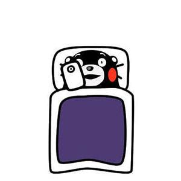

读万遍书，行万里路。

吾常终日而思矣，不如须臾之所学也。

何为享受生命，当你认真对待你所做的一切时就是在享受生命。

# 懒惰

> 知乎用户——张浩然

看到一个问题，【对写作失去热情，对阅读失去欲望，但心里又真的很喜欢写作，怎么办？】

提问者是这样说的：“现在的我非常的浮躁，感觉自己什么都做不了，整天打游戏，一点理想追求也没有，明明心里很喜欢写作，但总是没有耐心静下来写作，对阅读也没有了以往的渴望，无法全身心的投入某件事情上去，咋弄啊？”

关于这个问题，其实很多人也有类似的情况，明明很想去做某件事情，但就是提不起劲，心里很着急，身体却很怠惰。比如：

考试前夕，要复习的资料一笔未动，趴在床上刷手机；说好的健身房跑步，却一直窝在房子里打游戏等。

其实这些行为都有着可被预测的规律，就是因为你“炼”成了一个惰性大脑。字面意思，你的任何懒惰行为都是受到了惰性大脑的影响，这是导致你拖延的根本原因。而且，并不是说你天生就具备这样的大脑，而是你长期以来慢慢转变成的。

想了解原因，请继续往下看。

**一.惰性大脑是人类天性的体现**

人类的本质是复读机——不好意思，串场了。

开个小玩笑，人类自古以来，就有一种趋利避害的本能。这种本能使我们的祖先走出山洞，收获了平原和满仓的猎物，开始演化人类精彩纷呈的发展史。这是源自于我们基因里的生物本能，天生会让我们对外界事物作出判断：选择对自己最有利的，避开对自己有害的。比如，面对宽阔的大路和崎岖的小路，我们会选择大路。面对美味的面包和干瘪的土豆，我们会选择面包。即使到了现代社会，这种逻辑依旧不变：柔软的沙发和干硬的板凳，选沙发。打游戏和看书学习，二话不说打游戏。所有这些选择都有一个判断准则，那就是大脑会因为这种行为感到愉悦。而相对艰难的环境则会令我们感到不适，难受，会产生抗拒及加速逃离的想法。比如看书这种事情，需要人去阅读，去思考。那一时看不懂就很难受了，感觉上面的字拆开来都认识，连在一起就成了天书，连带着整个人都昏昏沉沉的。借用李云龙的话：学习？学个P！

玩手机 x（n+1）小时·····

简单来讲，为什么你会对学习提不起劲，而刷抖音打游戏却很有动力，就是因为**大脑遵循生物本能直接下达命令，选择能带来愉悦体验的行为，让我们不自觉地投入到娱乐性较强的活动当中去。**

**二.惰性大脑只对即时刺激起反应**

公众号【L先生说】中《你的深度思考能力，是如何一步一步被毁掉的？》一文中提到：“一切娱乐产品——影视剧、综艺、游戏，它们背后有着庞大的团队，这些团队的唯一目的，就是用尽各种手段，去降低你触及它们的「阻力」。它们会在你视野中不断出现，用各种资讯、消息提醒你，诱导你去点击。一旦点击了，就再也不会给你机会离开。”

“一旦你习惯了这种「低成本、高回报」的刺激，你就很难去做那些「高投入」的事情了。因为，我们的大脑已经被周围的环境，塑造成了一个「高刺激阈值」的对象。习惯了轻而易举能获得大量愉悦感，你就会慢慢对这种愉悦感脱敏。"

“相对而言，愉悦感更少、付出更高的行为 —— 比如学习，阅读，思考 —— 自然也就没有人愿意去做。"

L君是深度思考领域的践行者，他对事物的看法非常敏锐和深刻。是的，正如L君所言，我们的大脑在长期追求愉悦行为的影响下，已经被严重塑造成只对能够即刻带来反馈的东西感兴趣。讲具体一点，刷抖音为什么停不下来，就是在这15秒之内，视频能够提供一个令你意外的元素，或许是搞笑，或许是猎奇，你的心里总是在期待着能够瞬间带给你惊喜。然而如果递给你一本专业书，你甚至连15秒都看不进去，因为看书需要思考，15秒的时间，怎么可能就吸收并消化得了这些内容。所以，对于需要时间来给予反馈的行为，比如乐器的练习，跑步，读书等，被现代娱乐声色惯坏的我们，根本无法继续做下去。

**三.惰性大脑容易被完美主义所影响**

关于完美主义的具体解释在此不贴，我个人简单翻译一下：过于追求事物完整性或完成度，不接受任何瑕疵。或许你会认为你自己并没有这种情况，因为每天该吃吃该喝喝，就算有不如意也不会过度在意。但其实这与完美主义并不矛盾，应该说，我们每个人都是潜在的完美主义者，只是追求完美的方向不同。以我为例：在两个月前，我的年度目标是写一篇完整的新媒体文章。如果有看过我之前文章的童鞋应该会疑惑，因为我这段时间已经写了好几篇出来，怎么看目标都不是是这个。但其实，在这之前，我对于写文章这件事还是相对比较恐惧的，因为我本人自以为在写作上比同龄人功底好一些，然而我却不知道如何写出一篇完整的文章。我担心的是我写不出来，第二如果写出来很烂怎么办？其他人会怎么看我云云。这种想法在我的心底反复出现，让我深陷某种痛苦之中，暗恨自己的无力和弱小。现在回过头来反思，我认识到了我这种想法，就是典型的“完美主义”的表现。完美主义并不是说在生活上追求尽善尽美，而是会在你最在意的地方张牙舞爪，阻碍你的下一步行动。比如，我有个朋友，她从上学时英语就学得不错，但是近段时间在聊的时候，她说她没有过六级，现在很害怕提到英语复习，生怕自己过不了，在别人眼里变成一个笑话。道理都是一样的，如果你对一件事情迟迟无法开始行动，那一定是完美主义在作祟，影响了你的大脑和思维，让你始终无法进步。

那么，在清楚认识“惰性大脑”的成因后，我们又应该如何去做呢？

**第一步，先尝试做5分钟，告诉自己只做5分钟，做不下去了就停止。**先让自己动起来，这很关键。因为很多行为看着吓人，只是我们在大脑里的臆造而已，真正动手以后你就会发现并没有那么难。

**第二步，记录过程。**在做的过程中，你可以拿纸笔把进度写下来，不论是用百分比计数或者写具体描述。这样做的目的是心里有数，让你知道你开始行动，并且已经有了成果。这实质上是一种自我激励，暗示自己可以做到，并且会越做越好。

**第三步，总结反思和感想。**把自己在行动过程中的感想做一个回顾，想想自己还有哪些不足，哪些地方还可以改进。最重要的是，不用怕做得好不好，谁都有个开始不是么？毕竟如果不去行动的话，那就永远开始不了。

ok，到此为止，感谢你的阅读，希望能够给你带来切实的帮助，如果有什么问题，欢迎留言与我交流，我会非常高兴。

# 坚持

**很想努力拼命一把，但没有动力坚持下去怎么办？**

> “只有行动能给你带来自信，持续的果断的行动。”

没那么多需要扯的高大上鸡汤，只是需要训练。

本文不讨论价值观，自律，博弈策略，只考虑怎么训练坚持下去。

按照以下的步骤，一步一步尝试看看：

1，找一个可以当天有正反馈的事情，比较常见的是，做饭，整理房间。

每天坚持做好这个事情，比如，晚餐每天要做不一样的菜，做一个就行，自己（也包括朋友家人）喜欢吃为标准。每天换着花样做，坚持三周。

2，把第一个事情改成每周一次，然后找一个需要坚持几天才有正反馈的事情，比如跑步，游泳，撸铁，最好找个同伴一起，每天固定时间段做，坚持三周。

3，把要努力的方向明确后，找相应的考试，外语有各种考试，很多职业有各种证书，从最简单的开始考，先报名，每天固定时间学习2~3小时，这个学习时间要把手机关掉，或静音后放在其他房间，如果需要看网课，单独用笔记本或者学习的ipad（不要装社交app和游戏）。

4，两次以上考试合格后，把合格的证书放到学习常见位置，找下一个每天2~3小时的时间要肝的东西。

5，阶段3以后，每天记日记，记下来今天有什么收获，可以简单一些，然后每周复盘一次。

以上坚持下来，就能养成需要肝的时候，有自制力的习惯。

一些要点：

1，要不断回顾自己坚持长期训练过程中的收获，给自己信心，自己可以坚持。

2，把事情分级，不要忙于每天的鸡毛蒜皮事情的思考，不要关心八卦和娱乐新闻。

3，目标确认后不要去想实现很难，而是把每天的学习时间（开始是2小时，可以扩展到5小时）用好，持续做好当前的目标就好。

4，每周可以有固定一天，不肝，休息。

5，三周是一个基本的习惯养成周期。

以上。

供尝试参考。

# 优秀

**如何让自己优秀起来？**

**一，要对自己的定位有个清晰的认识。这是第一步，也是最重要并且最难的一步，在决定让自己优秀起来之前，一定要弄明白这个问题，“我是谁？我在人生的什么阶段，我与周围的人相比处于什么位置？我与同龄人相比又处于什么位置”。很多人信心满满地决定改变自己，但在这第一步对自己的判断上就出错了，导致后面再怎么努力都无法达到想要的目标。这就如同地图导航，连自己在哪儿都搞错了，即使后面路线规划的再好，也是白费力气。**

**二，要弄清楚自己的想法。究竟是我要变得优秀还是要我变得优秀，这是一个主动与被动的过程，它直接决定了在接下来的过程中，我们愿意为之付出的努力与坚持的力度。很多人终其一生都没有弄明白自己要干什么，上学的时候老师和家长会告诉他们，他们应该干什么。工作之后，老板和同事告诉他们，他们应该干什么。终其一生也没有真正摆脱别人口中的“应该”，过得昏昏噩噩，毫无激情与动力。其实想要知道如果一个人主动想要一件事究竟有能产生多么大的动力，看一看周围玩游戏的人就知道了，无论是王者还是吃鸡，每个玩家打游戏的时候都是全神贯注，活力满满。尽管有游戏设计者精心引诱玩家入局的原因，但是对于玩家而言是他自己想要玩游戏，才能够调动自己全部的精力与激情去做这件事情。**

**三，要对自己想要的“优秀”有个明确的定位。究竟是要比过去的自己优秀，还是比周围的人优秀，更或者是比同龄人优秀。之后才能够制定改变自己的方案，太过高远的目标，很容易让人望而却步，早早放弃，只有看见摸得着的目标，才会更加具体，更加有诱惑力**

**四，有了明确的定位动力和目标，剩下的就是具体如何去做的问题了，这里我有几条建议，或许有所帮助**

1. **拒绝接受碎片化信息。**
2. **拒绝廉价的成就感。**
3. **培养自己独立解决问题的能力。**
4. **培养自己专注做事的能力。**
5. **给自己紧迫感。**

**不管在哪里做什么事，努力总不会心虚。** 

# 箴言

你有哪些箴言想告诉刚毕业的大学生？

> `我是花丑，诸君久等了。`

终于要毕业了，我不知道该恭喜你们，还是该怜悯你们，你们当中大部分人要读20年书，接下来很可能要还30年房贷，就这样庸庸碌碌过一生；你们当中99.99％的人会变成钱奴，钱奴，听起来很残忍，但这是事实。

你们刚刚下载这个叫“社会”的APP，对规则一窍不通，有些茫然，有些不知所措。10年前的我和你们一样，现在的我是社会的前万分之一，性格和思想使然，我只想当掠食者玩家。本文通篇都在传递强者思维，要真正读懂我文章里的观点，你得带着脑子，最好有点儿慧根。

1.当前教育机制的本质就是批量生产螺丝钉，毕业证仅仅是一张打工者的通行证，它承载不了更多诉求。对真正有能力的人来说，大学左右不了人生。我列表里的清北本科上百人，对接之后发现高分低能的现象在这种顶尖学府依旧很普遍，这些人仅仅是把天赋树上关于学习的技能点加满了，而已。所以，别觉得你学校好就了不起，会念书跟有能力是两码事儿。

2.权臣曾国藩有云：众争之地勿往。关于考研，我的个人观点是：非必要，不考研。首先，学历贬值的速度是肉眼可见的；其次，学历只能决定你人生的下限，并不能决定你的上限；最后，我是真心觉得把人生最风华正茂的时光都用来参与学历内卷，蛮可惜的，人间只一回，青春很昂贵。当然，你最终到底要不要考，还是要结合你的专业和择业需求，深度权衡。

3.潜意识里不要再依赖父母了，至少有九成以上的父母很菜，不，是非常菜，包括我的父母。他们在我人生的重大抉择上，从来没有提过高光建议，在我的成长过程中，他们从没有给过我高品质的指引，不是不想，是真的没那个本事。他们自己的大号玩儿废了，扭头把我们当小号玩儿，殊不知游戏规则变了，他们那些攻略已经严重滞后于当前版本了。

4.刚走出象牙塔，你的认知不足以让你认清社会运行逻辑，不足以看清人性本质。成长过程中一定会遇到很多棘手的问题，冷静下来，如果一个事情让你觉得很难很难，那答案一定在更高维度，试着换条思路去解决，如果最终成功解决掉，即刻抛下心锚，积累多了就会总结出技巧，慢慢也会养成成长型思维。

5.人生规划一定要践行长期主义，流水不争先，争的是滔滔不绝。拉伸时间和空间才能让你更清晰地看清某个行业，以做出更清醒的判断。年轻赚钱可以稍微急一点儿，但不要做勤奋的驴子，累死的都是赚小钱的。多去聆听与学习更高阶的赚钱方式和思维，这些对你的影响很深远。赚钱之前先把事儿做好了，积攒势能，势能积攒到位了，那后面基本就是一泻汪洋，一年顶十年。

6.任何对你没有正向收益的事情，都不值得你投入时间和情绪。尽量避免和不同频的人争论，认知的差距让人与人的差别比人与狗的都大。认知可以把人划分为100个段位都不止，它是一个人思维、学识、心智、阅历以及社会地位(财富)的综合体现，你要从这几个维度去提升你的认知边界。

7.永永远远都要保持独立思考的能力，不要让任何媒体钳制你的思想，只忠诚于自己身体发肤的感受，只臣服于自己的意志。不要轻易向别人展示你的懦弱，人类这个物种能卑劣到的地步，远超你的想象。行、坐、立、卧，身体要打开，成大事儿的人，眼神都很坚定，处事都很果断，性格都有侵略性。当你开口说话的时候，你说的话就必须比你的沉默更有价值。

8.根据能量守恒定律，现在让你爽的东西，今后也大概率会让你痛苦；现在让你痛苦的，最终大概率会成全你。比如沉迷游戏很爽，但你因此而失去的东西，总有一天会让你扼腕叹息，“当其欣于所遇，暂得于己，快然自足，不知老之将至，及其所之既倦，情随事迁，感慨系之矣”；比如改变、自律，这些自我雕琢的过程，一定是痛苦的，但如果你坚持下来，将来的你一定会感谢现在的你。

9.刷抖音、B站、小红书，不要光图一乐呵，这除了增加你屏幕堕落的时长，其他一无所获。试着观察与探索那些不起眼的细分领域账号，看看能否模仿一个(感官上)不如你，却拿到结果的前浪，深刻剖析他的起号逻辑和变现模式，看看能否找机会也做一个账号。这些前浪的年龄也不见得比你大呀，人家能大把赚钱，你凭啥就不行，你比他差哪了？

10.正确拥抱互联网。试着学学视频剪辑，账号运营，一旦做好一个账号，就相当于你在现实中拥有了一套门头房，将来无论你要做什么，总比一个素人要高效的多，这个“门头房”，不受疫情的负面影响，不受任何空间的限制，无论你身处洛杉矶，还是想回老家县城，它都在你的手机里，而且永远免费。我的创业社群里有太多四两拨千斤的大学生，都是这么崛起的，无一例外。

11.展开你的观察你会发现，那些真正出类拔萃的精英，都特别善于用脑。他们会深度洞悉并捕捉事物的本源和底层逻辑，而后大致推演出其变化方向或终极形态，并能通过自己的处事逻辑和行事手段拿到结果。所以，身为一个灵长类高等智慧生物，必须得学会用脑，尤其是男人，鸡巴不好使都不要紧，千万别脑子不好使。鸡巴不好使，失去女人，脑子不好使，失去全部。

12.社会就像一棵爬满猴子的大树，向上看全是屁股，向下看全是笑脸，左右看全是耳目。社会上的择友，取决于你的综合能量，他们通常会随口打探你的谋生方式，以便快速衡量出对你的尊敬程度。不光是人，其实动物的本性就是慕强和趋利，想要有高品质的圈子，必须先强大自己。当一个人认识你，对他而言是正向收益的时候，他才想和你做朋友。成年人交际的本质就是利益互换。

13.现在闪过的每一个想赚钱的念头，都是未来的你在向你求救。钱比你想象的还要重要得多，在我心里与健康并列。生活中除了呼吸免费，其他的都得付费，反哺父母，照顾妻儿，衣食住行，每一样都得花钱。你觉得生活凄苦，仅仅是因为你穷，你若崛起，这灯红酒绿，这骏马轻裘，只等你去享受，吹个风都他妈是甜的。

14.择偶必须慎之又慎，要尽可能地去观察对方的品格秉性。如果你是女生，千万别轻易让自己怀孕，一旦遇人不淑，会让你深陷泥潭，消耗大量精力。如果暂时遇不到像父母那般爱你的人，宁可晚嫁，甚至不嫁，也不要嫁错，婚姻的试错成本太高昂了。如果你是独女，别把自己嫁得太远，有时候想念爸妈是那种钻心的想念，交通工具再便利，也怕归家路太远。

15.要对未来有预见性，重要的事情要放置plan B，这样即便发生变故，也不会让你措手不及。工作之余可以学一门手艺，挑选那种在可预见的未来不能被人工智能替代的手艺，学精了，最好能达到在领域内或区域内小有名气的水平，这样在人生失意时(比如中年失业)，也能给自己几分托底的勇气，所谓荒旱年饿不死手艺人。

16.世俗的成功没有那么难，大部分庸碌的人生都是因为懒。现在互联网掘金比做实体要简单，基本都不需要投钱，即便输了也只是输掉精力和时间，找对方向+深度渴望+极为专注+变态执行+一万小时，你大概率会在某个领域有所建树。我曾深刻剖析过我自己，以及身边的创一代们，我们的崛起大都是用这套公式。人先有痴，而后有成，古今中外，概莫能外。

又写到饿了，就先这么着吧，我去厨房对付点儿吃的。我是真挺忙的，你也知道丑弟儿的买卖一天还能赚个三万两万的，我写一篇文章投入的精力太大了，横竖都划不来，要能划得来我就天天写了，对吧？现实中有丑弟儿这个水平，还继续在这个平台用心输出的，不多了。我更新的慢诸君也别挑理，感觉写得对你有点用，就张罗个免费的赞。

最后用我社群的群训收个尾，一年探索要领，三年沉淀致用，一生躬身践行。

我是[@花丑](https://www.zhihu.com/people/8c905dc14abe819f887187b614840289) ，感谢阅读。

> 摘自知乎用户——花丑

# 30而立

大龄男女都一样艰难。

年轻是一层厚厚的美颜滤镜，掩盖了一部分丑、穷、笨、作、懒、自私、无能等等问题。

等年纪大了，滤镜没了，大家慢慢露出本来面目。

长得不美的，再也没有胶原蛋白做遮掩；

人穷家贫的，再也没有飞上枝头的指望；

脑子蠢笨的，再也不能拿单纯无知来掩饰；

作天作地的，也不能拿随性、没有安全感做借口；

闲懒散慢的，再也不能拿梦想、爱好之类的词儿当遮羞布；

至于无能，已经明明白白的写在工资条上了呀！

**没了滤镜，才发现彼此面目可憎，而已。**

# 不思

> 作者：樱桃小完犊子
> 链接：https://www.zhihu.com/question/321459788/answer/2764321416
> 来源：知乎
> 著作权归作者所有。商业转载请联系作者获得授权，非商业转载请注明出处。

废掉一个大学生，真的太简单了！！！

**1、玩手机，拼命玩手机。**

刷抖音、刷知乎、逛B站、逛微博、看朋友圈，这个世界如何精彩，快乐如此简单，怎么也停不下来，一事无成太容易了。

**2、买装备，买最好的学习装备。**

用最新的笔记本电脑追剧打游戏。

**3、超前消费。**

花钱时理由一大堆：裙子真好看，手机颜值高，包包是新款。

还钱时总在计算：用网贷还借呗，用借呗还花呗，怎么还利息能最少。

**4、下课了立马把自己封印在宿舍**

饭让室友打，快递托室友拿，然后一个月后发现自己胖了十斤。人的颓废，就是从放弃身材开始的。

**5、想一口吃成大胖子。**

读一本讲沟通的书，就希望自己变成交际高手；
追一个女孩，就希望马上可以告白成功；
背10个单词，就希望英语能考90分。

给自己做了这么多预设，一旦发现自己付出的“努力”没有得到预期的回报，就安慰自己不是这块料。眼高手低，不愿改变。

**6、放弃成本低到谷底。**

一个人能轻易放弃到什么程度？原计划7点起床，8点去图书馆。一觉醒来9点了，就会想着“反正今天的计划没法完成了，明天再重新开始”，然后因为开头的1个小时没有按计划进行，就颓废一整天。

**7、做个大忙人。**

今天去这个社团跑跑腿，明天去那个社团打打杂，然后安慰自己，这样起码可以和别人混个脸熟，积累自己的人脉。
于是，两年过去了，自己变成了打杂时人人都能想到的“人脉”。

**8、经常窥探有钱人的生活。**

比如经常刷小红书，满屏都是什么“18岁挣到人生的第一个100万”“24岁买了人生的第一套房”，看来看去，好像就自己最穷。

经常体验这种心理落差感，会让自己深陷自我怀疑，抱怨原生家庭的不公，焦虑感满满，却无能改变。

**9、容不下比自己优秀的人。**

一看到比自己优秀的人，不是想着多和他们打交道，多分析他们怎么做到的，就只会酸溜溜说人家只是运气好。

**10、心气浮躁。**

业余时间只想沉迷抖音快手，给大脑制造一波波快感的人，成不了大事。

他们即便有天赋，也会被浮躁和生疏收走，再也不能沉下心做事，别说看经典著作，就算看到好文章，也会随手划走。

**11、没有重点，什么都想学。**

写作、健身、摄影、英语样样不落下，计划把自己培养成一个全能型人才。结果目标太多，时间分配不过来，最后什么也没学好。

**12、深陷假努力的错觉中。**

一大早就到图书管霸占VIP座，看了两页书，告诉自己要劳逸结合，开始掏出手机刷刷刷，一抬头两个小时过去了。
下午又是重复同样的流程，直到晚上图书馆闭馆才回宿舍。不但学了个寂寞，也玩了个寂寞。

**13、和室友交朋友，努力融入他们的圈子。**

室友追剧泡电影，你也追剧跑电影；
室友打牌唱K ，你也打牌唱K；
室友逃课睡觉，你也逃课睡觉。

**14、经常逃课被老师点名。**

那么你很可能发现期末考试时，别人是60分，你是59分。

**15、总感觉自己时间很多，未来有无限的可能，拖延一点无所谓。**

于是，作业可以拖到明天去做，单词可以拖到明天背。一年365天，每天都是明天。毕业找工作那时，才发现自己当初的愚蠢和无能。

**16、遇事只会抱怨。**

考试成绩不好，赖老师；长胖十斤，赖学校门口奶茶店。怨天怨地怨社会，反正都是别人的错，自己肯定没错。长期下去，身边的人都会远离这种人。

**17、过分讨好别人。**

室友让自己打饭，室友让自己拿快递，室友让自己帮忙作弊......
虽然内心里极度抗拒这些事情，但害怕拒绝就会被讨厌，所以即使自己受尽委屈，也要答应室友的要求，照顾室友的情绪。

**18、拒绝思考。**

许多人年纪轻轻，就停止了思考。
他们上学过得舒心，有坎坷也会“甩锅”给学习太难、任务太多，却从没想过自己的一天，对未来的几十年有没有帮助。
他们的大脑几乎没有使用过反思、观察、总结这三样技能，每天都过得“浑浑噩噩”。

# 成瘾

> 作者：奇迹年
> 链接：https://www.zhihu.com/question/473249078/answer/2247979027
> 来源：知乎
> 著作权归作者所有。商业转载请联系作者获得授权，非商业转载请注明出处。

大多数手机成瘾危害的研究结果，对年轻人的杀伤力约等于0，没有一个二十出头的人会因为担心近视和颈椎病而不玩手机，因此这篇文章对那些杀伤力为0的内容一笔带过，**我打算制造一些直击灵魂的焦虑。**

人的大脑可塑性非常强，这是所有自控力和意志力相关书籍的一致观点，相关的脑科学研究也支持者这一论点。但是我们要认识到，大脑可以正向塑造，同样也可以反向塑造。而手机则是向负方向塑造大脑，使我们大脑变弱的大杀器。

互联网巨头对用户时长的争夺，导致各类APP的成瘾性越来越强，普通人对他们的产品越来越依赖，刷会儿抖音回个微信，点赞几条朋友圈，再切换到微博看明星八卦，看到种草博主的推荐，又切到淘宝，注意力持续时间永远不会超过10分钟，时间久了，大脑就会被折腾的注意力极其涣散。

我们大脑的工作原理和身体一样，都是“**用进废退**”，一个原本舒适区在10公里的跑步者，如果出于偷懒或其它原因开始跑5公里，他的水平将会从10公里迅速倒退到5公里。

同样，智能手机24小时不间断的推送通知，持续干扰大脑的深度思考，将会大幅减弱我们的专注力，原本你能专注思考两个小时，但手机隔几分钟给你推送一条新闻、未读消息，打断你的思考进程，久而久之就会丧失深度思考能力，人也就废得差不多了。因为你只能进行“**五公里的思考**“，当工作或学习需要你进行”**十公里的思考**“，你就跪了。而你的竞争对手则可以进行”**马拉松级**”的深度思考。

大脑在处理内容时的运行机制和电脑很像，都有一个预热的过程，也就是先把内容加载进内存，再进行处理运算，如果你的大脑刚加载几KB的数据，还没完成预热，就被手机干扰了，你的大脑将永远停留在几KB的处理能力，一旦要处理稍微大点的数据，内存就会溢出。**这种情况的外在表现是，你在学习的时候很容易走神儿，或者在思考复杂问题的时候很容易思维混乱，不得不一遍一遍从头开始理顺逻辑。**

如果你再沉迷算法推荐给你的内容，得，那你人就全废了。

算法推荐时代的内容创作，第一要义就是“爽”，有句话说，音乐人为了押韵可以写出任何没有逻辑的歌词，而算法平台的创作者为了让观众爽可以创作出任何内容，抖音的影视剪辑号，已经内卷到把浓缩成5分钟的电影，再剪出最吸引人的几秒放在片头。

我们的大脑如果习惯这种内容的“**喂养**”，刺激点就会变得非常高，结果会是你再也无法专注去看那些大部头的书籍，与那些充满“**爽点**”和“**虚假获得感**”的内容相比，大部头的书读起来毫无快感，即使你相信它对你非常有用。

这不是我为了制造焦虑危言耸听，而是有相关脑科学的研究做为支撑。大脑对“爽”的内容的渴求，与成瘾机制非常类似。大脑喜欢被新鲜细碎的内容冲刷，是因为它会让大脑产生多巴胺，在历史的长河中，多巴胺对人类来说一直是奢侈品，大脑对多巴胺的渴求会激励着人们去奋斗，但是当大脑习惯打开手机就能获得多巴胺，就会再也无法忍受枯燥的深度阅读，一心只想看穿黑丝的小姐姐跳舞、打游戏。

美国有很多几百斤的大胖子，他们对高热量的食物上瘾，导致体重越来越重，而体重的上升又会进一步刺激他们对高热量食物的需求，陷入恶性循环。

我们的大脑在碎片化内容的喂养下，也会像“**高热量食物上瘾**”一样变得“**又虚又胖**”。虚的表现形式是再也无法进行深度思考，胖的表现形式则是分泌多巴胺的阈值越来越高，需要看更多、更漂亮的小姐姐跳舞。

最可怕的是，当你失去深度思考能力以后，会导致你看不清新事物的底层逻辑，错过各种翻身机会。现代社会每隔几年，就有一波浪潮，只有保持脑清醒，坚持深度阅读与思考，才能看清未来，成为先知先觉者，站上浪潮之巅。

而被手机干废大脑的你，工作效率会不断降低，整个人变得浑浑噩噩，焦虑感持续上升，陷入内耗不能自拔，连工作、学习都应付不了，理想和未来也就不要指望了。

于是你开展自救计划，下载各种日程管理软件，给自己安排一堆学习和健身计划，严格控制玩手机的时间，但是注意力和自控力是一体两面，注意力下降的同时，自控力也会减弱。始于雄心壮志，陷于自控力不足，你的自救计划大概率会一次又一次失败。

你问我为什么这么了解？因为我深受其害。

当我意识到注意力出现问题，开始自救的时候，我仅剩的那点自控力，与庞大的计划相比，简直是蚍蜉撼树。毕竟大脑不是一天被干废的，根本不可能在一夕之间就完成拯救。

后来又看了很多资料和亲身试验以后，我总结了以下几种比较有效的恢复注意力的方法。

**第一，先把大脑对多巴胺的高需求降下来。**

当大脑的刺激点和兴奋点在一个很高的区间，你需要不断看小姐姐跳舞，在游戏中骑马砍杀和持枪冲锋，才能满足大脑他老人家的需求，这时候你根本就干不了别的。你制定的自律计划越多，你就越觉得自己是个废物。

那怎么才能把刺激点降下来呢？答案是刻意无聊。

我们现代人几乎失去了无聊的机会，忘了无聊是什么感觉。让我来帮你回忆一下，你入职了一个新公司，第一个星期领导就让你熟悉熟悉环境，没有给你安排具体的工作，你闲的难受，又不敢明目张胆的玩手机，总想找点事情干，这就是无聊。

大脑在清醒状态下，总要处理点什么信息，不然就会特别难受。主动去无聊能有效的激发你处理信息的欲望。所以当理性告诉我们“放下手机去学习”，但你又做不到，或者当你特别不想工作、学习的时候，除了玩手机还有一个中间状态，那就是什么都不干。

等你无聊够了，就工作一会儿，或者看几页书，看不下去就继续无聊，经过这样的反复练习，大脑的刺激点很快就能降下来。

**第二，用正确的休息方法。**

真正的休息是非参与式的，小憨、发呆、冥想、放空才是真正的休息，而那些参与式的休息，比如刷短视频、打游戏都会持续不断的干扰大脑，使你产生混沌感和疲劳感。

**第三，坚持冥想。**

冥想的各种好处已经有很多研究，总结起来就是，冥想可以提高大脑前额叶皮层区域抑制低级区域情绪活动的能力。用大白话说就是，冥想可以抑制悲观、沮丧、懒惰、拖延、浮躁这些负面情绪的产生，增强抗压能力、延迟满足、专注力等等。

最常见的冥想方式是静坐，然后专注于呼吸。

你可以坐在椅子上，或者坐在垫子上，然后注意你的呼吸，呼气时默念“呼”，吸气时默念“吸”，当你发现自己走神的时候，重新把注意力放在呼吸上即可。几分钟之后，就可以不默念“呼”、“吸”了，把注意力专注在呼气、吸气上，认真感受气息在体内进出的感觉。

新手每天练习五分钟就可以，然后慢慢增加到10分钟、20分钟，如果觉得有负担，可以再减少。但是每天都要练习，按我的经验，中断一次很可能就前功尽弃。

多提一嘴，如果你已经废到每天5分钟的冥想都坚持不了，那就用冥想辅助软件，这类软件会播放一些舒缓的音乐，界面上有一个能变大变小的“**圆**”，圆变大的时候吸气，变小的时候呼气，跟着练习，可以很好的帮助你渡过新手的浮躁期。

**第四，洗脑自己厌恶手机。**

具体操作就是把你遇到糟烂事时所产生的愤怒、恶心、厌恶等等情绪，投射到手机上，这有两个好处，一是平缓糟烂事带来的负面情绪，二是你对手机产生了厌恶感以后，自然就减少了玩手机的时间。

另外，能用电脑完成的事情尽量用电脑，毕竟电脑是生产力工具，而手机的娱乐属性大于生产力属性。