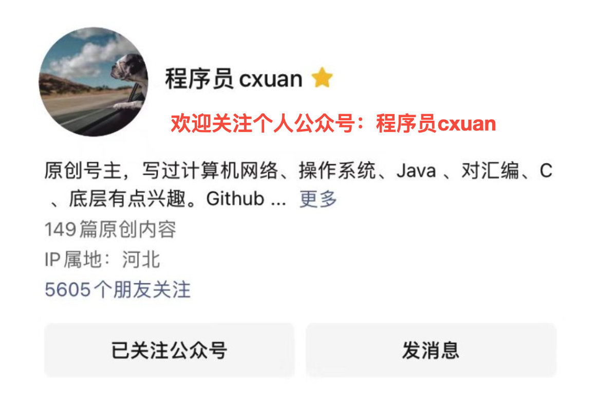

# 七宗罪

> 摘自百度百科

但丁在《神曲》里根据恶行的严重性顺序从轻到重排列七宗罪，其次序为：
**色欲**（拉丁语：luxuria，英语：lust）－－**放纵自己的欲望，只重视肉体的满足，忽略心灵的沟通交流。**
色欲是指过于强烈的、不合乎道德的欲望。对性爱的渴望，对刺激的追求等都是色欲最极端的罪行。（但丁的标准是“过分爱慕对方”，而这样便会贬低了神对人们的爱。）
**暴食**（拉丁语：gula，英语：gluttony）－－**浪费食物，沉迷享乐。**
狭义的观点认为“暴食”等于浪费食物。从广义来说，就是指“沉迷”于某事物，如酗酒、滥用药物、屯积不必要的物品、沉溺于赌博玩乐而不思进取等。（但丁的观点是“过分贪图逸乐”。）
**贪婪**（拉丁语：avaritia，英语：greed）－－**希望占有比所需更多的事物。**
尤其是指金钱或权力的过分追求。圣多玛斯·阿奎纳认为贪婪是“背向神的罪恶，正如所有朽坏的罪恶一样，是人为了会腐败的东西，放弃永恒的东西。”与贪婪有关的罪包括偷窃、打劫、贪腐、叛国等。（但丁的观点是“过度热衷于寻求金钱上或权力上的优越”。）
**懒惰**（拉丁语：acedia，英语：sloth）－－**逃避现实、无责任心及浪费时间。**
懒惰被宣告为有罪是因为：1.其他人需更努力工作以填补缺失。2.该做的事情还没有做好，对自己是百害而无一利。（从但丁的神学观念上去看，怠惰是“未能全心爱上帝，未能全副精神爱上帝，未能尽全人之心灵爱上帝”，具体来说包括怠惰、怯懦、容易满足及无责任感。）
**暴怒**（拉丁语：ira，英语：wrath）－－**憎恨他人。**
产生无理的愤怒，对人复仇。在律法所赋与的权力以外，行使惩罚他人的意欲亦被归作愤怒。歧视、过分的警戒心、对他人有伤害的意图也算是暴怒。（但丁描述为“把对公义的爱护歪曲为复仇和憎恨”。）
**嫉妒**（拉丁语：invidia，英语：envy）－－**因对方所拥有的资产比自己丰富而恼恨他人。**
嫉妒跟贪婪一样，是一种因为不能满足的欲望而产生的罪恶。贪婪通常跟物质财产有关，而嫉妒则跟其他方面有关，例如爱情，或他人的成功。（但丁说：“对自己资产的喜爱变质成了忌恨其他更美好事物的拥有者的欲望”。）
**傲慢**（拉丁语：superbia，英语：pride）－－**最严重的罪恶，包括对上帝不敬、对他人凶残。**
《圣经》在路加福音4:5-8记载：撒旦是这世界的统治者，撒旦也曾以他所统治的世界荣耀试探耶稣，这显示撒旦拥有全世界的政治权柄。圣经中并没有交代撒旦的真实身份，仅在旧约有提到：上帝命令人类不可食用智慧之树的果实，撒旦为了摧毁上帝的创造物，化为蛇引诱人类犯罪，导致人类被逐出伊甸园，从此必须忍受寒冷与饥饿。后来其他人的小说写作内容借用撒旦代表：傲慢被认为是七宗罪中最原始，最严重的一项，因为撒旦拥有统治世界的权力，而滥用权力正是一种傲慢。

# 当时只道是平常

> 作者：鹿十七
> 链接：https://www.zhihu.com/question/41771606/answer/2688579428
> 来源：知乎
> 著作权归作者所有。商业转载请联系作者获得授权，非商业转载请注明出处。
>
> 坚持        do it or not do it，专注并坚持之，多么简单的道理啊，只要切实去做。

**本科双非一本，硕士985（东南大学）**，讲真，别听太多知乎的建议，太多营销号，尤其是那些挂着**大学要自律、考证、梦想、拼搏等羊头**的看似励志的**狗肉**建议。这些建议看着很励志，看完很激动，然后**收藏从未停止，行动从未开始**，该啥样就啥样~

对于大学，最核心的主线有三条：

**1、规律作息，保持健康的身体，再好的身体也抵不过规律作息，早上的粥比夜间的酒更美味；**

**2、享受独处的时光，慎独，独立思考，培养相对独立的人格；**

**3、好好学习，除了专业之外，顺带发展点其他爱好，比如写作、表达、赚钱、摄影、吹牛、讲故事等**！

咱就像个正常人一样**学习、生活、恋爱、就业（考研/留学）、旅游、兼职**等就行了，人生没有绝对的模板，只有适合自身的选择。

我觉得大学生最好的状态：**心平气和，与自己和现实和解，大大方方承认别人的优秀；思考清楚理想的生活状态，设定几个目标，寻找实现路径、专注并坚持之**。

# 你想告诉准程序员些什么？

[程墨Morgan]

从业十四年，大公司干过也创过业，有资格作为“过来人”说几句吧。

我见得最多的“准程序员”就是实习生，面对每一个实习生，技术上的指导我自然尽自己所为，但是任何一个专业的工程师都会这么做，我要说的是，我对每一个实习生都会多两条人生建议：

1. 早点买房
2. 不要读研（如果是本科生的话）

至今为止，没有一个人听我的，当然，几年后再和他们或者她们聊起来，**都后悔了**。

说这事想说明的是：**其实准程序员往往也听不进去前辈的话:-)**

但还是忍不住和准程序员们说几句啊，我知道你们喜欢最直接的指导，所以1、2、3这么列下来。

1. **实践是最好的老师**。程序员这行就是实践的行当，做什么事情都看实践，show me the code，少BB。
2. **你自己的价值，不在于你技术多牛，而在于你给组织带来多大价值**。你技术上好厉害，但是你的技术不能给公司带来什么价值，那你就没有价值；相反，即使你技术上还不成熟，但是你做的事能够给公司产品带来价值，你就很有价值。
3. **不要着急成为大牛**。有的事情就是要积累几年才会懂，不要急，即使现在别人当你什么都不是也无所谓，要坚持你的理想，你努力几年迟早会成为受尊敬的大牛。

最后，还要多说一句：**做一个专业的人**。

你为啥选择这个职业呢？肯定有你的理由，不管你本来的理由是什么，**这条路要走得正，走得直，就要做一个专业的人**。

也许你现在还不懂我在说什么，就请记得，当你将来想要胡乱给一个变量起名的时候，当你将来说“这功能在我的机器上是好使”的时候，当你发现自己听不明白你说什么的时候……就想想 [@程墨Morgan](https://www.zhihu.com/people/29448cc28212a543bea56b9492f82e25) 告诉过你，**做一个专业的人**！

——更新分割线——刚发表就有很多朋友问为啥说“不要考研”，虽然我不想再多说，但是为了省一点评论区口舌，我就把以前的答案链接贴上吧：

[程墨Morgan：怎么评价张雪峰在《演说家》的演讲以及那句“所以你不是世界企业500强!”？](https://www.zhihu.com/question/63319033/answer/210609192)

[程墨Morgan：考研有什么好处，在目前情况下，对人生的改变大吗？](https://www.zhihu.com/question/26908425/answer/178930037)

我先说好了啊，我所给的建议，就是我看到的实习生的状况给的真诚建议，绝无私心，劝人不要考研对我有啥子好处，不就是想让学弟学妹们少走一些弯路嘛。如果读者你觉得考研是有必要的，我完全尊重你的选择。

# 计算机noweb

> 作者：匿名用户
> 链接：https://www.zhihu.com/question/452184164/answer/1917115970
> 来源：知乎
> 著作权归作者所有。商业转载请联系作者获得授权，非商业转载请注明出处。

2022年更新：终于上岸某编外咯，各位加油吧，不和你们继续搞计算机（我就没踏进过计算机的门）。我们班目前已有十多个人转行了，继续搞Java的据我所知不是很多。有些是直接进银行工作了，不是搞银行计算机项目的。有的进别的私企了，好像是外贸相关的。有的自己创业了，一年搞了十几万。当然也有些人想考编了，或者像我一样先进编外做着，再准备别的考试。

继续留在计算机行业的，有的已经转行做测试了，或者做实施工程师（基本上经常出差，但不用打代码），还有的去做HR了。

------

2021原答案：

感觉是吧，由于是目前二本应届毕业，所以找的都是实习生岗位。自己面了几个，说说情况。

第一个小公司，十个人不到，比我家还小，面试也比较随意，问的问题很简单，比如[遍历数组]的方式，以及aop通知方式，一些基础概念，重载之类的，抽象类接口区别，完全没有涉及原理。无奈这是我第一次面试，由于当时没有好好准备，还是有一半没回答出来。转正薪资：7000

第二家公司十几个人左右，办公地点很好，某高级大厦，办公室向海。这次面试是真的给我面出阴影了，面试要求写得很简单，了解Java，JS，spring，短短几行字，虽然现在也觉得不是很难。首先问了java常见集合，hashmap线程问题，最可怕的问了我某数据库底层存储引擎的原理，aop的实现方式。除了集合说了一些之外，其它基本都不会。实习期：50～100一天

第三家是电话面试，[java集合]，包括他们的存储结构，基本算法，[数据结构]。因为有了之前的经验，基本都回答出来了。薪资没问，实习期3000。

第四家公司几十个人，这个问的也是完全摸不到套路，看到我简历上写了一些相关课程，就问我这些课都学了哪些，由此展开。而这些课程基本都是我大二，大三上学期学的，我也就依稀记得学了什么东西，仔细讲还真不知道，所以我也很懵逼。和java相关的也就问了一个。还问了一些[网络协议]，真没学过啊。这次也不是很理想，真没想到还问了相关课程所学内容，忘记了很多。转正薪资：估计是7、8千。

结合以上几点，我觉得对于我们这个层次的大部分人来说，不背java面试题，想直接凭经验就通过面试的话，不太现实。很多应届生的经验真的不足，项目比较少，功能也比较简单。真的有人在个人项目里用到了那么多集合吗?或者弄明白了他的底层原理。而我以上面试的这些公司，问的问题都要求你对集合都有一定的深入。

而且，这些公司实习期都是3k，不包吃不包住，一线。所以，真的靠项目经验来弄明白这些知识点的大佬们，早就已经做了很多项目了，也看不上这些小公司。看得上的，想进去，像我们这种有个工作就可以的，也只能靠背面试题了。

# 每天写代码

> 作者：泛程序员
> 链接：https://www.zhihu.com/question/553442941/answer/2717129976
> 来源：知乎
> 著作权归作者所有。商业转载请联系作者获得授权，非商业转载请注明出处。

简单说，能。

反过来说，不写代码，水平一定没提高。写代码是必须要的，还有两个重要的方面经常被忽略：

- **读代码**
- **刻意练习**

## **读代码**

读代码，对于程序员，就好比诗人读别人的诗，作家读别人的文。古人云：巧妇难为无米之炊。不读代码，哪里来的写代码的新的灵感和新的素材？**同样、类似的代码写 100 遍只会增加你打字的水平，不会提升编程水平。**（如果你发现你每天写同样、类似的代码，那说明你应该去学习如何抽象这部分工作，减少重复，而如何抽象的灵感很可能来自于你读到的其他项目的代码。）

《Code Reading: The Open Source Perspective》这本书说提到：40% - 70% 的软件开发工作是改善、完善已有的项目，而进行这项工作之前，我们需要先*阅读代码*。然而，大部分的计算机教育只交会我们如何写好代码，却没有告诉我们如何读好代码。当然，学好基本功（组成原理、操作系统、数据结构算法、数据库、网络）是读代码和写代码的共同基础。

另外，读写也会相互促进，缺一不可。只读不写，是纸上谈兵；只写不读，是无米之炊。

那么，我们应该如何选择项目来阅读呢？要分类来看。本职领域的代码和非本职领域的代码。比如，我是做量化交易的，本职的代码项目主要是关于：回测框架、交易框架、数值计算、时间序列处理等等方面的项目。而非本质的项目可以是任何感兴趣的项目。对于本职项目，需要认真阅读，分析结构、架构、算法和实现；而非本职项目，可以像是读小说或者新闻一样的阅读，可以其中一些亮点，比如小算法啊，一个语法糖啊，吸引。

另外，有一些项目一定要避免：

1. 编码风格不一致
2. 无意义的复杂且难懂
3. 有明显的逻辑问题
4. 无人维护（或者长期无人维护）
5. 大量使用无法迁移的技术

遇到一个项目，可以如下分析：

1. \- 这是我的领域优秀代码吗？
2. \- 阅读这段代码、项目的目的事？
3.   \- 学习新的设计模式？
4.   \- 编码风格？
5.   \- 业务实现方法？
6.   \- 新奇的数据结构？算法？API设计？
7. \- 这个项目的规模适合我吗？
8.   \- 新手应该从小项目入手

不过读代码本身是个大话题，比如检索源代码、语言相关的范式、文档、不同版本的演化等等，一个回答无法阐述。

## 刻意练习

刻意练习容易理解，我们写代码的时候要有明确的目的：这是一个项目还是某个架构或算法的练习？这是项目的什么部分？这部分有什么运行时需求？我应该采用什么方法解决？之前接触过类似的方法吗？

总之，每天写代码的时候应该明确的知道自己在做什么，为什么要写，以及跟其他部分的联系。

其实，就是通过每天的读、写代码，让自己的知识库更新，有意识的纳入新的东西，用新的东西跟自己已有的东西建立联系。这就是刻意练习的意义。

# [Sidney.Ji](https://www.zhihu.com/people/qian-chen-61-51)

在职会计

2,631 人也赞同了该回答

我在24周岁的时候[裸辞](https://www.zhihu.com/search?q=裸辞&search_source=Entity&hybrid_search_source=Entity&hybrid_search_extra={"sourceType"%3A"answer"%2C"sourceId"%3A1498244959})了，以为年轻还有无限可能。

本人性格偏内向，不太爱跟人打交道，喜欢看小说，刷剧，特别宅和懒，间接性努力。刚工作时斗志满满，试图改变自己成为更优秀的人。我在一家著名制造业企业的异地工厂干过两年会计。领导前期蛮看重我想培养来着，后来因为组织架构变动他晋职大领导无暇顾及我。中间我顶了好几个人的岗，有幸了解了不少[管理类会计](https://www.zhihu.com/search?q=管理类会计&search_source=Entity&hybrid_search_source=Entity&hybrid_search_extra={"sourceType"%3A"answer"%2C"sourceId"%3A1498244959})知识，但因为沟通能力、决策能力、管理能力欠佳，还有些不注重细节，导致解决不了什么问题，常常一问三不知，“原形毕露”后经常被领导责骂，长久之后精神压抑，不敢再跟领导沟通。

两年间多次想过离职，但由于薪酬高，工作氛围好，父母不同意，一直坚持着。这个年纪貌似有很多选择，比如考公，考研，考CPA。但因为在工作中无法获得成就感，认为自己干不了任何事，不知道能干什么事，所以对未来非常迷茫，学习、考证有点随波逐流，然后最终一事无成。

离职前信誓旦旦地跟别人讲，趁着年轻，要利用最后的机会了却遗憾，去考研换个工作方向。结果回来后家里人让考公，仓促准备后果然落选，继续准备军队文职，结果自己不争气，两天打渔三天晒网，心里始终有个声音告诉自己“不可能考上”，受到这样的[潜意识](https://www.zhihu.com/search?q=潜意识&search_source=Entity&hybrid_search_source=Entity&hybrid_search_extra={"sourceType"%3A"answer"%2C"sourceId"%3A1498244959})影响，行动上自然不给力。

日子就这么混过去了，然后家里人担心我闷头学没结果，提议我去报培训班，但咨询后培训班都是上完的，又舍不得花钱，最终决定放弃考研，重新找工作。

没有学习的状态，也以为一直失业在家愈发焦虑，不敢出门碰见邻居等熟人。不敢翻阅朋友圈，和同学们的差距越来越大。

找工作的日子里睡不着觉，但得益于前东家的名头，我在一个星期左右的时间里拿到了几个offer，最终抉择时非常痛苦，因为都不是完美的。

我不敢再去大公司，担心重蹈覆辙，也不想加班加点。最后抛开薪水和名企的诱惑，选择了自己感兴趣的工作。迅速入职后，自己又仿佛进入了舒适圈，有工作万事足，开始做只闲鱼。

太容易囿于安逸，好了伤疤忘了痛。有很多想干的，最终却一事无成。

没有目标和坚持，浑浑噩地生活，没有友情，没有爱情，只有垂垂老矣的双亲。

清醒地知道自己的不足，却没有改变的执行力。

荒废了最该奋斗的20年代前半段，与同学、兄弟的人生距离彻底拉开。

若干年的梦想是成为空中飞人，工作充实，无怨无悔。现实却是盼着早点下班，周末抱着手机躺尸一天，变成了不曾想过的人。

手机改变了我的后半生。我堕落着，挣扎着，本命之年遭遇了电话诈骗的悲惨，也经历了失业在家的焦虑和找到工作的小确幸。

我是乐观还是麻木呢？我什么都不知道。

我走了很多弯路，浪费了很多金钱，没有前进的目标便一路跌跌撞撞，摇摇晃晃。我该去往哪里，我背负着沉重的欲望，左顾右盼。

虽然容易受别人影响了但任何选择也是自己做出的，人生是自己的，酸甜苦辣都由自己来尝。

生活不是苦，而是难。难以放弃贪念，难以坚持自律，难以满足欲望。活得清醒比较累，与人攀比容易抑郁，唯有与自己亦敌亦友。活着就有无限可能，虽然有三天三夜说不完的后悔故事，但时间如流水总要向远方流淌。

不管在哪里做什么事，努力总不会心虚。

既然没有破釜沉舟的勇气和决心，那就慢慢来吧，毕竟每个人的节奏都不一样，多几分克制和[居安思危](https://www.zhihu.com/search?q=居安思危&search_source=Entity&hybrid_search_source=Entity&hybrid_search_extra={"sourceType"%3A"answer"%2C"sourceId"%3A1498244959})，真正做到吃一堑长一智。共勉。

# 什么时候

> 作者：cxuan
> 链接：https://www.zhihu.com/question/433470161/answer/2740744797
> 来源：知乎
> 著作权归作者所有。商业转载请联系作者获得授权，非商业转载请注明出处。

上个周末幸得空闲时间和爱人去图书馆学习看书，整理了一下思绪，回忆了一下这两年自己的心态变化，成长经历，学习状态，时间管理等，于是乎我发现自己**变懒了**，趁着今天反思一下自己，也希望能给大家有一些警示所用吧。

## **状态**

随着年龄的增长和周遭事物的快速变化以及自己肩上的担子越来越重，我发现自己很难再进入长时间的学习状态。这种学习状态也是我们经常说的**心流**，即长时间心无旁骛的专心看书，没有频繁的 CPU 线程切换，也不用保存上一秒的内存状态。

由于年龄的不断增大，我发现自己的记忆和理解能力确实在衰退，这种衰退的现象可能起源于不经常用脑导致的脑细胞组织衰减所致，脑细胞衰减就导致思考能力变弱，思考能力变弱就会导致越来越不愿意动脑，这是一种负面循环，很可能会使老年痴呆提前到来。人最重要的是大脑，而我们对大脑的开发和利用却少的可怜。

不知道大家有没有经历过这样一种情况，每天都很多人找你，你看似很匆忙，但是晚上回想一下自己一天的经过却发现做的事情大多数重复性且可替代性很强的工作，而当你一天很快进入工作状态却没人打断你，你勤加动脑你会发现自己能解决很多难题，会有很多创造性的 idea 出现，会觉得自己非常有成就感，这就是一种心流状态。

上面是两种不同情况之间的差距，真实情况其实是第一种：每天有无数个毫无意义的会议和很多人来找你，你自己很难进入心流状态。每天担心自己的绩效在这个季度会不会垫底，会不会存在被优化的风险，导致自己一天天的忧心忡忡，拒绝思考，喜欢做简单且可替代性强的工作来争取绩效，从而产生工作中的内卷 ...... 陷入负面循环。

还有就是手机对我们的控制和吃瓜心态的优先级正在变的越来越高，不摸鱼也不会吃瓜，不吃瓜也不会摸鱼，这也是一种循环，你想摸鱼你才会吃瓜，你吃瓜的时候你肯定正在摸鱼，这就是一种热点效应，中国老百姓就是喜欢看热闹，无非就是形式变了，把现实中聚在一起看热闹搬到了网上变成大家围观吃瓜。所以为啥每次微博只要一崩肯定就是 xx 明星又出轨了这种生活作风性质的烂批事儿，你除了向他键盘伤害之外，还能跟广大的网友有啥关系？你爱看无非就是人性罢了，而进入心流状态是一种逆人性的事情，但很可怕的是这种逆人性的事情在变得越来越少。

编码是需要创造和思考的，而程序员的美好愿景不就是 debug the world 吗？我们不能陷入毫无意义只想划水吃瓜的猎奇怪圈中，我们需要及时跳出来，也许终究一生我们都只是柴米油盐酱醋茶的普通人，但是我们写过的代码，带过的人，都会是这个行业中浓墨重彩的一比，就像 GitHub 尘封在北极中的代码是一样的。

> 在平时的工作和生活中，要让自己多多进入心流，减少外界事物对自己的干扰，进入心流状态，让自己静下心来，思考问题的深度就会加深，会让自己沉浸在一种状态下，一种持续精进的状态中。

## **怪圈**

最近经常听到一些读者不经意间的讨论，cxuan 最近更文的频率慢了很多，我承认确实是这样的。那么为什么会这样呢？其实这些话我很早讲，但是奈何没有找到一个合适的时机，所以趁着今天，我也想说明一下。

其实我陷入了一种怪圈，一种我想写出更优秀的作品，但是写出这种作品需要以大量的基础知识作为铺垫，所以我就想要吸收更多的知识，看更多的书，读更多的文章，汲取大量的营养，但是谁也没法保证在吸收这么多知识后就一定能写出优质的文章，有可能我写的越来越屎。但是有一点确定的是，在吸收大量知识的同时，我是无法持续更文的，但是不写文章就会变的焦虑，导致越来越没信心吸收更多的知识。最终导致文章也断更了，知识也没学到多少。

就比如我是 Java 程序员，也许我写关于 Java 类型的文章会好很多，但是我偏偏想要写操作系统、C/C++ 、计算机网络、汇编等方面的文章，这就需要吸收大量的只是并揉碎了给大家讲出来，不过这需要大量的时间和精力。也许单纯的写 Java 方向的文章会好很多，但是谁叫我愿意呢？理论上我必须承受这些知识带给我的压力，我必须要挤出来更多的时间来接纳，但是实际情况是我躺平了。

躺平的原因有很多种，但是我只接受一种：我变懒了。

我一直以为工作不忙就会有更多的时间做自己的事情，但实际情况是工作不忙就会有更多的时间划水摸鱼，到点打卡下班。再加上结婚之后暂无要孩子的打算，于是自己心态变了。这是很可怕的一件事情，屠龙少年，终成恶龙。

再加上我现在又有健身的兴趣，但是我为满足我的兴趣和工作以及学习的总时间并没有变多，所以我的兴趣就会挤占其他项目的时间，导致我最近的时间管理这块变得很糟糕。

希望我自己能及时调整心态，合理平衡兴趣、工作和学习的时间，慢慢找回之前的状态。人若无名便可专心练剑，时刻让自己保持一种空杯心态。

## **寒潮**

今年对互联网行业最大的一个冲击就是[裁员潮](https://www.zhihu.com/search?q=裁员潮&search_source=Entity&hybrid_search_source=Entity&hybrid_search_extra={"sourceType"%3A"answer"%2C"sourceId"%3A2740744797})和 HC 的锁紧，随着互联网脚步放缓，很多毕业生毕业找不到工作，很多培训班也爆雷。但是由于计算机这几年鼓吹的太狠，所以毕业季有很多毕业生同时抢一个 offer，因此越来越内卷，所以现在的互联网环境可以说是半死不活了。但是这种环境下，对真正优秀的毕业生来说还是影响不太大，还是有一些岗位在招人，不过对于大多数同学来讲，能上岸就抓紧上岸，先活着再生活。考研的人数也是一年比一年多，现在大学生都不好意思跟人说自己是大学生了，因为遍地都是研究生，甚至博士都已经见怪不怪了。

就拿石家庄某个高效来说，二本学校招聘教师 120 个岗位无一例外全是博士学历起，令人卷到只想骂人。

我还依稀记得一年前互联网在高位的时候，应届毕业生年薪 package 50w 已经不算什么大新闻了，再看看与现在的对比，令人唏嘘，无非是在风口浪尖罢了，并不是真正的能力。

那么如何破局呢？其实谁都无法给出准确的答案，我们能做的只是丈量好脚下的步数，不过还是有一些建议可以采取的。

**精进基础知识**

再过多强调基础知识都不为过，但很多人依然认识不到其重要性，很多同学都以为开发就是会写代码就完事儿了，玩玩框架做做增删改查就是全部工作内容，只不过现实是不给你转身的机会的，你看看现在的就业环境是只会增删改查就能找到一份称心如意的工作吗？就拿面试来说，两年前面试还是卷一些框架用法、了解基本原理即可，再看看这两年面试直接卷深层次的内容和应用实现，底层原理等。

基础知识是一通百通的，比如你了解计算机网络的分层设计之后就知道网络协议的每一层打包的目的是什么，Socket 为什么是端口通信的大门？ping 的实现原理，为什么要发 ECHO_REQUEST 包？为什么有的电脑插入网线不用配置 IP 就能直接上网？点击 [http://www.google.com](https://link.zhihu.com/?target=http%3A//www.google.com) 背后的实现过程是怎样的？操作系统为什么要分为三大抽象？

再好比你在搞并发编程，你就得知道为什么读写要遵循 MESI 协议？Java 实现的各种并发工具类其实都是操作系统读写的几种模型罢了，以及线程和进程的本质区别是啥，管程是啥？等等，要学的内容太多了。可以说这个行业你不得不随时都准备学习，可以说是把终身学习理念贯彻最彻底的行业。

**掌握核心技术**

今年很多大厂对内都进行了人员优化，比如前段时间虾皮裁员毁约闹的挺大的，只不过裁掉和优化的都是边缘部门和边缘开发同学，也就是不赚钱没有盈利前景的那些部门。核心岗位的核心开发还是公司的支柱，所以这里建议大家还是要向公司的核心业务、核心部门靠拢，这才是一家互联网公司的全部核心。也就是说要让自己具有核心竞争力和不可替代性，也要有随时离开的本领。

一言以蔽之，多看书，多实践，向公司核心技术和核心业务靠拢，覆巢之下无完卵，大家加油。

