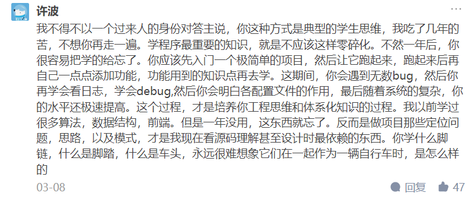

# 100天行动

## 九条核心规则

1. 制定合适的目标坚持100天
2. 一次一个目标是种独特的能力
3. 记录的力量
4. 没有检视的人生不值的活
5. 中断、失败和痛苦是你必须面对的事情
6. 成长从复盘开始
7. 100天只是一个起点
8. 帮你重视的人一起达成
9. 每年一次新挑战突破生活舒适区

## 学习/工作坚持不下去怎么办？

> 作者：warfalcon
> 链接：https://www.zhihu.com/question/63178949/answer/212159368
> 来源：知乎
> 著作权归作者所有。商业转载请联系作者获得授权，非商业转载请注明出处。

现有答案中打鸡血的太多，真正说方法的太少，给一些可以立刻应用的学习建议吧：

### 1、不要在精疲力竭的时候学习

- 对于边工作边考 CPA 考试的人，刚刚经过一天的工作、下班之后回到家里已经精疲力竭，然后简单吃些东西再去学习，往往看不进书，理解能力也很差，这个时候的学习效果是最差，很难坚持下去。

- 当你下班感觉特别累的时候，晚餐反而要注意，不要随便点个外卖或找个小饭店，不要吃的过油，尽量少油少糖，饭菜轻淡一些，多吃些水果。

- 小睡一会。哪怕是10分钟也能让你的疲劳缓解不少，别睡的时候太长，会影响晚上的睡眠，最好不要超过30分钟。

- 补充下水分，清水就好，别喝咖啡、可乐、红牛之类的刺激性饮料，短时间能看到效果，但一段时间之后，效果就会变弱，而且会影响睡眠。

### 2、在专注模式和发散模式来回切换

大脑在学习的时候分为两种模式：专注模式（注意力高度集中）和发散模式。大脑要理解解决任何问题，都离不开这种信息之间的往来传递。当你在学习一个概念时，理解不了的时候。试试切换其它的方式，在搜索引擎中搜索下关键字，看看不同的书籍或教程，有时候对概念稍有不同的表述阐释，就能让你换个角度看问题 。

激活发散模式的一般方式：

- 各种运动：去健身房、慢跑、游泳、跳舞、散步。
- 洗澡或泡澡。
- 听音乐，最好是纯音乐。
- 冥想、静坐。
- 睡觉 。

当你使用一种方法学习学不下去，可以试试换成其它方法，比如做题做下不去、试试背诵。看书或听课程做不下去，试式做思维导图方式或测试。

进入下一次专注模式之前，应该留出足够长的休息时间，让你的意识完全从手头的问题解决出来。

### 3、更换不同的学习场景

成倍的增加与记忆内容相关联的感觉提示数量最简单的方法之一，就是让自己的学习场所加倍——多换几个不同的地方去学习。有多项研究和试验表现，环境背景的变换大大提高了记忆力。

去试试换一个完全不同的房间，换一个完全不同的时间段。去公园、水边、不同的咖啡店、自习室、图书馆甚至是办公室、会议室。这些针对惯常行为的每一个改变都会你把要学、要练的东西记得更牢固一点。

### 4、不要照笔记复习

学不下去的时候，可以停下来。找张图和几个彩色，完全靠记忆，把当前你学的知识点，用思维导图的方式画出来，看看能画出来，不同分支用不同彩色的彩笔，能检测你当前记住多少的内容。或者别看笔记，来重新整理学习材料，想出一套全新的重要概述来，这样做会强迫你把学习材料再重新过一遍，而是以不同的思路过一遍。

### 5、用费曼技巧的方式讲给别人听或自己复述一遍

真正理解与机械记忆之间的区别就在于你是否可以以最通俗易懂的方式去将某个知识讲解给他人。

### 6、睡觉，然后明天早点起床学习

睡觉在学习过程中学习的重要，睡眠能增强你对前一天所学内容的理解力和记忆力。

最好你在睡前快速复习一下关键之处的主要细点，好好睡一觉之后大约能提升成绩的10%-30%。大脑在睡眠时，会把短期记忆转为长期记忆，从本质上来说，保持充足而规律的睡眠，就是好好学习。

不要熬夜或晚睡，尽可能多睡一会，比如7-8小时，会你的精力重新恢复。

早床起床之后，把昨天的内容再重新复习一遍，会让记忆更加牢固，而刚起床的时候学习的效果也比较好。

# 当时只道是平常

**本科[双非一本](https://www.zhihu.com/search?q=双非一本&search_source=Entity&hybrid_search_source=Entity&hybrid_search_extra={"sourceType"%3A"answer"%2C"sourceId"%3A2688579428})，硕士985（东南大学）**，讲真，别听太多知乎的建议，太多营销号，尤其是那些挂着**大学要自律、考证、梦想、拼搏等羊头**的看似励志的**狗肉**建议。这些建议看着很励志，看完很激动，然后**收藏从未停止，行动从未开始**，该啥样就啥样~

对于大学，最核心的主线有三条：

**1、规律作息，保持健康的身体，再好的身体也抵不过规律作息，早上的粥比夜间的酒更美味；**

**2、享受独处的时光，慎独，独立思考，培养相对独立的人格；**

**3、好好学习，除了专业之外，顺带发展点其他爱好，比如写作、表达、赚钱、摄影、吹牛、讲故事等**！

咱就像个正常人一样**学习、生活、恋爱、就业（考研/留学）、旅游、兼职**等就行了，人生没有绝对的模板，只有适合自身的选择。

我觉得大学生最好的状态：**心平气和，与自己和现实和解，大大方方承认别人的优秀；思考清楚理想的生活状态，设定几个目标，寻找实现路径、专注并坚持之**。

> 作者：鹿十七
> 链接：https://www.zhihu.com/question/41771606/answer/2688579428
> 来源：知乎
> 著作权归作者所有。商业转载请联系作者获得授权，非商业转载请注明出处。
>
> 坚持        do it or not do it，专注并坚持之，多么简单的道理啊，只要切实去做。

# 编程学习建议

# 计算机

作者：匿名用户
链接：https://www.zhihu.com/question/452184164/answer/1917115970
来源：知乎
著作权归作者所有。商业转载请联系作者获得授权，非商业转载请注明出处。

2022年更新：终于上岸某编外咯，各位加油吧，不和你们继续搞计算机（我就没踏进过计算机的门）。我们班目前已有十多个人转行了，继续搞Java的据我所知不是很多。有些是直接进银行工作了，不是搞银行计算机项目的。有的进别的私企了，好像是外贸相关的。有的自己创业了，一年搞了十几万。当然也有些人想考编了，或者像我一样先进编外做着，再准备别的考试。

继续留在计算机行业的，有的已经转行做测试了，或者做实施工程师（基本上经常出差，但不用打代码），还有的去做HR了。

------

2021原答案：

感觉是吧，由于是目前二本应届毕业，所以找的都是实习生岗位。自己面了几个，说说情况。

第一个小公司，十个人不到，比我家还小，面试也比较随意，问的问题很简单，比如[遍历数组](https://www.zhihu.com/search?q=遍历数组&search_source=Entity&hybrid_search_source=Entity&hybrid_search_extra={"sourceType"%3A"answer"%2C"sourceId"%3A"1917115970"})的方式，以及aop通知方式，一些基础概念，重载之类的，抽象类接口区别，完全没有涉及原理。无奈这是我第一次面试，由于当时没有好好准备，还是有一半没回答出来。转正薪资：7000

第二家公司十几个人左右，办公地点很好，某高级大厦，办公室向海。这次面试是真的给我面出阴影了，面试要求写得很简单，了解Java，JS，spring，短短几行字，虽然现在也觉得不是很难。首先问了java常见集合，hashmap线程问题，最可怕的问了我某数据库底层存储引擎的原理，aop的实现方式。除了集合说了一些之外，其它基本都不会。实习期：50～100一天

第三家是电话面试，[java集合](https://www.zhihu.com/search?q=java集合&search_source=Entity&hybrid_search_source=Entity&hybrid_search_extra={"sourceType"%3A"answer"%2C"sourceId"%3A"1917115970"})，包括他们的存储结构，基本算法，[数据结构](https://www.zhihu.com/search?q=数据结构&search_source=Entity&hybrid_search_source=Entity&hybrid_search_extra={"sourceType"%3A"answer"%2C"sourceId"%3A"1917115970"})。因为有了之前的经验，基本都回答出来了。薪资没问，实习期3000。

第四家公司几十个人，这个问的也是完全摸不到套路，看到我简历上写了一些相关课程，就问我这些课都学了哪些，由此展开。而这些课程基本都是我大二，大三上学期学的，我也就依稀记得学了什么东西，仔细讲还真不知道，所以我也很懵逼。和java相关的也就问了一个。还问了一些[网络协议](https://www.zhihu.com/search?q=网络协议&search_source=Entity&hybrid_search_source=Entity&hybrid_search_extra={"sourceType"%3A"answer"%2C"sourceId"%3A"1917115970"})，真没学过啊。这次也不是很理想，真没想到还问了相关课程所学内容，忘记了很多。转正薪资：估计是7、8千。

结合以上几点，我觉得对于我们这个层次的大部分人来说，不背java面试题，想直接凭经验就通过面试的话，不太现实。很多[应届生](https://www.zhihu.com/search?q=应届生&search_source=Entity&hybrid_search_source=Entity&hybrid_search_extra={"sourceType"%3A"answer"%2C"sourceId"%3A"1917115970"})的经验真的不足，项目比较少，功能也比较简单。真的有人在个人项目里用到了那么多集合吗?或者弄明白了他的底层原理。而我以上面试的这些公司，问的问题都要求你对集合都有一定的深入。

而且，这些公司实习期都是3k，不包吃不包住，一线。所以，真的靠项目经验来弄明白这些知识点的大佬们，早就已经做了很多项目了，也看不上这些小公司。看得上的，想进去，像我们这种有个工作就可以的，也只能靠背面试题了。