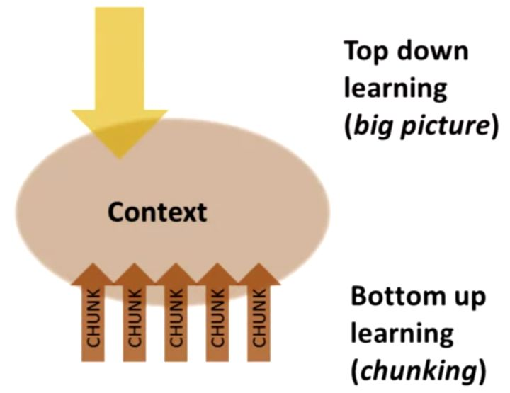

# 热爱学习

取势，就是在学习前要明白，学习的目的和本质；明道，就是懂得记忆、理解、运用的规律；优术，就是通过复盘迭代，不断优化学习方式与习惯。

## 取势

学习首要要捉住两点：

1. 第一个是学习的目的，只有明确了目的（也就是你学这个东西，是为了解决什么问题？）你才有可能知道，我们要学什么？应该学到什么程度？并且要明确学习目的的重心，捉大放小，学习也要分清主次，先去解决最需要解决的问题，细致末梢就放一边。
2. 第二个是所学内容的本质规律（这个本质，其实就是某个学科，考察什么能力；对成年人来说，本质就是行业规律）。虽然说，自己思考，也能归纳出本质，但是这样太慢了。我给你一条捷径：就是在学习之前，你可以先把网上牛人总结的本质都看一遍先。

抓住这两个核心，针对性的投入精力，我们就能像风口上的猪一样，事半功倍。

实操：

1. 在学习前，你要先借鉴网络大神，大致搞懂本质。然后你要准备多一本课本的习题册，和现在老师在用的那本不一样就ok了。但是章节目录，最好和现在的一致。

   如果你是成年人，那要准备的是，行业解决方案。另外，你准备的也不是课本，而是行业经典理论书籍。

2. 切记，在学一个章节前，千万不要急着去看课本。因为你不带着目的看书，就会以为书上写的都是重点，所以看课本和看天书一样。看着看着，就走神了，看着看着，就想去问候山本的先人。

   所以看书之前，你要先快速去看，习题册中这个章节的习题。你甚至可以直接看答案。每道题就用1分钟。看不懂是正常的。这一步，主要是记录答案中，经常出现的，关键术语、关键解题步骤、关键知识点的推理过程。带着这3个关键，开始去看书。

3. 经过了前一步，你就知道，书中有什么是重点的，常考的；什么是没用的，边边角角的。着重看刚才记下来的重点部分，这样你看书就比别人快了不止1倍。

4. 看完书后，再去做章节的例题，以及老师给你的习题册。如果你想了5分钟还卡壳的话，果断去搜答案。并且，在自己的笔记本上，把自己卡壳的原因，还有对应的解题步骤，记录下来。这是积累自己的解题套路。

## 明道

学习总共分为三个层次：记忆、理解、运用。

**记忆：**（高频率适量重复）

- 想要形成纯记忆，你只需要不断重复，提高频率。无意识中，大脑就能帮你记住了。
- 我们记忆的时候，千万不要苛责自己，要求一次就背下来，一旦记不住，还贬低自己。正确的方法是，让自己放松一点，哪怕每一次背的时候不太认真，只要重复频率上来了，你的大脑，就能自动帮你记下来。
- 注意：**分散记忆，不要集中背大量的对象，才能省时省力**；**交替记忆，提高效率**。

**理解：**所谓理解，就是联系，理解的规律，就是建立联系。理解的本质，就是构建起抽象概念和实际例子之间的联系，以及概念相互之间的联系。

- 理解的第一步，就是给抽象概念，联系上实际例子。（例如勾股定理和直角三角形）
- 只有在不同抽象概念之间，也建立起联系，这才是真理解。

实操：

- i）你挑出同一章节，需要去理解的重点概念。多看几遍，先记下来。哪怕是死记硬背，也没关系。
- ii）找到一大堆，用了某个概念的简单题答案。这些题目，其实就是把抽象概念，运用到实际生活中的例子了。重点观察，这个疑惑的概念，在具体的场景中，是长什么样子的。
- iii）等你看得够多了，就会无缘无故有一种，“oh， so thus 咧”，的感觉。这其实是因为，你把抽象的概念，和实际运用例子，联系在一起了。你的大脑中，已经形成了，一个零碎的知识。
- iv）理解了好几个概念后，我们还要继续找，运用了好几个概念的中档题。这一次是观察，这几个概念之间，在答案中是怎么联系到一块的，建立起概念之间的联系。当这种联系变多了，大脑中的零碎知识，才会连成网，形成思维导图。

跳坑：

1. **理解前，需要先有记忆**。我们遇到很难理解的，没必要死磕，先硬背下来，等接触的题目够多了，一边建立联系，一边修正，大脑就自动帮你理解了。

2. **你需要接触到，足够多的实际例子，从多个角度观察过一个知识点，才能理解透彻**。理解不了一个知识，只是因为，你没有从多个角度，接触到足够多的例子而已。破除办法很简单，不要怀疑自己，找多点，同一知识点，不同类型的题目例子，看足够了，就理解了。

3. **检验自己是否理解，你需要根据自身情况，选择合适的方法**。对于基础较弱的同学，我会推荐用电子版的思维导图，去检验理解。

   如果你时间紧，任务重，你可以直接从网上，找到别人做的。自己对着图中的某个知识点，看看能不能说出来，这个点有什么实际例子，跟其他点有什么联系。这也能检验，你是否达到了理解。（费曼学习法，是有前提的。如果你大脑里面，连单个知识点都没理解好。这个时候，你其实是在地下室10层。大脑空空去就用费曼学习法，会非常卡壳。讲两句，就要停下来翻5页书，又废又慢。别人在大气层用费曼，那当然能升天啦。你在地下室搭火箭，那也是real升天了，只不过是，位列仙班的那一种。所以，费曼学习法，只适合用来查缺补漏，辅助理解，一周用个1次就差不多得了。）

**运用：**

在日常学习中，我们可以这么来使用运用的道。

1）比如，当你的记忆、理解没问题了，但是遇到题目就发懵。

这时候，你可以去找堆题目，对着答案看一遍，看看别人是如何解题的。并且把自己总结的运用方法，记录到笔记本上。

然后把答案合上，自己试一试，能不能解出来。这就是模仿了。

模仿后，还要继续找同类题目，尝试不看答案自己解。在解的过程中，修正自己的记录。如果还是不会做，就继续去模仿，不断循环。

2）对待难题，也是同样做法。

有些同学，一碰到难题就很害怕，也是因为模仿难题的答案，太少了。

如果你基础题和中档题，都没什么问题了。就找个时间，密集模仿难题答案。不用很长时间，你就不害怕难题了。

3）你甚至可以在每次做作业之前，都先花10分钟，去模仿。你会发现，这能省下非常多做作业的时间。而且作业难题的正确率，也会有很大的提升。

模仿得越多，节省的时间就越多，题目在你面前，就变得更加简单。你会越来越自信，不再害怕难题。这就是从普通学生，到学神的正向反馈。

对于成年人来说，也是同理的。只不过成年人就不需要刷题了，更加多是，要刷案例和系统解决方案。这里就不展开来说了。

## 优术

我们在学习过程中，无论是记的笔记，做题心得，或者是对学习方法的思路，都是十分宝贵的资源和精华。

但试问一下，你上次复盘整理这些精华，是在什么时候呢？

很多人喜欢听新课，刷新题，学新的学习方法，接触新的认知。恨不得让旧知识，别再联系自己了，怕被新知识误会。

这种喜新厌旧，通常被叫做渣男行为，这是没有好果子吃的哈。这类人，往往要等到考试扑街，才痛定思痛，想起复盘的好。

学神则不一样。他会每天复盘迭代，一边复盘过去的精华，一边迭代出新的方法。对新旧认知，“我全都要”，所以进步速度，就能秒杀普通学生。

如何优术？

复盘迭代，其实说人话就是，发现问题，找到本质，给出解决方法，分类汇总经验。实操步骤：

1. **a定义问题**

   你发现了一个问题后，要先问自己，这个问题重要不？不重要就别去解决了。如果真的重要，那解决它是为了什么？为了达到目标，有没有办法绕过去？

2. **b拆解问题找本质**

   碰到问题，要从多个角度去拆分。这么多角度里面，哪一个是解决问题的关键因素？这个因素的本质是什么？

3. **c提出方法，实践验证**

   围绕着目标，以及问题的关键因素。在实践中检验，自己的解决方法是不是奏效

4. **d分类汇总**

   我们实践之后，要总结经验。把我们解决问题的心得，分门别类的记录下来，用来指导下一次的实践。这就是所谓的迭代了。

不受他人的影响，不用忍受世俗的目光，心底能有淡然的幸福，对未来还怀有希望。这就是学习能力，要带给你的目的呀。

# 如何长时间高效学习？

[如何长时间高效学习？ - 知乎 (zhihu.com)](https://www.zhihu.com/question/28358499/answer/43002343)              摘自知乎用户—[Andrew Xu](https://www.zhihu.com/people/owwtrl)的回答

谢邀，下面已经这么多答案了，可能写了也没有多少人看到。但是看到很多人都在分享高中的学习经验，显然这不是题主希望看到的，高中的学习呢，简单地讲就是重复重复重复，就那么些知识点，反反复复练三年，其实收获甚微，而且，高中时外界干扰不多，可以专心学习。

对于题主所说的长时间，是不是可以理解成需要一些好的学习习惯，就把之前在Coursera看到的一些和大家分享，希望对看到的人有所帮助，并感谢[vancexu](https://link.zhihu.com/?target=http%3A//vancexu.github.io)。

[Learning How to Learn: Powerful mental tools to help you master tough subjects](https://link.zhihu.com/?target=https%3A//www.coursera.org/learn/learning-how-to-learn/outline)

是UCSD开的一门课。

> Whether you are an outstanding or a struggling student, “Learning How to Learn” will give you powerful mental tools that will help you learn more effectively in tough-to-master subjects. You will discover practical, immediately useful insights that will help you to more deeply master your studies.

\--------------------

Week 1. 学习是什么？

*1.1 专注模式和发散模式*

大脑很复杂，了解一些关于大脑的工作原理可以让我们更好地学习，减少困惑。

首先介绍人在学习和思考时两种不同的模式：**专注模式 (Focused mode) 和发散模式 (Diffuse mode)**，专注模式就是集中精力学习或理解某事，只有局部的神经链接处于激活状态，有利于你解决实际问题。比方说你熟悉[四则运算](https://www.zhihu.com/search?q=四则运算&search_source=Entity&hybrid_search_source=Entity&hybrid_search_extra={"sourceType"%3A"answer"%2C"sourceId"%3A43002343})，那么解决算数题的时候就主要靠那部分神经出力；而发散模式就是人脑放松的时候，神经信号可以在脑内大面积移动，有利于发挥创造性，比方说你洗澡的时候突然想到一个久攻不破的问题的解决方案。

当你面对熟悉的事物时，一般处于专注模式，而当你需要新想法和办法时，或者你需要从宏观上把握某件事时就切换到发散模式，这两个模式是可以互相切换的，但不能同时进行。可以在紧张的学习新知识的时候通过洗澡、散步等让自己放松的事情主动进入发散模式来帮助加深理解。

打个比方，如下图，专注模式是针板密集的时候，球在局部弹来弹去，发散模式是针板稀疏的时候，球在整个桌面游走。

大脑是一个昂贵的器官，需要消耗同等体重躯干部分10倍的能量。而大脑中有1,000,000,000,000,000数量级的突触，这些突触连接是动态的，因此你一觉醒来之后就不是你了，你的大脑已经发生了变化。

*1.2 拖延、记忆和睡眠*

当你做一件你不想做的事情比如学习时，大脑中和痛苦相关的区域被激活 (insular cortex), 大脑就趋向于将注意力转移到其他不那么痛苦的事情。

后面会有更多关于拖延的介绍。

介绍一个应对拖延症的简单办法：**番茄工作法 (Pomodoro)**。番茄工作法由Francesco Cirillo发明，听上去很简单：

- 25分钟
- 没有任何干扰
- 专心学习

最后当这25分钟结束后，你需要休息5分钟。

> Practice makes permanent.

你需要不断的练习来增强大脑中的连接，形成比较深刻的记忆模式。

记忆分为**长期记忆 (Lone-term memory) 和工作记忆 (Working memory)。**工作记忆也就是短期记忆，一般认为可以存放4块 (Chunks, 关于chunk后面会深入介绍) 信息，就像一块不太好用的黑板，不仅大小有限，而且很容易就被抹掉了，所以你需要不断重复，比如记电话号码，你需要一直重复直到你有机会把它写下来。而长期记忆的容量很大，从工作记忆转化到长期记忆需要时间以及不断的重复，这里提到了一个小技巧：**spaced repetition**, 就是一晚上重复20遍的效果不如你每天重复几遍。

**睡眠对学习也十分重要。**我们觉醒时大脑会产生有毒的物质，而睡觉时大脑细胞收缩，细胞间隙变大，[脑脊液](https://www.zhihu.com/search?q=脑脊液&search_source=Entity&hybrid_search_source=Entity&hybrid_search_extra={"sourceType"%3A"answer"%2C"sourceId"%3A43002343})可以通过并且清理掉这些东西。睡眠的意义不止于此，它也是学习与记忆的重要的一部分。睡眠时大脑会整理你的想法和你学习的内容，不重要的记忆会被清理掉，而你想要记住的会得到加强。睡眠时大脑还可以重复你白天学习的复杂知识，对解决难题和理解知识都有帮助。在睡觉之前看的东西更容易进入你的梦境，而梦到它又有助于你对它的理解，关于睡觉对学习的作用具体可见我的另一个回答：

[睡眠可以帮助大脑整理白天学过的知识吗？ - 知乎用户的回答](http://www.zhihu.com/question/28714587/answer/41873436)——答案就是，是的。

**另外，锻炼身体很重要。**除了散步洗澡听音乐等让你放松的方式会帮助你进入发散模式，锻炼身体能让你从之前集中精力的地方解放出来，使得发散模式有机会呈现，锻炼身体对大脑生长新的[神经元](https://www.zhihu.com/search?q=神经元&search_source=Entity&hybrid_search_source=Entity&hybrid_search_extra={"sourceType"%3A"answer"%2C"sourceId"%3A43002343})有益。

**隐喻和类比是强大的学习技巧。**

Week 2. Chunking

Chunk中文直译是“块”，在这里是指**组合起来的有意义的知识**。比如字母d,o,g你可以很容易的把它们组成单词dog并在脑海中浮现狗的模样；比如拼图，鼻子眼睛耳朵背景等等，最后凑成一张图。chunk也像是把一些相近的文件做成的压缩包，节省空间的同时，便于搜索。之所以关心[chunk](https://www.zhihu.com/search?q=chunk&search_source=Entity&hybrid_search_source=Entity&hybrid_search_extra={"sourceType"%3A"answer"%2C"sourceId"%3A43002343})，是因为**chunk是已经加工好的知识，是我们解决问题的时候真正会使用的东西。**

如何形成chunk呢？

学一首新的吉他曲（可以视为一个chunk），通常是先完整听几遍曲子，看别人弹，然后自己一个小节一个小节练熟，最后串起来。 学一门新语言，一般会先从基本的音节，然后把音节串成单词，熟练了再把词串成句子，还要不断的融合[语音语调](https://www.zhihu.com/search?q=语音语调&search_source=Entity&hybrid_search_source=Entity&hybrid_search_extra={"sourceType"%3A"answer"%2C"sourceId"%3A43002343})之类的更多的细节。 这些都是给了我们形成chunk的直观感受：由mini chunk不断拼接，直到最后在我们的大脑形成了坚固的神经通路，使我们可以不用多想就可以迅速作出反应。

**生成chunk的方法：Focus, Understand, Practice。**

首先需要集中注意力。在形成chunk的时候，工作记忆像一只四脚章鱼一样，在努力建立新的神经结构，分心会占用章鱼有限的四只脚使得原本的chunk很难形成。

接着是理解，理解像是强力胶水，能让chunk之间相互关联，使得知识更容易被想到和使用。

最后一步就是练习，形成[context](https://www.zhihu.com/search?q=context&search_source=Entity&hybrid_search_source=Entity&hybrid_search_extra={"sourceType"%3A"answer"%2C"sourceId"%3A43002343})（上下文），从而巩固chunk，并建立多个指向chunk的入口。

要形成上下文，得跳出原来要解决的问题，开阔思路，不断的使用相关的或不相关的chunk进行练习，**直到我们不仅理解了何时该使用这个chunk，还能知道什么时候不能用它为止。**Chunk告诉你如何解决问题，上下文告诉你什么时候使用chunk，以及这个chunk在整张[知识图](https://www.zhihu.com/search?q=知识图&search_source=Entity&hybrid_search_source=Entity&hybrid_search_extra={"sourceType"%3A"answer"%2C"sourceId"%3A43002343})中的位置。

**另外，学习时不要过多的画重点**，因为这可能会给你一种错觉：你记住了这些划过的内容，提倡在学习的过程中多提炼中心思想。对于我们已经掌握的东西，没必要一直重复学习了，**你更应该多花时间和精力在你感觉最难的部分，这就叫[deliberate practice](https://www.zhihu.com/search?q=deliberate+practice&search_source=Entity&hybrid_search_source=Entity&hybrid_search_extra={"sourceType"%3A"answer"%2C"sourceId"%3A43002343})**。著名的10000小时理论也十分强调deliberate practice, deliberate practice往往能把顶尖和普通的学生区分开来。

Week 3. 拖延和记忆

拖延就像毒品，每次品尝一点点，虽然获取了短暂的快感，但是已经上瘾了，你的大脑慢慢建立起了稳定的神经结构，使得你再看到数学题的时候会自动产生更多的痛苦，而同时无需经过你的抵抗就让你自动拿起手机或者打开网页。如此循环，你发现自己越来越难以将注意力转回原来要做的事情。

这时，你尝试着用自己钢铁般的意志力去跟拖延症战斗，结果往往不理想，因为用意志力去解决问题会消耗很大脑力，所以并不是很好的策略。

那怎么办？用习惯，将你想靠意志力完成的事情变成靠习惯来完成。

**习惯的养成有四个部分：导火索(cue)，习惯动作(routine)，奖励(rewards)，信念(belief)。**

1. 导火索就是触发事件的原因，可能是时间，地点，感受，对外界的反应，比如午饭，沙发，疲劳，互联网，短信，邮件等。导火索会在不知不觉中让你做出习惯动作，它本身是没有好坏之分的，有好坏之分的是接下来的习惯动作，比如对“做数学作业”你的习惯动作是打开电脑先上会儿网，那就不好了。在这个阶段可以做到是尽可能减少危险的[导火索](https://www.zhihu.com/search?q=导火索&search_source=Entity&hybrid_search_source=Entity&hybrid_search_extra={"sourceType"%3A"answer"%2C"sourceId"%3A43002343})，比如手机一震你就要看手机然后半小时回不了神，那就别带手机或者关机；一开电脑就想刷社交网络，那就断网或者别用电脑。
2. 习惯动作就是你对导火索的反应，它之所以叫习惯动作，是因为你在无意识中就做了动作，比如你一要做作业就先上网玩了一会儿。很明显，这步很重要，你要重建会导致拖延的习惯动作。怎么重建？做计划，在脑中先想象自己一会儿要做的事，比如“我走进了图书馆，拿出来打印好的作业，读了第一道题，用书上例题中类似的方法和步骤解了出来，然后看第二题……”，到了真正去写作业的时候，就按照自己想象的计划做，这时候需要用一点意志力。再比如你每次学了一小时想休息一下，习惯性地刷刷朋友圈，结果停不下来了，如果做了计划，休息的时候只听某一两首歌，或者出去走一圈，就好很多。你做的计划一开始可能不能完美执行，没关系，尽力坚持就好，习惯慢慢肯定可以改过来。
3. 奖励是指在养成习惯的过程中每当有收获就给自己奖品，比如买点自己心仪的东西，或者毫无悔恨的放开玩等。它在养成习惯的过程中是非常重要，也是容易被忽视的。非常重要是因为如果你的奖励是你非常想要得到的，比如一项荣誉，一个舍不得买的物品等，在你想到它的时候会激励你坚持下去。从来只付出不奖励自己，在养成习惯的效果上会差很多，应该善用奖励机制。
4. 信念就是要相信自己能形成新的习惯，能战胜拖延。恶疾容易复发，经常会有朋友新习惯没坚持多久就又回到老习惯的情况。别在意，要相信之前的付出是有用的，为了更好的贯彻信念，可以找志同道合的朋友一起努力。

看了这么多关于通过改变习惯战胜拖延的东西，有人会说这有啥用啊，我每次一看到数学题还是头疼要死，即使强忍着不干乱七八糟的，也完全做不进去，马上就开始拖延了，根本改不了。

存在痛苦的感受是很正常的，关键是你如何看待这些痛苦。**那些不拖延的人，遇到困难之后告诉自己的是：我知道你很难过，但别浪费时间，开始做一点点吧，一定会慢慢变好的。你要相信确实是有办法让情况好转的。**

**一个技巧是：专注于过程，而非结果 (Focus on process rather than product)。**番茄工作法之所以有用，就是因为他让你专注过程的25分钟。

**另一个建议是做计划，weekly list of key tasks, and daily to-do list。**每周对主要任务列个计划，每天再列个待办事项。

还有三个提升效率的技巧和建议：

1. **最难的事情最先做。**因为越难越需要最充足的脑力去战斗，而且最难的最容易拖延的事情都解决了，后面都好办。
2. **给自己定一个结束时间，这跟制定工作时间一样重要。**比如定好下午5点以后就不学了，之后去吃去玩去运动，所以5点之前，就专注把清单上的任务一个个做下来，尽量抓紧时间多做些，5点就解放。
3. **遇到困难先试试再说。**只要试一下，头不疼了，心不乱了，过一会儿就发现，居然做完了。

一定要战胜拖延症。学习是一个日积月累的过程，人脑需要时间来建造神经蓝图，就像健身增肌那样。所以我们要保持一个良好的学习惯性，避免拖延到最后一刻，以防在脑内搭建豆腐渣工程。建立新的习惯是战胜拖延的良方，可以从习惯的四个部分入手养成好习惯。关注过程而非结果，做好计划都是提高效率的技巧。

# 习惯优秀

如何让自己优秀起来？

一，要对自己的定位有个清晰的认识。这是第一步，也是最重要并且最难的一步，在决定让自己优秀起来之前，一定要弄明白这个问题，“我是谁？我在人生的什么阶段，我与周围的人相比处于什么位置？我与同龄人相比又处于什么位置”。很多人信心满满地决定改变自己，但在这第一步对自己的判断上就出错了，导致后面再怎么努力都无法达到想要的目标。这就如同地图导航，连自己在哪儿都搞错了，即使后面路线规划的再好，也是白费力气。

二，要弄清楚自己的想法。究竟是我要变得优秀还是要我变得优秀，这是一个主动与被动的过程，它直接决定了在接下来的过程中，我们愿意为之付出的努力与坚持的力度。很多人终其一生都没有弄明白自己要干什么，上学的时候老师和家长会告诉他们，他们应该干什么。工作之后，老板和同事告诉他们，他们应该干什么。终其一生也没有真正摆脱别人口中的“应该”，过得昏昏噩噩，毫无激情与动力。其实想要知道如果一个人主动想要一件事究竟有能产生多么大的动力，看一看周围玩游戏的人就知道了，无论是王者还是吃鸡，每个玩家打游戏的时候都是全神贯注，活力满满。尽管有游戏设计者精心引诱玩家入局的原因，但是对于玩家而言是他自己想要玩游戏，才能够调动自己全部的精力与激情去做这件事情。

三，要对自己想要的“优秀”有个明确的定位。究竟是要比过去的自己优秀，还是比周围的人优秀，更或者是比同龄人优秀。之后才能够制定改变自己的方案，太过高远的目标，很容易让人望而却步，早早放弃，只有看见摸得着的目标，才会更加具体，更加有诱惑力

四，有了明确的定位动力和目标，剩下的就是具体如何去做的问题了，这里我有几条建议，或许有所帮助

1.拒绝接受碎片化信息；

2.拒绝廉价的成就感；

3.培养自己独立解决问题的能力；

4.培养自己专注做事的能力；

5.给自己紧迫感。

最后我想对所有励志改变自己的人说几句，优秀不一定够能给你带来快乐，但是“不优秀”一定会让你长久的痛苦，每个人的生命中都有最艰难的一年将人生变得美而辽阔。

# 编程学习建议

# 毛泽东论青年及其事业

毛泽东

## 《青年团的工作要照顾青年的特点》

十四岁到二十五岁的青年们，要学习，要工作，但青年时期是长身体的时期，如果对青年长身体不重视，那很危险。青年比成年人更需要学习，要学会成年人已经学会了的许多东西。但是，他们的学习和工作的负担都不能过重。尤其是十四岁到十八岁的青年，劳动强度不能同成年人一样。青年人就是要多玩一点，要多娱乐一点，要跳跳蹦蹦，不然他们就不高兴。以后还要恋爱、结婚。这些都和成年人不同。

我给青年们讲几句话：

一、祝贺他们身体好；二、祝贺他们学习好：三、祝贺他们工作好。

我提议’学生的睡眠时间再增加一小时。现在是八小时，实际上只有六七小时，普遍感到睡不够。因为知识青年容易神经衰弱，他们往往睡不着，醒不来。一定要规定九小时睡眠时间。要下一道命令，不要讨论，强迫执行。青年们要睡好，教师也要睡足。

革命带来很多好处，但也带来一个坏处，就是大家太积极太热心了，以致过于疲劳。现在要保证大家身体好，保证工人、农民、战士、学生、千部都要身体好。当然，身体好并不一定学习好，学习要有一些办法。

现在初中学生上课的时间也多了一些，可以考虑适当减少。积极分子开会太多，也应当减少。一方面学习，一方面娱乐、休息、睡眠，这两方面要充分兼顾。工农兵青年们，是在工作中学习，工作学习和娱乐休息睡眠两方面也要充分兼顾。

两头都要抓紧，学习工作要抓紧，睡眠休息娱乐也要抓紧。过去只抓紧了一头，另一头抓不紧或者没有抓。现在要搞些娱乐，要有时间，有设备，这一头也要来个抓紧。党中央已经决定减少会议次数和学习时间，你们要监督执行。有什么人不执行，就要质问他们。

总之，要使青年身体好，学习好，工作好。有些领导同志只要青年工作，不照顾青年的身体，你们就用这句话顶他们一下。理由很充分，就是为了保护青年一代更好地成长。我们这

一代吃了亏，大人不照顾孩子。大人吃饭有桌子，小人没有。娃娃在家里没有发言权，哭了就是一巴掌。现在新中国要把方针改一改，要为青少年设想。

要选青年千部当团中央委员。三国时代，曹操带领大军下江南，攻打东吴。那时，周瑜是个“青年团员”，当东吴的统帅，程普等老将不服，后来说服了，还是由他当，结果打了胜仗。现在要周瑜当团中央委员，大家就不赞成！团中央委员尽选年龄大的，年轻的太少，这行吗？自然不能统统按年龄，还要按能力。团中央委员候选人的名单，三十岁以下的原来只有九个，现在经过党中央讨论，增加到六十几个，也只占四分之一多一点。三十岁以上的还占差不多

四分之三，有的同志还说少了。我说不少。六十几个青年人是否都十分称职，有的同志说没有把握。要充分相信青年人，绝大多数是会胜任的。个别人可能不称职，也不用怕，以后可以改选掉。这样做，基本方向是不会错的。青年人不比我们弱。老年人有经验，当然强，但生理机能在逐渐退化，眼睛耳朵不那么灵了，手脚也不如青年敏捷。这是自然规律。要说服那些不赞成的同志。

《八届十中全会上的讲话》

我们这个国家，要好好掌握，好好认识，好好研究这个问题，要承认阶级长期存在，承认阶级与阶级斗争，反动阶级可能复辟，要提高警惕，要好好教育青年人，教育千部，教育群众’教育中层和基层干部，老干部也要研究、教育。不然，我们这样的国家，还会走向反面。走向反面也没有什么要紧，还要来一个否定之否定，以后又会走向反面。如果我们的儿子一代搞修正主义，走向反面，虽然名为社会主义，实际是资本主义，我们的孙子肯定会起来暴动的，推翻他们的老子，因为群众不满意。

 

## 《关于教育革命的谈话》

我早就说过，我们的教育方针，应该使受教育者在德育、智育、体育几方面都得到发展’成为有社会主义觉悟的有文化的劳动者。

现在课程多，害死人，使中小学生、大学生天天处于紧张状态。课程可以砍掉一半。学生成天看书，并不好，可以参加一些生产劳动和必要的社会劳动。

现在的考试，用对付敌人的办法，搞突然袭击，出一些怪题、偏题，整学生。这是一种考八股文的办法，我不赞成，要完全改变。我主张题目公开，由学生研究、看书去做。例如，出二十个题，学生能答出十题，答得好，其中有的答得很好，有创见，可以打一百分；二十题都答了，也对，但是平平淡淡，没有创见的，给五十分、六十分。考试可以交头接耳，无非自己不懂，问了别人懂了。懂了就有收获，为什么要死记硬背呢？人家做了，我抄一遍也好。可以试试点。

旧教学制度摧残人材，摧残青年，我很不赞成。孔夫子出身没落奴隶主贵族’也没有上过什么中学、大学，开始的职业是替人办丧事，大约是个吹鼓手。人家死了人，他去吹吹打打。他会弹琴、射箭、架车子，也了解一些群众情况。开头作过小官，管理粮草和管理牛羊畜牧。后来他在鲁国当了大官，群众的事就听到了。他后来办私塾，反对学生从事劳动。

明朝李时珍长期自己上山采药，才写了《本草纲目》。更早些的，有所发明的祖冲之，也没有上过什么中学、大学。美国的佛兰克林是印刷所学徒，也卖过报，他是电的大发明家。英国的瓦特是工人，是蒸汽机的大发明家。高尔基的学问完全是自学的，据说他只上过两年小学。

现在一是课多，一是书多，压得太重。有些课程不一定要考。如中学学一点逻辑、语法，不要考，知道什么是语法，什么是逻辑就可以了，真正理解，要到工作中去慢慢体会。课程讲的太多，是烦琐哲学。烦琐哲学总是要灭亡的。如经学，搞那么多注解，现在没有用了。我看这种方法，无论中国的也好，其他国家的也好，都要走向自己的反面，都要灭亡的。

书不一定读得很多。马克思主义的书要读，读了要消化。读多了，又不能消化，可能走向反面，成为书呆子，成为教条主义者、修正主义者。

现在学校课程太多，对学生压力太大。讲授又不甚得法。考试方法以学生为敌人，举行突然袭击。这三项都是不利于培养青年们在德、智、体诸方面生动活泼地主动地得到发展。整个教育制度就是那样，公开号召去争取那个五分，就有那么一些人把分数看透了，大胆主动地去学。把那一套看透了，学习也主动了。

据说某大学有个学生，平时不记笔记，考试时得三分半到四分，可是毕业论文在班里水平最高。在学校是全优，工作上不一定就是全优。中国历史上凡是中状元的，都没有真才实学，反倒是有些连举人都没有考取的人优点真才实学。不要把分数看重了，要把精力集中在培养分析问题和解决问题的能力上，不要只是跟在教员的后面跑，自己没有主动性。

反对注入式教学法，连资产阶级教育家在五四时期就早已提出来了，我们为什么不反？只要不把学生当成打击对象就好了。你们的教学就是灌，天天上课，有那么多可讲的？教员应该把讲稿印发给你们。怕什么？应该让学生自己去研究讲稿。讲稿还对学生保密？到了讲堂才让学生抄，把学生束缚死了。

大学生，尤其是高年级，主要是自己研究问题，讲那么多千什么？教改的问题，主要是教员问题。教员就那么点本事，离开讲稿什么也不行。为什么不把讲稿发给你们，与你们一起研究问题？高年级学生提出的问题，教员能答百分之五十，其它的说不知道，和学生一起商量，这就是不错了。不要装着样子去吓唬人。

学生负担太重，影响健康，学了也无用。建议从一切活动总量中，砍掉三分之一。请邀学校师生代表，讨论几次，决定实行。如何请酌。

现在这种教育制度，我很怀疑。从小学到大学，一共十六、七年，二十多年看不见稻、菽、麦、黍、稷，看不见工人怎样做工，看不见农民怎样种田，看不见商品是怎么交换的，身体也搞坏了，真是害死人。我曾给我的孩子说：“你下乡去跟贫下中农说，就说我爸爸说的，读了几十年书，越读越蠢。请叔叔伯伯、姐妹兄弟做老师，向你们来学习。”其实，入学前的小孩。一岁到七岁，接触事物很多。二岁学说话，三岁哇啦哇啦跟人吵架，再大一点就拿小工具挖土，模仿大人劳动。这就是观察世界。小孩子已经学会了一些概念。狗，是个大概念。黑狗、黄狗是小些的概念。他家里的那条黄狗，就是具体的。人，这个概念已经舍掉了许多东西，舍掉了男人、女人的区别，大人、小孩的区别，中国人与外国人的区别，只剩下了区别于其它动物的特点。谁见过“人”？只能见到张三、李四。“房子”的概念谁也看不见，只看到具体的房子，天津的洋房，北京的四合院。

大学教育应当改造，上学的时间不要那么多。文科不改造不得了。不改造能出哲学家吗？能出文学家吗？能出历史学家吗？

现在的哲学家搞不了哲学，文学家写不了小说’历史学家搞不了历史，要搞就是帝王将相。要改造文科大学，要学生下去搞工业、农业、商业。至于工科、理科，情况不同，他们有实习工厂，有实验室，在实习工厂做工’在实验室做实验，但也要接触社会实际。

 

## 《在中央政治局常委扩大会议上的讲话》

中专、技校、半工半读，统统到乡下去。

文学系要写诗、写小说，不要写文学史。你不从写作搞起怎么能行？写等于学作文，学作文就是以听、写为主。至于写史，到工作时再说。不要只读死东西，不搞应用。我们解放军的军长、师长，对宋朝、明朝、尧舜不知道，同样打胜仗。读《孙子兵法》，没有一个人照他那样打仗的。

两种办法：一种是开展批评，一种是半工半读，搞四清。不要压青年人，让他冒出来。戚本禹批判罗尔纲，戚是中央办公厅信访办公室的一个工作人员，罗是教授。好的坏的都不要压。赫鲁晓夫我们为他出全集呢！

把新生力量，如学生、助教、讲师、一部分教授，都解放出来。剩下一部分死不转变的老教授孤立起来。改了就好，不改也不要紧。还是尹达讲得对。尹达讲，年纪小的、学问少的打倒那些老的、学问多的。

《学校一律要实行半工半读》

一切学校和学科(小学、中学、大学、军事学校、医学院校、文艺院校以及其他学校例如党校、新闻学校、外语学校、外交学校等等，学科包括社会科学、自然科学及二者的常识)都应当这样办。分步骤地有准备地一律下楼出院，到工厂去，到农村去，同工人农民同吃同住同劳动，学工学农，读书。工读比例最好一半对一半，最多是四比六。因此读书的部分要大减。书是要读的，但读多了是害死人的。师生一律平等，放下架子，教学相长。随时总结经验，纠正错误。

许多无用的书，只应束之高阁。就像过去废止读五经四书、读二十四史、读诸子百家、读无穷的文集和选集一样，革命反而胜利了。譬如共产党人和我们的军事千部，一字不识和稍识几字的占了百分之九十几，而多识一些字的，例如读过三几年中学，进过黄埔军校、云南讲武堂、苏联军事院校的，只有极少数，大学毕业生几乎一个也没有。所以有人说，共产党“无学有术”，而他则是“有学无术”。这话从形式上看来是有些对的。但从实质上看，则是完全错误。共产党人曾经进过二十几年的军事大学和革命大学〔即二十几年的战争与革命〕，而那些大学教授和大学生们只会啃书本〔这是一项比较最容易的工作〕，他们一不会打仗，二不会革命，三不会做工，四不会耕田。他们的知识贫乏得很，讲起这些来，一窍不通。他们中的很多人确有一项学问，就是反共反人民反革命，至今还是如此。他们也有“术”，就是反革命的方法。

所以我常说，知识分子和工农分子比较起来是最没有学问的人。他们不自惭形秽，整天从书本到书本，从概念到概念。如此下去，除了干反革命、搞资产阶级复辟、培养修正主义分子以外，其他一样也不会。一些从事过一二次“四清”运动，从工人农民那里取了经回来的人，他们自愧不如，有了革命千劲，这就好了。唐人诗云：“竹帛烟销帝业虚，山河空锁祖龙居。坑灰未烬山东乱，刘项原来不读书。”有同志说：“学问少的打倒学问多的’年纪小的打倒年纪大的”，这是古今一条规律。经、史、子、集成了汗牛充栋、浩如烟海的状况，就宣告它自己的灭亡。只有几十万分之一的人还去理它，其他的人根本不知道有那回事，这是一大解放，不胜谢天谢地之至。

因此学校一律要搬到工厂和农村去，一律实行半工半读，当然要分步骤，要分批分期，但是一定要去，不去就解散这类学校，以免贻患无穷。

## 《凡是******的人，都没有好下场》

给群众定框框不行。北京大学看到学生起来，定框框，美其名曰“纳入正轨”，其实是纳入邪轨。

有的学校给学生戴反革命帽子。这样就把群众放到对立面去了。不怕坏人，究竟坏人有多少？广大的学生大多数是好人。

(有人提出乱的时候’打乱档案怎么办？)怕什么？坏人来证明是坏人’好人你怕什么？要将“怕”字换成一个“敢”字。要最后证明社会主义关是不是过。

凡是镇压学生运动的人，都没有好下场！ 

整理作者：小斯基丶 https://www.bilibili.com/read/cv17607823 出处：bilibili

# 吃饭睡觉打豆豆

作者：胆小鬼
链接： [初级程序员Java后端学习方法以及必学内容！！教你如何快速学习找到实习工作 - 知乎 (zhihu.com)](https://zhuanlan.zhihu.com/p/366001315)
来源：知乎

第一个：首先初学者学习目前最直观的学习方法是视频教程，你需要一个讲解比较详细内容完整的一套学习教程

（Java多线程编程实战指南）

如果你时间比较充足那么你可以选择书籍和视频相互结合来学习这样的效率是最号的，建议先用这一台学习教程，学习完基础的教学视频后再选择一些适合的书籍进行学习，这样打下来的基础是比较牢的。强力推荐！！

第二个：建议咱们寻人开始学习的时候不要学习间隔时间比较久，如果是时间比较久，那么很多人的学习内容容易遗忘，会跟不上教学的节奏的！！

第三个：咱们后端学习其实敲代码还是一块非常重要的因素的没毕竟踏实比较讲解实操的，我们一定不要养成用后台写代码，一定要尝试手敲代码，方便你记住代码，就有点类似你写学习其他的东西，你看视频是一回事，但是当你自己动手操作就不是那么回事了

第四个：学习java一定是会遇到很多的问题的，建议大家养成自己动手引擎查询，不要遇到问题就去问其他人，一定要学会自己解决

第五个：如果在学了两遍之后还是感觉有点懵，没关系，再去学第三遍，如果学了五遍还是很懵，那说明你真的不适合学习Java。

6.咱们开始学习的时候一定不要着急，光外面的培训班都是5-6个月的课程，那么你才学习一两个月不必慌张，咱们只有厚积才能薄发。在我们学习的过程中，一定要主动记下自己和别人不同的思路想法。多多与别人经常交流，记录下在和别人交流时发现的自己忽视或不理解的知识点。

7.学习java的过程中，一定不要为自己的错误找借口，不要因为自己是零基础就对自己的学习放松警惕，你要知道后期出去实习基础不扎实，那么你是很容录取不上的

8.做什么事情都是万事开头难，坚持下来就好了，每一个想要做后端开发工程师的人都会有那么一个学习过程的，不过他们都选择了去承受