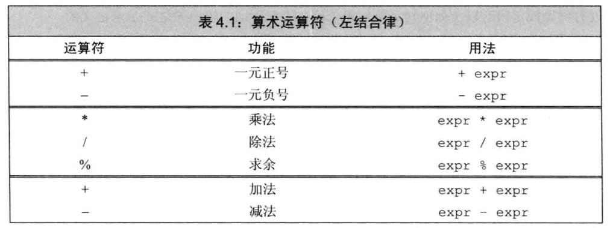
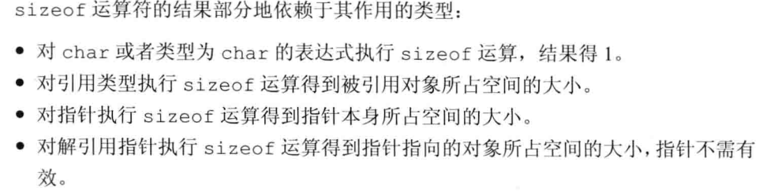
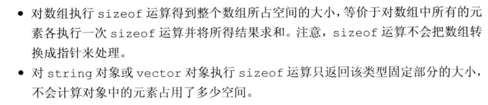

# C++

## HELLO

C++源文件  ==>  编译器  ==>  二进制可执行文件。

```c++
/* 第一个C++程序 */
#include <iostream>   
// main函数，程序的入口，main函数默认返回值是0
int main()
{
	std::cout << "Hello World!" << std::endl;
	std::cin.get();
}
```

#之后的都是预处理语句，编译器优先处理的在实际编译之前就去处理的，include表示需要找到某个文件，此处是找到iostream这个文件然后就拷贝到当前程序源文件中，这些文件也称之为“头文件”。

X86：win32。X64：win64。

```c++
/* Log.cpp */
#include <iostream>
void Log(const char* message)
{
	std::cout << message << std::endl;
}
/* Main.cpp */
#include <iostream>
void Log(const char* message);
int main()
{
	Log("Hello World!");
	std::cin.get();
}
```


预处理器阶段   实际编译阶段  链接阶段  

## 程序执行过程


# C++基础 start

# 变量与数据类型

## 输入输出


```c++
/*  */   多行注释
//       单行注释
```

C++中使用标准库来提供IO机制，比如iostream标准库。

```c++
// #之后的都是预处理语句，编译器优先处理的在实际编译之前就去处理的，include表示需要找到某个文件，
// 此处是找到iostream这个文件然后就拷贝到当前程序源文件中，这些文件也称之为“头文件”。
#include <iostream> 
int main() {
	/* cin：处理输入
	*  cout：处理输出
	*  cerr：输出警告和错误
	*  clog：输出程序运行时一般信息
	*/
	std::cout << "inter" << std::endl;
	int v1 = 0, v2 = 0;
	std::cin >> v1 >> v2;
	std::cout << v1 << "and" << v2 << std::endl;
	std::cerr << "警告~错误" << std::endl;
	std::clog << "日志" << std::endl;
}
```

1. `endl`：结束当前行并将缓冲器内容刷新到设备，保证所有输入输出写入输出流
2. `std`：命名空间，`std`指出cout、endl是定义在名为 std 的命名空间中的、是来自 std 命名空间中的。
3. `::`：作用域运算符，用于指出使用命名空间中的哪个名字，如果作用域操作符左侧为空则默认在全局作用域请求数据。

```c++
while(std::cin >> xxx){   //  退出该循环：回车后按Ctrl + Z 后再按回车
    
}
```


## 内置类型

C++的基本数据类型分为算术数据类型和空类型（void）。

**算术数据类型：字符、整数、浮点数、布尔值。**

| 数据类型    | 含义                  | 最小尺寸     |
| ----------- | --------------------- | ------------ |
| bool        | 布尔类型，true、false | 未定义       |
| char        | 字符型，单个字符      | 8位          |
| wchar_t     | 宽字符                | 16位         |
| char16_t    | Unicode字符           | 16位         |
| char32_t    | Unicode字符           | 32位         |
| short       | 短整型                | 16位         |
| int         | 整形                  | 16位         |
| long        | 长整型                | 32位         |
| long long   | 长整型                | 64位         |
| float       | 单精度浮点型          | 6位有效数字  |
| double      | 双精度浮点型          | 10位有效数字 |
| long double | 拓展精度浮点数        | 10位有效数字 |

无符号整型：unsigned short、unsigned int（简写为unsigned）、unsigned long、unsigned long long。

字符型的无符号类型：字符型分为三种——char、signed char、unsigned char，char的具体表现为带符号还是不带符号由编译器决定。

无符号类型与有符号类型的区别在于：

1. 无符号类型不能表示负数。
2. 无符号类型全部位都表示数值位，而有符号最高位表示符号位。

**关于数据类型的选择：**

1. 整数运算常用int，如果数的长度超过int那么使用long long，不用long是因为long一般和int的尺寸一样。
2. 算术运算中不要涉及char、bool，如果需要用char来定义一个不大的整数那也应该指明是无符号类型还是有符号类型。
3. 浮点运算常用double。
4. 确切知道数值不为负时使用无符号类型。

**数据类型的自动转换机制：**

1. 数值赋给bool，0为false，其他的为true；bool的值赋给非布尔类型，true为1、false为0。
2. 浮点数赋给整数，只保留小数点前的数值；整数赋给浮点数时小数部分记为0，如果该整数超过浮点数的范围那将会导致精度损失。
3. 赋给无符号类型的值超过其范围，结果将是该值对该类型的的最大值取模后的余数。

| 转义字符 | 含义       |
| -------- | ---------- |
| \n       | 换行       |
| \t       | 横向制表符 |
| \v       | 纵向制表符 |
| \ "      | 双引号     |
| \ '      | 单引号     |
| \ \      | 反斜       |
| \r       | 回车       |
| \?       | 问号       |
| \f       | 进纸符     |
| \b       | 退格符     |

**字面值常量类型指定：**通过前后缀，改变整型、浮点型、字符型字面值的默认值。

字符和字符串字面值

| 前缀 | 含义                   | 类型     |
| ---- | ---------------------- | -------- |
| u    | Unicode 16 字符        | char16_t |
| U    | Unicode 32 字符        | char32_t |
| L    | 宽字符                 | wchar_t  |
| u8   | UTF-8 （仅用于字符串） | char     |

整型字面量

| 后缀     | 最小匹配类型 |
| -------- | ------------ |
| u 或 U   | unsigned     |
| l 或 L   | long         |
| ll 或 LL | long long    |

浮点型字面量

| 后缀   | 类型        |
| ------ | ----------- |
| f 或 F | float       |
| l 或 L | long double |

```c++
int v = 12L;
```


## 变量

 C++中，变量和对象一般可以互换使用， C++中变量初始化和变量赋值是两个完全不同的操作。

- 初始化：创建变量时赋予初始值，未初始化的变量不能被使用。
- 赋值：把对象当前值擦除，以一个新值来代替。

**初始化：**

```c++
/* 使用等于号初始化变量 */
int val = 0;
/* 使用花括号初始化变量，也称为列表初始化；花括号还可用于初始化对象、为对象赋新值 */
// 注意：使用列表初始化来初始内置类型的变量时，如果初始值存在丢失风险则编译器会报错
int val = {0};
int val{0};
/* 使用括号初始化变量 */
int val(0);
```

默认初始化：变量定义但没有指定初始值时，变量会被默认初始化。

1. 任何函数体之外定义的内置类型变量：默认初始化为0（无论char、double等都是0）。
2. 函数体内内置类型的变量：没有默认初始化。
3. 类：由自身决定。

**声明和定义：**

c++的分离式编译机制：允许将程序分割为若干个文件，每个文件可被独立编译。而为了支持这种机制，c++语言将声明和定义区分开来。

- 声明：是指出存储类型，并给存储单元指定名称，变量可以被多次声明。
- 定义：创建与名字相关的实体，变量只能被定义一次。（是分配内存空间，还可为变量指定初始值）

```c++
// 声明：使用extern修饰，并且不要初始化
extern int i;
// 定义
int j;     
extern int i = 0;
```

函数体内不能初始化extern关键字标记的变量，否则将引发错误。

**标识符：**

1. 标识符是由字母、数字、下划线组成，且必须以字母或下划线开头。
2. 用户自定义的标识符不能连续出现两个下划线，也不能以下划线紧连大写字母开头。
3. 定义在函数体外的标识符不能以下划线开头。（定义在函数体外的标识符只能以字母开头）

**变量命规范：**

1. 有含义、一般小写。
2. 自定义类名大写字母开头。
3. 多单词变量名以驼峰命名或者用下划线隔开。（例如：aVariable、a_variable）

**作用域：**

1. 全局作用域：函数外定义的。
2. 块作用域：函数内定义的。

没有特别指定时作用域就近原则。如果函数中有可能使用到某全局变量，那么不宜定义同名的局部变量。

## 引用和指针

复合类型：基于其他的数据类型定义的类型，例如引用、指针。

**引用：**

- 引用不是对象，只是为对象起一个别名，可为一个对象定义多个引用但不能直接对字面量定义引用。
- 定义引用时，引用会和初始值对象一直绑定在一起（引用无法被重新绑定到一个新对象，必须被初始化）。

```c++
int val = 12;
int &num = val;
int &refVal; // 错误，引用必须被初始化
int &r = num; // 正确，因为num是引用，这里相当于 int &r = val;
```

c++中不允许定义引用的引用。

```c++
// 摘自[C++ 是否能够定义引用的引用？ (https://www.zhihu.com/question/28023545)
int ival = 1024;
int &refVal = ival;
int &(&refVal2) = refVal; // 错误，无法创建对引用的引用
return 0;
// 注：类型别名和函数模板均会触发引用折叠，可间接定义引用的引用
```

了解一下：但c++中允许间接定义引用的引用（严格意义上不是引用的引用，只是引用折叠，引用折叠是std::move、std::forward等的工作基础。）。

**指针：**

指针是“指向”其他对象的对象，其本身是对象，允许对指针对象进行拷贝和赋值，生命周期内可以先后指向不同的对象，指针不需要在定义时赋予初始值。

```c++
/* 指针定义：使用*来定义指针变量 */
int* d;   // 定义一个int型对象的指针
```

```c++
/* 指针定义 */
int ival = 12;
// d是指向变量ival的指针，存放了ival变量的地址；&是取地址符
// 什么类型的指针存放什么类型的变量的地址，必须严格匹配
int* d = &ival; 
```

指针的值（即地址）应该是这四种状态之一：

1. 指向一个对象。
2. 指向紧邻对象所占空间的下一个位置。
3. 空指针，没有指向如何对象。
4. 无效指针，上述三种外的其他值。

```c++
/* 指针访问对象 */
int ival = 12;
int* d = &ival; // 此时d是一个地址值
std::cout << *d << std::endl; // 使用解引用符 *，获取到的是指针对象内存放的地址所指向的值
```

```c++
/* 空指针 */
int* p1 = nullptr; // 等价于int *p1 = 0； 将指针初始化为0也可以得到空指针
#include <cstdlib> // NULL在头文件cstdlib中定义，值为0
int* p1 = NULL;
```

注意：指针存放的是地址值而不能存放变量本身的值。赋值永远改变的是等号左侧的对象。

指针变量可用于条件表达式：空指针为false，非空指针都为true。==、!=来判断时：都是空指针则相对，指向同一个地址则相等。

字符串字面量可赋值给指针，此时指针指向的是字符串的第一个字符。

**void*指针：**可以存放任何类型变量的地址的指针。

```c++
void* val = &obj;
```

**指针的指针：**

允许将指针的地址放到另一个指针中，以*的个数来区分指针层级。

```c++
1. **：指针的指针。
2. ***：指针的指针的指针。
int i = 12;
int* p1 = &i;
int** p2 = &p1; // p2存放的是另一个指针的地址，所以用**来表示p2是p1指针的指针
int*** p3 = &p2;
```

**指针的引用：**

指针的引用即在引用前加上*表示对指针变量的引用。（`&`——定义普通变量引用、`*&`——定义指针引用）

```c++
int i = 12;
int* p1;
/* 从右往左看，根据ref最靠近的声明符就可以判断其是什么类型，这里最靠近&，因此可看出其是一个引用，其他的确定引用的是什么类型 */

int* &ref = p1; // 定义指针变量的引用，ref这个名字就可以替代p1，将ref看成p1即可
ref = &i;       // 因为是指针的引用，直接对引用赋值相当于对p1赋值
*ref = 0;       // 相当于对*p1赋值
```

## const限定符

### const

const限定的变量的值经初始化后其值不能再改变，const限定的内部对象必须被初始化，可以使用变量来初始化但只是值的拷贝而不是指向关系。

```c++
int num = 12;
const int val = num;
// const 限定的变量的初始值可以是表达式，如果是表达式则会在运行时完成初始化
const int val = get_size();
```

默认状态下，const定义的变量只在文件内有效，如果需要文件间共享，则需要使用extern关键字。示例如下：

```c++
// file_1.cc 初始化，并用extern加以限定使其可以被其他文件使用
extern const int bufSize = fcn();
// file_1.h  在头文件中指明bufSize并非本文件独有，它将在别的地方定义
extern const int bufSize;
```

**const修饰引用：**

引用const对象，即为对常量的引用，对常量的引用不能修改其绑定的对象，即不能对常量引用再赋值。

```c++
// 定义常量
const int val = 12;
// 定义常量引用，相当于对绑定的变量，该引用只读不可写
const int &ref = val;
```

引用的类型必须与其引用的对象的类型一致，但有两个例外：

1. 初始化常量引用允许任意表达式作为初始值，只要表达式结果能转换成引用的类型即可。
2. 允许为常量引用绑定非常量的对象、字面值、甚至是一般表达式。

```c++
int val = 1;
double num = 3.14;
// 定义常量引用，只读不可写
const int &ref1 = val; 
const int &ref2 = val * 2;
const int &ref3 = 12; 
const int &ref4 = num;  // 这里编译器会创建一个临时变量将double的转为int的再赋值给常量引用
```

**const修饰指针：**

普通指针不能指向常量。

指向常量的指针：其不仅仅能指向常量，也能指向非常量。

```c++
/* 指向常量的指针，而不是常量指针，指针的地址初始化后能再被改变 */
int num = 10;
// 限定*cptr为常量，而不是限定cptr为常量，const限定的是 *cptr，此时不能通过对*cptr进行赋值操作，但不影响num变量
const int* cptr;
cptr = &num;
const int v2 = 100;
cptr = &v2;
std::cout << *cptr << std::endl;
```

常量指针：如果需要定义常量指针，即指针的地址初始化后不能再被改变，则这样定义：

```c++
int num = 12;
// 定义常量指针，可以这样理解：从右往左看，const仅限定指针变量cptr为常量，而不是限定*cptr为常量
int* const cptr = &num;
std::cout << *cptr << std::endl;
int val = 33;
cptr = &val;  // 错误，常量指针不能再被赋值
```

综上，指向常量的常量指针：

```c++
const int num = 12;
const int* const cptr = &num;  // 指向常量的常量指针
```

**顶层const：**

- 用顶层const表示指针本身是一个常量（变量本身是常量也是顶层const）。
- 用底层const表示指针所指向的对象是一个常量（const修饰的引用都是底层const）。

**拷入和拷出的对象：必须有相同的底层const或者两个对象的数据类型必须能够转换。（重要）**

一般而言，非常量可以转换为常量，反之不行。

```c++
const int *p2 = 0;
const int *const p1 = p2;   // 正确，有相同的底层const
int *p = p1;   // 错误，没有相同的底层const，而且无法从const int *const转为int
int *p3 =0
p2 = p3;       // 正确int* 可以转为 const int*
			  // 对常量对象取地址也是底层const
```

### constexpr和常量表达式

1. 常量表达式：**指值不会改变，且在编译过程中就能得到计算结果的表达式**。（比如字面值、常量值运算）
2. `C++11`新标准规定，允许将变量声明为`constexpr`类型以便由编译器来验证变量的值是否是一个常量的表达式。声明为constexpr的变量一定是常量并且必须使用常量表达式来初始化。

```c++
constexpr int num = 12;
constexpr int val = num + 1;
constexpr int v = size();   //  当 size()是一个constexpr函数时才正确

// 初始值是字面值常量，但是数据类型不是const int，还是可以被重新赋值，所以不是常量表达式
int val = 12;   
//  具体值在编译过程中不知道，运行后才知道，但如果get_size()是一个constexpr函数，那么才会是常量表达式
const int sz = get_size();   
```

字面值类型可以使用constexpr，比如算术类型、指针、引用。

constexpr指针的初始值必须是nullptr、0或者存储于固定地址的对象。

## 对类型处理

### 类型别名

类型别名：为类型起一些好听的名字

```c++
/* typedef */
typedef double wages;
typedef wages base, *p;   // 相当于typedef double base，*p：为double、double*再起名字
```

类型别名指代复合类型或常量时，把它用于声明语句会出现意料之外的效果。（先跳过）

```c++
typedef char* pstring;

const pstring cstr = 0;   // const (char*) cstr = 0;
const pstring* ps;        // const (char*) *cstr;    
const char* cstr = 0;     // (const char*) cstr;     指向常量的指针
```


**别名声明：**c++11新标准中出现的

```c++
/* using */
using wages = double;
using p = wages*;
```

### auto

**auto——类型说明符：**让编译器分析表达式所属的类型，通过初始值来推断变量的类型，使用auto必须要有初始值。

```c++
auto item = v1 + v2;  //   item的类型由表达式决定，对象或者某种基本数据类型、复合数据类型
auto i = 1, *p = &i;  //  整形和整形指针
auto data = 1, num = 2.0;   // 错误，int、double，类型不一致
```

auto使用注意事项：

1. 编译器推断处理的auto类型有时候可能会和初始值的类型不一致。
2. 如果使用引用初始化变量，那么auto类型是引用所绑定的对象的类型。
3. auto会忽略顶层const。

### decltype

**decltype类型指示符：**选择并返回操作数据的类型

`decltype()`，括号内的仅用来确定最终数据类型，并不会执行。

```c++
decltype(fun()) sum1 = xxx;   //  以函数fun的返回值类型作为sum的类型，实际并没有调用该函数
decltype(i) sum2 = xxx;       //  decltype(i)的i是什么类型sum就是什么类型，（decltype(i)可以是引用）
```

decltype和引用：

```c++
int i = 12, &ref = i, *p = &i;
decltype(ref + 0) sum3 = xxx;   // 表达式结果是int
decltype(*p) sum4 = xxx;        // 表达式的内容是解引用操作，因此sum是引用

decltype((i)) sum5 = xxx;       // 变量加了括号，得到的都将是引用
```

`decltype(variable)`和`decltype((variable))`：

1. `decltype(variable)`：由variable本身决定。
2. `decltype((variable))`：永远是引用。

引用产生的两种情况：

1. 变量可以作为赋值语句左值的特殊表达式，会产生引用。
2. 赋值操作也是一种会产生引用的表达式，引用类型以左值类型为准。

## 自定义数据结构

### struct

定义类：类可以定义在全局作用域或者函数块作用域中，或者头文件中。

```c++
struct 类名 {
    类体
}; // 分号必须
/* 示例 */
struct Sales_data {
	std::string bookNo;       // 没有指定初始值将会默认初始化
	unsigned units_sold = 0;  // 不能使用圆括号进行初始化
	double revenue = 0;
};
```

```c++
int main() {
    // 声明结构体并创建对象
	struct Sales_data {
		std::string bookNo;
		unsigned units_sold = 0;
		double revenue = 0;
	} accum, trans, *salesptr;
	std::cout << trans.revenue << std::endl; // 使用点操作符访问内部成员数据
	return 0;
}
// 上面相当于：
int main() {
    // 声明结构体
	struct Sales_data {
		std::string bookNo;
		unsigned units_sold = 0;
		double revenue = 0;
	};
    // 创建对象
    Sales_data accum, trans, *salesptr;
	std::cout << trans.revenue << std::endl; 
	return 0;
}
```

### 头文件

头文件：

- 类通常定义在头文件中而不是函数体内。
- 头文件通常包含的是只能被定义一次的实体。（例如：类、`const`和`constexpr`变量。）
- 修改头文件后需要对修改过的文件重新编译。

预处理器：编译前执行的一段程序，确保头文件多次包含仍能正常工作。

头文件保护符（2.3.2节，第四十八页）依赖于预处理变量，预处理变量即检查操作命令如下：

1. `#define`：用于定义预处理变量。
2. `#ifdef`：仅当变量已定义时为真。
3. `#ifndef`：仅当变量未定义时为真。
4. `#endif`：执行停止。\

示例——创建sales_data.h头文件：

```c++
#ifndef SALES_DATA_H     // 预处理变量如果没有定义则执行后面操作
#define SALES_DATA_H     // 定义预处理变量，等再一次包含sales_data.h时#ifndef为false，这样就能防止重复包含发生
#includ <string>
struct Sales_data {
	std::string bookNo;
	unsigned units_sold = 0;
	double revenue = 0;
};
#endif
```

注意事项：

1. 预处理变量无视c++中关于作用域的规则。
2. 预处理变量、头文件保护符必须保持唯一，通常做法是以头文件中类名字为保护符名称并且预处理变量名称是类名的全大写形式。
3. 示例如上。

# 字符串、向量、数组

## 命名空间的using声明

> `using namespace::name;`   using声明，当使用name时将从命名空间namespace中获取它

```c++
using std::cout;
using std::cin;
using std::endl;
int main() {
	cout << "hello world" << endl;
	return 0;
}
```

注意：为避免始料未及的名字冲突，头文件中不应该使用using 声明。

## string

标准库类型string：可变字符。

```c++
#include <string>
using std::string;
```

| string对象初始化       | 说明                                          |
| ---------------------- | --------------------------------------------- |
| `string s1;`           | 默认初始化，一个空字符串                      |
| `string s2(s1);`       | s2是s1的副本                                  |
| `string s2 = s1;`      | 等价于s2(s1)，s2是s1的副本                    |
| `string s3("value");`  | s3是字面值value的副本，字面值最后的空字符除外 |
| `string s3 = "value";` | 等价于s3("value")，s3是字面值value的副本      |
| `string s4(n, 'c');`   | 把s4初始化为连续n个字符c组成的串              |

使用=号来初始化的方式成为拷贝初始化，其他的称为直接初始化。

字符串操作说明：（os——输出流、is——输入流、string s）

| string操作     | 说明                                                         |
| -------------- | ------------------------------------------------------------ |
| os << s        | s写到输出流os中并返回os                                      |
| is >> s        | 从输入流is读取字符串赋给s，字符串以空白分隔（只读取到第一个空白前的字符串，开头有空白不算），返回is |
| getline(is, s) | 从输入流is中读取一行赋给s，返回is，遇到换行符就结束并返回结果 |
| s.empty()      | s为空就返回true，否则返回false                               |
| s.size()       | 返回字符串s中字符的个数                                      |
| s[n]           | 返回s中第n个字符，位置n从0开始                               |
| s1 + s2        | 返回连接后的结果                                             |
| s1 = s2        | s2的副本代替s1中原来的字符                                   |
| s1 == s2       | 判断所含字符是否完全一样，字符完全一样则相等；对字母大小写敏感 |
| s1 != s2       |                                                              |
| <、<=、>、>=   | 利用字符在字典中的顺序进行比较，且对字母大小写敏感           |

<、<=、>、>=的比较方式：

1. 如果两个string对象的长度不同，那么并且较小长度的都和较长的对象在对应的位置上相等，那么此时就是较短的小于较长的。
2. 如果两个对象某些位置的字符不一致，那么就以第一对相异字符的比较为结果。

注意：`size()`函数返回的是`string::size_type`类型的值，它是一个无符号整数值，**无符号类型的值与有符号的一个负值进行比较，这个负值会自动转换为一个比较大的无符号值。**

```c++
using std::string;
using std::cout;
using std::cin;
using std::endl;

int main() {
	string str = "hello world";
	string s = "坚持和持之以恒";
	str = s;
	cout << str << endl;

	string line;
	while (getline(cin, line)) {
		if (!line.empty()) {
			if (line.size() >= 9) {
				cout << line << endl;
			}
		}
	}
    
    // 比较：s3>s2>s1
    string s1 = "hello";
    string s2 = "hello world";
    string s3 = "hi";
	return 0;
}
```

字符串相加：每个+号两侧至少有一个是string对象，不能把字面量直接相加。（字符串字面值与string是不同的类型）

```c++
string s4 = "123456", s5 = "7890";
string s6 = s4 + "," + s5;
string s6 = "s4" + "," + s5;   // 报错 ：+不能添加两个指针
string s6 = "s4" + ("," + s5); // 相当于string temp= "," + s5;  s6 =  "s4" + temp;
```

string对象字符处理，字符判断与字符转换：（cctype头文件）

| 处理函数      | 解释                                                         |
| ------------- | ------------------------------------------------------------ |
| `isalnum(c)`  | 当`c`是字母或数字时为真                                      |
| `isalpha(c)`  | 当`c`是字母时为真                                            |
| `iscntrl(c)`  | 当`c`是控制字符时为真                                        |
| `isdigit(c)`  | 当`c`是数字时为真                                            |
| `isgraph(c)`  | 当`c`不是空格但可以打印时为真                                |
| `islower(c)`  | 当`c`是小写字母时为真                                        |
| `isprint(c)`  | 当`c`是可打印字符时为真                                      |
| `ispunct(c)`  | 当`c`是标点符号时为真                                        |
| `isspace(c)`  | 当`c`是空白时为真（空格、横向制表符、纵向制表符、回车符、换行符、进纸符） |
| `isupper(c)`  | 当`c`是大写字母时为真                                        |
| `isxdigit(c)` | 当`c`是十六进制数字时为真                                    |
| `tolower(c)`  | 当`c`是大写字母，输出对应的小写字母；否则原样输出`c`         |
| `toupper(c)`  | 当`c`是小写字母，输出对应的大写字母；否则原样输出`c`         |

关于C++版本的C标准库头文件：C语言中的头文件形如name.h，在C++中则命名为cname并去掉.h后缀。（方便区分从C中继承过来的头文件）

```c++
#include <iostream>
#include <cstdlib>
#include <string>
#include <cctype>
using std::string;
using std::cout;
using std::cin;
using std::endl;

int main() {
	string s = "123 a";
	for (auto c : s) {
		if (isalnum(c)) {
			cout << c << endl;	
		}
	}
    // 改变字母大小写
    for (auto &c : s) {
		if (isalpha(c)) {
			c = toupper(c);
		}
	}
	cout << s << endl;
	return 0;
}
```

十进制转十六进制数：

```c++
#include <iostream>
#include <cstdlib>
#include <string>
#include <cctype>
using std::string;
using std::cout;
using std::cin;
using std::endl;

int main() {
	const string hexdigits = "123456789ABCDEF";
	cout << "enter a series of numbers between 0 and 15 " << "separated by spaces. Hit '\\n' amd Enter when Finished: " << endl;

	string result = "";
	string::size_type n;
	while (cin >> n) {
		if (n < hexdigits.size()) {
			result += hexdigits[n - 1];
		}
	}
	cout << result << endl;	
	return 0;
}
```

小技巧，声明为引用类型可以避免对元素的拷贝，如下，如string特别大时可以节省大量时间。

```c++
vector<string> text;
for(const auto &s: text){
  cout<<s;
}
```


## vector

标准类型库vector：表示对象的集合，vector是一个类模板，编译器可以根据类模板实例化类。（vector也为称为容器）

```c++
#include <string>
#include <cctype>
#include <vector>
using std::vector;
using std::string;

int main() {
	vector<int> ivec;
	//vector<Sales_item> Sales_vec;
	vector<vector<string>> file;
	vector<vector<string> > files;   //  老式编译器中的定义形式，定义vector类型元素需要加上一个空格
	return 0;
}
```

vector对象的定义和初始化：

| 定义和初始化                     | 说明                                                         |
| -------------------------------- | ------------------------------------------------------------ |
| **`vector<T> v1;`**              | `v1`是一个空`vector`，它潜在的元素是`T`类型的，执行默认初始化不包含任何元素 |
| `vector<T> v2(v1);`              | `v2`中包含有`v1`所有元素的副本                               |
| **`vector<T> v2 = v1;`**         | 等价于`v2(v1)`，`v2`中包含`v1`所有元素的副本                 |
| `vector<T> v3(n, val);`          | `v3`包含了n个重复的元素，每个元素的值都是`val`               |
| `vector<T> v4(n);`               | `v4`包含了n个重复地执行了值初始化的对象                      |
| `vector<T> v5{a, b, c...};`      | `v5`包含了初始值个数的元素，每个元素被赋予相应的初始值       |
| **`vector<T> v5={a, b, c...};`** | 等价于`v5{a, b, c...}`                                       |

```c++
vector<int> ivec;          // 空
vector<int> ivec2(ivec);   //  拷贝赋值
vector<int> ivec3 = ivec;  //  拷贝赋值
/* 列表初始化 */
vector<string> articles = {"a", "an", "the"};
vector<string> articles{"a", "an", "the"};
/* 创建指定数量元素 */
vector<int> ivec(10,-1);      
vector<string> svec(10,"hi");
vector<int> ivec(10);      // 10个元素，都为0
vector<string> svec(10);   // 10个元素，都为空字符串

vector<string> articles{10, "hi"};   //  特殊情况：10不能用来列表初始化，此时表示有10个hi
vector<string> articles{10};         //  特殊情况：10不能用来列表初始化，此时表示有10个默认初始化的元素
```

元素的添加：

```c++
vector<int> v2;
v2.push_back(xxx);   //  将值插入到集合末尾
```

限制一：不能在范围for循环中向vector对象添加元素。（如何理解）

限制二：任何能改变vector对象容量的操作都会使该vector对象的迭代器失效。（因为可能会导致已分配给vector对象的内存不足，那就会触发内存重新分配，那样就必定导致迭代器失效，因此会有此限制避免程序出现问题）

vector集合的其他操作：

| 操作                  | 说明                                                         |
| --------------------- | ------------------------------------------------------------ |
| `v.emtpy()`           | 如果`v`不含有任何元素，返回真；否则返回假                    |
| `v.size()`            | 返回`v`中元素的个数，类型为`vector<T>::size_type`            |
| `v.push_back(t)`      | 向`v`的尾端添加一个值为`t`的元素                             |
| `v[n]`                | 返回`v`中第`n`个位置上元素的**引用**                         |
| `v1 = v2`             | 用`v2`中的元素拷贝替换`v1`中的元素（擦除原来的再赋值）       |
| `v1 = {a,b,c...}`     | 用列表中元素的拷贝替换`v1`中的元素（擦除原来的再赋值）       |
| `v1 == v2`            | `v1`和`v2`相等当且仅当它们的元素数量相同且对应位置的元素值都相同 |
| `v1 != v2`            | 同上                                                         |
| `<`、`<=`、`>`、 `>=` | 以字典顺序进行比较                                           |

示例：

```c++
#include <string>
#include <cctype>
#include <vector>
using std::vector;
using std::string;
using std::cout;
using std::cin;
using std::endl;

int main() {
	vector<unsigned> scores(11,0);
	unsigned grade;
	while (cin >> grade) {    //   12 13 14 15 15，循环读取到每一个空格前的数据，遇到\n结束循环
		if (grade <= 100) {
			++scores[grade / 10];
		}
	}
	for (int i = 0; i < scores.size();i++) {
		cout << scores[i] << " " << endl;
	}
	return 0;
}
```


## 迭代器

标准库容器都可以使用迭代器，string对象不属于容器类型但也可以使用迭代器。类似于指针类型，迭代器也提供了对对象的间接访问。

获取迭代器：

1. `对象.begin()`：返回指向第一个元素（或字符）的迭代器。
2. `对象.end()`：返回指向最后一个元素的下一个位置的迭代器（也称为尾后迭代器）。当容器为空则begin()和end()返回的迭代器是同一个迭代器。

迭代器运算符：

| 运算符                             | 解释                                                 |
| ---------------------------------- | ---------------------------------------------------- |
| `*iter`                            | 返回迭代器`iter`所指向的**元素的引用**               |
| `iter->mem`                        | 解引用并获取该元素名为mem的成员，等价于`(*iter).mem` |
| `++iter`                           | 令`iter`指向下一个元素                               |
| `--iter`                           | 令`iter`指向上一个元素                               |
| `iter1 == iter2`、`iter1 != iter2` | 判断两个迭代器是否相等                               |

迭代器使用示例：

```c++
#include <iostream>
#include <string>
using std::string;
int main() {
    /* 使用迭代器将字符串的首字母转为大写 */
	string s = "hello world";
	if (s.begin() != s.end()) {
		auto iterator = s.begin();
		*iterator = toupper(*iterator);   // 使用*解引用，获取值
	}
	std::cout << s << std::endl;
    /* 将字符串的首个单词转为大写形式 */
	for (auto iter = s.begin(); s.begin() != s.end() && !isspace(*iter); ++iter) {
		*iter = toupper(*iter);
	}
	std::cout << s << std::endl;
}
```

关于迭代器的类型：可使用迭代器的标准库中，迭代器的类型一般使用iterator和const_iterator来表示。示例：

```c++
#include <iostream>
#include <string>
#include <vector>
using std::vector;
using std::string;

int main() {
	
	string s = "hello world";
	vector<int> ivec{6,3,4,5,7,8,9};
    // iterator型
	string::iterator iter1 = s.begin();
	vector<int>::iterator iter2 = ivec.begin();
    // const_iterator型
	string::const_iterator iter3 = s.begin();
	vector<int>::const_iterator iter4 = ivec.begin();

	std::cout << *iter1 << *iter2 << std::endl;
	std::cout << *iter3 << *iter4 << std::endl;
	return 0;
}
```

1. 如果string、vector的对象是const常量，那只能使用const_iterator来对对象进行操作。
2. 如果string、vector的对象不是const常量，那么iterator、const_iterator这两种类型的迭代器都可以使用。
3. 对象是const常量，那么begin()返回的就是带const的那个迭代器，否则就是返回iterator迭代器；end()同理。

**C++11：cbegin()、cend()函数——无论对象是否是常量，都返回const_iterator类型的迭代器。**

**注意：凡是使用迭代器的循环体，都不要向迭代器所属容器中添加元素。**

vector和string的迭代器支持的运算：

1. 和整数的运算：iter+ n或iter - n、iter += n、iter -= n，表示向前或向后移动多少个位置。
2. 迭代器之间的运算：iter1 - iter2，表示它们之间的距离，整数。
3. 迭代器大小比较：>、<、>=、<=。


## 数组

### 定义

数组大小固定，数组元素不能随意增加。

数组的定义：

1. 定义数组时，维度必须为常量表达式 。
2. 必须指定数组类型，不能使用auto等定义数组。
3. 数组元素为对象，因此不存在引用的数组（引用不是对象）。

```c++
int arr[10];   // 定义并初始化了一个容量为10的数组，默认初始化

unsigned cnt = 12;
int arr[cnt];  //  错误，数组的维度必须是一个常量表达式

constexpr unsigned ct = 12;   //  常量表达式
intarr[ct];    // 正确
string[get_size()]; //  get_size()为constexpr才正确
```

数组的初始化：

```c++
/* 定义并初始化，如果不初始化则是默认初始化 */
int arr1[3] = {1,2,3};
int arr2[] = {1,2,3};
int arr3[5] = {1,2,3};   // 相当于{1,2,3,0,0}
int arr4[3] = {};   // 全部初始化为0
```

字符数组注意事项：当使用字符串字面值初始化char数组时，要保证数组中有位置放置字符串末尾的一个空字符。

```c++
char a[6] = "TeShuX";   // 报错：数组界限溢出；没有位置放置字符串末尾的一个空字符
```

复杂数组声明：

```c++
/* 定义存放指针的数组 */ 
int* pstr[10];  // 存放十个整型指针的数组
```

```c++
/* 定义数组的指针 */
int arr[3] = {3,6,9};
int (*Parry)[3] = &arr;   // Parry为数组arr的指针
std::cout << *Parry[0] << std::endl;   // 输出3
```

```c++
/* 定义数组的引用 */
int arr[3] = {3,6,9};
int (&arrRef)[3] = arr;   // arrRef为数组arr的引用
std::cout << arrRef[0] << std::endl;   // 输出3
```

理解复杂数组声明的含义的技巧——从数组的名字开始由内向外解读。例子：

```c++
int* ptrs[10];
int *(&array)[10] = ptrs;
/* 一：array是引用 
   二：array引用的对象是大小为10的数组
   三：引用的数组的类型是 int*——整形指针
   四：引用的对象是——ptrs
*/
/* 示例： */
int a = 3;
int* ptrs[1]{&a};
int* (&array)[1] = ptrs;
std::cout << *array[0] << std::endl;   
```

### 访问

1. 数组下标的类型：通常将数组下标定义为`size_t`类型，该类型在cstddef头文件中被定义（c标准库的c++版本） 。
2. 字符数组的特殊性：结尾处有一个空字符，如 `char a[] = "hello";`，这个数组长度为6 。
3. 用数组初始化 `vector`： `int a[] = {1,2,3,4,5}; vector<int> v(begin(a), end(a));` 。

```c++
#include <cstddef>

constexpr size_t array_size = 10;
int arr[array_size];
```

范围for循环：

```c++
for(xxx xx : xx){
    
}
```

### 指针和数组

```c++
int arr[3] = {3,6,9};
int* p = &arr[0];  // 指向数组的第一个元素
int* p = arr;      // 也是指向数组的第一个元素，和上面等价
auto arr2(arr);    // auto arr2(&arr[0])，推断arr2为int*
decltype(arr) arr2; // 根据arr推断arr2为int [3]
```

string和vector的迭代器支持的运算，数组的指针都支持，能像使用迭代器遍历vector一样，使用指针也可以遍历数组。

```c++
int arr[3] = { 3,6,9 };
int* p = &arr[0];  
++p;   // 指向arr[1]
std::cout << *p; 
int* p2 = &arr[10];  // 获得尾元素下一位置的指针，不能解引用和递增
```

```c++
/* C++11：可通过begin(数组)、end(数组)获取数组的首元素指针、尾元素下一位置的指针 */
/* begin()和end()函数定义在iterator头文件 */
int arr[3]{3,6,9};
int* beg = std::begin(arr);
int* last = std::end(arr);
```

指针的解引用、递增、比较、与整数相加、两个指针相减等，和迭代器的效果差不多。

```c++
int arr[3]{3,6,9};
int* beg = std::begin(arr);
int* last = std::end(arr);

constexpr size_t sz = 5;
int* p = arr + sz;  // 错误，arr[0]的指针加上sz，指针超出范围将会出错
```

- 两指针相减的结果为 ptrdiff_t 的标准库类型，在cstddef 头文件中定义，是一种带符号的类型。
- 指针指向不同的对象，比较则无意义。
- 空指针可以加上或减去值为0的常量表达式，两个空指针相减结果也为0。

解引用和指针运算的交互：

```c++
int ia[]{3,6,9};
int last = *(ia + 2); // 结果为last=9；ia相当于&ia[0]，加上2就是&ia[2]，再解引用就是ia[2]的值
int last2 = *ia + 2;  // 结果为last2=5；此时等价于 ia[0] + 2
```

数组下标和指针：数组的下标是有符号的，可以处理负值（内置的下标运算符所用索引值不是无符号的）

```c++
int ia[]{3,6,9};
int i = ia[1];    // 相当于*(ia+1)
int* p = &ia[2];
int k = p[-2];    // 相当于 k=*(p-2)，k=ia[0]
```

 **尽量使用vector和迭代器，少用内置数组、指针。**


## 多维数组

实际是数组的数组。

```c++
int arr[3][3]= {{1,2,3},{1,2,3},{1,2,3}};
int arr[3][3]= {1,2,3,1,2,3,1,2,3};  // 与上面等价

int arr[3][3]= {{0},{1},{2}};   // 初始化每一行的首元素 
int arr[3][3]= {0,1,2};       // 初始化第一行的全部元素，其他的默认初始化
```

多维数组的处理：

```c++
constexpr size_t rowCnt = 3, colCnt = 3;
int arr[rowCnt][colCnt];
for(size_t i = 0; i != rowCnt; ++i){
    for(size_t j = 0; j != colCnt; ++j){
        // 初始化二维数组
		arr[i][j] = i * colCnt + j;
    }
}
// 最终结果：
0 1 2

3 4 5

6 7 8
```

```c++
/* 使用范围for循环，最终结果和上面一样 */
size_t cnt = 0;
int arr[3][3];
for(auto &row : arr){
    for(auto &col : row){
        col = cnt;
        ++cnt;
    }
}
// 上面使用引用是为了避免数组形式的元素转为指针
for(auto row : arr)  // 不使用引用，则row会自动编译为指向其数组的首元素的指针
    for(auto col : row) // 这里可不使用引用
```

指针和多维数组：

当使用多维数组名字是，会自动转换为指向数组首元素的指针。

```c++
int arr[3][3];
int (*p)[3] = arr;  // 数组的指针，p指向含有三个元素的数组
p = &arr[2];   // p指向二维数组的最后一个数组
```

多维数组是数组中存储数组，指针和数组的内容和一维数组差不多。

# 表达式

## 基本概念

表达式：表达式由一个或多个运算对象组成，对表达式求值将得到一个结果，比如：字面值和变量。

一元运算符：作用于一个运算对象，比如取地址符&和解引用符。

二元运算符：作用于两个运算对象，比如==、*。

三元运算符：作用于三个运算对象。

函数调用也是特殊的运算符，对对象数量没有限制。

左值和右值：当一个对象被用作右值的时候，用的是对象的值（内容）；当一个对象被用作左值的时候，用的是对象的身份（在内存中的位置）。

（左值取址(地址)，右值取值(数值)。简单深刻又容易记忆。只要能取得地址的东西，就可以做为左值被赋值。如果编译器报左值错误之类的，先查看它是不是能取地址，问题就差不多能找出来了。）

优先级：使用括号将无视优先级和结合律。

求值顺序：有些表达式行为不可预知，有四种运算符明确规定了求值顺序，那就是&&、||、三元运算符、以及逗号运算符。求值顺序和优先级、结合律无关。


## 运算符

**算术运算符：**



表达式求值前，小整型的会被提升为较大的整数类型，所有运算对象最终会转换成统一类型。

溢出：内置基本数据类型都有其一定的内存空间，当存储的值超过空间范围就会导致溢出。

`/`：都是整型时是整除（会忽略小数部分），当有浮点型参与时是浮点除法。

`%`：取余，`m % n`，余数的正负由m的正负决定。

**逻辑操作符：**!、<、>、>=、<=、==、!=、&&、||。

```c++
//   首先判断`cp`，`cp` 不是一个空指针，因此`cp`为真。然后判断`*cp`，`*cp` 的值是字符`'H'`，非0。因此最后的结果为真。
const char *cp = "Hello World"; 
if (cp && *cp)       
```

**赋值运算符：**

1. 赋值运算的**返回结果时它的左侧运算对象**，且是一个左值。类型也就是左侧对象的类型。
2. 如果赋值运算的左右侧运算对象类型不同，则右侧运算对象将转换成左侧运算对象的类型。
3. 赋值运算符满足**右结合律**，这点和其他二元运算符不一样。 `ival = jval = 0;`等价于`ival = (jval = 0);`
4. 赋值运算优先级比较低，使用其当条件时应该加括号。
5. 复合赋值运算符，**复合运算符只求值一次**，普通运算符求值两次。（对性能有一点点点点影响）
   任意复合运算符op等价于`a = a op b;、`  `a += b;  a=a+b`

**递增递减运算符：**

- 前置版本`j = ++i`，先加一后赋值。
- 后置版本`j = i++`，先赋值后加一。

优先使用前置版本，后置多一步储存原始值。（除非需要变化前的值）

```c++
vector<int> v = {3,4,5};
auto pbeg = v.begin();
while(pbeg != v.end() && *pbeg >= 0){
    cout << *pbeg++ << endl;   //  ++优先级高于解引用符*
}
```

```c++
*(pbeg + 1) = toupper(*pbeg++);   // 错误，将产生未定义的行为，编译器不知道先求左边的还是先求右边的
```

**成员访问运算符：**

成员访问运算符有两种：点运算符`.`和箭头运算符`->`。（注意点运算符优先解引用符）

```c++
string s = "keep", *p = &s;
s.size();
(*p)->size();  // 相当于(*p).size()
```

**条件运算符：**`xxx ? xx : xx`

可以嵌套使用，**右结合律**，从右向左顺序组合：

```c++
finalgrade = (grade > 90) ? "high pass"
    : (grade < 60) ? "fail" : "pass";
//等价于
finalgrade = (grade > 90) ? "high pass"
    : （(grade < 60) ? "fail" : "pass"）;
```

输出表达式使用条件运算符记得加括号，条件运算符优先级太低。

**位运算符：**位运算符是作用于**整数类型**的运算对象。

- 左移（`<<`）：移出边界外的位就被舍弃掉了，右侧插入的值用0。
- 向右移（`>>`）：移出边界外的位就被舍弃掉了，左侧插入的值：无符号===> 0；有符号 ===> 符号位值(0或1)。
- 位取反（`~`，一元运算符，逐位求反）、与（`&`）、或（`|`）、异或（`^`）。（与或非是二元运算符）

有符号数负值可能移位后变号，所以强烈建议**位运算符仅用于无符号数**。

char类型在运算中会转为int。

例子：

```c++
unsigned long quiz1 = 0;    // 每一位代表一个学生是否通过考试
1UL << 12;  // 代表第12个学生通过
quiz1 |= (1UL << 12);   // 将第12个学生置为已通过
quiz1 &= ~(1UL << 12);  // 将第12个学生修改为未通过
bool stu12 = quiz1 & (1UL << 12);   // 判断第12个学生是否通过
```

移位运算符（又称IO运算符）满足左结合律，优先级介于中间，使用时尽量加括号。

```c++
cout << "i am" << "here" << endl;
// 相当于
((cout << "i am") << "here") << endl;
```

**sizeof()运算符：**返回表达式或一个类型名字所占的字节数（也就是说返回的是类型所占内存），并不实际计算其运算对象的值；返回类型是 size_t，是常量表达式。

1. `sizeof(类型)`：返回该类型所占字节数。
2. `sizeof 表达式`：返回表达式结果类型的大小。

```c++
int a;
int* p;
size_t n1 = sizeof(int);
size_t n2 = sizeof a;
size_t n3 = sizeof *p; //sizeof(*p)
cout << n1 << endl;
```





```c++
int ia[10];
// sizeof(ia)返回整个数组所占空间的大小
// sizeof(ia)/sizeof(*ia)返回数组的大小
constexpr size_t sz = sizeof(ia)/sizeof(*ia);
int arr[sz];
```

**逗号运算符：**

从左向右依次求值。

优先级较低。

## 类型转换

隐式转换：（设计为尽可能避免损失精度，即隐式转换为更精细类型。）隐式转换触发的情况：

1. 大多数表达式中，比 `int`类型小的整数值先提升为较大的整数类型。
2. 条件表达式中，非布尔转换成布尔。
3. 初始化中，初始值转换成变量的类型。
4. 算术运算或者关系运算的运算对象有多种类型，要转换成同一种类型。（优先转换为尽量避免精度损失的类型）
5. 函数调用时也会有转换。

```c++
int sum = 3 + 3.3;  // 3转为double后相加，初始化再转为int
```

算术转换之整型提升：

* 常见的char、bool、short能存在int就会转换成int，否则提升为`unsigned int`。
* `wchar_t,char16_t,char32_t`提升为整型中`int,long,long long ……`中最小的，且能容纳原类型所有可能值的类型。

其他隐式转换：

1. 数组能自动转换成指向数组首元素的指针。
2. 指针的转换：0、nullptr能转换成任意指针类型；指向非常量的都能转为`void*`，指向任意对象的指针都能转为`const void*`。
3. 继承关系的类之间的指针转换。
4. 转为bool：指针或算术类型的值为0，转换为false；否则转换为true。
5. 转为常量：非常量指针可转为常量指针，非常量引用可转为常量引用。

显式类型转换（尽量避免）：（`cast-name<type>(expression);`：type为强制要转换成的类型，expression为要转换的值。）

- **static_cast**：任何明确定义的类型转换，只要不包含底层const，都可以使用。 

- **dynamic_cast**：支持运行时类型识别。

- **const_cast**：只能改变运算对象的底层const，一般可用于去除const性质。 

  > 只有其可以改变常量属性

- **reinterpret_cast**：通常为运算对象的位模式提供低层次上的重新解释。

```c++
int i = 1, j = 4;
void* p = &i;
// 为使用浮点除法，将i强制转换为double类型
double slope = static_cast<double>(i) / j; 
int* dp = static_cast<int*>(i);   // 将void*转换回初始的

const char* pc; 
char* p = const_cast<char*>(pc);
```

旧式强制类型转换：`type expr`。

```c++
int a = 13;
int b = 4.0;
double result = a / (double)b;
cout << result << endl;   // 3.25
result = a / b;
cout << result << endl;   // 3
```


# 标准库 start


  


# 类


# 工具与技术


