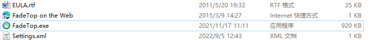
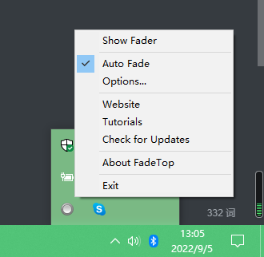
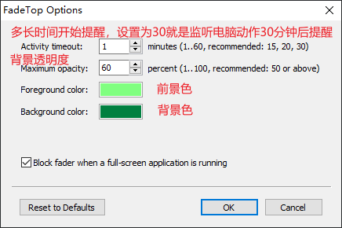
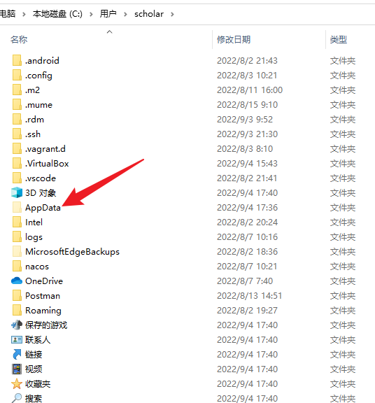
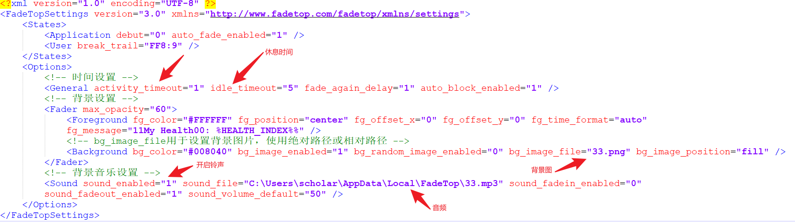
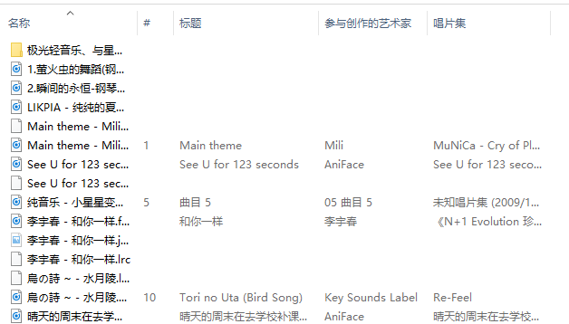

# FadeTop

每天长时间操作电脑，总是不知不觉中忘记休息，真的有点替眼睛觉得辛苦呢，好希望有办法时不时提醒自己休息一下噢。所以，一直希望寻找一个能既不打扰工作，又满足提醒需求的软件。然后最近试了下FadeTop，觉得还挺不错的。提醒方式温和、自然，不会太突兀。上手也挺简单，然后软件比较小也不太占地方。

（长时间操作电脑、休息提醒软件、占用小）

原文见：[保护眼睛之FadeTop篇 - 知乎 (zhihu.com)](https://zhuanlan.zhihu.com/p/23327525)，本篇在该文基础上完善操作细节。

官方网站：[FadeTop - Official Website](http://www.fadetop.com/)

官方使用说明：[FadeTop Tutorials](http://www.fadetop.com/tutorials.html)

## 安装

官方网站提供两个版本：

安装版直接安装就好，绿色版就解压后运行exe文件就好。绿色版解压后文件：

为了使电脑开机便自启动FadeTop，建议使用安装版，安装完成就默认开机自启动了。

## 设置

设置分为三部分：时间设置、背景设置、铃声设置。都可以在设置文件Settings.xml里设置。

如果不想折腾，会设置时间即可。

1、时间设置，建议安装完成后再进行设置：

找到那个⚪圆圈，鼠标移动到圆圈上点击右键（点击最下面的exit就是退出软件）：

然后点击Options...，出现如下图的窗口：

时间设置完成。

2、背景设置，铃声设置：

①需要打开Settings.xml配置文件，（绿色版一解压就可以看到了）安装版中该文件在C:\Users\username\AppData\Local\FadeTop路径下：

如果你不会显示隐藏目录，看这：

②到这里，你已经找到了Settings.xml，接下来就用支持UTF-8编码的文本编辑器（比如记事本、Notepad++、Sublime等等）打开并设置它，注意先退出FadeTop后再编辑该文件。

添加背景图操作：

1. 将背景图放到Settings.xml所在目录下。
2. 然后在Settings.xml里找到`bg_image_file=""`，添加图片路径就好。（例如：`bg_image_file="33.png"`）

添加铃声操作：

1. 将背景音乐放到Settings.xml所在目录下。

2. 然后在Settings.xml里设置这两个：

   sound_enabled="1" 

   sound_file="C:\Users\scholar\AppData\Local\FadeTop\33.mp3"     （安装版使用相对路径可能会失效，这里使用绝对路径）

3、铃声音频的注意事项

以前版本，经测试，所用音频应没有以下信息：

如果是这样（标题、唱片集有信息），那么这些音频就只能播放30秒：（我以前是使用[在线音频处理丨剪辑丨编辑丨转换-免费MP3转换 - 100Audio](https://100audio.com/sound/100audio_editor/)来重新导出音频来解决这个问题的）

2022.09.5，我使用最新版测试，铃声没有任何问题，播放时长也没有问题，只是安装版下使用相对路径就有不能播放铃声的问题。

完。

## 效果

安装后不作任何设置，会15分钟提醒你休息，无铃声提醒。提醒界面如下：

自己定制背景、铃声后的提醒界面如下：

不要问我为什么喜欢绿色，因为养眼啊！！！休息时间多去看看远方的绿植！
