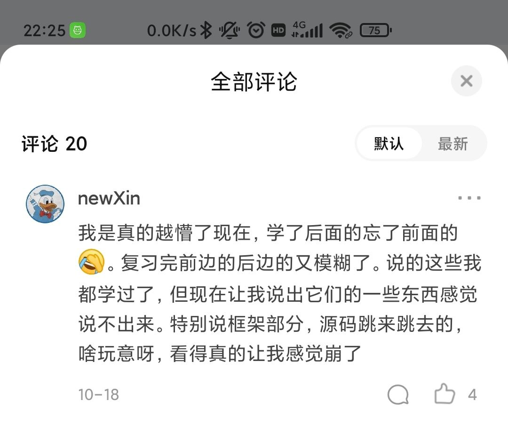
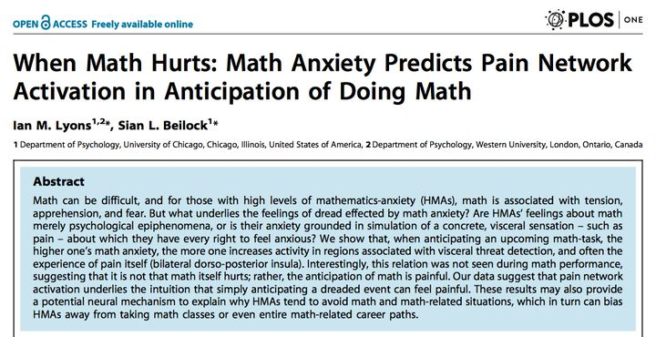

# Just do it

独立思考——做个清醒的学习者	自信坚强——做个积极向上的学习者	知行合一——做个切实的学习者

# 行

行动，去解决你遇到的一切问题。不想学习？不知道做什么？......那这些就是你目前的问题所在，那就立刻去行动，去解决这些问题，无论是以何种途径，而不是与解决这些问题相反的方向去行动。解决问题的能力是最不可或缺的，多思考问题、多去行动，好过万千焦虑、自愧不如、自顾自怜、自甘堕落、怨天尤人。

# 思

坑中沉思：

2021年11月4日，在知乎上看到一条评论，觉得很契合自己现在的处境，评论内容如下：

于是我把这条评论发上了一个交流群，期待群友的解惑。很幸运的是，夜猫和南黎慷慨直言，我也因此收获颇丰，遂有此文。

思前想后，学习的几个要素无非：学习计划、学习目标、学习过程、学习成果。学习计划是有体系的学习的保证，有了目标就去行动，就进入了学习过程，学习过程之后就是自己的学习成果，好的学习成果又正向激励着学习，于是我从这四个要素来剖析了一下我低效的学习以及学习不好计算机的原因：

第一：从学习计划分析：有完备的学习路线，但没有明确的学习规划、总的规划。对每天该学习些什么、该做些什么、该掌握哪些东西、回顾和复习没有一个明确的规划，就只是知道把视频看了、代码敲了、笔记做了，而对自己的脑子里到底吸收了多少毫不过问。也就是没有解决“往哪里走”、“怎么走”的问题。

第二：从学习目标分析：清楚学习哪些内容，也确实去学了，但不清楚自己为什么要学习这些内容以及不知晓这些内容应用的场景（引用一段话：“new了一个知识，但因没有引用而形成了一座孤岛，然后就被GC了”），所以导致了一个问题：学了后面的忘了前面的，复习起来也不知所措。

第三：从学习过程分析：除了陷入“学而不思则罔，思而不学则殆”，就是学习重心不明确，把看视频记笔记敲案例当成了学习重心，真正的重心应该是掌握知识并会实际应用。

第四：从学习成果分析：怀揣什么样的心态、目的去学，就导致了最后收获的是是什么果，得到了什么又会正向激励你去持续这么一个学习的过程。所以，就目前的果而言，是半生不熟、半死不活的。

今后要做的：求知终极法宝：好奇、实践、思考；学习计划，只需分好新技术的学习和旧知识的巩固、熟练应用就好了，然后每天简简单单地安排一些任务，以掌握、应用为目的去学习，在规定时间最大限度刻进脑子就行了。其实问题也没有那么复杂，把一些简简单单的认真做好了就行了，就不会不知道该怎么办了

**夜猫@Forward Steps ：**你缺的不是方法，是实践，自己实践，总结出来一套适合自己的方法，别人的方法可以听听，但不是听从。

**思-答：**不是缺乏实践，而是缺乏实践中的思考和好奇心。不知道如何衡量自己学到了哪些东西、掌握了多少，没有及时的反省每天的作为，没有思考技术本身，没有思考学习过程的不足之处，总的就是说进入了“学而不思则罔”的那个深坑而不自知。思又有哪些呢？在我看来，学习过程中无非就是三个思：对学习内容的思考、在实践中的思考、对自身所作所为的反思；说白了，最后还是回到了独立思考本身。大道至简，环环相扣，在某些最基本最应该去锻炼培养的往往会被我们忽视（就像计算机四大金刚的重要性一样），那些方法论也不过是实践与思考的结晶。“学而不思则罔，思而不学则殆”，“学”不就是对应了实践吗，“思”不就是对应了思考吗，实践与思考相互促进、相互成全、共同发展啊。实践确保不会出现空中楼阁（虽然行动不一定有结果），思考确保实践的更加完美。而那些学习能力强的人，不正是因为这两样东西已经融合进他们的骨子里了吗，所以他们学习成长起来如鱼得水。而好奇心呢，是不断促使我们去探索、去思考的源动力。满怀好奇心，做那个仰望星空的程序工程师。

举个学思结合的例子：比如我听说计算机很流行，我也有点兴趣（好奇心），我也想学习或了解一下（学习需求），可我不知道计算机是什么东西，我就在想计算机到底是什么玩意啊，我怎么去了解呢（思考）？局限于本身的知识储备而没有思考出个所以然来，于是我就去图书馆或互联网上查找资料——加强知识储备，亦或者向和这方面有过接触的或是就是这个行业里的人请教（思考得到的解决思路），然后就去找资料、请教老师同学（实践、行动），直到最后我搞清楚了这个问题：计算机是能够按照程序运行，自动、高速处理海量数据的电子设备（学习成果），然后还有很多不懂，什么是程序、如何实现那些功能的？（好奇心促使思考）就再去思考是什么、如何实现、有哪些途径可以解决我的疑惑、我要不要学、要学习哪些（好奇，继续思索），之后就再去寻找答案（实践、行动），思考-找答案-思考-找答案-...，由浅至深、一步步深入，最后也就水到渠成了。

实践和思考就是一把万能钥匙，运用得越熟练，面对各种各样的问题时就越懂得如何以最小的代价去解决。（好奇心启动你的思考，促使你去探索）

可现实中的大部分情况就是，好奇心缺乏、思考不足、行动不足，所以学习能力弱得可怜，现在的我就是一个典型的例子。

回到计算机，计算机是一门应用科学，而不是一门理论科学，所以学习计算机相关的技术不能以偏理论的方法去学习（而国内学校的教育，学科中多以一纸试卷来衡量学习程度，也就是说衡量出来的是偏理论上的知识，反馈也来自于试卷成绩，这样是不利于学习计算机并将技术应用起来的）。计算机的诞生，从网上得到的原因就是：“是美国为了计算导弹的运行数据而诞生的，也就是为了计算其弹道数据而诞生的”。这说明了什么？这说明了计算机就是为了某种需求而诞生的！计算机也是需求的产物！计算机不是凭空产生的，是从解决需求中创造出来的。所以后面在计算机技术基础上发展起来的语言或技术也是为了各种各样的需求服务的，比如java语言的诞生也是因为需求而诞生的（用于微机设备，得保证代码短小、紧凑且与平台无关）。

说了这么多，其实就是为了说明需求与创造的联系，以需求的角度去学习计算机技术的必要性。有了需求才去创造了某些东西，而不是凭空产生创造了某些东西。学习计算机技术过程中，不妨也以需求的角度入手，多想想自己的技术需求是什么、这些技术需求应用于哪些场景、这些技术的本质是什么、技术需求能不能为我的应用需求服务、我该如何应用于实际等等。而需求哪里来？现实中来，思考中来，实践中来，此处不再赘述。

学习不应该被复杂化，学习无非就是实践与思考，不清楚自身到底要干什么的时候，先扪心自问自己是否有思考有实践（思考过如何解决困境吗？师长、朋友、书籍、调研哪个方面你）

大道至简，许多学习上的问题的存在是因为懒惰与不作为。

总结：

1. 大行其道的各种各样的学习方法论只能是作为参考与补充，永远要记得怀揣着好奇心去思考、去实践，“学而不思则罔，思而不学则殆”，有问题、不足就要想用尽你所想到的所有方法、所有途径去解决，而不是看着别人的解决方案、看着别人的总结而没有自己的思考与实践，**毕竟，只有经过了自己的亲身实现，你才会知道你能不能做得到**。（不要光欣赏别人的，要想想自己做得到的）
2. 清楚学习技术（工具）的目标是什么，“All long,the language was a tool,not the end”（毕竟，语言只是实现目标的工具，而不是目标本身），如果不搞清楚学习技术的目标，仅仅为了学习技术而学习，到头来学习了技术也不会去应用，反而会丢失掉学习的乐趣。技术因需求而生、为解决问题而生，我们学习技术就是为了解决需求、解决问题，因此学习技术也应该以解决问题、解决需求为目的去学习。
3. 项目是一个或大或小的工程，项目的需求也往往不会很简单直白，解决需求运用到的技术也不可能很单一，因此分析需求和技术整合的能力也非常重要，许许多多的技术之间存在一定联系并且互相配合才能解决一个个工程问题。

记`南黎。`的一段话： 

技术，因为需求而生，这个技术是因为什么才被广泛使用的，始终揣着这个思路去学，去看它是怎么做的，是如何尽自己最大的能力解决了需求，才能更容易理解一个技术。比如mysql，你应该时刻抱着探索这样的心态。为什么需要数据库？这个数据库是通过什么样的技术做到了这件事？它通过什么方法解决了这样的性能问题？

为什么需要数据库？因为数据过于庞大复杂时难以管理，你靠人力难以对大量的数据进行整合并对其查找或分析，而又因为有数据查询的需求，所以你需要设计解决方案去查询，而数据查询又可以通过哈希算法对其进行快速处理并查询，但是哈希算法有极限，难免会存在哈希冲突，因此可以考虑使用数组来对其存储，这样可以避免哈希冲突，又因为数组占用空间大，同时查询遍历有n的复杂度，所以又考虑使用树状结构去存储；通过分层，降低查询平均复杂度，因此考虑采用搜索树，但是因为数据越来越庞大，树层数越来越高，同时因为数据极端情况下，树会退化成链表，回到n的复杂度，因此考虑采用自平衡的树来存储，这时候就出现了b树和b+树，而不同组织情况的树，对于不同查询条件的查询次数也是不同的，因此考虑建立不同的索引树，分别在不同索引树上查询，来降低期望时间复杂度，再后面，因为可能有些查询语句不能覆盖某索引树，但对另一棵树可覆盖，这时候就出现了mysql优化器的机制。
你要怀揣着一个去挖掘技术本质需求的态度去学习技术才行，最开始大家也只是有存储数据的需求罢了，为什么后来变得这么复杂，就是因为需求越来越高，靠硬背，早晚都会忘完了。怀揣本质、挖掘技术的最本质需求是什么，这种学习的思路在任何技术上都可以通用，所以有的培训班的视频我不爱看，就是因为他们会对一些技术背景一笔带过，反而着重讲各种技术，误导了我们很多朋友，他们甚至根本不知道，为什么需要这个技术。而看框架源码，你要揣着这个框架的本质去看，为什么需要spring，归根结底就是java自己的那一套原生web请求源码不好用（繁杂），因此封装一套成熟的框架给你用，降低开发成本；为什么springboot发展起来，就是因为spring也太繁重（配置繁重，简直配置地狱），用起来不够友好了，所以就开发出springboot来简化开发了（如何实现？）。

# 学

取势，就是在学习前要明白，学习的目的和本质；明道，就是懂得记忆、理解、运用的规律；优术，就是通过复盘迭代，不断优化学习的技术。

## 取势

学习首要要捉住两点：

1. 第一个是学习的目的，只有明确了目的（也就是你学这个东西，是为了解决什么问题？）你才有可能知道，我们要学什么？应该学到什么程度？并且要明确学习目的的重心，捉大放小，学习也要分清主次，先去解决最需要解决的问题，细致末梢就放一边。
2. 第二个是所学内容的本质规律（这个本质，其实就是某个学科，考察什么能力；对成年人来说，本质就是行业规律）。虽然说，自己思考，也能归纳出本质，但是这样太慢了。我给你一条捷径：就是在学习之前，你可以先把网上牛人总结的本质都看一遍先。

抓住这两个核心，针对性的投入精力，我们就能像风口上的猪一样，事半功倍。

实操：

1. 在学习前，你要先借鉴网络大神，大致搞懂本质。然后你要准备多一本课本的习题册，和现在老师在用的那本不一样就ok了。但是章节目录，最好和现在的一致。

   如果你是成年人，那要准备的是，行业解决方案。另外，你准备的也不是课本，而是行业经典理论书籍。

2. 切记，在学一个章节前，千万不要急着去看课本。因为你不带着目的看书，就会以为书上写的都是重点，所以看课本和看天书一样。看着看着，就走神了，看着看着，就想去问候山本的先人。

   所以看书之前，你要先快速去看，习题册中这个章节的习题。你甚至可以直接看答案。每道题就用1分钟。看不懂是正常的。这一步，主要是记录答案中，经常出现的，关键术语、关键解题步骤、关键知识点的推理过程。带着这3个关键，开始去看书。

3. 经过了前一步，你就知道，书中有什么是重点的，常考的；什么是没用的，边边角角的。着重看刚才记下来的重点部分，这样你看书就比别人快了不止1倍。

4. 看完书后，再去做章节的例题，以及老师给你的习题册。如果你想了5分钟还卡壳的话，果断去搜答案。并且，在自己的笔记本上，把自己卡壳的原因，还有对应的解题步骤，记录下来。这是积累自己的解题套路。

## 明道

学习总共分为三个层次：记忆、理解、运用。

**记忆：**（高频率适量重复）

- 想要形成纯记忆，你只需要不断重复，提高频率。无意识中，大脑就能帮你记住了。
- 我们记忆的时候，千万不要苛责自己，要求一次就背下来，一旦记不住，还贬低自己。正确的方法是，让自己放松一点，哪怕每一次背的时候不太认真，只要重复频率上来了，你的大脑，就能自动帮你记下来。
- 注意：**分散记忆，不要集中背大量的对象，才能省时省力**；**交替记忆，提高效率**。

**理解：**所谓理解，就是联系，理解的规律，就是建立联系。理解的本质，就是构建起抽象概念和实际例子之间的联系，以及概念相互之间的联系。

- 理解的第一步，就是给抽象概念，联系上实际例子。（例如勾股定理和直角三角形）
- 只有在不同抽象概念之间，也建立起联系，这才是真理解。

实操：

- i）你挑出同一章节，需要去理解的重点概念。多看几遍，先记下来。哪怕是死记硬背，也没关系。
- ii）找到一大堆，用了某个概念的简单题答案。这些题目，其实就是把抽象概念，运用到实际生活中的例子了。重点观察，这个疑惑的概念，在具体的场景中，是长什么样子的。
- iii）等你看得够多了，就会无缘无故有一种，“oh， so thus 咧”，的感觉。这其实是因为，你把抽象的概念，和实际运用例子，联系在一起了。你的大脑中，已经形成了，一个零碎的知识。
- iv）理解了好几个概念后，我们还要继续找，运用了好几个概念的中档题。这一次是观察，这几个概念之间，在答案中是怎么联系到一块的，建立起概念之间的联系。当这种联系变多了，大脑中的零碎知识，才会连成网，形成思维导图。

跳坑：

1. **理解前，需要先有记忆**。我们遇到很难理解的，没必要死磕，先硬背下来，等接触的题目够多了，一边建立联系，一边修正，大脑就自动帮你理解了。

2. **你需要接触到，足够多的实际例子，从多个角度观察过一个知识点，才能理解透彻**。理解不了一个知识，只是因为，你没有从多个角度，接触到足够多的例子而已。破除办法很简单，不要怀疑自己，找多点，同一知识点，不同类型的题目例子，看足够了，就理解了。

3. **检验自己是否理解，你需要根据自身情况，选择合适的方法**。对于基础较弱的同学，我会推荐用电子版的思维导图，去检验理解。

   如果你时间紧，任务重，你可以直接从网上，找到别人做的。自己对着图中的某个知识点，看看能不能说出来，这个点有什么实际例子，跟其他点有什么联系。这也能检验，你是否达到了理解。（费曼学习法，是有前提的。如果你大脑里面，连单个知识点都没理解好。这个时候，你其实是在地下室10层。大脑空空去就用费曼学习法，会非常卡壳。讲两句，就要停下来翻5页书，又废又慢。别人在大气层用费曼，那当然能升天啦。你在地下室搭火箭，那也是real升天了，只不过是，位列仙班的那一种。所以，费曼学习法，只适合用来查缺补漏，辅助理解，一周用个1次就差不多得了。）

**运用：**

在日常学习中，我们可以这么来使用运用的道。

1）比如，当你的记忆、理解没问题了，但是遇到题目就发懵。

这时候，你可以去找堆题目，对着答案看一遍，看看别人是如何解题的。并且把自己总结的运用方法，记录到笔记本上。

然后把答案合上，自己试一试，能不能解出来。这就是模仿了。

模仿后，还要继续找同类题目，尝试不看答案自己解。在解的过程中，修正自己的记录。如果还是不会做，就继续去模仿，不断循环。

2）对待难题，也是同样做法。

有些同学，一碰到难题就很害怕，也是因为模仿难题的答案，太少了。

如果你基础题和中档题，都没什么问题了。就找个时间，密集模仿难题答案。不用很长时间，你就不害怕难题了。

3）你甚至可以在每次做作业之前，都先花10分钟，去模仿。你会发现，这能省下非常多做作业的时间。而且作业难题的正确率，也会有很大的提升。

模仿得越多，节省的时间就越多，题目在你面前，就变得更加简单。你会越来越自信，不再害怕难题。这就是从普通学生，到学神的正向反馈。

对于成年人来说，也是同理的。只不过成年人就不需要刷题了，更加多是，要刷案例和系统解决方案。这里就不展开来说了。

## 优术

我们在学习过程中，无论是记的笔记，做题心得，或者是对学习方法的思路，都是十分宝贵的资源和精华。

但试问一下，你上次复盘整理这些精华，是在什么时候呢？

很多人喜欢听新课，刷新题，学新的学习方法，接触新的认知。恨不得让旧知识，别再联系自己了，怕被新知识误会。

这种喜新厌旧，通常被叫做渣男行为，这是没有好果子吃的哈。这类人，往往要等到考试扑街，才痛定思痛，想起复盘的好。

学神则不一样。他会每天复盘迭代，一边复盘过去的精华，一边迭代出新的方法。对新旧认知，“我全都要”，所以进步速度，就能秒杀普通学生。

如何优术？

复盘迭代，其实说人话就是，发现问题，找到本质，给出解决方法，分类汇总经验。实操步骤：

1. **a定义问题**

   你发现了一个问题后，要先问自己，这个问题重要不？不重要就别去解决了。如果真的重要，那解决它是为了什么？为了达到目标，有没有办法绕过去？

2. **b拆解问题找本质**

   碰到问题，要从多个角度去拆分。这么多角度里面，哪一个是解决问题的关键因素？这个因素的本质是什么？

3. **c提出方法，实践验证**

   围绕着目标，以及问题的关键因素。在实践中检验，自己的解决方法是不是奏效

4. **d分类汇总**

   我们实践之后，要总结经验。把我们解决问题的心得，分门别类的记录下来，用来指导下一次的实践。这就是所谓的迭代了。

不受他人的影响，不用忍受世俗的目光，心底能有淡然的幸福，对未来还怀有希望。这就是学习能力，要带给你的目的呀。

# 学不下去

学不下去时就这样做。

**小睡一会**：当你不在教室学习时，比如在家、寝室、自习室之类比较自由的地方，看书学习犯困的时候，小睡几分钟就行，但注意最长不要超过30分钟，否则会头疼或睡过头，注意这个技巧是有使用次数的，别无限制使用。

类似的研究非常多，一项针对美国国家航空与航天管理局飞行员的研究表明,飞行员在飞行时小睡26分钟(这时飞机由副驾驶员驾驶),可以提高34%的工作效率并且提高注意力54%。哈佛的一项类似研究也同样表明,小睡45分钟可以提高学习力和记忆力。

**做运动**：小睡对你无效时，尝试一下运动，有条件的话，最好去室外慢跑10-20分钟，不用太快，能提高注意力和理解能力。没条件的话，就在室内做俯卧撑、Plank、拉伸、瑜伽之类的有氧活动，补充下水分也能快速集中注意力。

在美国内珀维尔203学区有个学校发起一个活动【零点体育课】。目的是希望确定，上文化课之前进行大量的体育锻炼是否能提高学生的阅读能力以及其他学科的学习能力。他们让学生在上课之后进行运动，让这些学生的心率要保持在其最大心率的80%到90%之间。在一个学期结束时，参加活动的学习们阅读和理解能力提高17%；与之相比，喜欢睡觉以及参加标准体育课的学生们，他们的阅读和理解能力提高了10.7%。

**冥想或深呼吸**：以前写过一篇[推荐几个冥想APP](http://mp.weixin.qq.com/s?__biz=MjM5NjA3OTM0MA==&mid=212479410&idx=1&sn=ed3581407084a6bf7baccf6c852a65d4&scene=21#wechat_redirect)　，里面推荐过几个冥想的APP，尝试几分钟冥想，如果实在不方便。试试深呼吸3分钟，刚开始可以吸10秒，呼10秒，然后慢慢延长。

**笔记术**：把书中的内容做成笔记，在做笔记的时间运用合适的方法，会让你重新思考和集中注意力到重点信息上。看看下面的建议中，哪种方法更适合你。

-  [《聪明人用方格笔记本》黄金三分法](http://mp.weixin.qq.com/s?__biz=MjM5NjA3OTM0MA==&mid=210163876&idx=1&sn=b9411d76564b2b02f078783f8b97a016&scene=21#wechat_redirect)
-  [用更短的时间达到更佳效果和更好成绩](http://mp.weixin.qq.com/s?__biz=MjM5NjA3OTM0MA==&mid=403475231&idx=1&sn=bbf21f2e37e91fc10d1a48285e8abefd&scene=21#wechat_redirect)
-  [笔记术（1）使用缩写和符号提高记笔记的速度](http://mp.weixin.qq.com/s?__biz=MjM5NjA3OTM0MA==&mid=200975376&idx=1&sn=71192b666fce0088cd8e72600885f5d7&scene=21#wechat_redirect)

**音乐**：有很多科学家会用音乐来放松，弹钢琴、小提琴用来缓解一下情绪，要是你博学多才并且条件具备可以尝试一下。反之，可以找首喜欢的歌，跟着唱一、二遍，也能振奋精神。

有个亲戚从小学小提琴，在高中压力最大的时候，特别是学不下去的时候，只要在家就利用小提琴拉上一段时间来放放松自己，每次的效果都很好，高考的成绩也非常不错。

**洗头、洗澡**：条件允许的情况下，去洗个舒服的澡或洗个头也能清醒大脑，特别是用清凉薄荷的洗浴用品。

**口香糖**：很早之前就看过一份报告，说在学习时可以利用嚼口香糖来集中注意力，但这种方法对有些人无效，买些不同的口味的口香糖，尝试一次嚼3、4颗，对我来说效果不错。

特意搜了一下这方面的报告不少，圣劳伦斯大学的心理学者做了一个实验。他们让159个学生解读一道非常难的数学题，其中一半的学生允许边做边嚼口香糖，口香糖分含糖和不含糖两种，另外一半的学生什么都不能吃。结果显示，在6道题中，嚼口香糖的学生有5道题的测试结果比未嚼口香糖的学生好。

**用水果来坚持**：在桌子上准备一些自己喜欢的水果，告诉自己每坚持20、30分钟就吃一个，也是一种很有趣的方法。

前段时间在写作时经常准备了一碗草莓，每写20分钟就吃一颗，很容易就坚持写下去。

欢迎大家来分享自己的心得，在你学不下去的时候，做哪些事情能让你继续坚持学下去？

# 习惯优秀

如何让自己优秀起来？

一，要对自己的定位有个清晰的认识。这是第一步，也是最重要并且最难的一步，在决定让自己优秀起来之前，一定要弄明白这个问题，“我是谁？我在人生的什么阶段，我与周围的人相比处于什么位置？我与同龄人相比又处于什么位置”。很多人信心满满地决定改变自己，但在这第一步对自己的判断上就出错了，导致后面再怎么努力都无法达到想要的目标。这就如同地图导航，连自己在哪儿都搞错了，即使后面路线规划的再好，也是白费力气。

二，要弄清楚自己的想法。究竟是我要变得优秀还是要我变得优秀，这是一个主动与被动的过程，它直接决定了在接下来的过程中，我们愿意为之付出的努力与坚持的力度。很多人终其一生都没有弄明白自己要干什么，上学的时候老师和家长会告诉他们，他们应该干什么。工作之后，老板和同事告诉他们，他们应该干什么。终其一生也没有真正摆脱别人口中的“应该”，过得昏昏噩噩，毫无激情与动力。其实想要知道如果一个人主动想要一件事究竟有能产生多么大的动力，看一看周围玩游戏的人就知道了，无论是王者还是吃鸡，每个玩家打游戏的时候都是全神贯注，活力满满。尽管有游戏设计者精心引诱玩家入局的原因，但是对于玩家而言是他自己想要玩游戏，才能够调动自己全部的精力与激情去做这件事情。

三，要对自己想要的“优秀”有个明确的定位。究竟是要比过去的自己优秀，还是比周围的人优秀，更或者是比同龄人优秀。之后才能够制定改变自己的方案，太过高远的目标，很容易让人望而却步，早早放弃，只有看见摸得着的目标，才会更加具体，更加有诱惑力

四，有了明确的定位动力和目标，剩下的就是具体如何去做的问题了，这里我有几条建议，或许有所帮助

1.拒绝接受碎片化信息；

2.拒绝廉价的成就感；

3.培养自己独立解决问题的能力；

4.培养自己专注做事的能力；

5.给自己紧迫感。

最后我想对所有励志改变自己的人说几句，优秀不一定够能给你带来快乐，但是“不优秀”一定会让你长久的痛苦，每个人的生命中都有最艰难的一年将人生变得美而辽阔。

# 病态学习

## 发现自己什么都不懂，什么都想学，又什么都学不精，是不是一种病态？

作者：孙文亮
链接：https://www.zhihu.com/question/19778858/answer/12943046
来源：知乎
著作权归作者所有。商业转载请联系作者获得授权，非商业转载请注明出处。

这种面对无穷选择的无力感，我觉得是因为欲望，因为想学会一切的欲望。社会中学习和学校中学习是完全不一样的。没有人帮你选课程，也没有人帮你打分。同样也不要妄想拿到100分。有舍才有得！

《海上钢琴师》有一段经典台词：

”一部钢琴，从琴键开始，结束。你知道钢琴只有88个键。它们不是无限的。你才是无限的，在琴键上制作出的音乐是无限的。我喜欢这样，我活的惯。 你把我推到舷梯上然后扔给我一架有百万琴键的钢琴，百万千万的没有尽头的琴键，那是事实，max，它们没有尽头。那键盘是无限延伸的。然而如果琴键是无限的，那么在那架琴上就没有你能弹奏的音乐，你坐错了地方，那是上帝的钢琴。“

大千世界，知识无止境。面对无尽的知识不知从何学起，这种状态，与1900面对陆地生活的恐惧，是何其相似。因为生于陆地，才觉得陆地生活是何其正常又轻松；因为长于陆地，才学会如何摒弃、选择、归纳、遗忘。1900对陆地生活的恐惧感，是因为他终身生活在同一艘船上。

**当你发现什么都不懂，什么都想学的时候，最先做的应该不是迷惘，而是庆幸。因为你的目光终于不再局限于船上，因为你发现了一片新大陆。**

学校的教育，就像一艘封闭的大船。再大也是有限的，用不了多久就能看清。这种桎梏可能会深深的影响一生。大船停航，学习也就终结了。**从船到陆地，从有限到无限，选择和遗忘是很珍贵的技能。有舍才有得！**

“所罗门•舍雷舍夫斯基出生于1886年，俄国记者，记得发生过的所有事情。” 在一个实验中，研究人员给[舍雷舍夫斯基](https://www.zhihu.com/search?q=舍雷舍夫斯基&search_source=Entity&hybrid_search_source=Entity&hybrid_search_extra={"sourceType"%3A"answer"%2C"sourceId"%3A12943046})出示了一张纸，上面写着一个拥有三十个字母和数字组成的复杂公式。然后他们把纸放在盒子里，将它封存十五年。当他们取出之后，舍雷舍夫斯基能够精确地回忆起来…舍雷舍夫斯基能够记起来，但他不能提取精髓。他记住了大量随机事实，但他不能将它们组织成重复性样式。最终他不能搞清隐喻、明喻、诗歌，甚至于复杂的句子。【1】

不能遗忘，是一件可怕的事。不会选择，是一件失败的事。因为1900不会选择，所以惧怕，所以止步。他已经习惯了88个钢琴键的有限世界，可以完全的掌握，然后在任意组合。然而面对陆地生活，他仍然沿用了有限世界的学习方法：全部掌握、任意组合。结果必然是不可能。

因此面对海量的知识，首先应当意识到学是学不完的，学了也会忘的。**不知道如何选择的时候，付诸行动比选择更重要。**不能一直犹豫，一直不迈出第一步，最终困死在船上。

总结一下：

1. 有取舍之心，不能什么都学会，也就没必要什么都想学。这是一种心态，可以让你面对无穷选择的时候不会有犹豫、迷惘、恐惧这些负面情绪。
2. 有时候付诸行动比选择更重要。学习尤为如此，作为新的开端，学习的状态比学什么更重要。很多知识要学一段时间才能发现兴趣，才知道是否有用。

什么都不懂，很正常，因为这是新的开始；什么都想学，是缺少取舍的心态，先开始学一个再说；什么都不精，学过几年才见分晓，一万小时才算精通。

有人会因为无法作出决定就推迟决定，然而实际上推迟决定是最差的决定 ，在推迟决定期间，时间悄悄流逝，你却没有任何一条路上的积累，白白浪费了时间。

**如果你有一些钱不知道花在 A 还是 B 上，你先不作决定，没问题，因为钱还是你的，但如果你有一些时间，不知道花在 A 上还是 B  上，不行，因为过了这段时间，这段时间就不是你的了。**【2】

最后推荐一文《学习的艺术》【3】，不要让学习停滞，坚持下去，这些焦虑将不复存在。

【1】 摘自《中国的创造力是如何被扼杀的》：[译言网 | 中国的创造力是如何被扼杀的？](https://link.zhihu.com/?target=http%3A//article.yeeyan.org/view/190382/205086)

【2】 摘自[刘未鹏](https://www.zhihu.com/search?q=刘未鹏&search_source=Entity&hybrid_search_source=Entity&hybrid_search_extra={"sourceType"%3A"answer"%2C"sourceId"%3A12943046})的博客《不是书评 ：「我是一只IT小小鸟」》：[不是书评 ：《我是一只IT小小鸟》](https://link.zhihu.com/?target=http%3A//mindhacks.cn/2009/10/05/im-a-tiny-bird-book-review/)

【3】 《学习的艺术》:[学习的艺术 - 左岸读书_blog](https://link.zhihu.com/?target=http%3A//www.zreading.cn/archives/2397.html)

## 中国的创造力是如何被扼杀的？

Nowadays people may admire China’s economy, but not Chinese creativity. Chinese architecture art, music and movies are derivative, and many a Chinese enterprise is merely a carbon copy of an American one. China’s best schools may produce the world’s best test-takers, but the United States’ best schools produce the world’s most creative talent.

当今人们可能会赞叹中国的经济发展，但却没有人欣赏中国人的创新能力。中国的建筑、艺术、音乐和电影大多缺乏创意，很多中国企业更是直接照搬美国。中国的顶级学府能培养出全球最优秀的应试人才，而美国的顶级学府却能缔造出世上最具创新能力的天才。

David Brooks outlines the four-step learning process that teaches students to be creative: knowledge acquisition (research), internalization (familiarity with material), self-questioning and examination (review and discussion), and the ordering and mastery of this knowledge (thesis formulation and essay writing).

David Brooks总结出启发学生创造力的“四段式”学习方法：获取知识（研究）、消化（熟悉材料）、反思和检查（复习和讨论）、整理和掌握知识（论文和笔记）。

However, this isn’t a linear process, Brooks points out, which means that the learner ‘(surfs) in and out of his unconscious, getting the conscious and unconscious processes to work together – first mastering core knowledge, then letting that knowledge marinate playfully in his mind, then wilfully trying to impose order on it, then allowing the mind to consolidate and merge the data, then returning and returning until some magical insight popped into his consciousness, and then riding that insight to a finished product.’

然而，布鲁克斯指出，这并不是一个线性过程，这意味着学习者需要在他的潜意识中来回穿梭，将意识与潜意识融为一体——首先掌握其精髓，再让这些精髓一直活跃在他的大脑中，进行各种排列组合、巩固加强、合并重组，如此循环反复直到灵光乍现，然后趁势付诸实践、创造出成果。

‘The process was not easy, but each ounce of effort and each moment of frustration and struggle pushed the internal construction project another little step,’ David Brooks continues. ‘By the end, (the learner) was seeing the world around him in a new way.’

布鲁克斯继续写道：“整个过程并非一蹴而就，每一分努力、每一次挫折和拼搏，都使内在理念更趋于完善。最后，学习者会以全新的视角看待他的周遭世界。”

But what permits our brains to turn a chaotic sea of random facts and knowledge into an island of calm understanding? Believe it or not, it’s our emotions that permit us ultimately to become creative thinkers. In his book The Accidental Mind, the neuroscientist David J. Linden explains how emotions organize our memories:

但是，究竟是什么，让我们的大脑将一团充满随机事件与知识碎片的混沌意识，变成冷静而理智的认识？信不信由你，事实上正是我们的情感最终让我们变成具有创造力的思考者。神经科学家David J. Linden在*The Accidental Mind*一书中解释了情感是怎么组织我们的记忆的。

‘In our lives, we have a lot of experiences and many of these we will remember until we die. We have many mechanisms for determining which experiences are stored (where were you on 9/11?) and which are discarded (what did you have for dinner exactly 1 month ago?). Some memories will fade with time and some will be distorted by generalization (can you distinctly remember your seventeenth haircut?). We need a signal to say, “This is an important memory. Write this down and underline it.” That signal is emotion. When you have feelings of fear or joy or love or anger or sadness, these mark your experiences as being particularly meaningful…These are the memories that confer your individuality. And that function, memory indexed by emotion, more than anything else, is what a brain is good for.’

“我们一生中会经历很多事情，其中许多我们致死都将铭记在心。我们脑中有许多机制，来决定记住哪些经历（9.11事件发生时你在哪里？（注，作者是美国人）），遗忘哪些经历（一个月之前你吃的晚餐是什么？）一些记忆随时间流逝而褪色，还有一些记忆会因过于平常而被混淆（你能清楚记起你17岁时的发型么？）。我们需要有一个信号给予提示：“这是一条重要的记忆。记下来并且加上重点标记。”那个信号就是情感。当你感觉到喜怒哀乐时，这些情感会给你的经历刻上“意义非凡”的标记。这些记忆赋予你独特性。大脑唯一能提供的就是用情感索引的记忆。”

What this means is that memories are ultimately emotional experiences, and that effectively learning must involve the learner emotionally. The very best US schools are seen as such because they inspire their students to be curious, interested, and excited; China’s very best schools gain their reputation by doing the opposite.

这就意味着记忆最终都是情感经历，并且有效的学习是需要学习者全“情”投入的。美国的顶级学府都是如此，因为他们赋予学生求知欲、兴趣和激情；而中国的顶级学府恰恰相反，因压抑学生而著称。

Thinking is the conscious effort of applying our memories to understand a new external stimulus, and creativity is asserting individual control over this process to create a synthesis between memory and stimuli. In other words, thinking is really about applying previous emotional experiences to understand a new emotional experience, whilst creativity is the mixing of old and new emotional experiences to a create an entirely new and original emotional experience. 

思考是运用我们已有的记忆来理解新的外界刺激的意识活动，而创造力则控制这个过程而创造出旧记忆与新刺激的复合物。换句话说，思考就是通过往昔的情感经历来理解一个新的情感经历，而创造力则是通过混合新旧情感经历，进而去创造一种全新的独创的情感经历。

The best US education institutions endow students with creativity by providing a relaxed and secure learning environment in which students share in the refined emotional experiences of humanity by reading books and developing the logic necessary to share in collective emotional experiences through debate and essay writing. A dynamic learning environment allows students at many US schools to feel joy and despair, frustration and triumph, and it’s these ups and downs that encode the creative learning process into our neural infrastructure and make it so transformative. 

美国最棒的教育机构，给学生提供轻松自在、无忧无虑的学习环境，在这里，他们通过阅读可以分享人类思想的精华，并通过辩论、撰写论文来提供共同的情感经历，以培养他们接受分享所必需的逻辑推理能力。许多美国学校通过丰富多彩的学习环境，让学生体验到兴奋与绝望、挫败与成功，正是这些跌宕起伏将有创造力的学习方法编入我们的神经网络，而且能活学活用。

A Chinese school is both a stressful and stale place, forcing students to remember facts in order to excel in tests. Neuroscientists know that stress hampers the ability of the brain to convert experience into memory, and psychologists know that rewarding students solely for test performance leads to stress, cheating, and disinterest in learning. But ultimately, the most harmful thing that a Chinese school does, from a creativity perspective, is the way in which it separates emotion from memory by making learning *an unemotional experience*.

中国的学校则是一个压抑、没有生气的地方，为了考试成绩，强迫学生死记硬背。神经科学家都知道压力会妨碍大脑将经历转化为记忆的能力，心理学家都知道仅仅用考试成绩来考查学生会导致压力、作弊、厌学。但是最终在创新能力方面，中国的学校做出的最有害的一件事是在教育过程中分割情感与记忆，使学习变成“无情感的经历”。

Whatever individual emotions Chinese students try to bring into the classroom, they are quickly stamped out. As I have[previously written](http://the-diplomat.com/china-power/2011/06/14/resistance-futile-in-chinese-class/#respond), from the first day of school, students who ask questions are silenced and those who try to exert any individuality are punished. What they learn is irrelevant and de-personalized, abstract and distant, further removing emotion from learning. If any emotion is involved, it's pain. But the pain is so constant and monotonous (scolding teachers, demanding parents, mindless memorization, long hours of sitting in a cramped classroom) that it eventually ceases to be an emotion.

无论中国学生尝试将什么个人情感带入教室，都无一例外地会被抹杀掉。正如同我之前写到的，自从开学的第一天起，爱提问的学生发现沉默是金，尝试展现个性的学生受到处罚。进一步让情感远离学习之后，他们所学的知识的显得无关紧要、单调乏味、抽象而晦涩。如果说还有什么情感的话，那也是痛苦。但是这种痛苦却是始终如一、单调乏味的（老师的斥责、家长的苛求、机械的记忆、长时间地坐在拥挤的教室里），这唯一的情感也将失去“感情色彩”。

To understand the consequences of Chinese pedagogy, consider the example of ‘Solomon Shereshevskii, a Russian journalist born in 1886, who could remember everything,’ whom David Brooks writes about in*The Social Animal*:

为了更好地理解中国教育的后果，让我们看看Solomon Shereshevskii的例子，“他是一个生于1886年的俄罗斯记者”，David Brooks在*The Social Animal*中写道：

‘In one experiment, researchers showed Shereshevskii a complex formula of thirty letters and numbers on a piece of paper. Then they put the paper in a box and sealed it for fifteen years. When they took the paper out, Shereshevskii could remember it exactly…Shereshevskii could remember, but he couldn’t distil. He lived in a random blizzard of facts, but could not organize them into repeating patterns. Eventually he couldn’t make sense of metaphors, similes, poems, or even complex sentences.’

“在一次实验中，研究人员给Shereshevskii出示了一张纸，上面写了一个由三十个字母和数字组成的很复杂的式子，然后他们把这张纸放进盒子里封存起来。十五年后，他们取出这张纸，Shereshevskii能够一字不差地背出来……Shereshevskii能记起来，但他不能提炼加工。他的脑海里充满了各种孤立的事实，但他不能归纳出一些共同的模式，将它们组织起来。最终他不能理解隐喻、明喻、诗歌，甚至于复杂一点的句子。”

Shereshevskii had a neural defect that prohibited his brain from prioritizing, synthesizing, and controlling his memories to permit him to formulate an understanding of self and the world. Like many a Chinese student today, he could experience, but he could not *feel*.

Shereshevskiis的神经有缺陷，他的大脑不能对记忆进行排序、合成等加工，也就无法形成对自我和世界的理解。他同许多今天的中国学生一样，只能经历，不能体验。

Chinese schools are producing a nation of Shereshevskiis, students with photographic memory and instant recall, but who can never be creative.

中国的学校正在制造Shereshevskiis之国，这些学生跟Shereshevskiis一样，只有快照记忆和短时记忆，绝不可能拥有创新能力。

## 不是书评 ：《我是一只IT小小鸟》

——摘自[刘未鹏的博客](https://www.zhihu.com/search?q=刘未鹏&search_source=Entity&hybrid_search_source=Entity&hybrid_search_extra={"sourceType"%3A"answer"%2C"sourceId"%3A12943046})

**设计你自己的进度条**

进度条的设计是一个很多人都知道的故事：同样的耗时，如果不给任何进度提示，只是在完成之后才弹出一个完成消息，中间没有任何动态变化，那么整个过程就会让人等得非常焦急，导致一些人干脆把程序关了了事。如果有进度不断更新，那么对整个过程耗时的心理感受就会远低于实际值，用户也不会郁闷到把程序关了。（你有多少次在银行处理手续的时候，看着工作人员把一堆材料不停地倒腾来去，心里多希望他们可以在柜台小窗口上投影一个进度条？）

这里的原因在于，没有进度提示的话，我们无法判断这个等待什么时候才是个尽头。如果有不断增长的进度条，那么我们对于什么时候会达到100%就会有一个粗略的估计，这个估计是一剂定心丸，让我们知道这事情总会并且会在不久的将来完成。

做事情也是同样的道理，善于规划的人，会将目标分割成一个个的里程碑，再将里程碑分割成TODO列表。前阵子流行的GTD方法学，核心的理念就在于，如果你把任务分割了，你就有了进度条，你就知道，事情在不断的进展，你总会完成任务或到达你的目标，你会有一个时间估计。反之如果没有这个分割，整个的任务或目标对你来说就只有两种状态——“完成”和“未完成”，如果不幸是一个比较漫长的目标，那么你会发现你的进度条总是“未完成”，一次又一次的等待未果会耗尽你的耐心，让你下意识的产生“这事什么时候才能完呢？”的疑惑，没有分而治之，你就不知道未来还需要付出多少努力才能达到目的，这就会让你心生怯意，不敢进一步投入时间，免得血本无归。在这样的心理下，不少人就会选择保守策略——退出，以免到头来花了时间还一事无成。

而所谓的规划其实就是针对这种心理弱点的做事方法。如果你对整个目标的几个重大步骤有清晰的界定，能够对每个步骤的耗时作出靠谱的上界估计，你就不会被不确定的未来，不确定的时间投入感到恐惧，就不会被这种不确定感压迫到过早退出。

**不要过早退出循环**

我们在尝试新的事物的时候，总是会遇到各种各样的困难，不同的人会在碰壁不同的次数之后退出。用程序员喜欢的话来说就是，我们都在for循环，区别在于你是什么情况下break;的。有的人退出阈值高，这是能坚持的一类人，有的人退出阈值低，这类人很可能遇到一些障碍就退出了。

过早退出的原因往往在于对于未来的不确定性，对于投资时间最终无法收到回报的恐惧，感受到的困难越大，这种恐惧越大，因为越大的困难往往暗示着这个任务需要投资的时间越大。所以其实我们都是直觉经济学家，当我们说“畏难”的时候，其实我们畏惧的不是困难本身，而是困难所暗示的时间经济学意义。

然而，我们的情绪大脑毕竟比较原始，仅根据碰壁的次数或硬度来判断事情的难易并不一定靠谱，如果你遇到困难，不妨用一用互联网，用一用群体的智慧，看看别人当时是怎么想怎么办的，绝大多数情况下你并不孤单，你遇到的问题早就有人遇到过，你踩过的坑里面尽是前人的脚印，不要仅仅因为一时摸不着头绪，找不着出路就退出，这不是informed decision，问一问自己作出退出的决策是否基于足够的信息，我是否进行了足够的调查，至少，是否去简单用了用搜索引擎。

模仿高德纳先生的名言：**过早退出是一切失败的根源**。

**兴趣遍地都是，专注和持之以恒才是真正稀缺的。**

很多人看了书中的故事之后得出这样的结论：兴趣最重要。然而，我觉得区别他们和其他人的，并不是他们拥有超过常人的兴趣，而是他们拥有超过常人的毅力。

其实人天生就对新事物怀有好奇心，难以找出谁没有对任何事物或领域产生过兴趣，然而不同的是，有些人的兴趣只能持续几天，当遇到第一个困难，第一道坎的时候，他们就熄灭了，然而另一些人的兴趣火花会变成火苗，火苗会变成火种，一直稳定的燃烧很多年。**区别他们的并不是兴趣的有无，而是他们的性格里面有没有维持兴趣的火种一直燃烧下去的燃料**。

一个人有专注和持之以恒的性格，即便在一个没有多大兴趣的领域也能成为专家（更何况，兴趣的很大一类来源就是“我擅长做这件事情”）；反之就算有兴趣也很快会被一些冷水泼灭。

**生活中的选择远比我们想象得要多，细微的选择差异造就了不同的人生**

唐雅薇同学的故事中，有这么一个细节吸引了我的注意：当时她正在找工作阶段，对女生在IT行业的发展很迷茫，恰逢微软的郭蓓菁女士到他们学校演讲，演讲完了之后她立即就奔上讲台拦住郭女士询问女生与IT的问题。

这是一个细节，但我相信不是所有人都有勇气上去拦住名人问普通问题的，我们会给自己找很多很多的理由和接口，我想最常见的应该是两个原因：1. 如果被批评了自尊心会受到打击。2.认为问了也问不出特别的信息。然而事实却是相反：1. 自尊心受到打击算不上实质性的损失。2. 你想不出能问出什么特别的信息并不代表就真的问不到重要的信息。**别把不知道当成没有**。

一个小小的思维差异，可能导致很多人在遇到困惑的时候原地打转，冲突不出，而另一些人则取经得到宝贵的经验，站在别人的肩膀上越过了障碍。唐雅薇从郭女士那儿得到了最宝贵的信息：女生在IT行业也能有很好的发展。信心，是这样一种奇怪的东西，就算你没有确切的证明未来会更好，你也会坚持下去，你不会过早退出循环；而来源于过来人的信息则是信心最靠谱的保障。

你是不是意识到，在平常的生活中，你所作出的选择比你想象的要多得多呢？有没有想过有一些看似细小的选择可能会产生巨大的影响？

想想看，试一下，是不是真的没什么损失，还有可能得到巨大的回报呢？

**靠专业技能的成功是最具可复制性的**

它需要的只是你在一个领域坚持不懈地专注下去，只需要选择一个不算太不靠谱的方向，然后专心致志的专下去，最后必然能成为高手或者绝顶高手。世上有很多成功带有偶然因素和运气成分或出身环境，但至少这一样，被无数人复制了无数遍，否则就不会存在学校和教育了。

**反思是让人得以改进自己的最重要的思维品质**

很多人在成年之后甚至未及成年，性格就难以再发生大的变化。性格是这样一种自我实现和强化的陷阱：如果你是不容易专注的人，你会发现生活中处处都是分散你注意力的东西，你的思维难以在一个事情上停留半小时，于是你的时间变得琐碎，你很难在一个领域有长久的积累和深入的思考，这样的现实可能会让你感到沮丧，后者让你更加无法专心，这样的现实可能会让你感到焦虑，为了避开焦虑你又会去寻求其他的刺激，结果是恶性循环。

反思是改变自己的第一步，我们常常容易发现别人的问题，别人的错误，却难以发现自己思维中的问题，因为我们很少会把自己的思维当成目标去思考。

作为程序员，相信没有人不知道能修改自身的程序，而能修改自身的程序的前提就是，首先这个程序必须有法子能够指向自身。

**饿死在干草堆之间的驴子**

有很多在迷茫期的同学，迷茫都是相似的：面前有两条路，到底选哪一条？“转行还是不转行？”“学C++还是学Java。？“做管理还是做程序员？”有些问题其实不是问题：比如“学C++还是学Java。”答案是都学而且还不仅学两个。有些问题不是一个泛泛的答案能够适合的，比如转行还是不转行，需要考虑很多自身因素。

但更重要的是，有人会因为无法作出决定就推迟决定，然而实际上推迟决定是最差的决定，在推迟决定期间，时间悄悄流逝，你却没有任何一条路上的积累，白白浪费了时间。

如果你有一些钱不知道花在A还是B上，你先不作决定，没问题，因为钱还是你的，但如果你有一些时间，不知道花在A上还是B上，不行，因为过了这段时间，这段时间就不是你的了。

所以，不管有多纠结，也不要从纠结中逃离，试图推延决定，既然终究是个痛苦的决定，就痛一回，好好思考和调查之后作出一个决定并坚持下去，只要不是太不靠谱的行业（相信也没谁会在纠结了之后却选了一个不靠谱的行业的），经过你的积累总会成为高手。

**一生的知识积累，自学的起码占****90%**

你会在这本书当中看到的一个重复出现的现象就是自学，大规模的自学，逃课自学，上网找书自学，程序员行业是最适合自学的行业，网络是程序员的天堂，需要的资源、工具，比课堂上的多出何止百倍，如果说还有一个学科，并不需要传统的教育就可以成才，估计非程序员莫属了。作为程序员如果没有查过wikipedia，没有看过几本原版电子书，没有在国内外主要邮件列表里面提过问题吵过架，没有用技术博客记录学习的独特体会，没有订阅技术牛人们的博客，怎么好意思说身在这个行业呢？

最后，看完了书还是说“说起来容易做起来难”的，**怪自己，不怪书**。

## 学习的艺术

**[LiuSerina](mailto:serina11@live.cn)**分享的文章。

有看过非诚勿扰不？我有看过一期是这样的：一个男嘉宾刚从后面的背景门后走出来，一个女嘉宾就以迅雷不及掩耳盗铃响叮当之势把灯按掉。主持人问她：姑娘，你怎么这么快就把灯按了呀。姑娘：“第一，我不喜欢个子矮的。第二，我不喜欢穿西装的。第三，我不喜欢个子矮还穿西装的。”搞笑了，是不是？也太武断了，是不是？我脑中马上想出一个画面：如果这位姑娘看到敬爱的小平同志的尊荣不知是何反应。嗯，应该很有趣吧。

八卦了半天，可以扯到正题了。

当我们初见一个人、初学一门技艺、初尝试一样新的菜式、或者初到一个陌生的地方、、、、、、，我们究竟是以一种什么态度来看待这些？我们可以以一种非常武断的方式早早下了结论：这个男生太糟了， 他个子低还穿西装。（上面的那个姑娘）为什么要学英语，我是中国人，为什么学鸟语，英语有什么好的？我们国家这么富强了，我不需要走出中国，因为世界已经走进中国了。我不要学英语，还是老外学汉语吧。（或者刚学游泳的人，为什么要学游泳，游泳池里的水一点都不好喝、我又不是鱼，离开水就不能活，而且，我是“伟大”的脊椎直立行走的动物——人，为什么要像只青蛙一样在水里扑腾？）这个菜怎么这么难吃？这里的人怎么就吃这个？他们怎么活过来的？还是我们家乡（我妈妈）的菜好吃。这个地方怎么这个样子？（如果是北方人到了南方，会说：这里的人怎么这么精明小气？这里的人怎么这么势利？这里的人怎么只懂得赚钱完全不搭理国家大事？如果是南方人到了北方，会说：这地方怎么这么破，这里的人怎么这么虚伪，这里的人怎么天天谈论国家大事自己的事却不干？）......

发现上面的人都有一个共同特点了吧。

他们（她们）都在以先入为主的方式粗鲁的把自己的观点加到新看到的人、新看到的地方上。他们采用各种办法拒绝学习、 拒绝看到新的东西新的方面，他们拒绝进步。所以，他们（她们）的结果是：他们可能一辈子独身。后来终于结了婚，但是矛盾重重。（因为，你懂的，找出别人的优点不容易，找人的毛病多容易啊：除了个子矮、穿西装难看外，还可以说：肩膀不够宽、声音不动听、不会哄人开心......，我可以写三天三夜也写不完）

他们可能一辈子都没学会英语、没学会游泳、......、没学会一切新的东西。或者即使学了也是不情不愿，怨天怨地，他们是——怨妇或怨夫，他们真是般配。他们可能一辈子只吃那几道菜。他们可能一辈子只呆在一个地方，或者即使去了其他地方，回来之后的评论是：还是我的家乡好。他们处于停滞状态，他们看不到别人、别处的好，他们拒绝进步，他们生活在陈式之中，他们虽生犹死。

这种人就是马斯洛所说的这种人：他们以一种大吵大嚷、横冲直撞、目的明确的利用方式来了解、塑造事物，迫切要求分类、陈规化、分级、归档、贴标签。他们永远生活在过去。马斯洛用了一个很直接的很不客气的比喻来形容这种思维方式：屠夫割肉。

他举了一个例子非常搞笑：一位拙劣的医生哪怕已经有100年的临床经验，也只会反复验证他在治疗之初学到的那套理论。正是从这个意义上说，一个医生可以在同一个错误上重犯40年，而且还大言不惭，把这称为“丰富的临床经验”。在积累错误的经验方面，他的却很有一套。随之，马斯洛问了一个非常尖锐的问题：我们看到的究竟是真实的、具体的世界还是我们自身投射的真实世界中的陈规系统？我们看到的是世界的本来面目吗？艾默生说：如果夜晚的繁星是一万年才会出现一次的奇观，我们会惊叹不已造物者的伟大，但在现实中我们却对眼前的奇迹视而不见。我们何其幸运，我们又何其不幸？我们究竟是目明还是眼瞎？

请问：当我们初见一个人、初学一门技艺、初到一个地方、......，我们能否采用一种轻柔的方式、耐心的了解他们（她们、它们）？我们能否像水渗入石缝一样，随地而安。不会急于以明确的形状将对方定形，贴上标签？我们能否允许对方展现本来的面目并且接受？我们能否欣然接受甚至欣赏对方的样子？我们能否主动卸下心防、以一种不抵抗的姿态应对这些新的东西？就像一艘小船在大海中乘着波浪、随风而动，而不是凭着一己之力逆流而动？我们能否主动的被动？

我们的回答是：我们可以。而且，通过这种以退为进的方式，我们不仅可以得到我们想要的，我们还会得到我们没有想到却更好的东西。

通过这种以退为进的方式，我们不仅可以获得和谐的两性关系，学会更多的更好的技能，尝到更多好吃的菜式，看到更多美丽的风景。我们还会：

收获人与人之间的真诚、善良和美丽。会体验到只可意会不可言传的学习的乐趣。对大自然、对人类生出一种深深的感恩之情：他们是如此慷慨、赋予我们如此丰硕的礼物。会真切的感受到与古今、天地之精神相往来的快乐。会真切地体验到天地有大美而无言，会明了为什么相视而笑、莫逆于心，为什么会心有灵犀一点通......

多么美好，这绝对是值得我们去追求的，这绝对是需要我们去努力的。这绝对不是一朝一夕可以到达的。马斯洛说，他还没有遇到45岁之前就达到自我实现的人。这需要时间、需要努力。但是确实可以到达的。

所以，我们要学习，要永远学习，向小孩学习。永远保有一颗赤子之心。我们可不可以像小孩子那样以明净的眼睛将一切看成好像初次见到一样，能够满怀惊奇的注视着一切事物，领会一切特征，因为对于他来说，所有的特征都同样重要、同等新奇。在他们的眼里，毛毛虫和蝴蝶一样令人着迷。泥土沙石充满魅力。天空中飘起的细雨让人遐想痴迷。

同时，我们要面对的挑战是：在经历挫折、伤痛等之后，是否仍然保持纯真的热情去接纳、去学习，而不会把以防御或躲避的姿态来保护自己？

我们能不能放下再前进？有时只是需要捅破一层薄如蝉翼的借口。

# 深度思考

作者：毛毛
链接：https://zhuanlan.zhihu.com/p/33587359
来源：知乎
著作权归作者所有。商业转载请联系作者获得授权，非商业转载请注明出处。

对于学习能力比较差的同学，如果其学习基础又比较差，那么，使用僵化的学习方法，就不大容易深入思考。对于学习能力很差、同时学习基础又很差的同学，使用僵化的学习方法，几乎没法进行深入思考，甚至连基本的思考都不可能。

要知道，连深入思考都不能进行，怎么可能学习进步呢？

为什么会这样？

因为学习能力差的同学，若他的学习能力中的重要因素之一的“学习起动力”差，那么，他思考某个问题的一开始，就会很慢，比如，别人思考几秒钟就清楚的题目，他可能需要思考几分钟、甚至几十分钟，才能“进入思考的状态”，因为他的“学习起动力”差啊，“起动不起来”啊。而僵化教育下，一般的，老师怎会给他这么长的思考时间？更可怕的是，由于经常的思考的慢，他就会认为自己很笨，有时就放弃学习了。

如果他很努力，仍坚持学习，那么，即使他勉强进入“思考状态”，若他的学习能力中的另外一个重要因素“凝聚能力”又差，那么，他思考时就会很容易分心，“凝聚不起来”啊。如果他的学习能力中的“执行力”差一些，“学习耐久性”又差一些，他就很快就会放弃了。如果他的“执行力”比较强，“学习耐久性”比较强，那么，如果他的“学习抗焦躁能力和学习耐久力”差一些，那么，思考简单的问题时，或许还行。但思考难的问题时，他又不行了，因为他“抵抗不住焦躁”啊，于是，他又放弃了。

因此，从“学习能力”的角度，一个学生要能深入思考，是多么的不容易啊！

# 懦弱的你

**性格懦弱的人怎么改变自己？**

作者：潇洒江湖派
链接：https://www.zhihu.com/question/506085952/answer/2302662132
来源：知乎
著作权归作者所有。商业转载请联系作者获得授权，非商业转载请注明出处。

**一：**想改变懦弱但千万别装叼，旁人很容易看出来。会看你不爽。装模做样会很累，甚至失去自我。想要改变自己的懦弱，首先必须承认自己是个懦弱的人，然后再一步一步让自己不再懦弱。承认自己的懦弱，并承认自己怕，有些人明明是怕却一直在心里找理由说服自己哪里是怕，其结果只会导致自己更懦弱，这是自欺欺人。

**二：**别想着马上变强，懦弱的人并不能一下子让自己变强，想要变强是个缓慢的过程。你只能逐渐变强，如果老是想着如何马上变强，那根本就是自欺欺人。找清楚自己什么地方做得不好，仔细分析，提醒自己下次不要这样了。

**三：**想靠认识叼的人帮你解决事情，这也千万别干。正所谓物以类聚，人以群分，叼的人当然和叼的人相处得好，懦弱的人跟他们在一起，要么把你当小弟，而且是好欺负的小弟，天天跟在他们屁股后面，什么事都叫你做，偶尔作弄你，花你的钱，最重要的是，他们不会真正帮你解决事情。

**四：**不要沉溺于幻想，这样会让你变得更懦弱。如果你们当中有沉溺于幻想而觉得迟早有一天会无端实现幻想，那我现在就告诉你，做你的春秋大梦，你一辈子也不会实现你的“梦”想。

**五：**千万别对任何人产生依赖，因为所有的事情到了最后还是要靠自己，别人帮得了你一时却帮不了你一世。唯一可做的就是不断增强自己。

**六：**努力工作、大胆赚钱，不要有恨，心里不能想着怎么报复别人，只有懦夫才会这样做，真正的强者是要增强自己。

**七：**多和人打交道，要主动向别人打招呼，碰到厉害的人物不要不好意思，叫个什么哥什么姐的死不了人。可以用社交去多认识人，陌陌啊或者更直接点的悦技，多沟通多交流，尤其悦技很多直奔主题的，看对眼谈个恋爱解决一下自己的生理也可以，但也别见到厉害的人就叫哥叫姐，有些人不喜欢。如果连主动向人打招呼都不敢，我没话说。

**八：**别想你永远都不会受到伤害，人在江湖混，哪有不挨刀。我们要做的不是永远不会受到伤害，而是尽量防止受到伤害。

**九：**帮助人是好的，但只要尽量就好了，别帮不了别人反而若祸上身。除非是生死之交。

**十：**别老是一个人，尽量去找你的知己，人最怕的就是孤独，尤其是一个人承受苦难。

**十一：**人不犯我，我不犯人（最基本，但还是要说下）。

**十二：**有梦就去追，不管再怎么苦难也好，最重要的是不要放弃。人一但放弃梦想，是很痛苦的。在追梦的时候，要一切谨慎，防人之心不可无，千万不要不好意思防人，不然迟早有一天会吃大亏。

**十三：**如果你是命运极其不佳，很倒霉的那种（这种人万中无一），唯一可做的是与命运搏斗。要能人所不能，忍人所不能忍。（解释下，这两句话不能只理解表面意思，忍，除了要你忍着别人，还要你忍着一切困难来增强自己，这就是能人所不能。）暂时一切不要强求，要用脑。我相信有命运，但我更相信人定胜天。（要如何做到能人所不能要看你自己，切记，不可强求，要用脑）

**十四：**坚持锻炼身体，因为锻炼身体可以增强意志力，意志力强承受痛苦的能力也强（还没听说过壮的人短命），如果你一但想到锻炼就心烦，那你更应该锻炼，很快就会习惯了。

**十五：**如果你不是那种善于交际的人，刚进入一个群体时先不要讨好所有人，别人会看不起你，和他们相处久了再慢慢行事。

**十六：**这条很重要。人一但在痛苦的时候，会变得堕落，一副很没出息的样子。喜欢睡觉，什么事都不爱干，喜欢对家人发火，不讲卫生，也没心情打扫房间。更严重点终日借酒消愁，抽烟，不思进取。总之做的事都是[懒汉](https://www.zhihu.com/search?q=懒汉&search_source=Entity&hybrid_search_source=Entity&hybrid_search_extra={"sourceType"%3A"answer"%2C"sourceId"%3A2302662132})没出息的人做的事。这个时候，你更应该站起来，老天是不会放弃你的，只有你自己会放弃自己。

**十七：**别想着出去混，也许会风光一时，但到最后看你会不会后悔死。

**十八：**切记，不要模仿别人，不要去刻意学别人的性格，你就是你自己，你唯一可做的就是加强自己。

**十九：**不要让自己失败的过去拖累现在的你，有很多成功人士都有自己惨淡的过去，以前做的不好用现在弥补，如果你还是一直因为失败过去而自卑，一辈子不敢变强的话，看你80岁会不会后悔死，人生可只有一次啊。

**二十：**多看书，一个人的想法是有限的，而书集合了古今中外所有的智慧。励志方面的书使你聪明；历史方面的书使你智慧；文化方面的书使你有修养；知识方面的书使你更有知识；[辨证](https://www.zhihu.com/search?q=辨证&search_source=Entity&hybrid_search_source=Entity&hybrid_search_extra={"sourceType"%3A"answer"%2C"sourceId"%3A2302662132})方面的书使你说话更有道理；兴趣方面的书使你更充实；小说方面的书使你语言书写能力更好……总之除了********什么书都好。（********看多了会让人的心变得龌龊，萎靡，想入非非，不思进取，只会更懦弱）

**二十一：**思进取，别老玩，也别想等明天，你没有几个明天，你想想你已经等了几个明天了。

**二十二：**好的方法要有好的用法，什么意思呢？我这里强调“方法”和“用法”。“方法”就是你今天得到了一个为人处事的方法，可却乱用。比如一个人想到对人和做事要强硬一点，于是就做事到处乱强硬，即使自己是错的也强硬，结果处处碰壁。因为他没有好的“用法”。好的“方法”配合好的“用法”对你绝对有好处，不会让你得到一个方法就乱用。使用方法应当配合时宜配合事情地用，用错了对象会使你吃大亏。将来大家想到了什么为人处事的方法千万别乱用，遇到相应的事情再用。

作者：熊大帮
链接：https://www.zhihu.com/question/506085952/answer/2295919480
来源：知乎
著作权归作者所有。商业转载请联系作者获得授权，非商业转载请注明出处。

1、不要老是笑,特别是贱兮兮的赔笑,让人看了想踩一脚的那种,特别是别人没有对你笑的情况下。不笑几乎可以解决50％软弱问题。
2、说话自然一点,不要怪腔怪调,语气平和稳重,语气过冷不行,过热也不行。

3、不幽默就不要幽默。
4、不要试图做一个好人，而是要做一个有实力的人。
5、勇于发表自己的看法，不要怕自己的看法与别人有冲突。[唯唯诺诺](https://www.zhihu.com/search?q=唯唯诺诺&search_source=Entity&hybrid_search_source=Entity&hybrid_search_extra={"sourceType"%3A"answer"%2C"sourceId"%3A2295919480})只会让人看轻你。
6、不要轻易被人使唤，被人控制，刚接触的时候，有些人（尤其是女人）总是请你随手关门，顺手倒杯水，捎带东西……，他们就是在测试你是否好控制（也许他们都意识不到这是种测试）。随着你一一应允，他们对你的要求会越来越多，越来越大。最后，你就成了一个烂好人，他们心里是不会感谢你的。
7、怎么拒绝别人呢，一就是找各种托辞：现在没空，有其他事要忙……，语气要坚决精炼，不要支支吾吾，搞得不帮他是你的错一样。最重要的一点是，拒绝别人的时候，不要看对方的反应。二是遵循价值交换原则，有人请你帮忙，那你也请他帮忙。比如：“去帮我搬个东西吧”，“好的，我杯子空了，你去帮我满一下”，如果他同意了，帮一下也可以的。如果他拒绝了，你拒绝他也有充分的理由。
8、没有实力的友善是不会被珍视的。别人尊重你，不会是因为你的友善，而是你的实力。所以努力去提高你的实力。1.钱财，2.社会地位，3.强壮的身体，4.坚强的框架（不会被控制，触碰底线直接开怼），5.充沛的精力。[病怏怏](https://www.zhihu.com/search?q=病怏怏&search_source=Entity&hybrid_search_source=Entity&hybrid_search_extra={"sourceType"%3A"answer"%2C"sourceId"%3A2295919480})的瘦弱者，谁看到都想上去踩一脚，这是人性。前二者需要时间和机遇，但是后三者是你现在努力就可以做到的目标。
9、[讨好者](https://www.zhihu.com/search?q=讨好者&search_source=Entity&hybrid_search_source=Entity&hybrid_search_extra={"sourceType"%3A"answer"%2C"sourceId"%3A2295919480})的本质是用被人喜欢来维系自己内心的安全感，如果他觉得所有人都喜欢他，那他就觉得自己是安全的，只有在这样的环境下，他们的本真才能完全表现出来。只要他觉得有人不那么喜欢他，甚至讨厌他，他的安全感就会缺失。这种时候，内心的安全感就会驱使他更加卖力地去讨好他人。不好意思拒绝别人，其实本质就是害怕自己被人讨厌，破坏内心的安全感。解决这种问题的唯一办法，就是设法使自己走上一条自强自立的道路，获得实力，并用实力去维系自己的安全感。
10、讨好者是丢失了“自我”的人，因为他们把别人的感受放在了第一位，把自己的感受放到了第二位。他们察颜观色，小心翼翼地说话，不敢表露自己的真情实感，凡事总喜欢征询别人的允许（因为这样最安全），最后往往搞得自己一身疲惫。只有在独处的时候，他们的“自我”才敢出来喘口气。所以，丢失了“自我”的人，休谈自信。
11、不要在外人面前暴露出你的不安全感，比如：讲话小声，语句重复、站立或者入座时频繁变换姿势、肢体动作僵硬、表情僵硬、眼神飘忽不定，这些都会透露出你的紧张和不自信。从现在开始你应该：说话语速平缓，声音洪亮，一气呵成、走路抬头挺胸，目视前方、入座时找到一个最舒服的姿势并保持它，直到你想变换时再换。你要经常这样做，多多练习，直到它们都成为了你的习惯为止。
12、不要拿自己的糗事逗人开心,不要说贬低自己抬高别人的话,也不要炫耀自己,不要示弱,但是也不要硬碰硬。说话不要夸张,宁可说保守一点都不要夸张,过犹不及。
13、你要明白一件事，比起被人喜欢，你的尊严和你的原则底线更重要，它们是你作为一个独立，完整的人的基础，不容侵犯！！！
14、说话声音要洪亮，尤其是在嘈杂的环境下说话更是要大声一点，小声只会被视为胆怯。
15、一个残酷的事实是：人际交往中，几乎没有人会喜欢一个懦弱的人，如果你表现得紧张，胆怯，卑微，谄媚，那你将会遭受到这世间最深的恶意。只有强硬的态度，强悍的实力才能让你免受伤害
16、人就是一种穿上了衣服的动物，世界就是一个弱肉强食的动物丛林，你强了，别人就怕了。任何人和你交往或交易，肯定是能从你这里得到他想的东西，把人都先往坏处想（基本是对的），抓住他的把柄、留下证据（比如各种合同、交易纪录、照片、录像、录音等一定要保存好），抓住对方的七寸，他自然就怂了。
17、要懂得如何维护自己的正当利益，不要怕翻脸，不要怕冲突，最怕冲突和翻脸的一方应该是对方，而不是你。要有斗争精神，每天都要充满斗志，要有谁惹你都不好使的外观，坏人看到你自然就望而却步了。当然不是让你真的四处去惹事，而是保全自己情况下，尽力争取自己的正当利益。只是重大利益上从来不吃亏，而且真的很爽，从来不委屈自己，成全恶人。
18、不要跟别人讨论过多自己的私事。性格软弱的人总是心里藏不住话，只要对方跟自己和颜悦色的多说两句，她就把自己的好多私事都告诉了别人。对方虽然当时附和两句，其实心里早就已经把你划到性格软绵好欺负的一类人当中。
19、抬头挺胸目视前方双脚下沉,走路尽量慢一点,沉稳一点,叫你慢不是像失恋了那样。
20、说话要委婉,不要一根直肠通大脑。

# 酒后真言

美国最大的论坛 Reddit，最近有一个热帖：

一个程序员说自己喝醉了，软件工程师已经当了10年，心里有好多话想说，“我可能会后悔今天说了这些话”。

他洋洋洒洒写了一大堆，获得9700多个赞。内容很有意思，值得一读，下面是节选。

（1）职业发展的最好方法是换公司。

（2）技术栈不重要。技术领域有大约 10-20 条核心原则，重要的是这些原则，技术栈只是落实它们的方法。你如果不熟悉某个技术栈，不需要过度担心。

（3）工作和人际关系是两回事。有一些公司，我交到了好朋友，但是工作得并不开心；另一些公司，我没有与任何同事建立友谊，但是工作得很开心。

（4）我总是对经理实话实说。怕什么？他开除我？我会在两周内找到一份新工作。

（5）如果一家公司的工程师超过 100 人，它的期权可能在未来十年内变得很有价值。对于工程师人数很少的公司，期权一般都是毫无价值。

（6）好的代码是初级工程师可以理解的代码。伟大的代码可以被第一年的 CS 专业的新生理解。

（7）作为一名工程师，最被低估的技能是记录。说真的，如果有人可以教我怎么写文档，我会付钱，也许是 1000 美元。

（8）网上的口水战，几乎都无关紧要，别去参与。

（9）如果我发现自己是公司里面最厉害的工程师，那就该离开了。

（10）我们应该雇佣更多的实习生，他们很棒。那些精力充沛的小家伙用他们的想法乱搞。如果他们公开质疑或批评某事，那就更好了。我喜欢实习生。

（11）技术栈很重要。如果你使用 Python 或 C++ 语言，就会忍不住想做一些非常不同的事情。因为某些工具确实擅长某些工作。

（12）如果你不确定自己想做什么东西，请使用 Java。这是一种糟糕的编程语言，但几乎无所不能。

（13）对于初学者来说，最赚钱的编程语言是 SQL，干翻所有其他语言。你只了解 SQL 而不会做其他事情，照样赚钱。人力资源专家的年薪？也许5万美元。懂 SQL 的人力资源专家？9万美元。

（14）测试很重要，但 TDD （测试驱动的开发）几乎变成了一个邪教。

（15） 政府单位很轻松，但并不像人们说的那样好。对于职业生涯早期到中期的工程师，12 万美元的年薪 + 各种福利 + 养老金听起来不错，但是你将被禁锢在深奥的专用工具里面，离开政府单位以后，这些知识就没用了。我非常尊重政府工作人员，但说真的，这些地方的工程师，年龄中位数在 50 岁以上是有原因的。

（16）再倒一杯酒。

（17）大多数头衔都无关紧要，随便什么公司都可以有首席工程师。

（18）手腕和背部的健康问题可不是开玩笑的，好的设备值得花钱。

（19）当一个软件工程师，最好的事情是什么？你可以结识很多想法相同的人，大家互相交流，不一定有相同的兴趣，但是对方会用跟你相同的方式思考问题，这很酷。

（20）有些技术太流行，我不得不用它。我心里就会很讨厌这种技术，但会把它推荐给客户，比如我恨 Jenkins，但把它推荐给新客户，我不觉得做错了。

（21）成为一名优秀的工程师意味着了解最佳实践，成为高级工程师意味着知道何时打破最佳实践。

（22）发生事故时，如果周围的人试图将责任归咎于外部错误或底层服务中断，那么是时候离开这家公司，继续前进了。

（23）我遇到的最好的领导，同意我的一部分观点，同时耐心跟我解释，为什么不同意我的另一部分观点。我正在努力成为像他们一样的人。

（24）算法和数据结构确实重要，但不应该无限夸大，尤其是面试的时候。我没见过药剂师面试时，还要测试有机化学的细节。这个行业的面试过程有时候很糟糕。

（25）做自己喜欢的事情并不重要，不要让我做讨厌的事情更重要。

（26）越接近产品，就越接近推动收入增长。无论工作的技术性如何，只要它接近产品，我都感到越有价值。

（27）即使我平时用 Windows 工作，Linux 也很重要。为什么？因为服务器是 Linux 系统，你最终在 Linux 系统上工作。

（28）人死了以后，你想让代码成为你的遗产吗？如果是那样，就花很多时间在代码上面吧，因为那是你的遗产。但是，如果你像我一样，更看重与家人、朋友和生活中其他人相处的时光，而不是写的代码，那就别对它太在意。

（29）我挣的钱还不错，对此心存感激，但还是需要省钱。

（30）糟糕，我没酒了！

# 时间规划局的过往——前进，再前进

作者：时间规划局
 链接：https://www.zhihu.com/question/366627317/answer/1151278214
 来源：知乎
 著作权归作者所有。商业转载请联系作者获得授权，非商业转载请注明出处。

用讲道理的方式去说服一个人接受你的观点，通常是很难的，那我就讲讲自己的故事吧，很长，要表达的，都在里面了。

时间拉回到十六年前，2004年的第一场雪，比以往来的更早一些。我和师兄、师姐蹲在冷呵呵的实验室里，看着面前那台崭新的机器，嘎吱嘎吱向外喷涂着被融化后的ABS树脂。对于研一的我来说，一切是那么新奇和高端。我们的研究方向是导师的一个教育部课题，基于RE(reverse engineering，逆向工程)和RP(rapid prototyping，快速成型)的机械零部件快速设计制造。

让我万万没想到的是，十二年后，也就是2016年左右，这项技术突然火了起来，换了一个叫“3D打印”的名字，变成了可以改变世界的技术，做一份PPT能很快拿到千万级的投资。但这一切都和我无缘了，因为在2005年夏天，师兄带领师姐成功发表了4篇核心期刊论文，而我还没来得及动手，导师的项目就成功结题了。然后他和其他导师合作，拿到了一个牛轰轰的863项目，两千万经费，我的“3D打印”之梦就此破灭，被迫转行。我可是给杨叔子院士写过邮件，和他探讨过RE/RP技术前景，他还鼓励我好好干呢，呜呜，拜拜了。

导师拍着我的肩膀，告诉我不要气馁，能力更大的人要承担更大的科研任务。我感觉他是在忽悠，但我没有证据，只是很惋惜费了我1年时间、足够发表2篇论文的实验数据。那也是我的心血呀，最后我忍痛把数据都送给学院里另一位工程硕士，保障他顺利毕业了，他非常感激我，请我在学校后门吃了一顿酸菜鱼。那个酸菜鱼馆再向北走200米，是宽阔的长江，江里的鱼都很美味，值得我们每个从这里毕业的人，毕生怀念。

日子还要继续，我收拾心情，转向863项目的研究工作。只是当时我还不知道，这个项目，它深刻的改变了我后来的人生。

在2005年，我参与的这个863项目可以说相当前沿和新潮，我负责的那部分研究内容，需要制备高性能、低表面粗糙度、纳米级的磁性薄膜(NiFe、CoFeB之类的)、搭建一套稳定的飞秒激光泵浦-探测(pump-probe)实验平台、编写数据采集软件并借助Matlab进行数据处理和运算，通过研究软磁薄膜与飞秒激光相互作用的超快瞬态动力学效应，为研发面向未来的太赫兹器件奠定坚实的理论与实验基础。这对机械制造及自动化专业的我来说，简直一脸懵，就像刘姥姥进了大观园，太高端太刺激了，又因为自己啥也不懂而感到深深的自卑。在这种自卑感的驱动下，我的苦逼日子开始了，连续一年半的时间，我没有在晚上11点前回过宿舍，一直做的事情只有三件：查文献，做实验，编写Matlab。

有那么3个月的时间，我一直处于抑郁状态，因为辛苦做出来的实验数据，波形上总是有异常的震荡和杂波，我一遍遍的用磁控溅射方法制作薄膜、一遍遍的检查pump-probe平台、一遍遍的检查数据采集软件，最后我崩溃了，因为根本发现不出什么问题，每个环节都好像是正常的。3个多月过去了，我差不多也得上抑郁症了，和女朋友也时不时的吵架，一切都是灰暗的，看不到希望。

那是一个极其偶然的下午，我继续穿着净化服，在洁净室里的激光平台上重复着实验，妄图优化并查找出问题根源。洁净室有一扇封闭的玻璃窗，有个师弟坐在窗外的电脑前勤奋的工作着。我神经兮兮的盯着数据采集界面，祈祷不要悲剧重现，可是震荡和杂波还是如约而至，盘踞在实验数据界面。压抑的实验室里，我分明听到响亮的打脸声，啪啪啪啪，令人头晕目眩，眼冒金星，孤独而绝望，那一刻，我想死的心都有。突然，有人在实验室外大喊师弟的名字，说他女朋友在外面等他，这个有点莽撞的家伙，猛地站起来往外跑，然后悲剧发生了，他一脚踢掉了他那个台式电脑的机箱电源，笨重的CRT显示屏一下熄灭了。师弟大喊一声卧槽，因为他那台电脑是实验室的顶配，里面每天都在不停的运行模拟程序，机箱和显示器都贴了纸条不准关闭，这一关机，跑了7~8天的模拟进程，大部分都毁掉了。我两步走到窗边敲了敲，看着师弟灰白的脸色，他勉强挤出一丝笑容，隔着玻璃大声说“导师估计要砍我了，好几个人都等着我的模拟结果呢”，我满是同情但也不知道怎么安慰他， 目送他慢慢走出去了。我两步走回去，又开始观察实验结果，我发现竟然出现了奇迹，从2分钟前，也就是我走过去看师弟意外关掉电脑的那一刻，数据波形上的震荡和杂波消失了，光滑平顺接近完美，阶跃突变的信号响应也如高台跳水下落般的完美曲线，这就是我苦苦追寻了一年想要的实验结果啊，我激动的要哭了好吗？看着被师弟熄灭的显示器，我恍然大悟，这种CRT的垃圾显示器，后方会产生大量的电磁辐射，一般情况下也没什么影响，但是我的pump-probe实验，需要良好的电磁屏蔽，激光锁相放大、震荡、弱信号采集都受不了CRT显示器的干扰。很快导师把CRT显示器都换成了液晶，把所有的电脑都搬离净化实验室，还给实验室的墙上加装了电磁屏蔽网，同时也给师弟的顶配电脑装了不间断备用电源，防止他再把电脑关掉。

后来的硕士阶段，没有了悬念，我得到了大量完美数据支撑研究结果，科研之路如开挂一般，发了好几篇论文，还在毕业前收到了SCI期刊Physica B的录用通知。尽管当时影响因子只有1不到，但是硕士就发SCI期刊论文，在只会发中文核心期刊和EI会议论文的机械学院，还是引起了很大轰动，导师也觉得挺有面子。

我闭着眼睛就能毕业了，心态轻松惬意，和女朋友也不吵架了。但很快我又遇到了新的困惑，我虽然用实验验证了飞秒激光和磁性薄膜相互作用的超快动力学现象的确存在，但背后存在的物理机制以及它能够应用到哪些具体的方向，我完全想不明白，我也不知道实验结果的理论基础在哪里。我和导师去探讨，他觉得我想太多了，他说这是和基础学科相关的，我只是看到了表面，并没有深入进去。但当时的我，内心经历了科研过程中哥伦布发现新大陆的狂喜，我已经爱上了这种感觉，我想把这背后一切搞明白啊。我想继续纠缠着导师，他又拿到了新的课题，没空理我了，给我丢下一句话，想把理论搞明白，就去读博士吧。

研三的十月份，大家纷纷开始找工作了，那些研究模具、精密加工、电气控制的同学，很快都拿到好几个offer，我唯一的一次面试，是上汽到学校招聘，有个师兄是上汽的中层领导，回来面试我们。轮到面试我的时候，他拿一罐可乐，说“师弟你几分钟可以把这个造型做出来？”，我苦笑了一下，我说Pro/E和CATIA都没学啊，我研究磁性薄膜和飞秒激光去了。师兄笑着说你这个太高端了，我们不需要这么深奥的，然后我就被刷掉了。

这么高端的研究方向，工作肯定是不好找的，面试过这一次，我再也没去面试过了，因为我之前已经查好了，国内有个课题组研究磁性薄膜和MEMS芯片方向，我也和那边打过几次电话交流了，我想要的答案，那些潜在的电磁学机理，在那里可以找到答案。

手机端打字好累，歇一歇，晚上转到电脑上继续写。硕士阶段告一段落，博士阶段的故事更精彩。

考试，复试，收到录取通知书，告别硕士的导师，告别硕士生涯，博士阶段就开始了。令我感到很满意的是，这里真的是可以找到答案的地方，课题组的几个牛人，有精通电磁学理论计算的，有精通薄膜制备工艺的，有精通基于薄膜制作MEMS芯片的，真是太爽了，学院里还有一条3英寸的芯片流片线，这下从理论到实验再到具体的芯片产品制造，都齐全了。反正不知道别人是什么感觉，我觉得自己就像进入了阿里巴巴的宝库，我延续了硕士时期的风格，一头扎进实验室里，就不怎么想出来了，像海绵一样吸取养分，向别人不断的请教。在硕士阶段的基础上，我基于NiFe和CoFeB材料的软磁薄膜性能越做越好，我不但会用磁控溅射机，我还学会了用气相沉积设备、外延设备、硅刻蚀设备、离子束溅射与刻蚀设备、光刻机、电镀设备、烧结炉、离子注入掺杂设备、SEM(扫描电子显微镜)、XRD(x射线衍射仪)、VSM(振动样品磁强计)等一系列设备。管理实验室设备的老师，都把我收为关门弟子了， 晚上如果他有事，下班时都把钥匙给我，让我关净化间的水电气，早上再老早过去开实验室。实验室的设备加起来上亿，对我也是真的信任了，这也让我比别人有了更多的时间和自由度去做实验，加速了我的科研进程。

而且我跟着师兄学会了手撕麦克斯韦方程组，我有个100多页的演草纸，上面全是手写的求解麦克斯韦方程的计算过程，我把麦克斯韦方程应用于求解软磁薄膜的高频磁阻变化以及随外界磁场和电场变化的响应曲线，得到的结果可以直接拟合实验结果，相似度非常高，然后就可以用理论计算得出的优化参数去指导实验工作。当时有个磁阻变化率的指标，我可以和全球几个主要的相同研究方向的课题组一决高下，经常是他们做到30%，没多久我40%的结果就发论文了，然后看到他们刊出的65%的论文，我已经做到80%了，后来根据理论模型得到的参数，我不用制备薄膜的方式了，换成磁导率更高的薄带材料，指标竟然可以做到200%以上，导致国外的几个竞争对手很眼红，就赶紧跟着换材料、发论文，和我们进行比赛。我超级享受这样的过程，中间还会和他们互通邮件聊一聊，就好像两个拳手打擂台赛，休息的间隙还在交流你用什么牌子的蛋白粉啊，你平时吃牛肉还是猪肉啊之类的，感觉既好玩又好笑。

2008年暑期，是我论文最高产的时段。我的实验工作进展顺利，手里的数据很丰富，我首先想到的是Physica B，毕竟我是老客户了，我翻出了之前发论文时给主编写过的邮件，追加了一封邮件，大意是我换了新的研究环境，有了新的研究进展，希望能把一些重要的结果在他们论文上分享给全球的同行们，然后我还说，你应该知道，现在北京正在开奥运会，希望你多关注这场盛会并享受体育带来的快乐，然后我把投稿的论文编号也发给他，希望他能关注并处理。没想到，过了不到1天，主编给我回复了一封热情洋溢的邮件，感谢我对他们期刊的关心，并说自己最喜欢看跳水和体操类比赛，讲了几个我不知道的名字的运动员，最关键的是，他说收到我的投稿了，会尽快让同事处理。然后，我的这篇SCI论文从投稿到修改到接受，只用了26天的时间，你说老外不讲私人感情吗？我觉得他们肯定是讲的，毕竟都是人嘛，和你聊的很好，而且你的论文做的工作又不错，加急给你发表了，也就是他们举手之劳的事情。老外也都讲感情，这个发现对我产生了很大影响，我每次投稿都要找个主编或副主编邮件聊聊天，结果2008年的暑假，我搞定了3篇SCI论文。有时正在看中国队的比赛，夺冠热血沸腾的时候，一封邮件提醒弹出来，是SCI核心期刊的论文录用通知，那种美妙的、刺激的、眩晕的愉悦感觉，不做科研的人永远体会不到，也许像吸毒后的感觉。但吸毒是短暂的、要命的，而科研成就带来的愉悦是永恒的、健康的。

这样的日子过了1年多，有一次和导师聊天，他说一直在思索除了单纯的做器件追求性能，他更想把器件具体的应用到某个方向，开拓出一个应用领域，但这几年下来，他一直没找到合适的方向，如果找到了这样的方向，他很想发一篇Applied physics letter的论文，这是他年轻时候的一个小心愿，不过到现在还没实现。我听了心里一哆嗦，这怎么和我最近几个月在实验室里没事瞎琢磨的想法那么一致呢？我也想干这个事啊，我都琢磨了很多具体方案了啊，你不问我都不知道怎么说啊，我努力帮你发个APL圆梦好了啊。再加上我平时也关注娱乐新闻，当时张国荣自杀还没几年，梅艳芳也患了宫颈癌去世了，我因为《胭脂扣》喜欢这两位明星，心里惆怅了很长一段时间。我看了一篇国外的报道，梅艳芳的去世是因为当时对宫颈癌的HPV病毒没法做到早期筛查和分型检测，HPV病毒有很多个亚型，最致命的有6种，每一种对应的治疗手段和用药都要有所区别的，所以不能做到早期筛查会出人命(因为早期的病毒在体液中的浓度含量很低很低)，筛查出来之后，无法做到精确分型，也会因为治疗手段的不太对症而延误治疗。这些事情，我都考虑过很多天了，我一直在想怎么去解决这个问题，今天导师既然主动提起，我立刻满怀激动的和导师谈了2个小时，并把我的具体实验方案和如何检测讲了一遍。

导师听完以后一直笑，可能他也觉得我讲的不错，问我这些想法怎么来的，我说我天天都在考虑这些东西啊，其实他不知道的是，我这2月和搞生物检测的另一个同学谈过几十次了，他说针对HPV每个亚型目前已经有特定的标记物了，每种标记物只认识对应的其中一个亚型，对其他的都熟视无睹，标记物就像触手一样，会紧紧的抓住它认识的那一个亚型的病毒。我内心里喊了一句卧槽，思路来了：我用纳米磁性粒子修饰到病毒样本表面、用微流体芯片分成不同检测区域、每个区域修饰不同的标记物、每个区域的标记物对应抓取不同的HPV亚型病毒、哪个或哪几个区域抓的多、哪几个区域的纳米磁性粒子就多、我的传感器去检测哪几个区域的磁型号更强，不就可以检测出体液样本中包含哪种或哪几种HPV病毒了吗？而成熟的PCR扩增技术又可以解决早期病毒浓度极低而检测不到的问题，从而解决早期筛查的困扰。怎么做高性能传感器、怎么刻蚀微流体芯片、怎么制作纳米磁性粒子、怎么在微流体芯片检测区域表面修饰标记物、怎么在病毒样本表面修饰纳米粒子、怎么PCR扩增、怎么处理弱磁检测信号，我和同学两个人一合作，全部都搞定了啊。兴奋，激动，我一下子又找到了硕士阶段哥伦布发现新大陆的感觉，我仔细查过文献，全球的科研圈，压根没有人用我们这种传感器做过这样的研究，这次导师主动找我聊，正好我把想法全盘托出。导师继续微笑着看我，当场批了10万块的预算，让我买各种耗材就开始整了。

2009年，整个一年我都很忙碌，按照之前的思路，各项试验进行的很顺利，我们一气呵成，在APL上刊出了研究成果，主编对我们还美言了一番，感谢选择他的期刊之类的话。反正也不重要了，我已经和导师举杯相庆了，我帮导师完成了课题组发表APL的心愿。导师问我接下来的想法，我说我们的高性能传感器，除了检测HPV，还能检测胃癌、肺癌、前列腺癌等各种标记物能识别的癌症细胞，能早期筛查和分型检测，我要像开挂一样的发表论文了。说干就干，2010年我们又转向胃癌细胞的检测，改进了微流体芯片和传感器结构，顺利发表了两篇更高水平的论文，其中一篇在Biosensor & Bioelectronics上也是快速发表，这个杂志当年影响因子6.5，那时还没现在这么多灌水的，现在影响因子都要破10了，JACS感觉到了压力。其实按照正常的发展路径，我接下来会成为一个科研能手，手握大把高质量论文，顺便申请一堆专利，承担各种国家的研究项目。但人生总是充满了变化，谁又能说的清楚呢，有两件事情的发生，对我接下来的人生方向产生了深远影响。

2010年，发生了两件对我很重要的事，第一件事是学校基本不再留博士毕业生任教了，这让我的导师很遗憾，原本我们计划好让我留校，然后在新领域大干一番，因为3年时间里，我已经以一作身份发了8篇SCI核心期刊，加上和别人合作的，共计14篇论文，影响因子累计40多了，而且手里正在做的实验和相关结果，已经够再发7~8篇高水平论文了，甚至冲一冲Nature materials子刊(材料应用领域的终极神刊，影响因子接近40)，都是有可能的。用导师的话讲，我一个人可以顶别人一个课题组加起来的成果了，但现在政策变了，我没法留校了，他感觉非常遗憾。他建议我去国外读博后，然后再回来学校，有了国外的经历，就可以满足留校资格了。因为当时那几个和我是竞争对手的课题组，一直追我的进度，而且也在跟着我转向传感器进行生物检测的方向，这三个课题组的负责人都给我写邮件，法国、美国还有西班牙，邀请去做个博士后研究，然后可以考虑留下任教。面对导师的建议和国外几个课题组的邀请，我最终选择了放弃，原因是我不想继续做科研了，我要换个人生方向。

让我产生这种想法的原因，是源于2010年初我参加的一次在线会议，那是一个传感器国际论坛，在新加坡，我因为没有争取到经费支持，没能到现场参加。通过视频，我观看了日本那个叫Mohri的学者，做了关于磁传感器芯片的演讲，这个演讲简直给我留下了巨大的阴影，让我明白了天外有天、人外有人。本来这个叫Mohri的学者，之前也一直在做和我们类似的器件研究，后来我们转向生物检测应用，他们就没有声音了。我因为做了一点生物检测的工作，发了几篇论文，就开始琢磨这个东西应该可以产业化的，但我们搭建的实验平台粗大笨重，信号处理都是PCB板级的电路，高频信号激励是买了一台笨重的阻抗分析仪还有一台信号发生器，整个实验系统满满当当占了半个实验室。但是，这个Mohri教授，沉寂的几年，他竟然找到日本爱知钢铁投资了他，把传感器的敏感单元、信号处理、阻抗匹配、高频信号激励、电磁屏蔽等模块，全部集成化做进了一个2mm*2mm的封装芯片里面，然后给日本的手机厂商供货，开始做手机里面的电子罗盘和地磁方位检测了。这个讲座让我整个人是崩溃的，2mm*2mm的面积是我的传感器敏感单元的尺寸，而其他的环节，我用了半间实验室的面积，人家却都集成都芯片里面了，而且已经过了研发的阶段，而且已经给手机厂商供货了，而且都申请了很多专利了。虽然单片的性能比我的差一大截，但在手机领域的应用，人家Mohri的产品是够用的，我只能用一大堆笨重的仪器，去做各种生物检测然后刷论文，离实际变成集成化的产品，还差了十万光年距离。我开始怀疑我的研究方向的意义，我从事应用科学研究，就是应该像Mohri一样，把成果变成实实在在的产品，去推动某一个产业的进步，但看着我那一大堆笨重的仪器，又有种深深的无力感，就算再牛，我一个人也搞定不了这件事，这是个系统工程啊。爱知钢铁给Mohri配置了50人的研发团队，涵盖电子、半导体、传感器、芯片封装各个领域的工程师，而我有什么，我就是一个孤单的螳螂，高高举起手臂，却推动不了事业的车轮。

但机会总是留给有准备的人，我08年无意间做的一件事情，在2010年我面临人生抉择时，开始发挥作用了。我之前讲过了，和管实验室的老师关系处的很好，实验室的设备我基本都会使用，机缘巧合下，我认识了一个已经毕业的师兄，他回来学校想做一些实验，关于陶瓷材料掺杂和烧结的东西，那两个破设备几乎都没人用，像垃圾一样丢在那里。听说我会使用，已经毕业的师兄找到我，给了我一些样品，让我帮他做实验，我有实验室的钥匙，晚上10点后，其他人都走了，我一个人留下来，一边制作我的薄膜传感器，一边帮师兄做样品。2008年9~12月，4个月的时间，我做了6个批次的样品，师兄很感激我，请我吃了一顿酸菜鱼(还记得工程硕士的同学也请我吃的酸菜鱼吗？)，然后给我讲了一个非常精彩的故事，他希望我可以沿着这个方向做下去。我看到命运之神向我招手，他手指一个充满挑战的方向，让我冲上去，挑战未知的困难。

师兄给我的样品是一种陶瓷芯片，是非常好的产品方向，07年国家要对机动车实施排放管制，所有汽车都要出厂强制安装，但是当时，全球只有德国、美国、日本三家公司有相关技术储备，中国这一块市场注定被别人垄断。师兄给的样品正是这个方向，他委托我做的样品，经过几家机构的检测，性能相当不错，接下来，要找到一个合适的代工厂伙伴，把这种陶瓷芯片批量化生产，然后在经过集成化的产品封装设计，把信号传输、热保护、抗振动、机械固定等装置与芯片集成起来，做成终端产品，与发动机匹配使用。国外几家公司的技术严密封锁，核心的芯片工艺没有人能够接触得到，也不会对外销售，只能靠自己做出来。我和师兄只做出了初版的芯片产品，还需要优化才能量产，而且后续还牵涉到封装设计和匹配使用，我们对这些一无所知。想了解全套的东西，只有到一家国外一线的汽车公司的发动机部门去工作，还要正好负责这一块产品的开发，那就可以以客户的身份，了解这些东西。但是说起来容易，哪里有那么正好的机会，一个大牌的汽车公司，正好发动机部门有这个新产品开发的职位空缺？

机缘巧合，天赐良机，2010年12月，某一线国际品牌汽车公司，发动机研发部招聘，有个职位专门负责这个新产品的开发，和师兄商量之后，我毫不犹豫的投了简历，干脆利落的被录用了，工资对于刚毕业的博士来说也算不错。不能让我留校，导师为了补偿我，就让我提前毕业了，还帮我争取到了校级优秀毕业生和校级优秀毕业论文，我很感谢他，从他身上学到了很多科学方法和科研精神，让我终生感激。临走时，导师单独和我长谈了一次，他说的一番话，我觉得很好的诠释了博士学位的意义：得到博士学位不是终点，不代表你以后能比别人成功，但博士学位能代表的是，只要你愿意，你可以做好这个世界上几乎所有的、有技术含量的事情。就这样，我告别了博士导师，告别了科研之路，踏上一场未知之旅，但我没有任何犹豫，我要追寻的东西，已经不在校园里了。

不知不觉已经8000字了，博士阶段告一段落，但博士毕业后的经历会更刺激。看一个凡人如何在人生路上步步修炼，所有内容都是真人真事，和大家一起分享。

2011年开始工作了，工作的前2年，我和刚进入博士阶段一样，每天都在接触和吸收新的东西，由于核心芯片已经做出来了，我很快能理解总成产品的各种技术细节，而且我每天在琢磨的是，如果让我来研发和生产这个产品，我应该如何改进，可以做的更好。工作2年之后，每次到供应商那里，他们都有点怕我了，因为我提出的问题他们已经开始回答不了，他们不敢在我面前有任何的隐瞒和虚假数据，我对产品了解的深度已经超过了他们。到第3年结束，我觉得差不多了，这个职位已经没有更多可以让我学习的东西了，我和师兄商量了一下，计划第4年离开汽车公司，开启属于自己的事业，但在离开之前，还有两件事必须完成：1 和代工厂一起努力，把我们核心的芯片产品批量生产的一致性和稳定性的问题解决，成品率提升到90%以上；2 我必须自己组建创业团队，然后去找投资机构，拿到天使轮融资。

第1件是技术上的事，总归是能解决的，我们加班加点、多多搬砖，逐渐能达到量产的标准了，但是第2件事，我又开始懵了，刘姥姥又一次进大观园，完全不知道怎么去做，只有查资料慢慢学着准备。我印象深刻的是有一本电子书，叫《给你一个亿，你能干什么》，里面有一个章节叫商业计划书 (BP) 的21条军规，特别感谢作者查立先生，我按着他讲的内容，一步步操作，最终做出了一份当时自认为很满意、但现在看起来比较垃圾的第一版BP。然后我准备各种资料，学着展示产品和性能测试报告，组建技术/质量/采购/生产管理的团队，向别人描绘市场前景，做财务分析，做盈利预测，做现金流量预算，做SWOT，用了1年的时间，在朋友的介绍下，有两个天使投资人的资金到位了，感谢金主爸爸，可以放开手脚干了。2015年我从公司正式离职，最后的一年感觉挺对不起主管，我经常迟到早退，去筹备自己的事情，但主管还是宽容的忍受了我一年，大概也是因为其他人没法专业而深刻的管理这么多传感器产品吧。临别时，请主管和同事们一起吃了一顿酸菜鱼 (第三顿了)，主管祝我前程似锦，我祝他以后别再有我这么不听话的下属。然后他好像受到了我的启发，在我走后的3个月，也麻溜的离职，跳槽到杭州湾南岸去了，据说工资翻了一倍还多。

2015年，我和师兄的芯片已经可以稳定量产了，我基于前面4年的工作经验并融入很多改进优化，在2016年终于有了完全自己制造出来的总成产品，并趁热打铁申请了一系列专利。2016年又发生了两件影响重大的事情，可能是我在做天使轮融资的时候，讲了太多次BP，导致我的演讲技能大幅提升，讲起项目口才就好的不行。我参加了一个领军人才项目评比，滔滔不绝的向很多专家评委进行介绍，由于产品有独创性，芯片是自主产权，而且市场前景巨大，公司成立一年就开始有销售收入了，项目答辩取得很好的名次，拿了300万政府资助，对创业初期起到了很好的资金补充。当地政府看我这么能讲，产品又好，就怂恿我去参加省里的创新创业大赛，我去了又是一顿讲，拿到了第二名，领导很开心，然后省里市里都给公司奖励，省市的领导接见我，还不停到公司走访，给了很多支持。他们的态度都很诚恳，能看得出对核心技术、对踏踏实实的创业者那种发自内心的尊重和鼓励，以至于我和他们都成了很好的朋友。我们的目标是一致的，都是希望尽快把产业做大，打破垄断格局，我可以收获成功，他们能得到一家成功的企业，带动就业、带动税收、带动人才的聚集。这种良性互动的局面在中国沿海省份已成普遍现象，让更多的技术型企业成长起来，是中国产业结构转型成功必须要做的事。

2016年的第二件大事来了，我记得那天是科技局的一位局长和我约了时间，他说每年科技部都会举办一次全国创新创业大赛，我在省里取得了好名次，他们决定推荐我参加全国创新创业大赛。局长一脸严肃的和我说，已经四年了，他推荐的本地企业，没有一家通过预赛并进入半决赛的，我问大概多少家进行比赛，局长说各省推荐能进入国家赛的，基本是按照每个大的行业1000名，到国家赛的预赛里从1000家企业选出100家进入半决赛，然后半决赛从100家选出10家进入决赛，两轮10进1之后，基本剩下的10家都是非常厉害的企业了，大家再争冠亚军和第三名。我说领导啊，你是不是觉得我比较能吹，才推荐我去参加的，这么残酷的淘汰赛，我也没底啊。领导笑了，说你这样的博士真不多见，技术专家，口才又滔滔不绝，也不紧张，我看好你啊。

说不紧张是假的，当我一个人背着包，坐上去参加大赛的高铁时，心里是惊恐不安的。1000名来自全国各地的人才们，把我丢进去都找不到在哪里，完全不起眼。但我在准备PPT的时候，一直回响着博士导师说的话，一篇论文、一份报告、一个项目，最核心的灵魂在于你把创新性讲清楚，最好的创新性不是你比别人做的好，而是你做了别人根本没做过的事情，开创了一个领域。我的产品，放到世界范围肯定不是原创的东西，因为有3家国外巨头公司已经做出来了，但是放到中国范围内，除了我根本没有人做过啊，我决定从这个角度开始讲。比赛时是10个企业分为一组，PPT讲完第一遍，我以小组第一从1000个企业里杀出来，进入到半决赛；PPT讲完第二遍，我再次以小组第一从100个企业里杀出来，进入到总决赛，这时，只剩下10家企业了。

出人意料的，是总决赛的前一天晚上，在酒店的会议室里，大赛的带队老师，把我们10家企业都召集在一起，说了一些恭喜的话，让我们加油之类的。然后又很严肃的说，你们10位入选者，都是博士学位，国家想在未来的10年内，从本土选拔近万名专家人才，入选“万 人计划专家”，这也是没办法的事，国家要转型升级，要科技强国，没有专家人才，都是空谈，而这一万多名“万 人计划专家”，就是科技强国的领军者，国家迫切需要你们。这次请你们来开会，就是想告诉大家，你们都是博士，如果明天能进入前三名，科技部有一个大赛通道，把你们推荐到中组部，再经过一轮答辩和评选，就可以入选“万 人计划专家”，希望你们把握这个弥足珍贵的机会。老师的一番话讲完，我看了看其余9个家伙，好像眼睛都发红了，身上已经散发出隐隐的杀气，看起来明天要拼命了。不由得心中一寒，也赶紧假装很有杀气的样子，不能在气势上先输给他们。

回想起大家的杀气，我吓得夜里一直睡不着，我总觉得按照之前预赛和半决赛的套路，只讲创新性是不行的，要有一些更打动人的东西。我翻出来几只芯片样品，小小的，拿在手里，那样的不起眼，但又充满了科技感和铜臭味，我盯着它们看了一个小时，我决定，我不再只是强调创新性了，我要讲一个关于芯片的煽情故事。12个小时后，我排在第6顺位出场，听完主持人的转场介绍，我从位置上站起来，伴着场下的掌声上台了，PPT投放在巨大的屏幕上，镁光灯在眼前聚焦，我看不到台下的任何人，我仿佛回到了学校夜晚12点的实验室里，静悄悄的只有我一个人不停的奋斗着。我从口袋里掏出芯片，举在手上，今天，我要给大家讲一个芯片的故事，这个记载了我8年青春回忆的小物件，就这样被我举着，竟然感觉沉甸甸的，我想起了这些年的辛劳、奋斗、挫折、彷徨、希望、喜悦、兴奋、刺激，就在这个时刻，浓缩为8分钟的演讲，与大家分享吧。我已经不记得当时的细节了，只记得自己讲完后，鞠躬致谢，恍惚中看到台下有很多人站了起来，连绵不断的在鼓掌，持续了半分钟还没有停下来。时间定格在10位参赛者都结束了演讲，计分屏上我的名字排在第二位，我揉了揉眼睛，没错，我是总决赛第二名了。

科技部信守了他们的承诺，2年半之后，通过新一轮的答辩和选拔，我入选了中组部国家万 人 计划专家，我会和另外一万多名专家一起，成为国家科技强国、升级转型的领军者，在这个古老的国家伟大复兴的道路上，与国外的竞争对手展开厮杀，最终杀出一条血路，加冕为王。

我和师兄创办的公司，从16年开始到现在，每年的销售额都以2~3倍的速度增长，后续还会增长的更快，公司的估值今年也到了5亿(是估值，不是个人资产)。但我们依然买不起大别墅，不舍得换保时捷，依然加班到夜里12点以后，依然把公司利润的大部分都投入到研发中去，依然出差的时候不舍得住超过400元的酒店，依然像守财奴一样守着投资人新投入的几千万现金不敢乱花，但我们从学院里那个阿里巴巴宝库学到的东西，还有我们可以手撕麦克斯韦方程组的功底，可以让我们再开发出几款市场容量过千亿的科技产品，可以再组建几个团队，再创办几家估值超过5亿的公司，再开拓几个无人涉及的研究领域。

在美丽的丽江古镇，有一座雪山，终年云雾缭绕，即使在最晴朗的日子，阳光也无法穿透云层。传说只有本领非凡、与山齐高者，才能看到云朵以上的风景。世间虽少有非凡之人，但看过者，无不终生称道绝世美景。

不工作的时候，我喜欢叫朋友们一起打王者，一起吃鸡；

我喜欢没事就去逗逗狗，撸撸猫，和小朋友一起到处玩；

我喜欢所有Alan Walker的歌，不开心的时候就一直听；

我和朋友到迪厅蹦迪，吃火锅撸串喝酒，K歌到深夜；

情人节还有结婚纪念日，我给老婆买花买钻戒买LV包；

我到菜场买菜经常被坑，去小区扔垃圾没分好类会被骂；

身边的人，几乎很少知道我上面讲的那些硕士、博士还有创业的事情，我平时展示的，只是我想展示的，那云朵以下、接连地气、炊烟袅袅的风景。而云朵以上的风景，只有与山齐高者才能看到，你没看见，不代表没有。就像你不会手撕麦克斯韦方程组，没看过杨-米尔斯理论的推导过程，你就不知道杨振宁的伟大紧随麦克斯韦之后，薛定谔和霍金与他相比，都是弟弟。你所看到的，只是他82岁那年，与28岁年轻妻子的传闻。

疫情还没爆发的1月初，我去了一位朋友的公司，他是很早就归国的行业专家，在贝尔实验室和西门子待了十几年，办了一家纳斯达克上市的公司，然后回国创业。到公司的时候，他开发的机器人正在惟妙惟肖的讲课，对着摄像头给孩子们网络直播，脸上的表情还可以各种变换，憨态可掬。坐在他的办公室喝茶，桌子上也有个机器人，这位朋友和我聊他在美国的经历，聊自己的最新产品。然后他扶着桌上的机器人，打开一个开关说：“我经常喜欢把机器人比作我们的国家，你看头部的这个处理器代表政治中心，胸部的电池包代表驱动发展的工业动力，双腿是支撑国家的农业基础，手臂代表执法机构，嘴巴代表外交和宣传部门，体内的各种电线电缆代表交通网络，漂亮的衣服、面容和发型代表娱乐业和服务业。”然后他顿了一下，打开机器人的后背开关，里面露出两个像液压挺杆的支撑柱，牢牢支撑着机器人沉重的金属躯体，他指着两根支撑柱说，“搞技术和研发的都在这里了，有了我们，国家可以顶天立地的站着，不用卑躬屈膝，也不需要下跪乞求，我们是脊梁。”

如果让我选出人生中最幸福的两件事，那么第一件，是在大学的图书馆里遇见我孩子的妈妈，而第二件，就是选择读博。

仅以此文，纪念过往。

# 时间规划局——科研潜力

大家熟悉的“员工执行力”这个词，其实是个伪命题，因为员工的执行力＝领导的领导能力，领导方法得当，每个人都有很强的执行力。那么“学生的[科研力](https://www.zhihu.com/search?q=科研力&search_source=Entity&hybrid_search_source=Entity&hybrid_search_extra={"sourceType"%3A"answer"%2C"sourceId"%3A1080447106})”，也算是个伪命题，因为学生的科研力＝导师的指导能力，导师指导细心到位，管理学生方法得当，每个人都能爆发出很强的科研潜力。

去看一名研究生，不能像选择一名练武奇才一样吧，来来来，我看阁下骨骼清奇，跟随我把九阳神功这个课题做一做？能通过考研初试和复试的选拔，学生的智商还有学习能力都没问题的，你只需要排除他是否有犯罪倾向、是否[反社会](https://www.zhihu.com/search?q=反社会&search_source=Entity&hybrid_search_source=Entity&hybrid_search_extra={"sourceType"%3A"answer"%2C"sourceId"%3A1080447106})反人类、是否偷鸡摸狗、品行不端，就可以了。剩下的，要靠你自己的培养。科研潜力不是先天就有的，是需要在您的指导下、通过科研实战培养起来的。导师每周都和所有学生开会，听取他们的进展、遇到什么困难、耐心给出解决方法了吗？关心过他们的心情，有没有失恋或者缺不缺吃饭钱吗？导师会经常鼓励和表扬学生勇于探索的精神、不随便把研究方向换来换去浪费学生精力吗？导师有告诉过他们做科研的技巧和会面临哪些坑吗？教他们如何在一个普通的课题方向上提炼出清晰的创新性了吗？教如何与投稿杂志的主编和编辑进行良好的互动与交流了吗？教他们如何写出流利通顺的英文论文的一百种格式与套路了吗？教他们如何管理时间与项目进度，保证按期完成预定目标了吗？如果这些导师都没做，学生靠什么爆发出潜力？连相关的文献他们可能都查不好，只能靠运气自生自灭了，科研做到哪算哪，最后发篇普通的论文随便毕业了，从此对科研丧失兴趣，认为学术圈都是虚伪、没有干货的。但是，我们本可以把他们的潜力发掘出来的呀。教育是什么？应该是把一块看不出质地的石头，打磨成为传世的宝玉或者精美的雕像，而不是把一块本就珍稀的和氏璧，雕琢为传国玉玺。和氏璧百年才一遇，而充满未知潜力的石头，每年都从本科阶段毕业很多。如果导师细心的做了以上那些工作，请放心，90%的能通过考研这一关的学生，都可以做出相对不错的研究工作，而其中的10%还会成为科研专家，在你给定的研究领域里爆发出惊人的潜力。另外还有10%，你做了以上所有的工作，还是什么都没搞懂，论文一塌糊涂，办公软件都用不好，能否毕业都成问题。那么不要纠结，这是大自然的法则，这10%是注定要被科研之路淘汰的。你做好自己的工作，问心无愧，想办法帮人家把学位证或毕业证混到手，也是[行善积德](https://www.zhihu.com/search?q=行善积德&search_source=Entity&hybrid_search_source=Entity&hybrid_search_extra={"sourceType"%3A"answer"%2C"sourceId"%3A1080447106})嘛。日后相见，看到恩师，依然感激涕零，传为一段佳话。愿每个导师都能成为悉心指导、体察民情的引路人；愿每个学生都能遇到好的导师、努力向上回报师恩。

# 去行动，去改变

摘自MADYong的评论：

**在知乎上看到一个大佬说的，我觉得很有道理。他说支撑你第二天早起的不是你的闹钟也不是你的梦想，而是早睡！学习从来不是热血的事情，你热的快，凉的也快，中高考誓师大会就是最好的例子，所以我觉得这种视频看完之后你可以有感触和想法，但是千万不要认为学习是件热血的事情，学习就是学习，要以平静的心去对待然后就是自律，我们古人说的宁静致远不是没有道理的。** 

摘自诗怡小姐的老父亲的评论       ：

**学生党最可悲的身份,是那种既不是学霸又不全是学渣的人.他们听不懂课,不努力,作业不会做,以抄作业为生,不逃课,不捣乱纪律,自作多情,为考试成绩着急而又无奈于现状.三分钟热度,然后又恨自己不争气,一点一点混着日子就这样过了一天,他们以最普通的身份埋没在人群中,却过着那个年纪最最煎熬的日子。**

摘自贪嗔痴念为情所困的评论    ：

**b站里的大多数都还上着中学、大学吧，作为一个过来人我劝君一句一定要多看书，多社交，珍惜时间，多积累知识。真的，时间过得太快了，你想毕业之后只会玩手机电脑找工作吗？成功不是一蹴而就，哪怕你偶然中了彩票得了巨款也不会长久，很简单，你没有与之匹配的内涵与深度。还有热评那个，什么二八理论，你怎么不说那20%的少数人花费了自己80%的时间在努力，所以成为了少数的精英人士。这个时代是个很浮躁的时代，智能手机功能越来越让人迷醉，买最高端的手机，天天吃鸡王者抖音，每天这样你的生活真的不空虚吗？**

Vtuber警察Official的评论：

**如果你只是因为一个视频就充满动力，那恭喜你，你也很快会因为现实而失去动力。少喝点毒鸡汤，把自己摆在正确的位置上，不要因为我想获得什么，我想成为什么而努力，而是我想现在就做点什么而去做，别做个等待别人给自己打鸡血的人。**

# 读书

《 人民日报 》（ 2018年12月27日 24 版）

http://www.81.cn/jsdj/2018-12/28/content_9390961.htm

把书本读活，是很多人的追求。所谓读“活”，就是把书本知识转化为认识，把认识转化为智慧，把智慧转化为能力，把能力转化为实践，进而在实践中有所创造。概括地说，就是读有所得，得而能用，用而生巧。

从掌握知识到实践创造，体现了从主观到客观，从认识世界到改造世界的实现逻辑。贯不通这根逻辑链条，很可能就是教条主义。因为书本知识不能代替人们在实践活动中的复杂判断和困难选择。同一部兵书，马谡的用法是背本本，诸葛亮的用法就不是。王明和毛泽东都读马列著作，王明读的甚至更多，但他是教条主义，毛泽东则强调实事求是。可见，读书效果的好坏，关键在于读法和用法，在于是不是拥有从书本到实践，从主观到客观进出自如、出神入化的本事。

毛泽东拥有这样一种大本事。他能够把书读活，得益于他别具一格的读书方法。他的读书方法，概括起来有以下几点值得体会。

**把读书学习当作一种调查研究**

人们的知识来自三个方面：向实践学习，向群众学习，向书本学习。这三个学习有交叉，有贯通。这当中，书本是前人或别人的思考成果，终究来自实践，来自对人民群众创造的各种经验的概括和提升。毛泽东读《徐霞客游记》和郦道元的《水经注》，就关注两位作者通过大量的调查研究，才能写出有所发现的“科学作品”；读蒲松龄的《聊斋志异》，也说蒲松龄“很注意调查研究”，否则他哪有那么多稀奇古怪的故事。

书本知识来自于调查研究，阅读者读书，自然也成为一种调查研究的途径了。调查研究有多种形式，如蹲点察看，座谈了解，也包括阅看相关报告、材料和书籍。毛泽东1961年3月23日在广州中央工作会议上举例说：“马克思、恩格斯提出的那些原理原则是经过调查得出的结论。如果没有伦敦图书馆，马克思就写不出《资本论》。列宁的《帝国主义论》，现在印出来是一个薄薄的本子，他研究的原始材料，比这本书不知厚多少倍。列宁的哲学著作《唯物主义和经验批判主义》，是他用好几年时间研究哲学史才写出来的。”

毛泽东爱读书，同时又提出“反对本本主义”，看起来矛盾，实则反映出他提倡的读书理念，不是为读而读，而是向前人或别人的实践经验作调查研究。怀着调查研究之心来读，就是要“本本”，不要“本本主义”。有了此心，翻开书页，才会觉得是在与一种生动丰富而又未知的世界打交道，由此才会有所收获。

**读书要到****“****底****”****，经典的和重要的书反复读**

毛泽东把读书学习叫作“攻书”。要“攻”，就不能半途而废、浅尝辄止，必须到“底”。所以他1939年5月20日在中央干部教育部召开的学习运动动员大会上说，“学习一定要学到底，学习的最大敌人是不到‘底’。自己懂了一点，就以为满足了”。1945年5月31日，毛泽东在中共七大总结讲话中向大家推荐五本马列著作，形象地说明了何谓读书到“底”：“我们可以把这五本书装在干粮袋里，打完仗后，就读他一遍或者看他一两句，没有味道就放起来，有味道就多看几句，七看八看就看出味道来了。一年看不通看两年，如果两年看一遍，十年就可以看五遍，每看一遍在后面记上日子，某年某月某日看的。”

这是毛泽东的经验之谈，他也是这样做的。在他留存的一些书籍上，便写有某年某月“起读”“再读”这样的字迹。在延安，他对曾志说到自己读《共产党宣言》的情况：“我看了不下一百遍，遇到问题，我就翻阅马克思的《共产党宣言》，有时只阅读一两段，有时全篇都读，每阅读一次，我都有新的启发。我写《新民主主义论》时，《共产党宣言》就翻阅过多次。读马克思主义理论在于应用，要应用就要经常读，重点读，读些马列主义经典著作。”对喜欢的文史哲经典，毛泽东同样经常读。上世纪50年代，他对人说自己已经读了5遍《红楼梦》，此后，他又15次索要过《红楼梦》，这在工作人员的记录中有明确记载。

反复阅读经典书籍，因每次阅读背景不同、需求不同、心境不同、年龄不同，总是会有新的理解和发现，这样，书中的价值内容也就得到最大限度的发掘。

**相同主题的书，要把观点不同的著述对照起来读**

毛泽东读美国历史的书，就让人到北京图书馆、北大图书馆去借，专门写条子说，不光是马克思主义学者写的，也要有资产阶级学者写的。关于研究拿破仑的书，他同时找来苏联、法国和英国学者写的《拿破仑传》和有关著述，对照起来读。关于《楚辞》，1957年12月一次就要了50余种古今对《楚辞》有价值的注释和研究书籍。关于研究《老子》的著作，在1959年10月23日外出时带走的书籍中，就有“关于《老子》的书十几种”。

另外，毛泽东还一直强调，要阅读一些和自己的观点相反的书，包括反面的书。1957年，他对领导干部讲，要读蒋介石的书这些反面的东西，“我们有些共产党员、共产党的知识分子的缺点，恰恰是对于反面的东西知道得太少。读了几本马克思的书，就那么照着讲，比较单调。讲话，写文章，缺乏说服力。”1965年初，他让中宣部编辑出版蒋介石的全集，中宣部根据这个意见编辑了《蒋介石言论集》系列，准备每本印5000册。毛泽东批示：“五千册太少，应出一万册。”60年代，毛泽东多次讲，不读唯心主义和形而上学的书，就不能真正懂得唯物主义和辩证法，并说“这是我的经验，也是列宁的经验，也是马克思的经验”。

**读书不仅要有传统的****“****四到****”****，还要注重讨论**

古人强调读书要“眼到”“口到”“手到”“心到”。“眼到”好理解。毛泽东的“口到”，不光是自己吟诵，还经常在一些场合，给人讲书，直接宣达自己的阅读体会。所谓“手到”，就是动手写笔记，写批注，由此体现“心到”。目前编辑出版的毛泽东读书批注，就有《毛泽东哲学批注集》，收了他读10本哲学书的批注和一篇读书摘录；《毛泽东读文史古籍批语集》，收了他读39部文史古籍和范仲淹两首词的批语；《毛泽东评点二十四史》（评文全本），共5卷，收了他在“二十四史”中的一些书里作的圈画和批注；《毛泽东手书古诗词选》《毛泽东手书历代诗词曲赋典藏》等，则反映了他读古代文学作品时随手书录的情况；13册《建国以来毛泽东文稿》，收了他读各种书刊和文章的批示、批注和批语，数量很多。

毛泽东读书，还有一个“耳到”，即组织读书小组由人念，大家听，再一起讨论，由此相互启发，碰撞出思维的火花。比如，青年时代，他组织过读书小组；延安时他组织过关于克劳塞维茨《战争论》的读书小组；1959年底又组织读书小组到杭州等地研读苏联的《政治经济学教科书》。晚年眼睛不好，就请人读给他听，边听边议。

**读书的时候要善于当****“****联系员****”**

读书要当“联系员”，是毛泽东1958年11月同山西省委书记陶鲁笳等人谈话时提出来的。只有当“联系员”，才能对所读之书有所比较和分析，进而见人之未见。

所谓“联系员”，有两层含义。

一是把书中写到的观点主张、人物事件，同与这些观点主张、人物事件有关的或对立的另一个侧面，联系起来思考。例如，毛泽东读《史记·高祖本纪》，不仅关注刘邦的内容，还联系书中有关刘邦的对立面项羽的描写，来作比较，进而得出“项王非政治家，汉王则为一位高明的政治家”的结论。再如，读日本学者坂田昌一谈基本粒子还可以再往下分的《关于量子力学理论的解释问题》，毛泽东就联系《庄子》里说的“一尺之棰，日取其半，万世不竭”的观点来理解，认为坂田昌一说的“是对的”。

“联系员”的第二层含义，就是善于跳出书本，联系现实来理解和发挥。毛泽东在1958年读斯大林《苏联社会主义经济问题》的批语中说，把书中的“‘我国’（指苏联——引注）两字改为‘中国’来读，就十分有味道”。他针对现实工作中存在分散主义、本位主义和有禁不止的情况，要求党的领导干部读《史记》时，要体会秦始皇在统一六国的战争中，善于调动各方面的力量集中到主攻方向上来的领导方法。读苏联的《简明哲学辞典》，毛泽东就抓住其“同一性”条目只强调矛盾的对立、否定矛盾转化这个形而上学观点，把它同斯大林时期苏联不善于处理人民内部矛盾、不做敌我矛盾转化的情况联系起来理解，进而认为，这个条目反映了斯大林晚年政治上犯错误在思想方法上的根源。

**读书的时候要善于当****“****评论员****”**

这也是毛泽东1958年11月同陶鲁笳等人谈话时提出来的观点。所谓“评论员”，就是对书中内容要有自己的看法，要有所评论，不是跟在书本后面亦步亦趋，而是从自己的知识背景和实践需要出发，对书本知识进行创造性的发挥，进而达到学以致用的目的。

毛泽东的读书笔记和谈话，常常体现政治家的敏锐和见识。《通鉴纪事本末·石勒寇河朔》叙述石勒拿不定主意是否攻取幽州，问计于谋士张宾，张宾分析了王浚、刘琨和乌桓几方面的情况，帮助他下决心攻取幽州，毛泽东从中读到的是“分析方法是极重要的”。毛泽东读《汉书·赵充国传》，认为赵充国建议汉宣帝实行屯田的奏章，由于分析得当，才取得了对公卿们“说服力强之效”；读《老子》，说其中的“祸兮福所倚，福兮祸所伏”一句是告诫人们分析问题“不但要看到事物的正面，也要看到它的反面”；读《不怕鬼的故事》，认为《宋定伯捉鬼》一篇对“新鬼大，旧鬼小”的描述，说明对具体事物“要具体分析”。从这些评论，可以看出毛泽东是如何注重并善于从书本中读出认识和改造客观世界的方法论的。

当“评论员”的读书方法，使毛泽东常常在书中见识到一般读书人所难见到的精妙，发一般读书人所难发的评论。诸如，他认为过去被看作荒淫无度的商纣王，其实是一个很有本事、能文能武的人；宋玉的《登徒子好色赋》有辩证法，歌颂了一个模范丈夫；枚乘的大赋《七发》，是批判保守主义的；贾谊的《治安策》是最好的政论；《水浒传》里的“三打祝家庄”，反映了搞统一战线的重要性；《红楼梦》写的是封建社会历史等等。这些评论，往往成为前人和今人所未曾言到的一家之言。

以上读书之法，彰显了理论联系实际的学风，反映了毛泽东的读书活动同客观实践的深刻关联。这种关联，激活了书本，让一些“闲”书有用，“死”书变活；也激活了毛泽东的思考，使他常有新的思想收获，进而在实践中有新的运用和发挥。

习近平同志号召“领导干部要爱读书读好书善读书”。党的十九大报告提出要增强“八个本领”，其中第一个本领就是“增强学习本领”。善读书，就是一种学习本领。毛泽东善于把书读活，对我们增强学习的本领，不无启发。

# 碎片一隅

## CS学习

吐槽你说的一句话：“可以从早上敲到晚上”。

这句话可以分析不少东西。

首先你有这个经历，值得点赞，**但是你应该没有坚持这件事的计划和实施的经历**，轮子哥说自己大学平均每天编程十小时（不管你们信不信，反正我是信了的；当然我理解是学编程十小时；我大学里面平均6小时这个样子，不过寒暑假每天有十小时）。其次，仅仅是写代码 not enough，编程大牛的成长（考研党除外，我说的是本科毕业就想去bat的）：

1.  需要有好的引导：看大牛写的书、博客、代码，或者和大牛交流、向大牛学习写代码等。
2.  需要自己的坚持和努力：本科没有6000小时基本很难很厉害，除非天赋异禀。
3.  更需要自己的思考：解决难题，不断的挑战自己，突破自己的舒适区。

我当年也是零基础大学才开始学编程，你大学才大二，再花两年学4000小时编程，其实还来得及毕业前成为一个小牛。我上个月（其实去年就写在博客上了）在专栏写了一篇 《学编程的一些核心建议》，这里贴过来（ps: 收藏人数是点赞人数3倍多orz）。

我认为最重要的有三点：

1. 热爱；
2. 努力（多做项目，每天学习编程 5小时以上）；
3. 解决问题的能力。

这三点保证了其次最重要的就是：

- 选好方向（深度和广度都得保证，最好是80%时间专精保证深度，20%时间来涉猎各种知识保证广度）；
- 学会思考。

**1.** **热爱**

**编程这么有趣的事，竟然还有钱赚** （by c++ 之父）

这个几乎是最重要的，我见过的所有大牛都是都编程无比热爱。

我大一也迷茫过，“编程是我所喜爱的东西吗？”，我花了一年时间来确认并给了肯定的答案，现在我非常喜欢写优雅的代码，顺便喜欢技术带给我的 能力、自信、钱。

然后选择方向上，最好由你的兴趣决定，follow your heart。

**2.** **努力**

热爱和努力往往决定了你在编程的路上能走多远。

第一点做到了，这一点应该是顺理成章的。

**其中最重要的是，要 learn by doing。也就是做中学，多做项目**，非常重要。让你写的程序从100行到1000行，再到万行，就好比看着你创造的城市在一点点的扩大，当然要确保代码的优美，时刻思考，不然那不是城市，而是垃圾堆。**每碰到一个问题，解决它并思考它都可以让你受益匪浅。**

**还有就是看书**，仔细阅读一本经典的书（做笔记、写博客、思考、把理论付诸于实践），胜过看十本普通的书，一百本烂书。所以选书很重要。练习、思考更重要。

总结一下，努力就是我后面说的 基本功 和 熟练度 的积累过程，记住 **量变导致质变**。

**3.** **解决难题的能力**

这个复杂一点，是程序员的 核心竞争力，我觉得解决问题的过程无外乎三点：

1. **透彻理解问题是什么**
2. **弄清导致问题的根本原因**
3. **寻找最佳解决方案**

有一种说法是面对 谷歌编程，面对 stackoverflow 编程，其实当你把这三点弄透，你就知道为啥了。你搜索之前应该弄懂前两点，看前人的经验来完成第三点。所以根本不是谷歌帮你编程，而是你在使用谷歌这个工具，最关键的还是你自己，不同人用谷歌搜索的效果是天差地别的。英文搜索质量远高于中文搜索。

除了搜索的技巧，基本功、熟练度、胆量 也很重要。

**基本功**

- 当然基本功很重要，不然你不可能真的能理解问题，比如你不会数据结构，然后面对这方面问题，肯定是一脸懵逼的。
- 说白了，当你真的懂了一个问题，问题的答案就是呼之欲出的。而透彻的懂一个问题，需要你对这个问题的方方面面有一定的了解和思考。

**熟练度**

无他，为熟能尔 (by 卖油翁) 

量变导致质变，当你解决了数千个问题后，谷歌了上万次，你会发现你再用谷歌，就是一目十行，眼睛跟老鹰一样，瞬间就锁定到了答案。

**胆量**

对于新手，编程学习的路途中有个胆量问题，对于绝大多数人这个问题还很严重。

1. 谷歌不会，翻墙好难
2. 英文好多，英语好难
3. 自学好难，代码、编程书看不懂，编程好难
4. 这里出 bug 了，debug 好难
5. 做项目好难，我不敢写有趣的项目

我还是 qq 问一下别人吧。于是海量的伸手党就出现了。

其实说白了，就是，大家都没有解决这个问题的胆量，都不敢自己一个人去解决问题，总是在自己的安逸区里活着，虽然这是共性，但是一定要有意识的克服，不然你会一直没有进步。

记得有人说过这样一句话，在公司上班，假如技术上的大问题来了，而你没有胆量去解决，而是总是交给别人，ok，别人就会一直进步，最后成为你的主管，你的大主管，你的大大主管，而你原地踏步，说不定还会被新来的淘汰。

并且，没有胆量熟练度就无从谈起，做有趣的项目就无从谈起，你学的所有基本功就会持续荒废，学而不用就会怎么样？忘记！

所以胆量是编程入门的 基石。

**方向**

深度和广度都得保证，最好是80%时间专精保证深度，20%时间来涉猎各种知识保证广度

选择方向上，很大一部分是取决你的兴趣的，你对算法感兴趣 or 工程 or 数据 or 优美的代码，这个要慎重选择，我花了半年时间才选择的，多了解、多尝试，发现自己的兴趣点，再为之努力，潜下心来学习，挖深领域。

**具体怎么学**

谷歌搜。

具体怎么学编程 也是一个 待解决的问题，我的经验就是看书、做项目、多思考，但是对于不同方向 具体细节是不一样的，答案知乎、论坛里很多很多，学会如何高效学习是一件很重要的事情。

**最后: 总结一下非常重要的东西**

1. 热爱
2. 努力(学会自学)
3. 解决难题的能力

- 基本功

- - 编程能力：语言语法、debug      能力、写优雅的代码、数据结构、算法
  - 底层知识：操作系统、计算机网络、编译原理等
  - 各领域特定知识：根据你的方向来

- 工具（君子生非异也，善假于物也）

- - 英语 非常重要
  - 搜索：谷歌（学会用英文搜）
  - 社区：github、stackoverflow等
  - 各类英文文档：MDN、dash（osx 专属，全平台文档利器在这里 [http://devdocs.io/](https://link.zhihu.com/?target=http%3A//devdocs.io/) ）

- 成果

- 扎实的基本功

- 多写几个有一定规模（纯代码量 3k 行以上）的有趣的项目，最好都发布在 github 上

- 等（看完十本经典编程书？）

以后再有人私信邮件我怎么学习编程，我就把这篇文章的链接潇洒的发给他。。。。。。。。

**我以前的回答里面的一些重点，最重要的有：**

1. **热爱、自学**；
2. **每天学习编程 5小时以上；**
3. **解决问题的能力，**你以后的工资取决于你的不可取代性；
4. **只学学校教的，几乎找不到好工作**。

毕业前成为小牛的建议:

轮子哥说自己大学平均每天编程十小时(不管你们信不信，反正我是信了的；当然我理解是学编程十小时；我大学里面平均6小时这个样子，不过寒暑假每天有十小时)；其次，仅仅是写代码 not enough，编程大牛的成长至少需要以下内容：

1.  需要有好的引导: 看大牛写的书，博客，代码 or 和大牛交流 or 向大牛学习写代码等。
2.  需要自己的坚持和努力: 本科没有6000小时基本很难很厉害，除非天赋异禀。
3.  更需要自己的思考: 解决难题，不断的挑战自己，突破自己的舒适区。

**大学里很重要的目标：**（即便有的完不成，完成一大半也是很好的）

1.  英语六级550分以上。
2.  github 单个 repo 100 star（自己写的项目）。
3.  单个项目代码量上万。
4.  有坚持学习1万小时的兴趣和毅力(大学期间完成6k小时，工作两年完成剩下的)。

## 费曼

费曼技巧：费曼认为，如果一个人不能用简单的语言解释清楚某件事，他就不能说是理解它。

就是通过自己的语言，对知识作出简单、形象、准确的表达，最好把复杂的概念解释清楚得就连外行人都能听懂。（联想你所能联想的，解释你所能解释的。）
当我们用自己的语言去解释时，我们才会调动自己原有的知识，并将新知识链接到我们已有的知识中并行成知识网！比喻不应该局限于修辞，他更是我们的思维方式和认知工具！因为人类只能通过已知事物来解释未知事物！我们很依靠难凭空想象去理解一个未见到的东西（抽象难的原因，是因为没有已知事物做基石而直接去构造上层建筑）。而类比就是连接已知事物和未知事物最好的桥梁！

不要害怕书上写了、别人做了，但是我没有，我要学并且学会，才是我拥有，而不是画画圈圈、写点笔记就算学过。好喜欢这句：“我们每个人都可以在这个世界上刻划一道与众不同的轨迹”。

很多观点不要因为别人讲过了而自己就不去想了。不要只是停留在做个笔记画个线就搁置一边了的学习状态，因为你能想明白的是从你的知识体系里萌牙出来的！这才是真正有生命力的武器！是可以与你同呼吸共进退的且不会背叛你的贴身护卫！这样融合了不同招式组合而造就的你，会在这个世界刻画出一条与众不同的人生轨迹！

复杂的理论用简洁有效的方式表达出来，别人听懂了，自己也从中得到提升，然后新知识和原已固有的链接成网。就像赠人玫瑰，手有余香万物如此，感受Share 的魅力。
多把学到的了解到的表达出来，无论是口述或是写作，无关他人是否已经说过、写过，你流露出的将是你自身生命轨迹中的纹理。

---------

如果你想掌握某种知识，就把它教给别人。**教学**是学习的有力工具。

用自己的语言来解释这个概念，并尝试向孩子或者完全不熟悉这个主题的人解释清楚，甚至你可以向桌子上画的小人解释。这个想法的要素是尝试尽可能用简单明了的语言来分解复杂的事物。在这个过程中，要使用简单的术语和词汇，不要将自己局限于所学的内容。当然，你也可以列举一到两个例子使解释更加清楚，也可以自己创建一个跟主题相关的示例。这样做之后你会对这个主题内部的关联理解更深，进而更容易在更深的层次上理解事物。

“*所有的事物都是由原子组成的——周围的粒子在永恒地运动，粒子之间距离远时会相互吸引，近的时候会相互排斥。*”在这句话中，隐藏着真实世界的许多信息。

他的建议是：如果要用最少的词来阐述科学知识中最重要的信息，那就阐述原子假设。

作者：中科院物理所
链接：https://zhuanlan.zhihu.com/p/431360934
来源：知乎
著作权归作者所有。商业转载请联系作者获得授权，非商业转载请注明出处。

## 核心竞争

问：池老师，我是个不爱互动的人，但是您所有的文章我都看了，非常感谢您的引导，我入手了人生第一台 MBP。现在问题来了，但是找不到更合适的人解答，只能求助于您了，如果您有时间的话。问题是这样的：我有个32bit unix file（开启一个服务进程），在 Mac 上执行时错误提示是：exec format error，但是在 Linux 服务器却可以执行，为何？Mac 上有可以运行的方案吗？期待您的回复，不胜感激。

答：Linux 和 OS X 是不同的操作系统，可以尝试在 OS X 里重新编译这个文件。

问：非常感谢！如果没有文件源码是不是就只能认命了？

答：可以在 Mac 上装 Docker，然后对服务进行端口映射就可以了。

答：茅塞顿开。谢池老师。

以上是我和一位读者的对话，这位小伙子在拿到答案之后像一缕烟尘一样消失无踪，之后再也没有出现过。

在微信上加了很多 MacTalk 的读者之后，经常会收到一些奇奇怪怪的问题，关于职场、关于选择、关于朋友、关于 Mac、关于技术等等，不一而足。但是我能回答的却很少。问题不好没法回答，问题太复杂没法回答，问题领域超出我的认知也没法回答，耗时太长的问题我也没时间回答，实在是惭愧的紧。好在偶尔也能够帮助一些小伙伴解决一些实际问题，心理上略感安慰，比如上面这个问题。

把这段程序员之间的对话翻译一下，大致是这么个故事：

一位读者有一个32位的 Unix 可执行文件，可以在某种版本的 Linux 服务器上正常运行，运行这个文件作用就是起个进程，开端口，然后与其他程序进行交互。但是这个文件拿到 Mac 上完全没办法运行。就在他趴在 Mac 上愁肠百结万念俱灰的时候，突然想到了「池老师」。不就是这个老家伙把 Mac 夸的像一朵玫瑰一样，让每个程序员都去采摘么？现在扎手了，你不管谁管？于是他给我发来消息，意思就是管也得管，不管也得管，您看着办。

我拿到问题一看，不难。Linux 和 OS X 虽然师出同门，都是从老前辈 Unix 那儿毕业的，但是后来毕竟各练各的，在 Linux 编译好的程序不可能在 OS X 上用，但是在 OS X 上重新编译一下可能就没事了。我把这个想法告诉了这位程序员，得到的反馈是：对不起哥，没有源代码！

我被这个冷酷的回复震惊了，立刻意识到刚才的想法并不是最优解决方案，因为在重新编译的过程中，各种包的依赖关系和编译错误足以让你焦头烂额，我随即提供了 B 计划：在 OS X 上安装 Docker，轻量级的容器 Docker 可以运行各种版本的 Linux，把文件扔到 Docker 里，然后通过主机和 Docker 之间的端口映射即可轻松解决这一问题。

虽然这里面会涉及很多技术细节，但是方向是没有问题的，所以这位程序员立刻表示「茅塞顿开」，然后「biu 」的一声就在屏幕对面消失了，没有留给我说「不客气」的机会。

这个问题装个 Linux 虚拟机也可以解决，但是虚拟机过于耗费资源，而且不如 Docker 灵活，所以不是最佳解决方案。Docker 是。

做为一个程序员，我们除了要掌握多门程序语言和多种数据库，了解前端技术、后端技术，通晓网络七层架构，知道 TCP/IP三次握手和四次挥手，编写漂亮的代码，设计优美的架构……之外，我们还要解决研发、程序运行和产品上线过程中遇到的各种问题，而且被要求以最小的代价来解决问题……我们容易吗？

除了编程技巧和程序设计能力，解决问题的稳准狠是衡量一个程序员是否优秀的重要因素之一，也是资深技术人员真正的价值所在。在科技浪潮澎湃、技术信息扑面而来的今天，一位刚毕业的大学生如果足够勤奋，他可以在两三个月之内掌握一门编程语言，并编写出像模像样的软件，他们的学习速度甚至超过了我们这些老程序员，但是解决问题的能力是无法速成的，只能依靠时间、经验和惨痛的教训历练而成。有时候还需要灵感和运气。

很多军迷读了大量的军事著作和历史小说，常常羡慕那些名将的风采，并浩叹自己「生不逢时」。但是名将不是那么容易炼成的。历史上叱诧风云的名将凤毛麟角，他们亲自持刀上阵追击敌人，见识战场的惨烈，目睹敌人的尸体，看到战友被杀，知道被刀砍中会流血死去，他们冷酷无情，坚如磐石，在全军即将崩溃的时候发现敌人的弱点并进行攻击，在瞬息万变的战场进行决断，在多次失败后从无数士兵的尸体里站起来重新出发去挑战那个战胜你的对手，在所有人对你说「指导员，我们上吧」的时候，坚定的说出那三个字：再等等！

如果你做不到这些，那还是做个最终会被张飞枪挑的小兵吧。

优秀的程序员同样如此，菜鸟常常羡慕高手在谈笑之间让难题灰飞烟灭，而自己却苦苦思索而不得入门之法，殊不知这些高手同样经历了名将的那些腥风血雨。他们在清晨的微光里编写代码，在轰鸣的机房中调试程序，他们彻夜不眠就是为了解决一个 bug，他们要承受数据丢失或上线失败的痛苦，默默吞下眼泪，准备下一次的战斗。不停的学习、实践和思索，成千上万个小时之后，高手始成。

同样的问题，高手的解决思路和小球是截然不同的。一般来说，只要不是世界难题，给足时间、空间和人力，都能解决。如果你遇到问题告诉上级，这个问题交给我了，两年之内搞的妥妥哒，那就不要怪项目组组团把你打出翔来，因为大家要的是分分钟解决，不是两年。在这个唯快不破的年代，我们没有这么多的时间，所以要通过逆向思维、经验教训、辗转腾挪、借力打力等方式以最小的代价快速解决问题。这才是老程序员的价值。

再举个例子，一个运行良好的线上应用在你修改 bug 增加功能之后重新上线出现了一些莫名其妙的问题，比如占用资源增加或运行一段时间宕机等等，怎么解决？

常规的做法就是通过阅读日志、模拟线上环境和调试程序来定位错误。容易的 bug 用这些方式基本就能搞定了，但是更隐蔽的 bug 会耗费大量的时间和人力。更好的方式是什么？

首先，排查是程序问题还是环境问题，把线上程序恢复到运行正常时的老版本，如果出现了同样的问题，那就是生产环境发生了改变。如果运行正常，要么是你修改老 bug 时引入了新 bug，要么是新增加的代码出现了问题。

其次，阅读产品的 changelog，根据代码提交的时间线构建系统，通过二分法排查，定位是哪部分代码引起的问题。

第三，排除了所有的不可能，剩下的无论看起来如何不可能，就是它干的。

以上只是一个简单的例子，实际的情况可能比这个例子复杂一百倍，需要我们综合使用各种方式进行交叉比对和错误排查才能解决。这仅仅是遇到问题解决问题，更多的时候是需要你提出问题，并解决问题，那是更高的境界。

很多人学了那么多编程语言，写了十几年程序，最终依然无法做到以最小的代价解决问题，不禁让人扼腕叹息。

程序员真正的竞争力是什么？以最小的代价解决问题！知行合一，方可无敌于天下。

## 思

有些人是感慨工作之后就没时间学习了，有些人是感慨成家之后就没时间学习了，有些人是感慨有小孩之后就没时间学习了。其实本质是一回事，只是每个人的忍耐度不同，基本盘不同，所以你认命的时间点不同，但是本质都是问题积累的扛不住了，认命了。这就是中年危机。为什么没有青年危机以及幼年危机？因为这个时期你是“在家靠父母”阶段，你根本不承担任何压力，除非你父母出问题，否则危机落不到你头上，所以不是没有危机，是有人帮你扛了。所以青年和幼年危机只会出现在少数不幸的孩子身上，这种是个例不是普遍现象，所以大家都不关心，也不讨论。

那为什么也没有老年危机？因为中年危机已经制服你了，你已经知道社会是怎么回事了，你已经认命了，习惯了活的像一棵草，那些你少年时根本不会遇到的烦恼也已经习以为常了，就像李宗盛歌里说的“让沧桑的男人把酒当水喝”，这时候你早就淡定了，哪里还有什么危机……什么是淡定？淡定本质上是一种彻底认命。已经丝毫不愿意去想，也激不起任何反抗念头，甚至开始有点享受了。

 说回中年危机的问题。很多人没有意识到，其实人生是一场游戏，父母是你的开局条件（或者可以理解为充值功能)，青少年是你的发育期，职场前十年是你的gank争霸期，中年就是大部分人的认命期以及少数人赢家通吃的封神期，老年则是垃圾时间的残局。你只要打过游戏就知道，胜败其实都是从开局到某个关键战役这期间很长时间的优势/劣势积累而来的。

积累这两个字非常重要。为什么强调积累？因为大部分人没意识到积累的本质消耗是时间，时间是整个游戏里最重要的一个维护，你去看那些游戏流的小说里主角作弊都是在时间上作弊的。但是现实生活这场游戏里没有重生，没有再来一局，没有三局两胜五局三胜，更没有作弊器，所以比的是什么？就两点。第一，你的场外充值能力（你父母的积累）。第二，你自己的打野发育和gank能力（读书能力，工作能力，学习能力，做生意能力等一切和赚钱有关的）。中年危机，其实就是你前期发育不好，中期又干不过别人，所以问题集中爆发，你的境况急转直下，几年之内就从风流潇洒的少年到焦头烂额的中年。这就好像游戏中前期积累了劣势，一场几十秒的团战就能让你明显处于颓势。遭遇危机。所以再别问我做嵌入式有没有中年危机？这不是做什么的问题，是你自己的问题。危机是自己的劣势积累，是别人开始gank起你而你自己无力防备，如果再不奋起反抗，下一步就是认命（打出gg）了。

 人生有很多重要节点，譬如中考，高考，第一份工作，工作前10年等。最聪明的人从第一个节点就开始抓了，而且后面每个阶段都抓的不错，到工作时你可能已经望不到别人的尾灯了。如果你不够聪明，也没有场外充值能力，那就在你意识到自己的危机时，在你读到这篇文章时，赶紧惊醒，赶紧开始奋起直追吧。解决危机的唯一方案，就是积极主动备战，提前解决掉潜在危机。

 以前看过一个问题很有意思，值得大家好好思考。问题是“为什么大家都不愿意吃学习的苦，却愿意吃生活的苦呢？”答案是：学习的苦要主动去吃，而生活的苦你只要躺着他就来了。一句话道尽了人间真相……

## error——成长

**（一）你需要彻底了解你自己**

所有关于成长的书籍都告诉我们要扬长避短，做自己最擅长的事，但是了解自己长短这件事情并不容易。

你可能试过很多方法，比如心理学的各种人格与性格分类，甚至玄学中的星座、属相等等。你会从这些工具中得到各种各样结果，但不管你被归类为冷静理性的INTJ，还是敏感细腻的INFP；是潇洒随意的射手座，还是完美主义的处女座。这些结论除了为你的自恋找到依据，或者为自我厌恶的部分做心理按摩以外，就只能增加些谈资，并没有什么实用价值，你的生活和事业并没有因为你知道这些而变好。

所以你需要一个科学的工具，这个工具叫回馈分析法（**feedback analysis**）。

为什么回馈分析法可以帮助我们了解自己？

因为本质上，人类这种生物是没有多少自由意志的，所有的决策都被潜意识所影响。

卡尔·荣格曾说过，除非你意识到自己的潜意识，否则它会一直影响着你的生活，然后你说那是命运。

所以你必须扒开你的潜意识看看你的底色，而窥探潜意识最好的方式，就是用回馈分析法观察自己的决策。

你的潜意识如何影响你的人生，真实的你自己是什么样子，答案藏在你做的每一个决策里。

**具体操作是**：在你准备做一件事情之前，记录下你对结果/效果的期望，在事情完成之后，将实际的结果/效果与你的预期进行比较。

比如下面这样。

**决策**：我决定远离有毒的同事关系，跳槽到新公司重新开始。

**预期结果**：新公司的同事关系一定会很和睦，至少会和平相处。

**实际结果**：新公司的同事一样很坏，他们都针对我。

你记录的越多，你就对自己越了解，你会发现成功和失败的原因都极其类似，有些事情你很擅长，有些事情你就是死活也做不到。

你是怎么想的和怎么说的都不重要，重要的是怎么做的，你的决策和行为方式才是你最真实人格的体现，你所有的长项和缺陷都在其中一览无遗。

**当然，你也不必花费数年的时间来记录自己的决策和结果，回忆过去所做的对人生有重大影响的决策，也可以达到同样的效果。**

从这些记录中，你可以分析出你应该做什么，避免做什么，你最强的欲望和最深的恐惧都一目了然。

然后改变其中能改变的，接受并避免那些不能改变的，在以后的人生中充分发挥你的长项，而不是在缺陷里死循环，白白浪费时间。

**（二）等价交换**

你目前所拥有的一切都是来自你自身价值的交换，你的工作来自于你的技能；你的生意来自你掌握的资源；你的友情来自你所能提供的情绪价值；你的爱情来自物质和情绪价值的双重交换。

人在年轻的时候总是过于自我，觉得自己“逆光而来，配得上这时间所有美好”，所以一旦不被领导赏识，难免会觉得“**[怀才不遇](https://www.zhihu.com/search?q=怀才不遇&search_source=Entity&hybrid_search_source=Entity&hybrid_search_extra={"sourceType"%3A"answer"%2C"sourceId"%3A2295005139})**”。你爱的人不爱你，你会觉得对方“**瞎了眼**”，永远不会反思自己配不配，因为你觉得爱情不应该用物质来衡量，可是你试图用“有趣的灵魂”去交换别人的财富、地位、美貌这些硬通货，又高尚到哪里去了呢？

短期内你的价值可能会被高估或者被低估，但生活就像投资品一样，是存在均值回归的，溢价终究会被时间抹平，最终每个人都只能过上自身实力能够匹配的生活。

**所以你想要什么，必要要先掌握能够与之交换的筹码。**

那么你有什么呢？

如果你是一个普通人，那么你对世界的认知无非来自知乎、微博以及你平凡父母的言传身教；你的知识来自智商正常就能读的学校（毕业后大部分都还了回去）；你掌握的工作技能，任何一个应届生培训半个月就能胜任。

你想要怒放的生命，你想要不平凡的人生，又或者你没有别的愿望，只想和多个异性.....（[季羡林](https://www.zhihu.com/search?q=季羡林&search_source=Entity&hybrid_search_source=Entity&hybrid_search_extra={"sourceType"%3A"answer"%2C"sourceId"%3A2295005139})先生语，此处省略）

就凭这些能交换到你想要的生活吗？

所以你必须要增加你的筹码，如果你不名一文，那就应该用你的勤奋，去交换技能和知识，然后和这个世界做交易，在每一步交易中都获得自己想要的筹码，或者是钱，或者是人情，或者是信息。当你积攒的筹码足够多，最后你就可以给你的目标一个“无法拒绝的条件”，过上你想要的人生。

这是一条极为艰苦的道路，爽片里的主角一旦下定决心奋斗，几个转场镜头，主角就脱胎换骨，走向人生巅峰。可是真实的奋斗不是这样，真实世界的奋斗是血与火的拼杀，是未知带来的恐惧，是无数个不眠之夜，你需要忍受焦虑和未知的煎熬。在这个过程中你会不断杀死“自我”，从一个文艺小清新，变成一个“油腻的生意人”，但这是一条正确的路。

**（三）你要有一门安身立命的手艺**

你必须要精通一门手艺，通过这门手艺你可以连接更高阶层的人，用帮助他们的方式种下友谊的种子，积累跨越阶层的人脉，从他们那里获取有价值的信息。

这门手艺将是你人生的下限，保证你过上至少中等水平的生活。这非常重要，假如你生活在社会底层，为了生活不得不精打细算，那么你将会因为生存资源匮乏养成“稀缺头脑模式”，没有任何多余“带宽”来考虑如何学习提升，这叫贫穷的陷阱。陷入其中的人会因为缺乏改变现状的心力而长期贫困，甚至出现贫困的代际传递，他们的子女大概率也会继续贫困。

在学习手艺的过程中你还可以掌握把事情做成的方法论，不要小看这件事的价值，成功乃成功之母，这个社会大多数人都浑浑噩噩，没有体验过真正成功的滋味，多少都有点习得性无助，当你体验过为一件事专注到废寝忘食，最终把它做成，你将脱胎换骨。

得益于互联网的发展，我们学习一门手艺不需要像古时候一样磕头拜师（如果你看过白鹿原就知道那时候学手艺这事儿有多难），现今社会需要的大部分技术都可以从网络上学习，网上有丰富详细的各种教程，你可以学习任何你想学的东西，互联网时代不会埋没人才，也不会亏待勤奋的人，假如你是的话。

**（四）生理决定了你的精神状态**

你有没有想过，为什么有的人精力充沛，遇到紧急工作能连续熬夜，在巨大压力下，还能保持充足睡眠，该吃就吃，该喝就喝。而你整天精神萎靡，早上起不来，晚上睡不着，浑身散发负能量，遇难则退，“太难了”、“做不到”是你的口头禅，饿、困、穷是你的日常抱怨内容。

有人觉得这是性格问题，但其实本质是个生理问题，人体分泌的各种神经递质会影响我们的情绪，而情绪又会外化为我们的各种日常行为。

大体上我们的情绪主要被三种神经递质影响。

**多巴胺**

多巴胺应该是最为大众熟知的神经递质，多巴胺不生产快乐，它是一种“承诺你这么做就能够获得快乐”的物质，是人的心理动力源泉。没有了它就没有做任何事情的内在驱动力。

人们之所以会在周五工作效率特别高，是因为知道完成工作，就可以在周末愉快的玩耍。如果多巴胺分泌水平较低，就会缺乏这种奖赏机制下产生的动力，明明知道很多事情「很重要」「必须做」，但就是提不起精神，一再拖延。

**血清素**

血清素最核心的作用是保持情绪和心情的稳定性。比如，别人对你发脾气，你心态很好，不容易生气。或者遇到挫折时抗压能力强，有点类似成功学说的“[逆商](https://www.zhihu.com/search?q=逆商&search_source=Entity&hybrid_search_source=Entity&hybrid_search_extra={"sourceType"%3A"answer"%2C"sourceId"%3A2295005139})”。

另外，血清素还能抑制「厌烦」情绪的产生。有实验表明，当分泌血清素的神经元被激活，实验参与者会表现出更高的耐心和积极性。哪怕接连给他们制造困难，也不会失控和不耐烦。

同样的，当大脑缺乏血清素的时候，很容易导致情绪不稳定，感到抑郁、厌烦、悲观，觉得世界一片灰暗，动不动就发脾气烦躁，看什么都不顺眼。

**皮质醇**

皮质醇又叫“**压力荷尔蒙**”，听起来是一种不好的激素，实际上大有益处。人在运动锻炼和比赛之前身体会自然分泌皮质醇，可以短暂的改善记忆力和提高疼痛阈值。人体能进化并保留出皮质醇这种激素，是自然选择的结果。一个面对猛兽的原始人，不管他是选择战斗还是逃跑，适当的压力都会提升他的警惕性与战斗能力，生存概率也就会因此提高。也就是说，今天的人类都是那些能产生压力情绪的原始人的后代。

但是皮质醇过高则又变成了一件坏事，它会让我们过度悲观，导致什么也不想干，食欲大增，吃饱了还想吃。

最关键的，皮质醇高还会导致「延迟满足」能力变弱，所有让人进步的事情，都需要先苦后甜，你想英语流利，就必须忍受背单词的枯燥。但是皮质醇过高，会让人没办法集中精力做需要静下心才能做的事情，只想要当下的满足。

**如果你多巴胺和血清素分泌水平低，皮质醇分泌水平高，你就会变成一个负能量黑洞或者高敏感人格，日日陷在心理内耗中不能自拔，学习、工作、事业就不要想了。**

那么怎么改善这些神经递质的分泌水平呢？有三种经过科学检验的方法：饮食、冥想、运动。

先说饮食，有些食物对改善神经递质的分泌有一定作用，但是我不建议用饮食调理，因为如果不能想吃什么就吃什么，人的情绪会受很大影响，饮食的调理功效会被对冲掉，所以饮食的作用可能不会太明显。

其次是冥想，有研究表明，有规律的进行冥想可以直接影响大脑中关键神经递质的水平，能有效提高自控力、钝感力，促进睡眠。而且冥想的效果立竿见影，没有冥想经历的人，尝试一次冥想就能体验到久违的内心平静，对驱散焦躁情绪帮助极大。

最后是运动，这是我比较推荐的一种方法，运动对提高多巴胺和血清素，降低皮质醇的作用非常显著，这和我们的印象大体上是一致的，运动能力好，身体素质好的人，通常元气满满，更乐观开朗。而身体素质差或者干脆就是亚健康的人抗压能力弱，遇到问题会更多抱怨，没有耐心，甚至脾气也更差。

当然冥想和运动都需要长期坚持，这对本身就充满负能量的人来说非常难。但是人生若不做成几件抓心挠肝的难事，基本不可能有阶级跃迁的机会。何况还是这种只要坚持就有效果，因果关系极为清晰的事。

**（五）完美主义害死人**

让一个完美主义者不出手的理由有很多，天气和心情都可以是原因，他们害怕失败，希望一出手就是完美状态。但这几乎是做不到的，很多事情都是在与现实的碰撞中一步一步完善的，不可能事先在脑海中想清楚每一个细节。

[软件设计](https://www.zhihu.com/search?q=软件设计&search_source=Entity&hybrid_search_source=Entity&hybrid_search_extra={"sourceType"%3A"answer"%2C"sourceId"%3A2295005139})领域有一个著名的“MVP”原则，既最小可行产品，可以把它理解为一个软件的最简单版本，细节虽然不完善，甚至粗糙，但它是可以运行的，可以满足用户最核心的需求。把它快速推向市场，接受用户的检验，验证这个软件是否有市场，确定以后再快速迭代，加大投入。这样做可以用最小的成本，快速验证自己的创意，如果一开始就追求大而全，要么失了先机，让别人抢占市场，要么就是闭门造车，做的东西完全没人用，浪费时间和金钱。

很多人在学习上也是完美主义者，喜欢死抠细节，不搞明白绝不进入下一章节的学习。在学习上死磕精神是对的，但是对于初学者来说，过于抠细节往往会钻牛角尖，导致学习过程举步维艰。不是说细节不重要，而是初学阶段的细节问题，要么在以后的章节会讲到，要么就是初学者不了解基本概念，思考了一个不是问题的问题。

对于一个想要做点事儿的人来说，接纳一定程度的未知、混乱、瑕疵是常态，路是一步步走出来的。你需要在“战争中学习战争”，让自己的想法和技能接受别人的检验和反馈。很多功成名就的人在成功以后都自夸当初如何运筹帷幄、高瞻远瞩，但实际上哪个不是一路如履薄冰，小心翼翼才走到今天。

**（六）你需要做一个副业**

这几年很多人都在尝试副业，但是我让你做的副业不是利用一项技能接私活，而是独立运营一门小生意。它可以是在朋友圈卖水果；在二手平台卖旧货；做外贸soho；利用独立站做drop shipping；做自媒体博主（文字、音频、视频，你对哪个感兴趣就做哪一种类型）。

做这些小生意你有百分之一的可能赚到超过你工资的钱，百分之十的可能赚点零花钱，更可能是亏几顿KFC，但这些都不重要，重要的是培养商业能力和保持市场敏感度。你会学习如何引流获客，什么是投入产出比，什么是供应链。当你以一个商人的视角看待这个世界时，你会更加客观，你没有得到你想要的东西，只会是你错了，因为市场永远不可能出错，它只会给正确对待的它的人以回报。

读一百本商业书籍，在脑中设计一万个商业模式，不如自己亲自运营一个小生意，你只有身在其中才能保持对市场的敏感，在下一波浪潮到来时及时抓住机会，站上浪潮之巅。

做站长失败的伊光旭抓住了微博崛起的机会，运营出冷笑话精选等一批微博大号；在论坛博客时代就活跃的人，抓住了公X号的红利期，赚得盆满钵溢；在阿里巴巴把流量日益向大卖家倾斜时，一些活不下去的小卖家抓住了拼夕夕的机会；近几年火爆的跨境电商，从业者大多以前就在做传统外贸。

**没有人是横空出现的，你必须先进场（这句话需要背诵）**

**（七）得到贵人帮助**

如果你研究过一些大佬的生平，你就会发现在大佬崛起的关键节点，往往都有贵人相扶。大佬得到的也许并不是直接的帮助，可能就是一个建议或者信息，但大佬从此就一飞冲天。

那么什么样的人才能得到贵人相助呢？

首先你要有平均线以上的能力，这是别人给你机会的基础。一个团队中什么样的人会得到提拔呢？不一定是能力最好的人，但肯定不是能力最差的人。

其次，你要靠谱，这个品质非常重要，甚至比能力还重要。对一个领导来说，“可预期”这件事非常重要，能力最好的人未必是可预期的，他可能心高气傲，受不了委屈随时撂挑子不干。如果你能做到“凡事有交代，件件有着落，事事有回音”，成为领导心目中靠谱的人，那么领导就更有可能成为帮助你的贵人。

第三，你要真诚，懂得感恩（起码要表现的如此），因为没有人愿意帮助一个白眼狼。

除此以外，还有一种人必然会得到贵人相助，那就是真正的“人中龙凤”，如果你惊才绝艳，才华突破天际，里里外外都表现出“非池中物”的品质，别人知道你迟早要出头，打压你也无济于事，就会给你提供帮助，提前在你这里攒下人情。

比如拼夕夕的创始人黄峥。

在浙大期间黄峥就表现出了极客的品质，他热衷在网上发布技术文章，是学校的风云人物。网易的创始人丁磊有次遇到一个技术难题，在网上看到了黄峥的文章，于是联系到黄峥，在他的帮助下顺利解决了问题。丁磊非常希望黄峥能够加入网易，但是当时黄峥正要去美国留学，丁磊便介绍黄峥给退休在美国做投资的步步高创始人段永平认识，两人很快成为忘年之交。

段永平是黄峥重要的人生导师和贵人。黄峥在美国硕士毕业以后获得两个offer，一个来自科技巨头微软，一个来自创立不久但发展迅速的谷歌。段永平建议他去当时规模还不大的谷歌。后来谷歌上市，黄峥持有的期权立刻让他实现财务自由。在谷歌工作两年后，黄峥回国创业，段永平又成为了他的投资人。

像黄峥这样的人万中无一，对于普通人来说，把自己修炼到平均水平以上的能力，并展现自己的靠谱和真诚，是获得贵人帮助的最好方式。

# [长时间*坚持*做一件事是种怎样的体验？](https://www.zhihu.com/question/38455082/answer/297675068)

[腻名用户](https://www.zhihu.com/people/abangtongxue)

长期坚持读《[毛泽东选集](https://www.zhihu.com/search?q=毛泽东选集&search_source=Entity&hybrid_search_source=Entity&hybrid_search_extra={"sourceType"%3A"answer"%2C"sourceId"%3A"297675068"})》，阅读时长和内容均不刻意，想起来就读，有空就读，每天都读，已经3年多了。这套书最神奇的地方在于，无论你从任何一卷、任何一篇开始看，都可以看得下去、看得懂——因为它的计划受众，上至高级领导群体，下至当时受教育水平不高的工农群众，不管读者文化程度如何，都可以直接开始读。**体验主要有3个：**最直接的体验就是，读《毛泽东选集》，恢复了我被碎片化阅读摧毁的耐心；第二，写东西变得更顺手，只要资料齐全和结构搭好，2000字的东西一般不用一个小时，而且不用改；第三， 考虑问题更容易运用结构化思维（Structured Thinking）去想问题，所以在公众场合发言和分析阐述的时候，基本不会卡壳和语塞，另外，在某些问题上钻牛角尖的情况会少很多。不过由于我国在义务教育阶段，大部分政治课的讲课方式和授课水平均有待提高，99%的人从学生时代里，就对政治理论学习有一种天然的抵触，所以99%的人肯定不会去主动读《毛泽东选集》，更别提反复看、长期看的人有多少了——反正我这几年问过的身边的人，从没有谁主动去看并且看完过。其实真正看过《毛泽东选集》你就会发现，这套书是保证“口语化”和“正式公文”写作风格兼顾的情况下，输出理论水平最高的作品之一——要做到这个其实非常之难，因为文章写得太口语，肯定无法保证政治的严肃性，但写得过于严肃、掉书袋过分，则无法打动当时大部分的工人阶级和农民群众、让大家都看懂。公平来说，《毛泽东选集》是一套非常好的长期理论学习、生活休闲读物。毛泽东的思维能力、文笔还有宣传思想工作水平，可以说是“亿中无一”。只要认真看并且学了比你水平高那么多的人写的书的内容，思维方式和写作能力，多少会有点提高，这是最直观的——补一句，以上的“亿中无一”应该是个理性形容，没有夸张的成分。毛泽东的文章有个风格：在讲道理的时候，把一些问题的本质和核心内容（俗称干货），用最简洁的语言阐述明白。一切革命同志须知：**国民革命需要一个大的农村变动**。[辛亥革命](https://www.zhihu.com/search?q=辛亥革命&search_source=Entity&hybrid_search_source=Entity&hybrid_search_extra={"sourceType"%3A"answer"%2C"sourceId"%3A"297675068"})没有这个变动，所以失败了。现在有了这个变动，乃是革命完成的**重要因素**。一切革命同志都要拥护这个变动，否则他就站到反革命立场上去了。——《[湖南农民运动考察报告](https://www.zhihu.com/search?q=湖南农民运动考察报告&search_source=Entity&hybrid_search_source=Entity&hybrid_search_extra={"sourceType"%3A"answer"%2C"sourceId"%3A"297675068"})》

一切军事行动的指导原则，都根据于一个**基本的原则**，就是：尽可能地保存自己的力量，消灭敌人的力量。这个原则，在革命战争中是直接地和基本的政治原则联系着的。——《[抗日游击战争的战略问题](https://www.zhihu.com/search?q=抗日游击战争的战略问题&search_source=Entity&hybrid_search_source=Entity&hybrid_search_extra={"sourceType"%3A"answer"%2C"sourceId"%3A"297675068"})》

**战胜蒋介石的作战方法，一般地是运动战。**因此，若干地方，若干城市的暂时放弃，不但是不可避免的，而且是必要的。暂时放弃若干地方若干城市，是为了取得最后胜利，否则就不能取得最后胜利。——《[以自卫战争粉碎蒋介石的进攻](https://www.zhihu.com/search?q=以自卫战争粉碎蒋介石的进攻&search_source=Entity&hybrid_search_source=Entity&hybrid_search_extra={"sourceType"%3A"answer"%2C"sourceId"%3A"297675068"})》

除了政治上经济上的**基本矛盾**，蒋介石无法克服，为我必胜蒋必败的**基本原因**之外，在军事上，蒋军战线太广与其兵力不足之间，业已发生了尖锐的矛盾。此种矛盾，必然要成为我胜蒋败的**直接原因。** ——《三个月总结》它们单独摘出来，都是很好的名词解释和名言警句，而且某些问题的本质和核心内容，蒋介石被赶到台湾都没想明白，有这种对手，我若是蒋公，怕是做梦都得被吓尿。当然，毛泽东对蒋介石的吐槽也是非常有趣的：中国大地主大资产阶级的政治代表蒋介石，大家知道，是一个**极端残忍和极端阴险的家伙**。他的政策是袖手旁观，等待胜利，保存实力，准备内战。果然胜利被等来了，**这位“委员长”现在要“下山”了**。《[中国社会各阶级的分析](https://www.zhihu.com/search?q=中国社会各阶级的分析&search_source=Entity&hybrid_search_source=Entity&hybrid_search_extra={"sourceType"%3A"answer"%2C"sourceId"%3A"297675068"})》一文，开宗明义：谁是我们的敌人？谁是我们的朋友？这个问题是革命的**首要问题**。中国过去一切革命斗争成效甚少，其**基本原因**就是因为不能团结真正的朋友，以攻击真正的敌人。那两个双问句已经成为名言警句了，而且这篇文章涵盖内容之广博，分析之深刻，阐述之简明，你绝对很难相信是一个32岁的年轻人单独所写——对比一下现在各种到处copy的策划、报告，还是一堆团队一帮人凑出来的，你就知道普通人和天才的差距究竟多大了。通过阅读这种理论水平的文章获得的思维方式转变，对人的影响是潜移默化的，比如我这几年写的东西，就常常会变成这样：“份子钱”除了“表达祝福”这个表面功能外，其实主要有两个**深度功能**，一是“情谊量化分级”，二是“诚意测试”。——[催婚是怎么成为我们这代人无处安放的焦虑的](https://zhuanlan.zhihu.com/p/32657173)

[杨天宝](https://www.zhihu.com/search?q=杨天宝&search_source=Entity&hybrid_search_source=Entity&hybrid_search_extra={"sourceType"%3A"answer"%2C"sourceId"%3A"297675068"})能红，其实和演技没有关系，因为她根本没有演技；也不完全是群众太傻、网民低龄化，**主要原因**是她背后站着的资本和权力，选择了一次次把这张画皮填充到一个个作品里而已。——[啊邦同学：杨颖（Angelababy）为什么能成为明星？](https://www.zhihu.com/question/51491301/answer/281875899)

它们的**最大问题**，在于经常脱离一定的语境和人生背景，直接抛给你一个看起来像模像样、似是而非的结论——[啊邦同学：怎么看「没有不适合的工作，只有不拼搏的人生」这句话？](https://www.zhihu.com/question/35500632/answer/70004828)最后一点，我觉得一个真正看完、看懂《毛泽东选集》的人，肯定会在思维方面有更强的独立性，所以，他最后既不会成为一个“毛粉”、也不会成为一个“毛黑”，而是成为独立思考的追随者。看完《毛泽东选集》会发现，毛泽东的一生是孤独的，他的思想高度，超过同时代的人太多，以至于不被常人理解，而且任何时代，喜欢讲道理的人，是很难被大众理解的，大众更喜欢听故事，但也正因为少，所以这件事更值得坚持。这就是我几年坚持读它的最大感受。感谢阅读。

知乎——腻名用户 著

# 张桂梅

**不惧怕，人生的“寒冬”里带着必然的希望**

孩子们：

　　你们好，我是张桂梅。能在2021年末以这样的方式和你们交流，是一件特别温暖的事。

　　虽然我们没有见过面，但读着你们的留言，我仿佛看到了提问背后一张张或困惑、或迷茫、或正在认真思考自我和未来的年轻的脸。

　　这一年里，或许你们各有各的不容易：既要面对自己升学、工作、情感等方面的压力，又要直面外部环境的变化带来的内心焦虑与挣扎。每个人都希望人生可以不断前进，但我们也不得不去面对人生中脚步慢下来甚至是停下来的那些时刻。你们当中的许多人都问了我一个问题：“我觉得我的人生可能就是这样了，我很辛苦，我是不是应该认命了？”

　　我相信，人生在必经的“寒冬”里，也带着必然的希望。没有人愿意经历严寒，但它经常不请自来，不经选择；也很少人敢确信未来一帆风顺，但如果你经历过和见过，你就会相信，并且愿意把它强烈地送给别人，让身边人都感受到。

　　我人生中的大部分时候，都过得不那么“舒服”，可以说是很“痛”的。在我很小的时候，就失去了母亲。在青年时期，父亲又离我而去。本以为来到大理后，有一份稳定的教书工作，遇到一位爱我的丈夫，就能过上平淡安稳的生活了，能从一个天真少女变成一个幸福女人。但突如其来的变故彻底打破了我的人生计划，我的丈夫被查出癌症，尽管全力筹钱治疗，但坚持了一年后，他还是离开了我。和他一同离去的，还有我人生中短暂拥有的快乐和美好。

　　那是我人生中最黑暗的一段时光。那时我的眼里，大理的山也不美了，水也不绿了……幸福感觉离你很远很远。后来，我要求调岗到了偏远的丽江华坪。说是“调岗”，其实就是想找一个没有人认识我，不会让我记起生命中任何美好的地方，把自己“流放”了。那时候你跟我说希望、说未来，我也不想听。

　　你们的人生也一定经历过这样的时刻：感觉全世界都在跟你作对，所有的厄运都降临到了你的头上。

　　走出痛苦的过程，有时候比痛苦本身还要难受。那时的我也只是一个普普通通的年轻人，在挫折面前也没那么坚强。我只是努力地让自己再多挣扎了一下，心里还是抱着一线希望。在走出痛苦的过程中，身边的人向我伸出了手，让我感受到了人世间的温暖。也就是那一点挣扎，那一点温暖，让我一次次坚持了下来。

　　不论何时，我们都需要彼此的爱。如果你觉得痛苦、迷茫，去看看其他人，你会发现自己的命运既有独特性，也有共同性。共同性会让你不因为孤单而害怕，在必要时伸出给彼此的手；而独特性则可以帮助你真正走上你乐于走上的路。

　　我现在仍然过得很“苦”，积了一身病。经常这个问题缓解了一点，那个问题又严重了。越来越糟的时候，我心里也很难受。但现在的“苦”，是一种我愿意付出的苦。因为我有一个清晰的目标，我要把孩子们带出大山，我要去实现它。有目标就有干劲儿，就不觉得那么苦了。

　　孩子们，你需要有一个人生大目标，去帮助你走过那些痛苦的、坚持不下去的时刻。但大目标就像一座高山，需要长久地攀登。你还需要找到一条上山的“路”，在每天的日常里完成一个个具体的小目标，一步步扎实地往上爬。爬着爬着，或许就走过了那一段黑暗的路，拨云见日。

　　给你们写下这封信，希望从我讲述的经历中让你们感受到一点点温暖，一点点力量。这是我今天正在完成的小目标。我今天还有好多个小目标要完成，比如等会儿我就要去看看孩子们测验的情况。督促她们上好每一节课，抓好每一分，也是我现在每天的小目标。

　　你也许和我一样，正在完成每天的小目标。也许，正在寻找你的那个“大目标”。但只要你开始思考、开始行动，你就已经走上了一条必然不易，但也充满希望的路途了。**放弃和认命是一条没有尽头的“下坡路”。**请记住，在任何一个你没有察觉的时刻，包括现在，通过行动去改变命运的机会，一直都存在。

# 穷人碎碎念

穷人为什么会难以翻身？不一定是因为穷人懒不上进，不努力，而是因为这一切都是被设计好的，只是你不知道而已。这个世界需要大量的穷人来干活，有人专门设计了很多贫穷的陷阱，让穷人很难跨越这个节奏。
首先学校是不会教你怎么赚钱的，因为学习的目的并不是为了培养人才，而是为了向工业化输出大量的劳动力。统一的课本，统一的升学标准，你学的那些东西其实都是为了让你变成穷的小部分。工资，只是奴化人性的一种手段。当你接受了工资的概念那一刻起，你的思维就已经被套上了枷锁。
当你辛辛苦苦工作了几年，有了一点点积蓄，又设计出房贷车贷，把你未来的几十年都掏空。你通过车贷房贷获得了车子，房子，你得意洋洋，却不知道这些只是一个圈套。然后你就得每天早出晚归，忙到停不下来，你根本没有时间思考其他的东西。让你余生都只是为了糊口，永无翻身之日。

# 100天行动

## 九条核心规则

- 制定合适的目标坚持100天
- 一次一个目标是种独特的能力
- 记录的力量
- 没有检视的人生不值的活
- 中断、失败和痛苦是你必须面对的事情
- 成长从复盘开始
- 100天只是一个起点
- 帮你重视的人一起达成
- 每年一次新挑战突破生活舒适区

## 学习建议

作者：warfalcon
链接：https://www.zhihu.com/question/63178949/answer/212159368
来源：知乎
著作权归作者所有。商业转载请联系作者获得授权，非商业转载请注明出处。

现有答案中打鸡血的太多，真正说方法的太少，给一些可以立刻应用的学习建议吧：

### 1、不要在精疲力竭的时候学习

对于边工作边考 CPA 考试的人，刚刚经过一天的工作、下班之后回到家里已经精疲力竭，然后简单吃些东西再去学习，往往看不进书，理解能力也很差，这个时候的学习效果是最差，很难坚持下去。

当你下班感觉特别累的时候，晚餐反而要注意，不要随便点个外卖或找个小饭店，不要吃的过油，尽量少油少糖，饭菜轻淡一些，多吃些水果。

小睡一会。哪怕是10分钟也能让你的疲劳缓解不少，别睡的时候太长，会影响晚上的睡眠，最好不要超过30分钟。

补充下水分，清水就好，别喝咖啡、可乐、红牛之类的刺激性饮料，短时间能看到效果，但一段时间之后，效果就会变弱，而且会影响睡眠。

### 2、在专注模式和发散模式来回切换

大脑在学习的时候分为两种模式：专注模式（注意力高度集中）和发散模式。大脑要理解解决任何问题，都离不开这种信息之间的往来传递。

当你在学习一个概念时，理解不了的时候。试试切换其它的方式，在搜索引擎中搜索下关键字，看看不同的书籍或教程，有时候对概念稍有不同的表述阐释，就能让你换个角度看问题 

激活发散模式的一般方式：

- 各种运动：去健身房、慢跑、游泳
- 跳舞
- 散步
- 洗澡或泡澡
- 听音乐，最好是纯音乐
- 冥想、静坐
- 睡觉 

当你使用一种方法学习学不下去，可以试试换成其它方法，比如做题做下不去、试试背诵。看书或听课程做不下去，试式做思维导图方式或测试。

进入下一次专注模式之前，应该留出足够长的休息时间，让你的意识完全从手头的问题解决出来。

### 3、更换不同的学习场景

成倍的增加与记忆内容相关联的感觉提示数量最简单的方法之一，就是让自己的学习场所加倍--多换几个不同的地方去学习。有多项研究和试验表现，环境背景的变换大大提高了记忆力。

去试试换一个完全不同的房间，换一个完全不同的时间段。去公园、水边、不同的咖啡店、自习室、图书馆甚至是办公室、会议室。这些针对惯常行为的每一个改变都会你把要学、要练的东西记得更牢固一点。

### 4、不要照笔记复习

学不下去的时候，可以停下来。找张图和几个彩色，完全靠记忆，把当前你学的知识点，用[思维导图](https://www.zhihu.com/search?q=思维导图&search_source=Entity&hybrid_search_source=Entity&hybrid_search_extra={"sourceType"%3A"answer"%2C"sourceId"%3A"212159368"})的方式画出来，看看能画出来，不同分支用不同彩色的彩笔，能检测你当前记住多少的内容。

或者别看笔记，来重新整理学习材料，想出一套全新的重要概述来，这样做会强迫你把学习材料再重新过一遍，而是以不同的思路过一遍。

### 5、用费曼技巧的方式讲给别人听或自己复述一遍

- [简单三步，掌握任何一门学科](https://link.zhihu.com/?target=https%3A//mp.weixin.qq.com/s%3F__biz%3DMjM5NjA3OTM0MA%3D%3D%26mid%3D2655710226%26idx%3D1%26sn%3D05b3655b4635d1c894b77df43d11b966%26chksm%3Dbd50ff918a2776872e7376d692a44f2ce4c1e062b0221dbe64567c669a71e9d8df00e63ebd71%26scene%3D21%23wechat_redirect)

### 6、睡觉，然后明天早点起床学习

睡觉在学习过程中学习的重要，睡眠能增强你对前一天所学内容的理解力和记忆力。

最好你在睡前快速复习一下关键之处的主要细点，好好睡一觉之后大约能提升成绩的10%-30%。大脑在睡眠时，会把短期记忆转为长期记忆，从本质上来说，保持充足而规律的睡眠，就是好好学习。

不要熬夜或晚睡，尽可能多睡一会，比如7-8小时，会你的精力重新恢复。

早床起床之后，把昨天的内容再重新复习一遍，会让记忆更加牢固，而刚起床的时候学习的效果也比较好。

#  学习建议

**一、Speak 谈**

**效果**：换脑筋＋加强理解。

**适用情况**：信息量庞大、思维开始混乱时

**具体做法**：跟朋友、同学、假想对象，解释知识。

 

这是我读研的时候，跟在读神经科学博士的室友，琢磨出来的。

我俩每天晚上都要写论文。为了不把腰坐断，约好每 2 小时到厨房接头一次，讲述研究进展、互给意见。

由于室友完全不懂音乐学，所以我必须用很平实易懂的语言跟她解释；她也一样。

 

后来我们发现，这简直是**宝藏休息＋知识巩固方式嘛！**

我们互相解释过的部分，会记得特别清楚、理解得无比透彻；连导师们的灵魂拷问都难不倒我们。

后来知乎的各位大v答主告诉我，这个方法，就是著名的**费曼学习法**。

这么多大牛都吹爆过，那我就省点口舌吧，大家照着图用就好。

 

**二、Switch 换**

**效果**：极其爽，注意力容易回归

**适用情况**：开始无聊、效率变低时

**具体做法**：转换沉浸方式，如别的科目、爱好、等等。

人类的大脑，有一个从古至今没有变过的 bug【*#z皇之人类有bug系列*】：**渴求信息**。

(Our) drive to forage for information in much the same way that other animals are driven to forage for food.[[1\]](#ref_1)
 人拼命搜集信息，正像动物拼命搜寻食物一样。

这个渴求，正好被手机填满；轻松获得的大量信息，让我们无时无刻不想摸出手机看看。

读几个故事，有意思；
 抖一个机灵，哈哈哈；
 翻两个趣图，好嗨森。

白天到晚上，一天又一天，就这么过去。

**这种速效满足，是有代价的。**

 

在《如何与手机分手》一书中，作者不断强调：

手机上的通知、广告、碎片知识和多重功能，让我们**极度不专心**。

而专心，是一种用进废退的能力。

所以结果就是：**越不能专注、越不想专注的邪恶死循环**。

 

好了说回来。

哔哔了这么多，我就想说一条：**休息的时候，尽量不要玩手机。**

“换”字诀，就是要让学抽筋了的大脑做点别的，但同时不牺牲专注的能力。

你可以做一件手工活、读一本杂书、听一首新歌；
 画画、练字、烹饪；
 甚至叠衣服、做家务......

只要认认真真地做，就算数。

你会感受到100% 的充实感，0% 的罪恶感；**疲惫的大脑休息满血，专注的能力也维持满格。**

 

**三、Sports 动**

**效果**：提高专注力、增强记忆力、减肥增肌，没完没了的好处

**适用情况**：对学习产生抵触感、爆炸感时

**具体做法**：任何运动，只要具有一定的挑战性就行。

 

生命在于运动，学习也在于运动。

荷兰[[3\]](#ref_3)和美国[[4\]](#ref_4)的两个、跟踪了上百个学生的研究显示：**规律运动的学生，注意力更集中**。

学霸们早就吃透了这一点。

紧跟学霸、动如癫痫的我，这些年来被安利了五花八门的运动：划船、游泳、举铁、crossfit、瑜伽、攀岩、铁人三项，等等等等。

如果你不知道如何开始运动、选择什么运动，可以关注我一下，跟我聊聊。

现在家里的“隔离健身角”：

自己运动的时候，每天可以设一个不难达到的**小目标**。

例如：比前一天多做一个俯卧撑；瑜伽多学一个动作；等等。

**稍微逼自己一下，比前一天进步一点点。**亲测，成就感爆棚。

# 没本事的人

0、穷。

1、胆子特别小。

2、喜欢做白日梦。

3、很敏感，很玻璃心。

4、做事没有计划，不去想未来。

5、怕吃苦，吃不了苦，更吃不了学习的苦。

6、常常一副愁眉苦脸的样子，让人看了都想远离他。

7、基本上都是月光族，存不下钱，还常常找人借钱来花。

8、脸皮比较薄，很要面子，为此很多事都不愿意去做。

9、跟家庭成员之间的关系也不太好，跟家庭成员也会经常吵架。

10、喜欢抽烟，酗酒，常常喝得烂醉，希望可以借酒精来麻痹自己。

11、心理素质比较差，遇到点事就紧张，慌慌张张的，不够镇定。

12、放弃了对自己形象的管理，指甲盖里黑黑的，鼻毛露出来，头发乱七八糟的，穿着邋邋遢遢的样子，也不在乎别人怎么看。

13、频繁换工作，频繁跳槽，沉不下心去做一件事。

14、情商比较低，不太会说话，说话、做事不懂照顾别人的感受，常常得罪人。

15、做事不够认真，不够仔细，常常都是差不多就行，也常常出错。

16、自控能力很差，一发工资就去消费，大手大脚地花钱，发完工资几天后就没钱了，然后吃泡面。

17、常常怨这怨那，表现得很消极，负能量满满。

18、[自制能力](https://www.zhihu.com/search?q=自制能力&search_source=Entity&hybrid_search_source=Entity&hybrid_search_extra={"sourceType"%3A"answer"%2C"sourceId"%3A2651653542})很差，总是控制不了自己，比如控制不了自己的脾气，喜欢乱发脾气，告诉自己少玩点游戏，但又控制不了自己，告诉自己少喝点酒，但还是控制不了自己，经常喝得烂醉。

19、不自律，喜欢待在舒适区，沉溺于短期快感的东西。

20、没有理想和目标，没有人生规划。

21、朋友很少，交际圈不大。

22、喜欢抱怨，喜欢发牢骚，喜欢诉苦，遇到点事就喜欢跟人抱怨，其实事情并不大。

23、喜欢把希望寄托在别人身上。

24、常常庸人自扰，自己折磨自己。

25、不主动，不积极，凡事喜欢等靠要。

26、小气，抠门，斤斤计较，喜欢占别人的便宜。

27、每天都过得浑浑噩噩的。

28、身上的坏习惯特别多，有很多的不良嗜好。

29、太过于单纯，一点心眼都没有，不懂得防着陌生人。

30、不懂得怎么处理人际关系，人缘很差。

31、信用不好，不诚信，口碑不好，别人遇到过一次这样的事，从此就远离他了。

32、不懂得独立思考，遇事没有自己的主见和看法，总喜欢人云亦云，喜欢随波逐流，喜欢盲从他人。

33、不懂得换位思考，不懂得站在别人的角度去考虑问题。

34、想得很多，做得很少。

# 你认为中国当前的教育最缺少什么？

匿名用户

1,226 人赞同了该回答

...我是一名“**曾·中学人民教师**”，恰巧就这段时间，经过挣扎后决定**正式辞职且直接转行**（即暂不考虑教师行业）以下所有肺腑之言，无论你是学生、是其他从业者；无论是即将步入教师行业的师范生非师范生，还是在职的教师们——我都希望把我的真实想法和感受毫无保留说给你们听听。

想到哪说到哪，就当写个心情日记。

当你点进我的空间，你会发现我这几天改了签名、改了工作经历：

**“人文主义的终极目的，是使人成为「人」，而非「某种人」”**

**“不能自由呼吸的教育毫无意义，不过「筛子」罢”**这两句话，便是我对我朝现阶段教育最根本、最本质的问题的控诉与质问。

***现在知乎显示ip，你们可以看到我是昆明的。**

我的经历比较有趣：初中就读于“云南师大实验中学”，高中就读于“云南师大附中”（本校校区）。

若你也是云南的朋友或了解相关情况的人士，那么想必再清楚不过像是“云南师大附中”这几个字的份量是多么重。

这么说或许略显王婆卖瓜，但我真的很庆幸我的初高中6年生涯是在实验和附中度过的，**尤其是师大附中，即便在今日我也可以简单粗暴断言，这是整个云南省唯一的教育净土——真正重视“人本主义”，重视把学生作为一个“身心健康，灵魂健全”的「人」来培育的唯一的净土**。附中的风气之自由，氛围之博优，人文主义色彩之浓厚，甚至在我看来是连一些大学院校都无法与之相比的。当然，今时今日的附中也面临着极其巨大的多方压力，或许比起当年，在一些方面也不得不做了改变与妥协，但它依旧在坚守着“放羊吃草”，坚持着“先学做人，再学做学问”，坚持着“独立之精神，自由之思想”，与唯分数论和衡中模式负隅顽抗着。

↑我之所以诉说这段经历，是因为：**附中让我曾经天真地以为这才是中学教育“普遍该有的样子”，结果使得在师范大学后面几年被现实当头一棒打到谷底**。

别的省份我不敢妄加解读，但至于云南省，我敢说整个云南的很多中学教育是普遍呈现出“畸形”甚至普遍“变态”的趋势，不仅是对于“学生”，对于“教职工”而言也同样——**朝六晚十的低效率内卷，对「人性」的泯灭和亵渎，照本宣科的教育「体制」，把学生和教职工当成「机器」的反常态...关于现阶段我朝中学教师和中学孩子们的普遍现状，不多赘述了，自行知乎一下**。

一言以蔽之，**无论再怎么吹得天花乱坠，但实行下来，目前的教育就是赤裸裸告诉你：我们不是在“育人”，而是在“筛选”罢了；何况很多民办乃至公立学校都不带这个“吹”的过程，而是很直白把那套扭曲变态的教学和管理体系灌输给教师，并直言“不干就滚”然后大兴变相的末位淘汰制，这也是造成很多师德败坏现象的重要原因：一个正常人在这样高压如监狱般的环境下是会被逼疯的，要么辞职走人，要么昧着良心违背初衷去成为“帮凶”的一员。**

当然，我也不忍心告诉很多孩子们，**在今天复杂且生灵涂炭的社会背景下，「上学」这件事已不像10多20年前那样「管用」了——学历贬值，供求饱和，内卷加剧，阶级固化，经济秩序岌岌可危...「上学」在我朝此时此刻的社会已经不像以前那般「出路广」或「高性价比」了。这就是最现实的问题**。

我经常能在知乎或生活中，见到受这种教育系统毒害而观念固执的年轻人们，或许是相对幸运没经历过苦难，亦或是应试本领高强而出类拔萃。这些年轻人常常会天真认为：*你学习不好就是垃圾，我学习好就是厉害，这就是代表了一切*。是的，我见过太多有这种愚昧想法的朋友了，但是一般来说，**他们当中大部分只要经历过大三、大四时期的实习+找工作，经历过走出象牙塔、回到民众中去的这个过程，基本都会瞬间达到一个堪比“兔兔变神神”的极大转变**。

你可以何不食肉糜，但不能否认摆在眼前的社会现状。**你可以用很多元的标准评价“教育是否成功”，但在我这里，最重要的标准就是——你是否是一个“身心健康”且“灵魂健全”的「人」。这就是我所认为的教育的核心与初心。**当然这不过是一个理想主义者也不敢做的遥不可及的梦罢了。尽管我可以问心无愧说出“我向来是个坚持如此”的人，但正因如此我知道这条路有多么艰难，多么困苦，多么令人挣扎而矛盾，内心不断抗争与翻腾，在理想主义和现实主义之间负重前行。说到这个，理想主义肯定是半死不活了，那现实主义又如何？至少二者求其一。但可惜的是，当你放弃曾经天真浪漫的理想主义，就想单纯“当个工作者，求个不错的工资待遇”时，在这个行业也几乎是难上加难了。这是某位河南省公办重点学校的朋友的薪资状况，二级职称教龄4年：

就是这么夸张。虽然说教师行业地区和地区之间薪资差别较大，但咱们云南地区，实则很大程度上也可以参考上图，尤其是今年大范围转公。

我在最后决定转行前是任职某中，也是我们这优质且名列前茅的中学。之所以用“某”而不说出来，单纯由于不敢妄自尊大，嘴下积德。

而这所学校也包括在今年的“转公”行列中。或许不知情的人以为的转公：在职教师整齐划一顺顺利利转公，轻轻松松~

**实际上的转公：校长和副校亲自面谈告诉我们，转公只对招生方面全面落实，但至于教师编制方面除了“3年内逐渐落实”这一信号外，任何具体消息和措施尚且杳无音信，因此“暂时还什么都无法保证我们”，“包括工资待遇”，无论是老员工还是新员工，皆是如此。但待遇却只会比以前大打折扣下降，“参考地区平均的公立学校工资”，或只低不高，而辛苦程度却不增反减，教职工压力只会不断变大**

我们这儿就是这样，别的省不太了解。

这就是现实，再加上如今的教师基本上无一例外需要负责班主任工作，我此前的“**朝六晚十**”其实都不太恰当，因为班级管理是个“**苦心活儿**”，需要你除了睡觉以外的全天时间都惦记着、操心着。一夜白头，老态龙钟，毫不夸张。引用一位匿名分校长的回答：

> 我是一高中高二年级的分管校长。女儿今天看到这个话题，让我来回答一下。由于隐私问题，匿名回答。
> 高二年级组，一线教师61人，这个暑假7.1号开始，已经陆续收到老师住院病假3条，其中1人重病会影响8.10号开学。另外因病无法上高三的5人。由于早出晚归忽略了自家马上要小升初或者初升高的孩子，希望有点时间管教孩子而申请下高一的，有4人。师资不够高三还需要继续双班的主课老师4人，但这些双班老师我们内心也是有愧的，都是一些年轻有实力但是被工作耽误了终身大事且身体也不好的。
> 没有寒暑假，我们以上老师连口气都喘不得了。
> 即使开会的时候我们也让我们的老师忍一忍、放宽心，但是郁结于心、心情压抑的女教师们还是有不少内分泌紊乱、影响生育、甲亢甲减等等。
> 不少刚进来的年轻小女生，不到一年就脸色蜡黄，满脸痘痘。她们哭着申请不当班主任的时候，我心里也是心疼的。也只能劝她们多多运动。
> 还有一些中流砥柱们，早5点晚12点在学校，一门心思放在管理上，自己的孩子一塌糊涂，每每不好意思地来找我们帮忙，我们内心也是很无奈的。
> 现在虽然暑假了，我们新高三年级仍有16位教师被派去学习，5位年轻老师在准备下学期比赛，全校老师将在7月下旬开始网络培训，新高三所有任课老师仍然在自己的班群里催作业，发讲义，备课。
> 不少人攻击那些到点就走，踩点上班的老教师，但是其中不少人，学校是敬重他们的，他们在年轻的时候，人才青黄不接的时候，为学校做出了贡献，付出了心血，学校能有今天的成就，也是这些老教师一滴汗一滴泪地拼出来的。

**沉默，哀叹。这就是我看到这段话的第一反应。刨除部分师德败坏的教师，普遍上来说，大部分三观端正、品德良好、兢兢业业的教师们，真的就是这么一个生存状况。**

**所以，你会发现，当这整个制度体系出了问题，越发臃肿，那么无论是教师，抑或是学生，都会被裹挟着，一起走向越来越看不到光明的深渊。**

话锋一转，拿我自己说说事吧。我本人作为教师这一身份时总是一副举止端庄、眉头紧锁、思想深沉而老态龙钟之势，明明还算年轻，气质外貌也不赖，但经常被吐槽心理年龄too old，或许与我是一名“历史教师”有关。在我看来**“历史学”这个科目，或者说将历史作为“中学必修科目”的“学科”定义时，它是一个最“艰难”、最“令人挣扎”的科目。**历史有诸多含义，对过去的记载（书籍等）是历史，一个事物的延革、来历是历史，一个人的经历、底细是历史......而历史作为一门人文“学科”时，则是用于专门记载和解释一系列人类进程事件，而这之间又可以划分为无数专业领域，不多赘述。**而中学历史，恰恰就是这多如牛毛的领域中的一根而已，它具有极大的限制性和条条框框，很大程度上泯灭了史学“独立之精神，自由之思想”的本质。**这么说吧，中学历史教师这个职业很神奇，哪怕你学富五车，堪比学院派或江湖派的史学大家，你也未必能“胜任”中学历史教师；**反之，哪怕一个人对于历史知识再匮乏、对于时事政治毫不关心、史学思维也不深刻，但只要ta能把「课程标准」和「课本框架」玩透了，ta也能很大概率成为“当今中学评判标准体系”下的“好老师”**。这番话或许会让一些在职的历史教师不舒服，但事实就是如此，且先听我进一步阐述。

**我们知道，如今的中学教育模式基本呈现出两大趋势：传统教学vs导学案式教育。**

**传统教学很讲究的，一堂课大体分为“导入，授课过程，小结”三个大部分，其中要运用到“师生互动”的诸多环节和技巧，运用到ppt or 传统板书等，运用到各种教具，注重“学生主体”...**

**导学案式教学，说白了就是这些年越来越多的内卷化中学采取的，直接整个上课都围着一张导学案走，老师也不怎么讲，基本就是所谓的“引导”然后让学生“全盘思考”。好处或许就是应试成绩相对立竿见影，坏处则很多了，比如彻底让“教育者”失去作用，让“教育”这两个字变成笑话，而培养一堆考试机器。**

**这些话略显言重，但这就是事实，我不怕说出来。**

我与各科目教师都交流过很多，发现无论在哪一种体系下，“中学历史”这一科目真的尤其都变得越发扭曲。我个人的风格偏向于大学讲师那种感觉，偏向于更加自由开阔的那种感觉，和儿时成长经历有关，再加上高中在附中那几年受我的班主任恩师（一位历史教师）影响，在大学历史系那几年也遇到了无数的自由思想独立精神的优秀老师，使得我「心目中的历史学」奠定了自由独立的基础。

但，中学则与之相反——历史课本严格划分了「单元」，而每个单元之下则是「课文」，每篇课文都有不同的「子目」。我们需要牢牢按照课程标准，按照教学进度，按照已经划分好的东西，去设计每一课的内容——导入怎么加花，用多长时间；第1子目讲几分钟合适；史料文字和图片如何与「重难点」（即应试点）挂钩；如何安排师生互动环节......所谓的《教师用书》，实则本质上已经沦为了形式主义，沦为了让这堂历史课如何形式化、规范化、应试化哪怕玩出花来依旧忽视了对核心素养的真正培养。

这些花里胡哨的东西，才是我们历史老师要去关心的，事实上要我去做我也能做的很好，不然我也不会在师范活动上拿那么些奖，也不会入职优质的中学。

**但我的本心与理念却与之相悖，我所向往的真正意义上的自由而独立的历史课堂，在整个云南中学教育不断死去，今日，一片哀鸿遍野中已然见不到几堂如师大附中那般的精髓。教育改革说的好听，让老师不要单纯当个“教书匠”，但本质上我们历史教师就是要在条条框框的限制和框架之下去讲授极其有限的课，在“重意义轻过程”的现状下为了中高考服务。什么“三维目标”，什么“历史学科五大核心素养”，都是鬼扯。本质上中学的历史学就是“照本宣科”。除非能去到相对优秀的学校执教，那里的氛围则会相对更加自由开阔，例如师大附中（高中部），或是师大实验、云大附中（初中部）。但试问这样的学校还剩几所？在今天哀鸿遍野的中学教育体系下如何施展教学？何况，中学历史书里很多史实都是扯淡的，很多历史事件、社会现象都有不同的解读。但是我不可能去和中学生说那些大学历史课堂里关上门说的东西，一来碰红线，二来说了他们这个年龄段也未必能懂。我在高中教学和初中教学都有经历，尤其是每当我拿着《八下》课本或是《中外史纲上》课本时，我真的不想昧着良心，去讲述一些......你懂的。**

**这个话题先cut，再说下去就危险了。**

我这么说并非在针对在职的历史教师，还请千万别误会**。因为很多在职的历史老教师，十分智慧，知识也十分渊博。他们会用自己的教学经验与智慧，按照框架的限制却也能充分培养学生的史学思维，在不碰红线不违背史学初衷的情况下“点到为止”。**

**我很佩服这些在职教师，真心话。只可惜的是，在这方面我确实是一个执拗而一根筋的人，或许这一点也是受我的高中恩师影响吧（笑）**。

为了方便大家理解，我举个思想品德里的例子：假设我要教给学生“**自尊**”这一品质，很多我朝中学教育会怎么教呢？课本赫然写道：1、自尊的定义：自尊是....（省略几百字）2、自尊的重要性（意义）：（1）（2）（3）...老师赫然教道：balabala.....记得下去背熟啊，明天默写！那这个部分就过了，我们接下来继续...

**是不是有画面感了？**

这就是所谓的「教育」？简直令人笑掉大牙。

而我所认为的教育则是，我会丢掉这些空有概念，没有实感的内容，去根据具体学情和学生讨论与自尊有关的很多现实问题——**当有一天咱们有了家庭，或许会为了家人、为了生计而面临「不得不舍弃自尊」的状况，那秒钟我们该怎么取舍？当有一天，一个公权力侵犯了公民身为人的权力与尊严，使我们活在一个「没有自尊」的社会中，我们要怎么办？**

**.....这样的内容探讨，哪怕仅有一次，也绝对胜过千千万万次的应试教育。到头来，你学了6年政治，你能在卷子上洋洋洒洒写出自尊的定义和重要性，但你真的知道我们该如何维护自己的自尊吗？真的知道当我们不得不放弃自尊时该如何取舍吗？中学历史学在我眼里，也是一个道理，且有过之而无不及。口口声声以史为鉴，但课本诸多内容从不正视真正的历史，鬼扯瞎掰，高声赞歌；并且所谓以史为鉴，却不告诉学生一个最重要的观念——以铜为镜可以正衣冠，但前提是你要选一面好的“铜”，不能选哈哈镜；以史为鉴可以知更替，但前提是你不能只以“你想看到的”那段史为鉴；我朝所谓的“王侯将相以史为鉴”，酿成了多少“矫枉过正”之例？我们要如何避免将来跳入这个王朝死循环中？你看，这些问题抛出去，多么具有探讨的意义，无论16岁左右的高中生或是14岁左右的初中生，都能根据具体学情展开适合他们接受范围的深浅度探讨，让他们有所收获，但更多现实就是 : no，不行，根本不可能。你中学历史老师基本就是个照本宣科的教书匠，哪怕你心有余，却根本力不足——面临着查课的压力，面临着学生检举的压力，面临着统一教学下的进度压力...尤其是面临着“出不了成绩，出不了分数”这一直接决定了一名教师「是好是坏」的生死线压力**你要怎么办？

当然这不只是历史这一科的问题，我相信每一科目的教师都会为了这些而挣扎，**但客观上而言，三大主科、理科、地理的授课内容确实相对可操作性大，灵活度高，且变数性小，教授起来「顾虑小」；但政治、历史就完全不同了，活生生整一个沦为了「服务工具」，尤其历史学的自由与独立，完全成为了笑话，这是对我本人底线的挑战，我不能昧着良心或扭曲着我的坚守，去说那些话。**

所以我才会说，我作为一个执拗的历史老师，一头特立独行的猪，我不想昧着良心接着在中学教书，面对着这样一群孩子们教书。**根源上来说“体系”不同**，一位优秀的中学历史教师，放到大学历史系教室里2个小时说不定支支吾吾啥都讲不出；一位优秀的大学历史教师，放到初中历史教学体系中，说不定也第二天就被冠以“不会教书”的名号而撵走。这个道理，我想你们应该理解。说到这个，我母亲虽然是个工作能人，但在教育方面是个极其不讲究的人，她在我成长过程中对我造成的诸多负面影响，都是我花了很长时间去克服和扭转的。直至今日，我也会经常和她探（指）讨（正）教育、生活观念等问题，把「以前的我」当成「客体」去分析。但依旧能听到不少她极其不正确和陈腐的所谓的教育理念，每次争辩都会上演为我对其全方位的、观念和思想的碰撞pk。

**试想一下，光是我老母亲一个人就这样了，那么我们班上55个学生的55位家长呢——家长落后腐朽却又固执不改的教育观念，是对孩子成长过程中最大的毒害之一。我们常说“家校教育不可分”，班主任一个人又不是神，很多愚昧的家长以为「我把孩子交给你就放心啦~」**

然而，我只能说我会尽到“学校教育”层面最大的努力；但剩下的，至于您孩子屡教不改的恶劣品质，恐怕是您的“家庭教育”层面出了问题。

我作为历史老师，作为研究教育教学领域的老师，自然对于如何同这些小朋友打交道、如何给孩子树立正确的三观，是要相对专业和可靠的，但是往往受到来自家长和上层这两方面的巨大压力：家长顽固愚昧而无理取闹；上层制定的严格而不科学的某些强制措施。

**【教师不是在做“教育”，我们已经根本不是在做“教育业”了，就是在做“服务业”，要把学生和家长服务的舒舒服服】**这番话是云附的一位前辈班主任说的，用那种出于无奈，却又无法否认的语气。所以，我上面零零碎碎说了一大堆，但我相信你看了这些文字，一定充分了解我朝的教育到底出了什么问题，无论是根源上还是表面上；对于“当前中国教育最缺什么”也有了更深入的理解。

我本人教育的经验和年限或许无法与很多在职教师相比，但**我以前跑过很多地方，去观摩和研究中学教育现状，大半个云南都跑过。我见识过云师大附中呈贡校区对自由开放的无奈收紧；我见识过澜沧地区边远中学对于导学案教学的运用初显成效；我见识过建水某中学对于“高效课堂，低进高出”与“军事化管理”这些泯灭人性的模式；我也见识过昆明地区越来越多的办学教育集团开始群魔乱舞...**这些东西交织在一起，我的心情是极其复杂的，三言两语难诉说。

若要以一段文字结束这一篇长长的而又零零散散的文字的话，我第一反应是前段时间去初三听评一位新入职教师+一位老教师授课的经历，讲授内容均是《希腊罗马古典文化》那一课，属于九上的内容，应该是九上第6课。她俩算同课异构。新入职教师尚且年轻，但教学功底扎实，节奏稳健，也注重师生互动，但太过于「中规中矩」了一些；老教师本人的教学功底可谓十分扎实，教学语言得体恰当，台风精干，讲述过程也挺精彩，只是不太注重师生互动，而过于看重「教师中心」。当然这个不是重点。当两位教师讲述到「雕塑文化」这一部分时，无一例外展示了**「掷铁饼者」**这一作品，并且竭尽全力在和学生描述那一时期对**「人的赞美」，对「生命的赞美」**

尤其是那位老教师，用“用力过猛”形容也不足为过，指着ppt上雕塑的肌肉线条大肆赞美，然后一遍又一遍强调着**「人文主义」，「对人的肯定」**。

但奇怪而讽刺的是，恰恰是这个环节，我观察到，学生们的眼神却是空洞的，他们的表情却是呆滞的，他们的神态却是麻木的。看似在认真听讲，但却如一尊尊雕像，呆呆的。有几位认真的学生会跟着点点头示意，也有几位积极的学生会跟着大合唱“对人的赞美！”、“人文主义！”但当他们点完头，重新抬起沉重的脑袋但当他们回答完，得意之情显露于脸颊我却在内心深深怀疑——**「人文主义」、「对人的赞美」这些概念，或许在他们心中，只不过是一个「应试符号」罢了，只不过是「一段概念」罢了。**

**台上的讲者竭尽全力照本宣科或发自内心诉说着「人文主义」**

**台下的听者却麻木而呆滞如一尊雕像这是一种怎样讽刺的场面呢？**

**现行教育制度下的孩子，或许将来会成为「精致的利己主义者」（筛子思想乃是病根），或许会成为「天真烂漫的小韭菜」（教育泯灭了他们的灵性和天性）**

**课本里依旧洋洋洒洒明目张胆写着「人文主义」，甚至大肆宣扬「天赋人权」，却不见每一个孩子都能成为一个真正的「人」，主动或是被动**

**你要知道，造成这一切的「根源」，是我朝目前的整个社会体制的问题，而非单纯怪罪老师或学生**

**“人文主义的终极目的，是使人成为「人」，而非「某种人」”**

**“不能自由呼吸的教育，不过是「筛子」罢了”**

**不把人当人看**

**不注重「个体」的成长发展而是把人当成一种「物品」、「东西」、「符号」、「数字」、「材料」、「应试工具」去看待**

**却还敢对这些「物品们」、「工具们」大肆宣扬全面发展，大肆宣扬「人文主义」**

**这就是我国教育最本质的问题，对人性、对个体性的泯灭和摧残**

**身为曾经的人民教师，我心痛而又自觉无能为力，挣扎过后选择了退出，但对于所有不忘教育初心并依旧坚守在中学教育岗位的广大同志们，致以最崇高的敬意**

**即便我的眼里依旧是一片黑暗的前途言至于此。**

> 我不禁特地翻出了不知在柜子里躺了多久的资格证，看着这曾经饱含着我一腔热血及天真烂漫理想主义的小本本，感慨万千。

9月30日更新：因某些不可抗力，本来决定删除答案，但最终选择匿名并关闭评论区。感谢所有知友们（尤其是从业者与学生党们)在过去的1个月内与我的种种倾诉交心、交流探讨，对于这数百条流露着真情实感的评论以及数十条充满着真心实意的私信，我十分感动、感慨，并尽可能都进行了一一回复。

愿逐梦者们不要输给现实。未来可期，一切安好。

[编辑于 2022-09-30 12:37](https://www.zhihu.com/question/540975730/answer/2643713510)

# 如何长时间高效学习？

[如何长时间高效学习？ - 知乎 (zhihu.com)](https://www.zhihu.com/question/28358499/answer/43002343)              摘自知乎用户—[Andrew Xu](https://www.zhihu.com/people/owwtrl)的回答

谢邀，下面已经这么多答案了，可能写了也没有多少人看到。但是看到很多人都在分享高中的学习经验，显然这不是题主希望看到的，高中的学习呢，简单地讲就是重复重复重复，就那么些知识点，反反复复练三年，其实收获甚微，而且，高中时外界干扰不多，可以专心学习。

对于题主所说的长时间，是不是可以理解成需要一些好的学习习惯，就把之前在Coursera看到的一些和大家分享，希望对看到的人有所帮助，并感谢[vancexu](https://link.zhihu.com/?target=http%3A//vancexu.github.io)。

[Learning How to Learn: Powerful mental tools to help you master tough subjects](https://link.zhihu.com/?target=https%3A//www.coursera.org/learn/learning-how-to-learn/outline)

是UCSD开的一门课。

> Whether you are an outstanding or a struggling student, “Learning How to Learn” will give you powerful mental tools that will help you learn more effectively in tough-to-master subjects. You will discover practical, immediately useful insights that will help you to more deeply master your studies.

\--------------------

Week 1. 学习是什么？

*1.1 专注模式和发散模式*

大脑很复杂，了解一些关于大脑的工作原理可以让我们更好地学习，减少困惑。

首先介绍人在学习和思考时两种不同的模式：**专注模式 (Focused mode) 和发散模式 (Diffuse mode)**，专注模式就是集中精力学习或理解某事，只有局部的神经链接处于激活状态，有利于你解决实际问题。比方说你熟悉[四则运算](https://www.zhihu.com/search?q=四则运算&search_source=Entity&hybrid_search_source=Entity&hybrid_search_extra={"sourceType"%3A"answer"%2C"sourceId"%3A43002343})，那么解决算数题的时候就主要靠那部分神经出力；而发散模式就是人脑放松的时候，神经信号可以在脑内大面积移动，有利于发挥创造性，比方说你洗澡的时候突然想到一个久攻不破的问题的解决方案。

当你面对熟悉的事物时，一般处于专注模式，而当你需要新想法和办法时，或者你需要从宏观上把握某件事时就切换到发散模式，这两个模式是可以互相切换的，但不能同时进行。可以在紧张的学习新知识的时候通过洗澡、散步等让自己放松的事情主动进入发散模式来帮助加深理解。

打个比方，如下图，专注模式是针板密集的时候，球在局部弹来弹去，发散模式是针板稀疏的时候，球在整个桌面游走。

大脑是一个昂贵的器官，需要消耗同等体重躯干部分10倍的能量。而大脑中有1,000,000,000,000,000数量级的突触，这些突触连接是动态的，因此你一觉醒来之后就不是你了，你的大脑已经发生了变化。

*1.2 拖延、记忆和睡眠*

当你做一件你不想做的事情比如学习时，大脑中和痛苦相关的区域被激活 (insular cortex), 大脑就趋向于将注意力转移到其他不那么痛苦的事情。

后面会有更多关于拖延的介绍。

介绍一个应对拖延症的简单办法：**番茄工作法 (Pomodoro)**。番茄工作法由Francesco Cirillo发明，听上去很简单：

- 25分钟
- 没有任何干扰
- 专心学习

最后当这25分钟结束后，你需要休息5分钟。

> Practice makes permanent.

你需要不断的练习来增强大脑中的连接，形成比较深刻的记忆模式。

记忆分为**长期记忆 (Lone-term memory) 和工作记忆 (Working memory)。**工作记忆也就是短期记忆，一般认为可以存放4块 (Chunks, 关于chunk后面会深入介绍) 信息，就像一块不太好用的黑板，不仅大小有限，而且很容易就被抹掉了，所以你需要不断重复，比如记电话号码，你需要一直重复直到你有机会把它写下来。而长期记忆的容量很大，从工作记忆转化到长期记忆需要时间以及不断的重复，这里提到了一个小技巧：**spaced repetition**, 就是一晚上重复20遍的效果不如你每天重复几遍。

**睡眠对学习也十分重要。**我们觉醒时大脑会产生有毒的物质，而睡觉时大脑细胞收缩，细胞间隙变大，[脑脊液](https://www.zhihu.com/search?q=脑脊液&search_source=Entity&hybrid_search_source=Entity&hybrid_search_extra={"sourceType"%3A"answer"%2C"sourceId"%3A43002343})可以通过并且清理掉这些东西。睡眠的意义不止于此，它也是学习与记忆的重要的一部分。睡眠时大脑会整理你的想法和你学习的内容，不重要的记忆会被清理掉，而你想要记住的会得到加强。睡眠时大脑还可以重复你白天学习的复杂知识，对解决难题和理解知识都有帮助。在睡觉之前看的东西更容易进入你的梦境，而梦到它又有助于你对它的理解，关于睡觉对学习的作用具体可见我的另一个回答：

[睡眠可以帮助大脑整理白天学过的知识吗？ - 知乎用户的回答](http://www.zhihu.com/question/28714587/answer/41873436)——答案就是，是的。

**另外，锻炼身体很重要。**除了散步洗澡听音乐等让你放松的方式会帮助你进入发散模式，锻炼身体能让你从之前集中精力的地方解放出来，使得发散模式有机会呈现，锻炼身体对大脑生长新的[神经元](https://www.zhihu.com/search?q=神经元&search_source=Entity&hybrid_search_source=Entity&hybrid_search_extra={"sourceType"%3A"answer"%2C"sourceId"%3A43002343})有益。

**隐喻和类比是强大的学习技巧。**

Week 2. Chunking

Chunk中文直译是“块”，在这里是指**组合起来的有意义的知识**。比如字母d,o,g你可以很容易的把它们组成单词dog并在脑海中浮现狗的模样；比如拼图，鼻子眼睛耳朵背景等等，最后凑成一张图。chunk也像是把一些相近的文件做成的压缩包，节省空间的同时，便于搜索。之所以关心[chunk](https://www.zhihu.com/search?q=chunk&search_source=Entity&hybrid_search_source=Entity&hybrid_search_extra={"sourceType"%3A"answer"%2C"sourceId"%3A43002343})，是因为**chunk是已经加工好的知识，是我们解决问题的时候真正会使用的东西。**

如何形成chunk呢？

学一首新的吉他曲（可以视为一个chunk），通常是先完整听几遍曲子，看别人弹，然后自己一个小节一个小节练熟，最后串起来。 学一门新语言，一般会先从基本的音节，然后把音节串成单词，熟练了再把词串成句子，还要不断的融合[语音语调](https://www.zhihu.com/search?q=语音语调&search_source=Entity&hybrid_search_source=Entity&hybrid_search_extra={"sourceType"%3A"answer"%2C"sourceId"%3A43002343})之类的更多的细节。 这些都是给了我们形成chunk的直观感受：由mini chunk不断拼接，直到最后在我们的大脑形成了坚固的神经通路，使我们可以不用多想就可以迅速作出反应。

**生成chunk的方法：Focus, Understand, Practice。**

首先需要集中注意力。在形成chunk的时候，工作记忆像一只四脚章鱼一样，在努力建立新的神经结构，分心会占用章鱼有限的四只脚使得原本的chunk很难形成。

接着是理解，理解像是强力胶水，能让chunk之间相互关联，使得知识更容易被想到和使用。

最后一步就是练习，形成[context](https://www.zhihu.com/search?q=context&search_source=Entity&hybrid_search_source=Entity&hybrid_search_extra={"sourceType"%3A"answer"%2C"sourceId"%3A43002343})（上下文），从而巩固chunk，并建立多个指向chunk的入口。

要形成上下文，得跳出原来要解决的问题，开阔思路，不断的使用相关的或不相关的chunk进行练习，**直到我们不仅理解了何时该使用这个chunk，还能知道什么时候不能用它为止。**Chunk告诉你如何解决问题，上下文告诉你什么时候使用chunk，以及这个chunk在整张[知识图](https://www.zhihu.com/search?q=知识图&search_source=Entity&hybrid_search_source=Entity&hybrid_search_extra={"sourceType"%3A"answer"%2C"sourceId"%3A43002343})中的位置。

**另外，学习时不要过多的画重点**，因为这可能会给你一种错觉：你记住了这些划过的内容，提倡在学习的过程中多提炼中心思想。对于我们已经掌握的东西，没必要一直重复学习了，**你更应该多花时间和精力在你感觉最难的部分，这就叫[deliberate practice](https://www.zhihu.com/search?q=deliberate+practice&search_source=Entity&hybrid_search_source=Entity&hybrid_search_extra={"sourceType"%3A"answer"%2C"sourceId"%3A43002343})**。著名的10000小时理论也十分强调deliberate practice, deliberate practice往往能把顶尖和普通的学生区分开来。

Week 3. 拖延和记忆

拖延就像毒品，每次品尝一点点，虽然获取了短暂的快感，但是已经上瘾了，你的大脑慢慢建立起了稳定的神经结构，使得你再看到数学题的时候会自动产生更多的痛苦，而同时无需经过你的抵抗就让你自动拿起手机或者打开网页。如此循环，你发现自己越来越难以将注意力转回原来要做的事情。

这时，你尝试着用自己钢铁般的意志力去跟拖延症战斗，结果往往不理想，因为用意志力去解决问题会消耗很大脑力，所以并不是很好的策略。

那怎么办？用习惯，将你想靠意志力完成的事情变成靠习惯来完成。

**习惯的养成有四个部分：导火索(cue)，习惯动作(routine)，奖励(rewards)，信念(belief)。**

1. 导火索就是触发事件的原因，可能是时间，地点，感受，对外界的反应，比如午饭，沙发，疲劳，互联网，短信，邮件等。导火索会在不知不觉中让你做出习惯动作，它本身是没有好坏之分的，有好坏之分的是接下来的习惯动作，比如对“做数学作业”你的习惯动作是打开电脑先上会儿网，那就不好了。在这个阶段可以做到是尽可能减少危险的[导火索](https://www.zhihu.com/search?q=导火索&search_source=Entity&hybrid_search_source=Entity&hybrid_search_extra={"sourceType"%3A"answer"%2C"sourceId"%3A43002343})，比如手机一震你就要看手机然后半小时回不了神，那就别带手机或者关机；一开电脑就想刷社交网络，那就断网或者别用电脑。
2. 习惯动作就是你对导火索的反应，它之所以叫习惯动作，是因为你在无意识中就做了动作，比如你一要做作业就先上网玩了一会儿。很明显，这步很重要，你要重建会导致拖延的习惯动作。怎么重建？做计划，在脑中先想象自己一会儿要做的事，比如“我走进了图书馆，拿出来打印好的作业，读了第一道题，用书上例题中类似的方法和步骤解了出来，然后看第二题……”，到了真正去写作业的时候，就按照自己想象的计划做，这时候需要用一点意志力。再比如你每次学了一小时想休息一下，习惯性地刷刷朋友圈，结果停不下来了，如果做了计划，休息的时候只听某一两首歌，或者出去走一圈，就好很多。你做的计划一开始可能不能完美执行，没关系，尽力坚持就好，习惯慢慢肯定可以改过来。
3. 奖励是指在养成习惯的过程中每当有收获就给自己奖品，比如买点自己心仪的东西，或者毫无悔恨的放开玩等。它在养成习惯的过程中是非常重要，也是容易被忽视的。非常重要是因为如果你的奖励是你非常想要得到的，比如一项荣誉，一个舍不得买的物品等，在你想到它的时候会激励你坚持下去。从来只付出不奖励自己，在养成习惯的效果上会差很多，应该善用奖励机制。
4. 信念就是要相信自己能形成新的习惯，能战胜拖延。恶疾容易复发，经常会有朋友新习惯没坚持多久就又回到老习惯的情况。别在意，要相信之前的付出是有用的，为了更好的贯彻信念，可以找志同道合的朋友一起努力。

看了这么多关于通过改变习惯战胜拖延的东西，有人会说这有啥用啊，我每次一看到数学题还是头疼要死，即使强忍着不干乱七八糟的，也完全做不进去，马上就开始拖延了，根本改不了。

存在痛苦的感受是很正常的，关键是你如何看待这些痛苦。**那些不拖延的人，遇到困难之后告诉自己的是：我知道你很难过，但别浪费时间，开始做一点点吧，一定会慢慢变好的。你要相信确实是有办法让情况好转的。**

**一个技巧是：专注于过程，而非结果 (Focus on process rather than product)。**番茄工作法之所以有用，就是因为他让你专注过程的25分钟。

**另一个建议是做计划，weekly list of key tasks, and daily to-do list。**每周对主要任务列个计划，每天再列个待办事项。

还有三个提升效率的技巧和建议：

1. **最难的事情最先做。**因为越难越需要最充足的脑力去战斗，而且最难的最容易拖延的事情都解决了，后面都好办。
2. **给自己定一个结束时间，这跟制定工作时间一样重要。**比如定好下午5点以后就不学了，之后去吃去玩去运动，所以5点之前，就专注把清单上的任务一个个做下来，尽量抓紧时间多做些，5点就解放。
3. **遇到困难先试试再说。**只要试一下，头不疼了，心不乱了，过一会儿就发现，居然做完了。

一定要战胜拖延症。学习是一个日积月累的过程，人脑需要时间来建造神经蓝图，就像健身增肌那样。所以我们要保持一个良好的学习惯性，避免拖延到最后一刻，以防在脑内搭建豆腐渣工程。建立新的习惯是战胜拖延的良方，可以从习惯的四个部分入手养成好习惯。关注过程而非结果，做好计划都是提高效率的技巧。

# 吃饭睡觉打豆豆

作者：胆小鬼
链接： [初级程序员Java后端学习方法以及必学内容！！教你如何快速学习找到实习工作 - 知乎 (zhihu.com)](https://zhuanlan.zhihu.com/p/366001315)
来源：知乎

第一个：首先初学者学习目前最直观的学习方法是视频教程，你需要一个讲解比较详细内容完整的一套学习教程

（Java多线程编程实战指南）

如果你时间比较充足那么你可以选择书籍和视频相互结合来学习这样的效率是最号的，建议先用这一台学习教程，学习完基础的教学视频后再选择一些适合的书籍进行学习，这样打下来的基础是比较牢的。强力推荐！！

第二个：建议咱们寻人开始学习的时候不要学习间隔时间比较久，如果是时间比较久，那么很多人的学习内容容易遗忘，会跟不上教学的节奏的！！

第三个：咱们后端学习其实敲代码还是一块非常重要的因素的没毕竟踏实比较讲解实操的，我们一定不要养成用后台写代码，一定要尝试手敲代码，方便你记住代码，就有点类似你写学习其他的东西，你看视频是一回事，但是当你自己动手操作就不是那么回事了

第四个：学习java一定是会遇到很多的问题的，建议大家养成自己动手引擎查询，不要遇到问题就去问其他人，一定要学会自己解决

第五个：如果在学了两遍之后还是感觉有点懵，没关系，再去学第三遍，如果学了五遍还是很懵，那说明你真的不适合学习Java。

6.咱们开始学习的时候一定不要着急，光外面的培训班都是5-6个月的课程，那么你才学习一两个月不必慌张，咱们只有厚积才能薄发。在我们学习的过程中，一定要主动记下自己和别人不同的思路想法。多多与别人经常交流，记录下在和别人交流时发现的自己忽视或不理解的知识点。

7.学习java的过程中，一定不要为自己的错误找借口，不要因为自己是零基础就对自己的学习放松警惕，你要知道后期出去实习基础不扎实，那么你是很容录取不上的

8.做什么事情都是万事开头难，坚持下来就好了，每一个想要做后端开发工程师的人都会有那么一个学习过程的，不过他们都选择了去承受

# 毛泽东论青年及其事业

毛泽东

## 《青年团的工作要照顾青年的特点》

十四岁到二十五岁的青年们，要学习，要工作，但青年时期是长身体的时期，如果对青年长身体不重视，那很危险。青年比成年人更需要学习，要学会成年人已经学会了的许多东西。但是，他们的学习和工作的负担都不能过重。尤其是十四岁到十八岁的青年，劳动强度不能同成年人一样。青年人就是要多玩一点，要多娱乐一点，要跳跳蹦蹦，不然他们就不高兴。以后还要恋爱、结婚。这些都和成年人不同。

我给青年们讲几句话：

一、祝贺他们身体好；二、祝贺他们学习好：三、祝贺他们工作好。

我提议’学生的睡眠时间再增加一小时。现在是八小时，实际上只有六七小时，普遍感到睡不够。因为知识青年容易神经衰弱，他们往往睡不着，醒不来。一定要规定九小时睡眠时间。要下一道命令，不要讨论，强迫执行。青年们要睡好，教师也要睡足。

革命带来很多好处，但也带来一个坏处，就是大家太积极太热心了，以致过于疲劳。现在要保证大家身体好，保证工人、农民、战士、学生、千部都要身体好。当然，身体好并不一定学习好，学习要有一些办法。

现在初中学生上课的时间也多了一些，可以考虑适当减少。积极分子开会太多，也应当减少。一方面学习，一方面娱乐、休息、睡眠，这两方面要充分兼顾。工农兵青年们，是在工作中学习，工作学习和娱乐休息睡眠两方面也要充分兼顾。

两头都要抓紧，学习工作要抓紧，睡眠休息娱乐也要抓紧。过去只抓紧了一头，另一头抓不紧或者没有抓。现在要搞些娱乐，要有时间，有设备，这一头也要来个抓紧。党中央已经决定减少会议次数和学习时间，你们要监督执行。有什么人不执行，就要质问他们。

总之，要使青年身体好，学习好，工作好。有些领导同志只要青年工作，不照顾青年的身体，你们就用这句话顶他们一下。理由很充分，就是为了保护青年一代更好地成长。我们这

一代吃了亏，大人不照顾孩子。大人吃饭有桌子，小人没有。娃娃在家里没有发言权，哭了就是一巴掌。现在新中国要把方针改一改，要为青少年设想。

要选青年千部当团中央委员。三国时代，曹操带领大军下江南，攻打东吴。那时，周瑜是个“青年团员”，当东吴的统帅，程普等老将不服，后来说服了，还是由他当，结果打了胜仗。现在要周瑜当团中央委员，大家就不赞成！团中央委员尽选年龄大的，年轻的太少，这行吗？自然不能统统按年龄，还要按能力。团中央委员候选人的名单，三十岁以下的原来只有九个，现在经过党中央讨论，增加到六十几个，也只占四分之一多一点。三十岁以上的还占差不多

四分之三，有的同志还说少了。我说不少。六十几个青年人是否都十分称职，有的同志说没有把握。要充分相信青年人，绝大多数是会胜任的。个别人可能不称职，也不用怕，以后可以改选掉。这样做，基本方向是不会错的。青年人不比我们弱。老年人有经验，当然强，但生理机能在逐渐退化，眼睛耳朵不那么灵了，手脚也不如青年敏捷。这是自然规律。要说服那些不赞成的同志。

《八届十中全会上的讲话》

我们这个国家，要好好掌握，好好认识，好好研究这个问题，要承认阶级长期存在，承认阶级与阶级斗争，反动阶级可能复辟，要提高警惕，要好好教育青年人，教育千部，教育群众’教育中层和基层干部，老干部也要研究、教育。不然，我们这样的国家，还会走向反面。走向反面也没有什么要紧，还要来一个否定之否定，以后又会走向反面。如果我们的儿子一代搞修正主义，走向反面，虽然名为社会主义，实际是资本主义，我们的孙子肯定会起来暴动的，推翻他们的老子，因为群众不满意。

 

## 《关于教育革命的谈话》

我早就说过，我们的教育方针，应该使受教育者在德育、智育、体育几方面都得到发展’成为有社会主义觉悟的有文化的劳动者。

现在课程多，害死人，使中小学生、大学生天天处于紧张状态。课程可以砍掉一半。学生成天看书，并不好，可以参加一些生产劳动和必要的社会劳动。

现在的考试，用对付敌人的办法，搞突然袭击，出一些怪题、偏题，整学生。这是一种考八股文的办法，我不赞成，要完全改变。我主张题目公开，由学生研究、看书去做。例如，出二十个题，学生能答出十题，答得好，其中有的答得很好，有创见，可以打一百分；二十题都答了，也对，但是平平淡淡，没有创见的，给五十分、六十分。考试可以交头接耳，无非自己不懂，问了别人懂了。懂了就有收获，为什么要死记硬背呢？人家做了，我抄一遍也好。可以试试点。

旧教学制度摧残人材，摧残青年，我很不赞成。孔夫子出身没落奴隶主贵族’也没有上过什么中学、大学，开始的职业是替人办丧事，大约是个吹鼓手。人家死了人，他去吹吹打打。他会弹琴、射箭、架车子，也了解一些群众情况。开头作过小官，管理粮草和管理牛羊畜牧。后来他在鲁国当了大官，群众的事就听到了。他后来办私塾，反对学生从事劳动。

明朝李时珍长期自己上山采药，才写了《本草纲目》。更早些的，有所发明的祖冲之，也没有上过什么中学、大学。美国的佛兰克林是印刷所学徒，也卖过报，他是电的大发明家。英国的瓦特是工人，是蒸汽机的大发明家。高尔基的学问完全是自学的，据说他只上过两年小学。

现在一是课多，一是书多，压得太重。有些课程不一定要考。如中学学一点逻辑、语法，不要考，知道什么是语法，什么是逻辑就可以了，真正理解，要到工作中去慢慢体会。课程讲的太多，是烦琐哲学。烦琐哲学总是要灭亡的。如经学，搞那么多注解，现在没有用了。我看这种方法，无论中国的也好，其他国家的也好，都要走向自己的反面，都要灭亡的。

书不一定读得很多。马克思主义的书要读，读了要消化。读多了，又不能消化，可能走向反面，成为书呆子，成为教条主义者、修正主义者。

现在学校课程太多，对学生压力太大。讲授又不甚得法。考试方法以学生为敌人，举行突然袭击。这三项都是不利于培养青年们在德、智、体诸方面生动活泼地主动地得到发展。整个教育制度就是那样，公开号召去争取那个五分，就有那么一些人把分数看透了，大胆主动地去学。把那一套看透了，学习也主动了。

据说某大学有个学生，平时不记笔记，考试时得三分半到四分，可是毕业论文在班里水平最高。在学校是全优，工作上不一定就是全优。中国历史上凡是中状元的，都没有真才实学，反倒是有些连举人都没有考取的人优点真才实学。不要把分数看重了，要把精力集中在培养分析问题和解决问题的能力上，不要只是跟在教员的后面跑，自己没有主动性。

反对注入式教学法，连资产阶级教育家在五四时期就早已提出来了，我们为什么不反？只要不把学生当成打击对象就好了。你们的教学就是灌，天天上课，有那么多可讲的？教员应该把讲稿印发给你们。怕什么？应该让学生自己去研究讲稿。讲稿还对学生保密？到了讲堂才让学生抄，把学生束缚死了。

大学生，尤其是高年级，主要是自己研究问题，讲那么多千什么？教改的问题，主要是教员问题。教员就那么点本事，离开讲稿什么也不行。为什么不把讲稿发给你们，与你们一起研究问题？高年级学生提出的问题，教员能答百分之五十，其它的说不知道，和学生一起商量，这就是不错了。不要装着样子去吓唬人。

学生负担太重，影响健康，学了也无用。建议从一切活动总量中，砍掉三分之一。请邀学校师生代表，讨论几次，决定实行。如何请酌。

现在这种教育制度，我很怀疑。从小学到大学，一共十六、七年，二十多年看不见稻、菽、麦、黍、稷，看不见工人怎样做工，看不见农民怎样种田，看不见商品是怎么交换的，身体也搞坏了，真是害死人。我曾给我的孩子说：“你下乡去跟贫下中农说，就说我爸爸说的，读了几十年书，越读越蠢。请叔叔伯伯、姐妹兄弟做老师，向你们来学习。”其实，入学前的小孩。一岁到七岁，接触事物很多。二岁学说话，三岁哇啦哇啦跟人吵架，再大一点就拿小工具挖土，模仿大人劳动。这就是观察世界。小孩子已经学会了一些概念。狗，是个大概念。黑狗、黄狗是小些的概念。他家里的那条黄狗，就是具体的。人，这个概念已经舍掉了许多东西，舍掉了男人、女人的区别，大人、小孩的区别，中国人与外国人的区别，只剩下了区别于其它动物的特点。谁见过“人”？只能见到张三、李四。“房子”的概念谁也看不见，只看到具体的房子，天津的洋房，北京的四合院。

大学教育应当改造，上学的时间不要那么多。文科不改造不得了。不改造能出哲学家吗？能出文学家吗？能出历史学家吗？

现在的哲学家搞不了哲学，文学家写不了小说’历史学家搞不了历史，要搞就是帝王将相。要改造文科大学，要学生下去搞工业、农业、商业。至于工科、理科，情况不同，他们有实习工厂，有实验室，在实习工厂做工’在实验室做实验，但也要接触社会实际。

 

## 《在中央政治局常委扩大会议上的讲话》

中专、技校、半工半读，统统到乡下去。

文学系要写诗、写小说，不要写文学史。你不从写作搞起怎么能行？写等于学作文，学作文就是以听、写为主。至于写史，到工作时再说。不要只读死东西，不搞应用。我们解放军的军长、师长，对宋朝、明朝、尧舜不知道，同样打胜仗。读《孙子兵法》，没有一个人照他那样打仗的。

两种办法：一种是开展批评，一种是半工半读，搞四清。不要压青年人，让他冒出来。戚本禹批判罗尔纲，戚是中央办公厅信访办公室的一个工作人员，罗是教授。好的坏的都不要压。赫鲁晓夫我们为他出全集呢！

把新生力量，如学生、助教、讲师、一部分教授，都解放出来。剩下一部分死不转变的老教授孤立起来。改了就好，不改也不要紧。还是尹达讲得对。尹达讲，年纪小的、学问少的打倒那些老的、学问多的。

《学校一律要实行半工半读》

一切学校和学科(小学、中学、大学、军事学校、医学院校、文艺院校以及其他学校例如党校、新闻学校、外语学校、外交学校等等，学科包括社会科学、自然科学及二者的常识)都应当这样办。分步骤地有准备地一律下楼出院，到工厂去，到农村去，同工人农民同吃同住同劳动，学工学农，读书。工读比例最好一半对一半，最多是四比六。因此读书的部分要大减。书是要读的，但读多了是害死人的。师生一律平等，放下架子，教学相长。随时总结经验，纠正错误。

许多无用的书，只应束之高阁。就像过去废止读五经四书、读二十四史、读诸子百家、读无穷的文集和选集一样，革命反而胜利了。譬如共产党人和我们的军事千部，一字不识和稍识几字的占了百分之九十几，而多识一些字的，例如读过三几年中学，进过黄埔军校、云南讲武堂、苏联军事院校的，只有极少数，大学毕业生几乎一个也没有。所以有人说，共产党“无学有术”，而他则是“有学无术”。这话从形式上看来是有些对的。但从实质上看，则是完全错误。共产党人曾经进过二十几年的军事大学和革命大学〔即二十几年的战争与革命〕，而那些大学教授和大学生们只会啃书本〔这是一项比较最容易的工作〕，他们一不会打仗，二不会革命，三不会做工，四不会耕田。他们的知识贫乏得很，讲起这些来，一窍不通。他们中的很多人确有一项学问，就是反共反人民反革命，至今还是如此。他们也有“术”，就是反革命的方法。

所以我常说，知识分子和工农分子比较起来是最没有学问的人。他们不自惭形秽，整天从书本到书本，从概念到概念。如此下去，除了干反革命、搞资产阶级复辟、培养修正主义分子以外，其他一样也不会。一些从事过一二次“四清”运动，从工人农民那里取了经回来的人，他们自愧不如，有了革命千劲，这就好了。唐人诗云：“竹帛烟销帝业虚，山河空锁祖龙居。坑灰未烬山东乱，刘项原来不读书。”有同志说：“学问少的打倒学问多的’年纪小的打倒年纪大的”，这是古今一条规律。经、史、子、集成了汗牛充栋、浩如烟海的状况，就宣告它自己的灭亡。只有几十万分之一的人还去理它，其他的人根本不知道有那回事，这是一大解放，不胜谢天谢地之至。

因此学校一律要搬到工厂和农村去，一律实行半工半读，当然要分步骤，要分批分期，但是一定要去，不去就解散这类学校，以免贻患无穷。

## 《凡是******的人，都没有好下场》

给群众定框框不行。北京大学看到学生起来，定框框，美其名曰“纳入正轨”，其实是纳入邪轨。

有的学校给学生戴反革命帽子。这样就把群众放到对立面去了。不怕坏人，究竟坏人有多少？广大的学生大多数是好人。

(有人提出乱的时候’打乱档案怎么办？)怕什么？坏人来证明是坏人’好人你怕什么？要将“怕”字换成一个“敢”字。要最后证明社会主义关是不是过。

凡是镇压学生运动的人，都没有好下场！ 

整理作者：小斯基丶 https://www.bilibili.com/read/cv17607823 出处：bilibili
